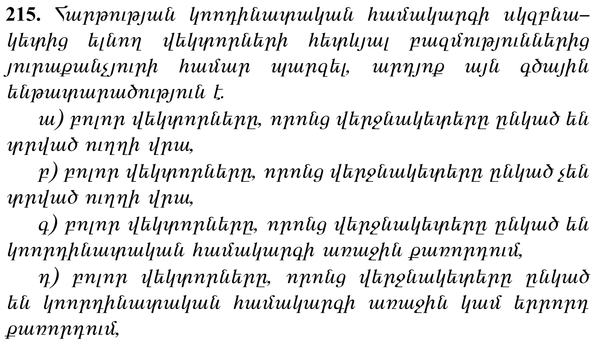

<script src="homework-scripts.js"></script>


[լուսանկարի հղումը](https://unsplash.com/photos/black-and-yellow-crane-near-building-during-daytime-JcRhkLqvICA), Հեղինակ՝ [Suren Sargsyan](https://unsplash.com/@s_u_ren)
      

# 📚 Նյութը

- [📚 Ամբողջական նյութը](01_vectors_linear_algebra.qmd)
- [📺 Վեկտորներ, սկալյար արտադրյալ, վեկտորի նորմ](https://www.youtube.com/watch?v=-VPo9D_E6FQ), [🎞️ Սլայդեր](Lectures/L01_Vectors.pdf)
- [📺 Անկյուն, կոսինուսային նմանություն, գծային տարածություններ](https://www.youtube.com/watch?v=kh10WTvYTR0), [🎞️ Սլայդեր](Lectures/L02_Angles__Vector_Spaces__Matrices.pdf)
- [🛠️📺 Անկյուն, նորմ, վեկտորական (ենթա)տարածություն](https://www.youtube.com/watch?v=bLQJIKmkqmE), [🛠️🗂️ Գործնականի PDF-ը](Homeworks/hw_01_vectors.pdf)
  

📚 Տանը կարդում ենք՝

**Վեկտորներ, սկալյար արտադրյալ, վեկտորի նորմ**

- [Poole](bibliography/Poole - Linear Algebra-1-400.pdf), 2-12 էջերը (վեկտորներ)
- [Johnston](bibliography/Nathaniel Johnston - Introduction to Linear and Matrix Algebra-Springer (2021).pdf), 10-14 էջերը (նորմ)

և դիտում 3b1b-ի 1-ին [տեսադասը](https://youtu.be/fNk_zzaMoSs) գծային հանրահաշվից(նույնը [հայերեն](https://youtu.be/7-r7Z2iH0Ps))


**Անկյուն, կոսինուսային նմանություն, գծային տարածություններ**

- [Johnston](bibliography/Nathaniel Johnston - Introduction to Linear and Matrix Algebra-Springer (2021).pdf), 15-19 էջերը (Կոշի-Շվարց, անկյուն)
- [Poole](bibliography/Poole - Linear Algebra-1-400.pdf), 26-28 էջերը (Պյութագորասի թեորեմ, պրոյեկցիա)
- [Johnston](bibliography/Nathaniel Johnston - Introduction to Linear and Matrix Algebra-Springer (2021).pdf), 121-124 էջերը (գծային տարածություններ)
և ցանկության դեպքում դիտում StatQuest-ի տեսադասը (https://youtu.be/e9U0QAFbfLI) կոսինուսային նմանության մասին

Բոլոր գրքերը [այստեղ](https://drive.google.com/drive/folders/14ib_UZSDQ4UPW6XgncURhhbtWLs3-qV3?usp=drive_link) են։


# 🏡 Տնային

::: {.callout-note collapse="false"}
1. ❗❗❗ DON'T CHECK THE SOLUTIONS BEFORE TRYING TO DO THE HOMEWORK BY YOURSELF❗❗❗
2. Please don't hesitate to ask questions, never forget about the 🍊karalyok🍊 principle!
3. The harder the problem is, the more 🧀cheeses🧀 it has.
4. Problems with 🎁 are just extra bonuses. It would be good to try to solve them, but also it's not the highest priority task.
5. If the problem involve many boring calculations, feel free to skip them - important part is understanding the concepts.
6. Submit your solutions [here](https://forms.gle/CFEvNqFiTSsDLiFc6) (even if it's unfinished)
:::


## Vector Operations

### 01 RGB color mixing with vectors {data-difficulty="1"}

::: {.callout-tip collapse="true" appearance="minimal"}
#### Context
In computer graphics and image processing, colors can be represented as RGB vectors where each component (Red, Green, Blue) ranges from 0 to 255. Vector operations on these RGB values correspond to color mixing and transformations.
:::

Consider these RGB color vectors:

- Red: $\vec{r} = (255, 0, 0)$
- Cyan: $\vec{c} = (0, 255, 255)$

1. Calculate what color you get by adding red and cyan: $\vec{r} + \vec{c}$.
2. Find the "average" color between red and cyan: $\frac{1}{2}(\vec{r} + \vec{c})$.
3. Use a [color picker](https://share.google/yadDErXuKGKRwIHnq) to verify your answers from parts (1) and (2). What colors do you actually see?

::: {.callout-tip collapse="true" title="Solution"}

**1.** Component-wise addition:

$$\vec{r} + \vec{c} = (255, 0, 0) + (0, 255, 255) = (255, 255, 255)$$

**2.** Half of that sum:

$$\tfrac{1}{2}(\vec{r} + \vec{c}) = (127.5,\; 127.5,\; 127.5)$$

**3.** What you actually see — these are the colors:

```{=html}
<div style="display:flex;gap:14px;align-items:center;justify-content:center;margin:1.2em 0 0.4em 0;font-family:sans-serif;font-size:12px;flex-wrap:wrap;">
  <div style="text-align:center;width:84px;">
    <div style="background:rgb(255,0,0);width:64px;height:64px;border:1px solid #888;border-radius:4px;margin:0 auto;"></div>
    <div style="margin-top:6px;">red (255,0,0)</div>
  </div>
  <div style="font-size:22px;">+</div>
  <div style="text-align:center;width:84px;">
    <div style="background:rgb(0,255,255);width:64px;height:64px;border:1px solid #888;border-radius:4px;margin:0 auto;"></div>
    <div style="margin-top:6px;">cyan (0,255,255)</div>
  </div>
  <div style="font-size:22px;">=</div>
  <div style="text-align:center;width:84px;">
    <div style="background:rgb(255,255,255);width:64px;height:64px;border:1px solid #888;border-radius:4px;margin:0 auto;"></div>
    <div style="margin-top:6px;">white (255,255,255)</div>
  </div>
</div>
<div style="display:flex;gap:14px;align-items:center;justify-content:center;margin:0.4em 0 1.2em 0;font-family:sans-serif;font-size:12px;flex-wrap:wrap;">
  <div style="font-size:13px;">average →</div>
  <div style="text-align:center;width:120px;">
    <div style="background:rgb(128,128,128);width:64px;height:64px;border:1px solid #888;border-radius:4px;margin:0 auto;"></div>
    <div style="margin-top:6px;">gray (127.5,127.5,127.5)</div>
  </div>
</div>
```

*Why does red + cyan equal white, exactly?*

Cyan is, by construction, the **complementary color** of red — and "complementary" has a precise vector meaning:

$$\vec{c} = \vec{w} - \vec{r} = (255,255,255) - (255,0,0) = (0,255,255)$$

So cyan *is* "white minus red" — the components red is missing. Adding it back gives white again. The same identity holds for any complementary pair (blue ↔ yellow, green ↔ magenta) — try it.

*Vector operations as color operations.*

When colors are vectors, the standard operations correspond to intuitive color manipulations:

| operation | color meaning |
|---|---|
| $\vec a + \vec b$ | mix two light sources |
| $\tfrac{1}{2}(\vec a + \vec b)$ | average / blend halfway |
| $c \cdot \vec a$, $\;0 < c < 1$ | dim |
| $c \cdot \vec a$, $\;c > 1$ | brighten (until clipped) |
| $\vec a - \vec b$ | "remove" color $\vec b$ |

*Two important caveats.*

(i) RGB is an **additive** color model — it describes mixing *light*, like on a screen. Mixing actual red and cyan **paint** gives a muddy dark color, not white, because pigments work *subtractively* (each pigment absorbs some wavelengths). The arithmetic for paints/inks follows a different model (CMYK) — same vector arithmetic, opposite physical meaning.

(ii) Real RGB clamps each component to $[0, 255]$. Our sum $(255,255,255)$ stays in range, but doubling a bright red would give $(510, 0, 0)$ — clipped back to $(255, 0, 0)$. You can't "go brighter" than full red on this scale.

*One useful invariant.* Any vector with all three components equal — $(t, t, t)$ for $t \in [0, 255]$ — is a shade of gray, ranging from black at $t=0$ to white at $t=255$. The grayscale axis is exactly the *diagonal* of the RGB cube.

:::

### 02 Dot product {data-difficulty="1"}
A translation office translated $a = [24, 17, 9, 13]$ documents from English,
French, German and Russian, respectively. For each of those languages, it takes about
$b = [5, 10, 11, 7]$ minutes to translate one page.
How much time did they spend translating in total? How much did each of the translators
spend on average if there are 4 translators in the office? Write an expression for this amount
in terms of the vectors $a$ and $b$.

::: {.callout-tip collapse="true" title="Solution"}

For each language: (number of documents) × (minutes per page) gives the total time spent on that language. Summing across languages gives the office's total time:

$$\text{total} = 24 \cdot 5 + 17 \cdot 10 + 9 \cdot 11 + 13 \cdot 7 = 120 + 170 + 99 + 91 = 480 \text{ minutes}$$

This is exactly the **dot product** $\vec a \cdot \vec b = \sum_i a_i b_i$.

With $4$ translators, the average per translator:

$$\frac{\vec a \cdot \vec b}{4} = \frac{480}{4} = 120 \text{ minutes per translator}$$

*Why this matters.* The dot product shows up *anywhere* you "multiply paired quantities and sum the results" — workload × rate, quantity × price (total cost), feature values × weights (a single neural network neuron's output), probabilities × outcomes (expected value). It's one of the most reused patterns in applied math, hiding in plain sight under different names.

:::

### 03 Feature vector normalization {data-difficulty="2"}

::: {.callout-note collapse="true" appearance="minimal"}
#### Context
In machine learning, we often work with data that has very different scales - like comparing a person's age (around 20-80) with their salary (around 20,000-100,000). Without normalization (bringing all the values to a similar scale (e.g. having length of 1)), algorithms might think salary is much more important just because the numbers are bigger. Normalizing vectors to unit length helps ensure all features are treated equally.
:::

A customer is represented by the vector $\vec{v} = (25, 50000, 3)$ where components represent [age, income in $, number of purchases].

1. Calculate the Euclidean norm (magnitude) $||\vec{v}||_2$
2. Find the unit vector $\hat{v} = \frac{\vec{v}}{||\vec{v}||_2}$
3. Verify that $||\hat{v}||_2 = 1$

*Note:* No need to carry out the calculations explicitly.

::: {.callout-tip collapse="true" title="Solution"}

**1. Norm.**

$$||\vec v||_2 = \sqrt{25^2 + 50000^2 + 3^2} = \sqrt{625 + 2{,}500{,}000{,}000 + 9}$$

The middle term ($50000^2 = 2.5 \times 10^9$) is **so much larger** than the other two ($625$ and $9$) that they're a rounding-level correction:

$$||\vec v||_2 \approx 50{,}000$$

(More precisely $\approx 50{,}000.0063$ — the age and purchases barely register.)

**2. Unit vector.**

$$\hat v = \frac{\vec v}{||\vec v||_2} \approx \frac{1}{50{,}000}(25,\, 50000,\, 3) \approx (0.0005,\; 1.0,\; 0.00006)$$

The income component is essentially $1$; the others are essentially $0$.

**3. Verification that $||\hat v||_2 = 1$.**

By definition of unit vector: $||\hat v||_2 = \left|\!\left|\dfrac{\vec v}{||\vec v||_2}\right|\!\right|_2 = \dfrac{||\vec v||_2}{||\vec v||_2} = 1$. ✓

(Scalar multiplication scales the norm by the same factor — that's the only fact you need.)

**Why this is a pedagogical disaster (and ML disaster).**

To see how badly this kind of normalization breaks, compare two clearly different customers:

| customer | age | income | purchases | unit vector $\hat v$ |
|---|---|---|---|---|
| A | $25$ | $50{,}000$ | $3$ | $\approx (0.0005,\; 1,\; 0.00006)$ |
| B | $75$ | $50{,}000$ | $50$ | $\approx (0.0015,\; 1,\; 0.001)$ |

Customer A and B are wildly different humans — a young person who's barely shopped vs. an older one with $50$ purchases — but their unit vectors are **nearly identical**. The income dimension drowns everything else out. Cosine similarity, distance between unit vectors, any geometric measure — they'll all say A and B are essentially the same customer. They aren't.

Worse: it doesn't matter whether you normalize or not. Whatever distance metric you put on the *raw* vectors will *also* be dominated by the income dimension. The dollar-scale numbers ($\sim 10^4$) make all the differences in age and purchases ($\sim 10^1$) numerically invisible.

**The fix: standardize, don't just normalize.**

Standardization rescales each feature *independently* to have mean $0$ and standard deviation $1$:

$$x'_i = \frac{x_i - \mu_i}{\sigma_i}$$

Suppose the customer base has means $\vec\mu = (45, \, 60{,}000, \, 10)$ and standard deviations $\vec\sigma = (15, \, 20{,}000, \, 5)$. Then customers A and B become:

| customer | standardized vector |
|---|---|
| A | $\left(\dfrac{25-45}{15},\, \dfrac{50000 - 60000}{20000},\, \dfrac{3-10}{5}\right) = (-1.33,\, -0.5,\, -1.4)$ |
| B | $\left(\dfrac{75-45}{15},\, \dfrac{50000 - 60000}{20000},\, \dfrac{50-10}{5}\right) = (2.0,\, -0.5,\, 8.0)$ |

Now the differences are visible in *every* dimension and the units are compatible — each feature is "standard deviations from the mean." The Euclidean distance between A and B becomes $\sqrt{3.33^2 + 0^2 + 9.4^2} \approx 9.97$, dominated this time by the *purchases* difference (which is genuinely the biggest difference between these two customers). That's the real signal.

**Which ML algorithms care about feature scale?**

| sensitive (need scaling) | not sensitive |
|---|---|
| KNN, K-means | decision trees |
| PCA, SVD-based methods | random forests |
| linear/logistic regression with regularization | gradient boosting (mostly) |
| neural networks (gradient descent step sizes) | naive Bayes |
| anything using Euclidean distance | rule-based methods |

Rough rule: anything that **measures distance** or **weights features linearly** needs scaled inputs. Tree-based methods only ever look at one feature at a time when they split, so absolute scale doesn't matter to them.

This is directly relevant to the next problem in this homework — **KNN**. If you run KNN on raw $(age, income, purchases)$ vectors using Euclidean distance, you're effectively running KNN on income alone. The other two features are noise compared to the income scale.

*Analogy.* Geometric reasoning over features is like measuring a building. If you measured one wall in millimeters and another in kilometers, "the diagonal" would be totally dominated by the kilometer wall — even if both walls are the same physical size. Standardization is the equivalent of putting all measurements in the same unit before comparing.

:::

### 04 Triangle inequality {data-difficulty="2"}
For vectors $\vec{u} = (3, 4)$ and $\vec{v} = (5, -12)$:

1. Calculate $||\vec{u}||$, $||\vec{v}||$, and $||\vec{u} + \vec{v}||$
2. Verify the triangle inequality: $||\vec{u} + \vec{v}|| \leq ||\vec{u}|| + ||\vec{v}||$
3. When does equality hold in the triangle inequality?

::: {.callout-tip collapse="true" title="Solution"}

**1. Norms.**

$$||\vec u|| = \sqrt{3^2 + 4^2} = \sqrt{25} = 5$$

$$||\vec v|| = \sqrt{5^2 + (-12)^2} = \sqrt{169} = 13$$

(Both are the famous Pythagorean triples — $3$–$4$–$5$ and $5$–$12$–$13$. Choosing them keeps the arithmetic clean.)

For the sum: $\vec u + \vec v = (3+5, \, 4-12) = (8, -8)$, so

$$||\vec u + \vec v|| = \sqrt{64 + 64} = \sqrt{128} = 8\sqrt{2} \approx 11.31$$

**2. Verify the inequality.**

$$||\vec u + \vec v|| = 8\sqrt 2 \approx 11.31 \;\;\leq\;\; 5 + 13 = 18 = ||\vec u|| + ||\vec v|| \;\checkmark$$

The inequality holds — and there's slack ($11.31 < 18$), meaning the two vectors are *not* aligned.

**3. When does equality hold?**

Equality $||\vec u + \vec v|| = ||\vec u|| + ||\vec v||$ holds **iff $\vec u$ and $\vec v$ point in the same direction** — that is, iff one is a non-negative scalar multiple of the other ($\vec v = c\vec u$ for some $c \geq 0$, or one of them is the zero vector).

*Geometric intuition.* Think of "going to point $\vec u$, then walking by $\vec v$ from there" — the total distance traveled is $||\vec u|| + ||\vec v||$ (sum of leg lengths), while the straight-line distance from start to end is $||\vec u + \vec v||$. The straight line is the shortest path; equality happens only when both legs point the same way, so "the path" *is* a straight line.

*Algebraic proof sketch.* From $||\vec u + \vec v||^2 = ||\vec u||^2 + 2\,\vec u \cdot \vec v + ||\vec v||^2$ and the squared sum $\,(||\vec u|| + ||\vec v||)^2 = ||\vec u||^2 + 2\,||\vec u||\,||\vec v|| + ||\vec v||^2$. The two sides are equal iff $\vec u \cdot \vec v = ||\vec u||\,||\vec v||$ — which by Cauchy–Schwarz happens precisely when $\vec u$ and $\vec v$ are parallel and pointing the same way.

For $\vec u = (3, 4)$ and $\vec v = (5, -12)$: angle from x-axis is $\arctan(4/3) \approx 53°$ for $\vec u$ and $\arctan(-12/5) \approx -67°$ for $\vec v$. They point in noticeably different directions — hence the strict inequality.

:::

### 05 Model selection with regularization {data-difficulty="2"}
::: {.callout-important collapse="true" appearance="minimal"}
#### Context
In machine learning, we constantly face a tradeoff: should we use a complex model that fits our training data very well, or a simpler model that captures the general pattern? This is where **regularization** comes in.

Imagine you're Netflix trying to predict movie ratings. You could create an extremely complex formula with thousands of parameters that perfectly predicts every rating in your training data. But when a new user comes along, your model might fail spectacularly - it memorized the training data instead of learning the underlying patterns. This is called **overfitting**. ([Kargin example](https://www.youtube.com/watch?v=723rlQAhXqc))

**Regularization** prevents overfitting by adding a penalty for model complexity to our optimization goal:

$$\text{Total Error} = \text{Prediction Error} + \lambda \cdot \text{Complexity Penalty}$$

where $\lambda$ controls how much we penalize complexity (having large parameter values).

The two most common regularization methods use different norms to measure complexity:

- **L1 Regularization (Lasso)**: Uses the sum of absolute values
   $$\text{L1 penalty} = \lambda \sum_{i=1}^{n} |w_i|$$
   
- **L2 Regularization (Ridge)**: Uses the sum of squares
   $$\text{L2 penalty} = \lambda \sum_{i=1}^{n} w_i^2$$

**Real-world example:** Suppose you're predicting house prices using features like size, location, age, etc. Without regularization, your model might learn that "houses with exactly 2,347 sq ft, built in 1987, with 3.5 bathrooms, facing north-northeast, with blue doors" sell for $523,456. With regularization, it learns more general rules like "larger houses in good neighborhoods cost more."
:::

Վստահ չեմ որ լավ եմ ձևակերպել (հատկապես) էս խնդիրը , եթե հարցեր լինեն՝ խաբար արեք։


You're comparing two models that predict house prices:

- Model A: Complex formula with weights (coefficients) $\vec{w_A} = (10, -8, 4)$ (this can correspond to equation ($10x^2 - 8x + 4$ (quadratic))) and prediction error = 100
- Model B: Simpler formula with weights $\vec{w_B} = (0.1, -3, 1)$ $(0.1x^2 - 3x + 1)$ (almost just a linear function) and prediction error = 120

Model B makes slightly worse predictions, but which model is better when considering both error and simplicity?

a) **L1 Regularization (λ = 0.5):** Calculate the total error for each model
   - Model A: $\text{Error} + \lambda \cdot ||\vec{w_A}||_1 = ?$
   - Model B: $\text{Error} + \lambda \cdot ||\vec{w_B}||_1 = ?$

b) **L2 Regularization (λ = 0.5):** Calculate the total error for each model
   - Model A: $\text{Error} + \lambda \cdot ||\vec{w_A}||_2^2 = ?$
   - Model B: $\text{Error} + \lambda \cdot ||\vec{w_B}||_2^2 = ?$

c) **Model Selection:** Which model would you choose under each regularization method? How does the choice of $\lambda$ affect your decision?
d) **Practical Insight:** In production systems, why might we prefer a model with slightly worse accuracy but much simpler weights?

::: {.callout-tip collapse="true" title="Solution"}

**a) L1 regularization.**

$$||\vec{w_A}||_1 = |10| + |{-8}| + |4| = 22$$

$$||\vec{w_B}||_1 = |0.1| + |{-3}| + |1| = 4.1$$

Total errors with $\lambda = 0.5$:

- Model A: $100 + 0.5 \cdot 22 = 100 + 11 = \mathbf{111}$
- Model B: $120 + 0.5 \cdot 4.1 = 120 + 2.05 = \mathbf{122.05}$

→ **Model A wins under L1** (lower total error: $111 < 122.05$).

**b) L2 regularization** (squared L2 norm, the standard choice for ridge):

$$||\vec{w_A}||_2^2 = 10^2 + 8^2 + 4^2 = 100 + 64 + 16 = 180$$

$$||\vec{w_B}||_2^2 = 0.1^2 + 3^2 + 1^2 = 0.01 + 9 + 1 = 10.01$$

Total errors with $\lambda = 0.5$:

- Model A: $100 + 0.5 \cdot 180 = 100 + 90 = \mathbf{190}$
- Model B: $120 + 0.5 \cdot 10.01 = 120 + 5.005 = \mathbf{125.005}$

→ **Model B wins under L2** (lower total error: $125.005 < 190$).

**c) Why the disagreement?**

L2 squares the weights before summing, so it punishes *large weights very heavily*: Model A's $|w_1| = 10$ contributes $100$ to the L2 penalty but only $10$ to the L1 penalty. Under L2, the cost of A's "big weight" outweighs its prediction-error advantage. Under L1, the penalty is more linear, and A's $20$-point lead in raw prediction error survives.

*How $\lambda$ shifts the choice.* Larger $\lambda$ tilts the balance toward simpler models; smaller $\lambda$ toward better-fitting models. For this exact pair we can solve for the crossover:

- L1: A wins iff $100 + 22\lambda < 120 + 4.1\lambda$, i.e. $\lambda < \tfrac{20}{17.9} \approx 1.12$. Above that, B takes over.
- L2: A wins iff $100 + 180\lambda < 120 + 10.01\lambda$, i.e. $\lambda < \tfrac{20}{169.99} \approx 0.118$. The L2 penalty dominates much sooner.

**d) Why prefer simpler weights in production?**

Several reasons that have nothing to do with raw accuracy:

- **Generalization.** Smaller weights tend to extrapolate better to data not seen at training time — the famous "overfitting" trap is when complex models memorize training quirks.
- **Robustness.** A model with extreme weights amplifies small input errors into big output swings; modest weights damp them.
- **Interpretability.** Sparse / small weights are easier to inspect and audit (which feature is doing what).
- **Inference cost.** In limit cases (sparse L1 → many zeros), you can drop unused features entirely, shrinking the deployed model.
- **Reproducibility and stability.** Tiny shifts in input data cause smaller swings in $\vec w$ during retraining.

The regularization penalty is essentially a way of saying "I prefer the *simplest* model that *almost* explains the data" — Occam's razor encoded as an optimization term.

:::

### 06 k-Nearest Neighbors Classification {data-difficulty="3"}


Կցված կգտնեք [csv ֆայլ](https://github.com/HaykTarkhanyan/python_math_ml_course/blob/main/math/assets/knn.csv) երեք սյունով՝ feature_1, feature_2, label։ 
Կարող եք պատկերացնել  որ feature_1-ը իրանից ներկայացնում ա ծաղկի բարձրությունը, feature_2-ը՝ լայնությունը ու label (պիտակը)  ներկայացնում ա թե 4 ծաղկի տեսակներից (0,1,2,3) որ մեկն ա։

 Պետք ա ստեղծել մոդել (ալգորիթմ) որը ստանալով feature_1, feature_2 արժեքները կգուշակի ծաղկի տեսակը։ 

Հետևյալ կերպով՝ նոր ծաղկի համար գտնել K հատ ամենամոտիկ ծաղիկները մեր ունեցած տվյալներից ու նայել թե էդ k հարևաններից որ տեսակի ծաղիկն ա գերակշռում՝ ու դա օգտագործել որպես գուշակություն, 

Հեռավորություն որպես օգտագործեք մի դեպքում L1-ը (Manhattan), մի դեպքում L2-ը (Euclidean): K-ի համար էլ տարբեր արժեքներ բզբացեք՝ 2,3, 5, 10 .

Թեթև հավելյալ նշումներ
1. Ալգորիմթի անունն ա K Nearest Neighbors ու զուտ "ասա ինձ ովքեր են քո ընկերները, ես կասեմ ով ես դու" սկզբումքով ա աշխատում, պրակտիկայում համարյա երբեք չի օգտագործվում բայց տնայինի համար կարա հավես լինի 
2. Պատճառներից մեկը թե ինչի չի օգտագործվում դա "Չափողականության անեծքն" ա (Curse of dimenionality), շատ հավես էֆեկտ ա ըստ որի երբ գործ ենք ունենում բարձր չափանի տարածությունների հետ, տվյալները հիմնականում իրարից համարյա հավասարահեռ են դառնում ու անկյուններում են կուտակվում (այլ կերպ ասած՝ եթե բարձրաչափ նարինջը կլպենք՝ տակը բան չի մնա)։ Աղբյուր (https://slds-lmu.github.io/i2ml/chapters/14_cod/)

## Dot Products and Angles Between Vectors

### 07 Finding perpendicular vectors {data-difficulty="1"}


Given the vector $\vec{v} = (2, 3)$:

1. Find a non-zero vector $\vec{w} = (x, y)$ such that $\vec{v}$ and $\vec{w}$ are perpendicular.
2. Verify that your chosen vector $\vec{w}$ satisfies $\vec{v} \cdot \vec{w} = 0$.
3. Find a unit vector in the direction of $\vec{w}$ by computing $\frac{\vec{w}}{||\vec{w}||}$.
4. Explain why there are infinitely many vectors perpendicular to $\vec{v}$ and describe the general form of all such vectors.

::: {.callout-tip collapse="true" title="Solution"}

**1. Find a perpendicular vector.**

Two vectors are perpendicular iff their dot product is $0$. So $\vec w = (x, y)$ must satisfy

$$\vec v \cdot \vec w = 2x + 3y = 0$$

One easy choice: $\vec w = (3, -2)$.

*A useful 2D recipe.* Given any $(a, b)$ in $\mathbb{R}^2$, the vector $(b, -a)$ (or equivalently $(-b, a)$) is automatically perpendicular: their dot product $a\cdot b + b\cdot (-a) = 0$ always. So from $(2, 3)$ we read off $(3, -2)$ instantly.

**2. Verify.**

$$\vec v \cdot \vec w = 2 \cdot 3 + 3 \cdot (-2) = 6 - 6 = 0 \;\checkmark$$

**3. Unit vector in the direction of $\vec w$.**

$$||\vec w|| = \sqrt{3^2 + (-2)^2} = \sqrt{13}$$

$$\hat w = \frac{\vec w}{||\vec w||} = \frac{1}{\sqrt{13}}(3, -2) = \left(\frac{3}{\sqrt{13}},\, -\frac{2}{\sqrt{13}}\right)$$

**4. Why infinitely many perpendicular vectors?**

The condition $2x + 3y = 0$ is **one linear equation in two unknowns** — its solution set is a *line through the origin* (specifically the line $y = -\tfrac{2}{3}x$). Every point on that line is a perpendicular vector to $\vec v$. The general form:

$$\vec w_{\text{any}} = t \cdot (3, -2), \quad t \in \mathbb{R}$$

For $t = 0$ you get the zero vector (which is technically perpendicular to everything). For $t \neq 0$, you get all the other perpendicular vectors — one direction for $t > 0$, the opposite direction for $t < 0$. They're all scalar multiples of each other.

```{=html}
<svg viewBox="0 0 280 280" xmlns="http://www.w3.org/2000/svg" style="display:block;margin:1em auto;max-width:100%;height:auto;font-family:sans-serif;">
  <g stroke="currentColor" stroke-opacity="0.12" stroke-width="1">
    <line x1="40" y1="0" x2="40" y2="280"/><line x1="80" y1="0" x2="80" y2="280"/>
    <line x1="120" y1="0" x2="120" y2="280"/><line x1="200" y1="0" x2="200" y2="280"/>
    <line x1="240" y1="0" x2="240" y2="280"/>
    <line x1="0" y1="40" x2="280" y2="40"/><line x1="0" y1="80" x2="280" y2="80"/>
    <line x1="0" y1="120" x2="280" y2="120"/><line x1="0" y1="200" x2="280" y2="200"/>
    <line x1="0" y1="240" x2="280" y2="240"/>
  </g>
  <line x1="0" y1="160" x2="280" y2="160" stroke="currentColor" stroke-opacity="0.5" stroke-width="1.5"/>
  <line x1="160" y1="0" x2="160" y2="280" stroke="currentColor" stroke-opacity="0.5" stroke-width="1.5"/>
  <defs>
    <marker id="arr1" viewBox="0 0 10 10" refX="9" refY="5" markerWidth="5" markerHeight="5" orient="auto"><path d="M0,0 L10,5 L0,10 z" fill="#D90012"/></marker>
    <marker id="arr2" viewBox="0 0 10 10" refX="9" refY="5" markerWidth="5" markerHeight="5" orient="auto"><path d="M0,0 L10,5 L0,10 z" fill="#0033A0"/></marker>
  </defs>
  <line x1="0" y1="240" x2="320" y2="0" stroke="#0033A0" stroke-opacity="0.25" stroke-width="1.5" stroke-dasharray="4,3"/>
  <line x1="160" y1="160" x2="240" y2="40" stroke="#D90012" stroke-width="3" marker-end="url(#arr1)"/>
  <line x1="160" y1="160" x2="280" y2="80" stroke="#0033A0" stroke-width="3" marker-end="url(#arr2)"/>
  <text x="248" y="36" font-size="13" fill="#D90012" font-weight="bold">v=(2,3)</text>
  <text x="200" y="74" font-size="13" fill="#0033A0" font-weight="bold">w=(3,-2)</text>
  <text x="20" y="234" font-size="11" fill="#0033A0" opacity="0.7">all perpendicular vectors</text>
</svg>
```

In higher dimensions, the condition "$\vec v \cdot \vec w = 0$" is still one linear equation, but in $n$ unknowns — its solution set is an $(n-1)$-dimensional subspace called the **orthogonal complement** of $\vec v$. In $\mathbb{R}^3$ that's a whole plane perpendicular to $\vec v$, not just a line.

:::

### 08: Word embeddings similarity {data-difficulty="3"}
::: {.callout-important collapse="true" appearance="minimal"}
#### Context
Computers understand numbers, not words. To make sense of text, we convert words into vectors in a high-dimensional space, called **word embeddings**. In this space, words with similar meanings are located close to each other. For example, "king" and "queen" are closer than "king" and "car".
:::

```{python}
#| eval: false

# install gensim if you haven't already (you can also do it without `uv`, but why would you? uv is fantastic)
# !uv pip install gensim

import gensim.downloader as api

# this might take a few minutes first time
model_name = "glove-twitter-25" # smaller model 

# If you're willing to wait a bit longer for a better model, uncomment line below:
# model_name = "word2vec-google-news-300"  # 1.5 gb model

model = api.load(model_name)  # 300-dimensional vectors

print("Model loaded successfully!")

# to get vector for a word we just get it like from a dictionary
word = "cheese"
if word in model:
    vector = model[word]
    print(f"Vector for '{word}' has shape: {vector.shape}")
    print(f"First 10 dimensions: {vector[:10]}")
else:
    print(f"'{word}' not found in vocabulary")
```

Familiarize yourself with the code above. It loads a pre-trained word embedding model and retrieves the vector for the word "cheese".

Your task is to calculate how similar the word "cheese" (or any other word you choose) is to a list of other words (given below) using cosine similarity. 

```{python}
#| eval: false

potential_words = ["elephant", "cheese", "butter", "bread", "watermelon", "potato", "iron", "clock", "computer", "chicken", "fries"]
```

Return a sorted dictionary where keys are words and values are their cosine similarity to "cheese".

You can **AFTERWARDS** also use the built-in method to find most similar words:
```{python}
#| eval: false
model.most_similar("cheese", topn=10)
```

**Bonus:** Play around with vector arithmetic to explore relationships - you can add and subtract word vectors to see how meanings combine. For example, try "king" - "man" + "woman" and see what word is closest to the resulting vector! Or try "Paris" - "France" + "Armenia" to see if you get "Yerevan".

::: {.callout-note collapse="true" appearance="minimal"}
 Check out this fantastic [3Blue1Brown video on word vectors (embeddings)](https://youtu.be/wjZofJX0v4M?t=751) for more insights! Also, [this](https://huggingface.co/blog/embeddinggemma#demo) is a cool tool to play with
:::


## Vector Spaces and Subspaces
### 09: Identifying vector spaces and non-vector spaces {data-difficulty="3"}

For each of the following sets, determine whether it is a vector space or not. If it is a vector space, prove it by verifying all the required axioms. If it is not a vector space, identify which axiom(s) fail and provide counterexamples. 

a) $A = \left\{\begin{pmatrix} a \\ 0 \end{pmatrix} \mid a \in \mathbb{R}\right\}$ (vectors with second component zero)

b) $B = \left\{\begin{pmatrix} a \\ -a \end{pmatrix} \mid a \in \mathbb{R}\right\}$ (vectors where second component is negative of first)

c) $C = \mathbb{N}$ (the set of natural numbers)

d) $D = \left\{\begin{pmatrix} a \\ 1 \end{pmatrix} \mid a \in \mathbb{R}\right\}$ (vectors with second component always 1)

Note: By default, if we don't mention the operation, we mean the standard vector addition and scalar multiplication (e.g. our good old + and * we learning at school).

**Hint:** For the non-vector spaces, show that there are some "bad" elements such that if we add them or multiply with some number (not necessarily positive), the result would not belong to the set.

::: {.callout-tip collapse="true" title="Solution"}

**Strategy.** When the set is a subset of $\mathbb{R}^n$ with the standard $+$ and $\cdot$, all the "abstract" vector-space axioms (associativity, commutativity, distributivity) inherit automatically from $\mathbb{R}^n$. So we only need to check the **three subspace conditions**:

(i) the zero vector is in the set,
(ii) closed under addition,
(iii) closed under scalar multiplication.

If any one of these fails, the set is not a vector space (with the inherited operations).

**a) $A = \left\{(a, 0)^T \mid a \in \mathbb{R}\right\}$ — vectors with second component zero.**

(i) $(0, 0)^T \in A$ (take $a = 0$). ✓
(ii) $(a, 0) + (b, 0) = (a+b, 0) \in A$. ✓
(iii) $c(a, 0) = (ca, 0) \in A$. ✓

→ **Yes, vector space.** Geometrically it's the $x$-axis — a $1$-dimensional subspace of $\mathbb{R}^2$.

**b) $B = \left\{(a, -a)^T \mid a \in \mathbb{R}\right\}$ — vectors where the second component is the negative of the first.**

(i) $(0, 0)^T \in B$ (take $a = 0$). ✓
(ii) $(a, -a) + (b, -b) = (a+b, -(a+b)) \in B$. ✓
(iii) $c(a, -a) = (ca, -ca) \in B$. ✓

→ **Yes, vector space.** Geometrically the line $y = -x$ in $\mathbb{R}^2$.

**c) $C = \mathbb{N}$ (the natural numbers).**

Closure under scalar multiplication fails: take $a = 2 \in \mathbb{N}$ and $c = -1 \in \mathbb{R}$. Then $c \cdot a = -2 \notin \mathbb{N}$.

(Even worse: $\mathbb{N}$ has no additive inverses — there's no $-3$ in $\mathbb{N}$ — and depending on the convention may not even contain $0$.)

→ **Not a vector space.**

**d) $D = \left\{(a, 1)^T \mid a \in \mathbb{R}\right\}$ — vectors with second component always $1$.**

Several axioms fail:

- (i) $(0, 0)^T \notin D$ — the zero vector is not in the set.
- (ii) $(a, 1) + (b, 1) = (a+b, 2) \notin D$.
- (iii) $c(a, 1) = (ca, c) \notin D$ unless $c = 1$.

→ **Not a vector space.** Geometrically, $D$ is a horizontal line that does *not* pass through the origin. A general fact: any "shifted" line (a line not through $0$) fails to be a subspace, because the zero vector lives at the origin.

:::

### 10 vector space or not? {data-difficulty="2"}

Check if the following set is a vector space:

a) $A=\mathbb{Z}$, with the usual operations $+$ and $\cdot$.

b) $B=\left\{ \begin{bmatrix} 0 \\ 0 \\ a \end{bmatrix} \,\middle|\, a\in\mathbb{R} \right\}$ with the usual operations $+$ and $\cdot$.

c) $C=\mathbb{R}^2=\left\{ \begin{bmatrix} a \\ b \end{bmatrix} \,\middle|\, a,b\in\mathbb{R} \right\}$, with the usual operation $\cdot$ and the addition defined as
$$
\begin{bmatrix} x_1 \\ x_2 \end{bmatrix}
+
\begin{bmatrix} y_1 \\ y_2 \end{bmatrix}
=
\begin{bmatrix} x_1 + y_1 \\ x_2 + y_2 + 1 \end{bmatrix}.
$$

d) The set of all polynomials of degree $\le 2$, with the usual operations $+$ and $\cdot$. Bonus question - is this maybe "equivalent" to some other vector space we already know?

::: {.callout-tip collapse="true" title="Solution"}

**a) $A = \mathbb{Z}$ (integers, usual $+$ and $\cdot$).**

Closure under scalar multiplication fails: take $c = \tfrac{1}{2} \in \mathbb{R}$ and $v = 3 \in \mathbb{Z}$. Then $c \cdot v = 1.5 \notin \mathbb{Z}$.

→ **Not a vector space** (over $\mathbb{R}$).

(Side note: $\mathbb{Z}$ *is* a vector space — sort of — over the scalar field $\mathbb{Z}$ itself, but that's a separate algebraic structure called a **module**, not a vector space in the usual sense. Vector spaces are defined over a *field* — like $\mathbb{R}$ or $\mathbb{Q}$ — and $\mathbb{Z}$ is not a field.)

**b) $B = \left\{(0, 0, a)^T \mid a \in \mathbb{R}\right\}$.**

Apply the three subspace checks (it's a subset of $\mathbb{R}^3$):

(i) $(0,0,0) \in B$ (take $a = 0$). ✓
(ii) $(0,0,a) + (0,0,b) = (0,0,a+b) \in B$. ✓
(iii) $c(0,0,a) = (0,0,ca) \in B$. ✓

→ **Yes, vector space.** It's the $z$-axis — a $1$-dimensional subspace of $\mathbb{R}^3$.

**c) $C = \mathbb{R}^2$ with modified addition $(x_1, x_2) + (y_1, y_2) = (x_1 + y_1, \, x_2 + y_2 + 1)$.**

This is the sneaky one. With this redefined "+", let's see how many axioms still hold:

- *Commutativity of $+$*: $(x_1+y_1, x_2+y_2+1) = (y_1+x_1, y_2+x_2+1)$. ✓
- *Associativity*: both $((a,b)+(c,d))+(e,f)$ and $(a,b)+((c,d)+(e,f))$ work out to $(a+c+e,\, b+d+f+2)$. ✓
- *Zero vector*: we need a $\vec 0_C$ with $\vec x + \vec 0_C = \vec x$. Solving $(x_1+0_1, x_2+0_2+1) = (x_1, x_2)$ gives $\vec 0_C = (0, -1)$. ✓ — there *is* an identity, just not the obvious one.
- *Additive inverse*: for $(x_1, x_2)$, need $(y_1, y_2)$ such that $(x_1+y_1, x_2+y_2+1) = (0, -1)$. So $(y_1, y_2) = (-x_1, -x_2 - 2)$. ✓
- *Distributivity over addition*: $c\bigl((x,y) + (a,b)\bigr) = c(x+a, y+b+1) = (c(x+a), c(y+b+1))$. But $c(x,y) + c(a,b) = (cx, cy) + (ca, cb) = (cx+ca, cy+cb+1)$. Setting equal: $c(y+b+1) = cy+cb+1$, i.e. $c = 1$. **Fails for any $c \neq 1$!**

→ **Not a vector space.** Distributivity fails — even though the rest of the axioms work out.

This is a nice cautionary tale: an addition that *looks* fine and even has a working identity element can still break the vector space structure further down. **Check all axioms.**

**d) $P_2$ — polynomials of degree $\leq 2$.**

A general element is $p(x) = a_0 + a_1 x + a_2 x^2$. Check:

(i) The zero polynomial $0 + 0x + 0x^2 \in P_2$. ✓
(ii) Sum of two degree-$\leq 2$ polynomials has degree $\leq 2$. ✓
(iii) Scalar times a degree-$\leq 2$ polynomial has degree $\leq 2$. ✓

The other axioms (associativity, commutativity, distributivity, inverses) inherit from the usual polynomial arithmetic.

→ **Yes, vector space.**

*Bonus question.* $P_2$ is "equivalent" to $\mathbb{R}^3$ via the **coordinate map**:

$$a_0 + a_1 x + a_2 x^2 \;\longleftrightarrow\; (a_0, a_1, a_2)$$

Adding two polynomials corresponds to adding their coefficient vectors; scalar-multiplying a polynomial corresponds to scalar-multiplying the coefficient vector. So the algebraic structure is *identical* — only the names of the elements differ. Two vector spaces with this kind of structure-preserving bijection are called **isomorphic**: they're "the same vector space wearing different clothes."

This is a recurring theme: many seemingly different vector spaces ($P_n$, $M_{m \times n}$, function spaces with finite bases, ...) all turn out to be isomorphic to some $\mathbb{R}^k$ once you pick coordinates.

:::

### 11 Vector subspaces {data-difficulty="2"}


[Video](https://www.youtube.com/watch?v=N8GR7eCepl8) solution


### 12 Deriving the cosine angle formula {.bonus problem data-difficulty="3"}

Derive the formula for the cosine of the angle between two vectors: $\cos(\theta) = \frac{\vec{a} \cdot \vec{b}}{||\vec{a}|| \cdot ||\vec{b}||}$

::: {.callout-warning collapse="true" appearance="minimal"}
#### Hint
Start with the law of cosines for a triangle: $c^2 = a^2 + b^2 - 2ab\cos(\theta)$. Consider a triangle formed by vectors $\vec{a}$, $\vec{b}$, and $\vec{a} - \vec{b}$. The side lengths are $||\vec{a}||$, $||\vec{b}||$, and $||\vec{a} - \vec{b}||$. Express $||\vec{a} - \vec{b}||^2$ using the dot product and substitute into the law of cosines.
:::

1. Write down the law of cosines for the triangle with sides $||\vec{a}||$, $||\vec{b}||$, and $||\vec{a} - \vec{b}||$
2. Express $||\vec{a} - \vec{b}||^2$ in terms of dot products by expanding $(\vec{a} - \vec{b}) \cdot (\vec{a} - \vec{b})$
3. Substitute your result from part (2) into the law of cosines and solve for $\cos(\theta)$
4. Verify your derived formula using vectors $\vec{u} = (3, 4)$ and $\vec{v} = (1, 0)$

::: {.callout-tip collapse="true" title="Solution"}

**1. Law of cosines.**

Form a triangle by placing $\vec a$ and $\vec b$ tail-to-tail; the third side is then $\vec a - \vec b$ (the vector from the tip of $\vec b$ to the tip of $\vec a$). The side lengths are $||\vec a||$, $||\vec b||$, $||\vec a - \vec b||$, with angle $\theta$ between $\vec a$ and $\vec b$:

$$||\vec a - \vec b||^2 = ||\vec a||^2 + ||\vec b||^2 - 2\,||\vec a||\,||\vec b||\cos\theta$$

**2. Express $||\vec a - \vec b||^2$ via dot products.**

Using $||\vec x||^2 = \vec x \cdot \vec x$ and the bilinearity of the dot product (i.e. $(\vec x \pm \vec y) \cdot \vec z = \vec x \cdot \vec z \pm \vec y \cdot \vec z$):

$$||\vec a - \vec b||^2 = (\vec a - \vec b) \cdot (\vec a - \vec b) = \vec a \cdot \vec a - \vec a \cdot \vec b - \vec b \cdot \vec a + \vec b \cdot \vec b$$

The dot product is symmetric ($\vec a \cdot \vec b = \vec b \cdot \vec a$), so the cross terms combine:

$$||\vec a - \vec b||^2 = ||\vec a||^2 - 2\,\vec a \cdot \vec b + ||\vec b||^2$$

**3. Substitute into the law of cosines.**

$$||\vec a||^2 - 2\,\vec a \cdot \vec b + ||\vec b||^2 = ||\vec a||^2 + ||\vec b||^2 - 2\,||\vec a||\,||\vec b||\cos\theta$$

The $||\vec a||^2$ and $||\vec b||^2$ cancel from both sides, leaving:

$$-2\,\vec a \cdot \vec b = -2\,||\vec a||\,||\vec b||\cos\theta$$

Divide by $-2$:

$$\boxed{\;\cos\theta = \frac{\vec a \cdot \vec b}{||\vec a||\,||\vec b||}\;}$$

This is exactly the **cosine similarity** formula — the basis of the dot-product/angle relationship and one of the most useful tools in machine learning for measuring similarity between high-dimensional vectors.

**4. Verify with $\vec u = (3, 4)$, $\vec v = (1, 0)$.**

$$\vec u \cdot \vec v = 3 \cdot 1 + 4 \cdot 0 = 3, \qquad ||\vec u|| = 5, \qquad ||\vec v|| = 1$$

$$\cos\theta = \frac{3}{5 \cdot 1} = 0.6 \;\Rightarrow\; \theta = \arccos(0.6) \approx 53.13^\circ$$

*Sanity check.* $\vec u = (3, 4)$ has angle $\arctan(4/3) \approx 53.13^\circ$ from the positive $x$-axis. Since $\vec v = (1, 0)$ points along the $+x$-axis, the angle between them is exactly the angle of $\vec u$ from $+x$ — i.e. $53.13^\circ$. ✓

:::

### 13 High-dimensional vector geometry {.bonus-problem data-difficulty="1"}
In high-dimensional spaces (common in ML), our intuition about geometry can be misleading (we will explore this later).

Consider the unit sphere in $\mathbb{R}^n$ (all vectors with norm 1):

1. In 2D, what fraction of a unit square $[-1,1] \times [-1,1]$ is occupied by the unit circle?
2. Estimate this fraction for a unit cube in 3D (you can google the formula)
3. Try to guess and then google  What happens to this fraction as the dimension $n$ increases? This is known as the "curse of dimensionality."

[Video](https://www.youtube.com/watch?v=9Tf-_mJhOkU)

::: {.callout-tip collapse="true" title="Solution"}

**1. 2D.**

Unit circle area: $\pi \cdot 1^2 = \pi$. Square $[-1, 1]^2$ has side length $2$, so area $= 4$.

$$\frac{\text{circle area}}{\text{square area}} = \frac{\pi}{4} \approx 0.785$$

So the inscribed circle covers about $78.5\%$ of the square's area. Most of the square is inside the circle.

**2. 3D.**

Unit ball volume: $\tfrac{4}{3}\pi \cdot 1^3 = \tfrac{4\pi}{3}$. Cube $[-1, 1]^3$ has volume $2^3 = 8$.

$$\frac{\text{ball volume}}{\text{cube volume}} = \frac{4\pi/3}{8} = \frac{\pi}{6} \approx 0.524$$

Already noticeable: the ratio dropped from $0.785$ in 2D to $0.524$ in 3D — almost half the cube's volume is now *outside* the inscribed ball, sitting in the corners.

**3. Higher dimensions.**

The unit $n$-ball has volume

$$V_n = \frac{\pi^{n/2}}{\Gamma(n/2 + 1)}$$

while the bounding $n$-cube $[-1, 1]^n$ has volume $2^n$. Their ratio:

$$\text{ratio}(n) = \frac{V_n}{2^n} = \frac{\pi^{n/2}}{\Gamma(n/2 + 1) \cdot 2^n}$$

Concrete values:

| $n$ | ratio | interpretation |
|---|---|---|
| $2$ | $0.785$ | circle fills $78.5\%$ of square |
| $3$ | $0.524$ | ball fills $52.4\%$ of cube |
| $5$ | $0.164$ | ball fills $16.4\%$ |
| $10$ | $0.00249$ | ball fills $0.25\%$ |
| $20$ | $\approx 2.5 \times 10^{-8}$ | essentially nothing |
| $100$ | $\approx 2 \times 10^{-70}$ | effectively zero |

→ The ratio goes to $0$ **super-exponentially fast** as $n \to \infty$.

*The "peeled high-dimensional orange".* Almost all the volume of an $n$-cube is concentrated in its **corners**, far from the center. If you imagine the cube as an orange with the inscribed ball as the flesh, the *peel* (= corners outside the ball) is essentially the entire orange in high dimensions.

This is one face of the **curse of dimensionality**:

- **Distances become uninformative.** In high dimensions, almost all pairs of points are roughly the same distance apart (most points sit near corners of similar magnitude). Algorithms that rely on "nearest neighbor" reasoning break down — your "nearest" point is barely closer than your "farthest" one.
- **Sampling becomes hopeless.** To uniformly sample inside the ball, you'd accept $\sim 2\times 10^{-70}$ of cube samples in $n=100$. That's why ML practitioners use specialized samplers (e.g., MCMC) and reduce dimensionality (PCA, autoencoders) before applying classical methods.

:::

# 🎲 38 (01) TODO
- ▶️[ToDo]()
- 🔗[Random link]()
- 🇦🇲🎶[ToDo]()
- 🌐🎶[ToDo]()
- 🤌[Կարգին]()


<a href="http://s01.flagcounter.com/more/1oO"></a>

