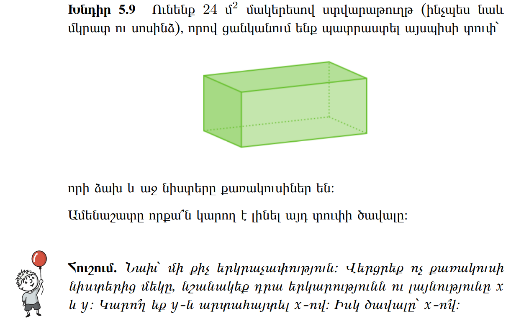

[լուսանկարի հղումը](https://unsplash.com/photos/man-in-black-suit-statue-twp2-YDQVn8), Գյումրի, Ֆրունզիկ, Հեղինակ՝ [Robert Levonyan](https://unsplash.com/@robertlevonyan)

# 📚 Նյութը

::: {.callout-tip collapse="true"}
## ⚠️ Note
YouTube links in this section were auto-extracted. If you spot a mistake, please let me know!
:::

## Դասախոսություն
- [📺 Դասախոսություն — Convex/concave functions, Taylor series](https://youtu.be/OHXH7zn65zU)
- [🎞️ Սլայդեր — L06 Limit  Derivative  Extrema of a Function](Lectures/L06_Limit__Derivative__Extrema_of_a_Function.pdf)
- [🎞️ Սլայդեր — L07 Taylor Series  Integral](Lectures/L07_Taylor_Series__Integral.pdf)

## Գործնական
- [📺 Գործնական — Extrema, convexity, Taylor](https://youtu.be/d5bAQnILhvs)
- [🛠️🗂️ Գործնականի PDF-ը](Homeworks/hw_04_calc_2_extrema_convexity_taylor.pdf)

# 🏡 Տնային

::: {.callout-note collapse="false"}
1. ❗❗❗ DON'T CHECK THE SOLUTIONS BEFORE TRYING TO DO THE HOMEWORK BY YOURSELF❗❗❗
2. Please don't hesitate to ask questions, never forget about the 🍊karalyok🍊 principle!
3. The harder the problem is, the more 🧀cheeses🧀 it has.
4. Problems with 🎁 are just extra bonuses. It would be good to try to solve them, but also it's not the highest priority task.
5. If the problem involve many boring calculations, feel free to skip them - important part is understanding the concepts.
6. Submit your solutions [here](https://forms.gle/CFEvNqFiTSsDLiFc6) (even if it's unfinished)
:::

## Extrema 

### 01 Box Problem {data-difficulty="2"}

[Video Solution in Armenian](https://www.youtube.com/watch?v=f2Bp77tiESg)

::: {.callout-tip collapse="true" title="Solution"}

(Problem 5.9 in the Armenian notes: from $24$ m² of material, build a closed box whose front and back faces are squares; what's the maximum volume?)

**Setup.** Let the square front/back have side length $x$, and call the depth $y$. The box has dimensions $x \times x \times y$.

The closed-box surface area is $2x^2$ (the two squares) plus $4xy$ (the four rectangular side faces):

$$2x^2 + 4xy = 24 \;\Rightarrow\; y = \frac{12 - x^2}{2x}$$

Valid range: $0 < x < \sqrt{12}$ (so that $y > 0$).

The volume:

$$V(x) = x^2 \cdot y = x^2 \cdot \frac{12 - x^2}{2x} = \frac{x(12 - x^2)}{2} = 6x - \frac{x^3}{2}$$

**Optimize.** Take the derivative and set to zero:

$$V'(x) = 6 - \frac{3x^2}{2} = 0 \;\Rightarrow\; x^2 = 4 \;\Rightarrow\; x = 2$$

(Take the positive root since $x$ is a length.)

**Check it's a max.** $V''(x) = -3x$, so $V''(2) = -6 < 0$ — concave down at $x = 2$, so this is a local maximum. At the boundary points $x \to 0$ and $x \to \sqrt{12}$ the volume goes to $0$, so this is also the global maximum.

**Plug back in.** $y = \frac{12 - 4}{4} = 2$. The optimal box has dimensions $2 \times 2 \times 2$ — a **cube**.

$$V_{\max} = 2 \cdot 2 \cdot 2 = 8 \text{ m}^3$$

**The geometric punchline.** Even though the constraint only forced *two* of the three dimensions to be equal ($x = x$), the optimum naturally produces $x = y$ — i.e., all three dimensions equal. This is a recurring theme in geometric optimization: among rectangular boxes with fixed surface area, the cube maximizes volume; among rectangles with fixed perimeter, the square maximizes area; among triangles with fixed perimeter, the equilateral triangle maximizes area. **Maximum-symmetry shapes win**, because they distribute the "budget" most efficiently across all dimensions.

(This generalizes to the **isoperimetric inequality**: in any dimension, among shapes with fixed surface area / perimeter, the most volume is enclosed by the sphere / circle.)

:::

### 02 Finding Local Extrema {data-difficulty="1"}

Let $f : [-1,2] \to \mathbb{R}, x \mapsto \exp(x^3 - 2x^2)$.

1. Compute $f'(x)$.
2. Plot $f$ and $f'$ (you can use any graphing tool or software).
3. Find all possible candidates $x^*$ for maxima and minima.
    
   *Hint: $\exp$ is a strictly monotone function.*
4. Compute $f''(x)$.
5. Determine if the candidates are local maxima, minima or neither.
6. Find the global maximum and global minimum of $f$ on $[-1,2]$.

::: {.callout-tip collapse="true" title="Solution"}

**1.** Using the chain rule:

$$f'(x) = \exp(x^3 - 2x^2) \cdot (3x^2 - 4x) = \exp(x^3 - 2x^2) \cdot x(3x - 4)$$

**2.** Plot would show $f$ starting low at $x = -1$, increasing to a peak near $x = 0$, decreasing through a valley near $x = 4/3$, then climbing back up by $x = 2$.

**3.** Since $\exp(u) > 0$ for all $u$, $f'(x) = 0$ exactly when $x(3x - 4) = 0$:

- Critical points: $x = 0$ and $x = \tfrac{4}{3}$
- Endpoints to check: $x = -1$ and $x = 2$

**4.** By the product/chain rule:

$$f''(x) = \exp(x^3 - 2x^2) \cdot \left[(3x^2 - 4x)^2 + (6x - 4)\right]$$

**5.** Evaluate $f''$ at the critical points:

- $f''(0) = e^0 \cdot [0 + (-4)] = -4 < 0$ → **local maximum**
- $f''(4/3) = \exp(\tfrac{64}{27} - \tfrac{32}{9}) \cdot [0 + 4] > 0$ → **local minimum**

**6.** Evaluate at all 4 candidates (2 critical points + 2 endpoints):

- $f(-1) = e^{-1-2} = e^{-3} \approx 0.050$
- $f(0) = e^0 = 1$
- $f(4/3) = \exp\!\left(\tfrac{64}{27} - \tfrac{32}{9}\right) = e^{-32/27} \approx 0.307$
- $f(2) = e^{8-8} = e^0 = 1$

**Global maximum:** $1$ (achieved at *both* $x = 0$ and $x = 2$).

**Global minimum:** $e^{-3} \approx 0.050$ (achieved at $x = -1$).

*A subtle point.* The global maximum is achieved at *two* points — an interior critical point $x = 0$ AND the endpoint $x = 2$. This is a useful reminder that on a closed interval the global extremum can be at *any* candidate (interior critical point, boundary point, or non-differentiable point), and you must check all of them. The "$f' = 0$" condition alone won't catch a maximum that lives at a boundary.

:::

## Convexity

### 03 Convex Function Properties {data-difficulty="2"}

Consider two convex functions $f,g : \mathbb{R} \to \mathbb{R}$.

1. Show that $f + g$ is convex.

2. Now, assume that $g$ is additionally non-decreasing, i.e., $g(y) \geq g(x)$ for all $x \in \mathbb{R}$, for all $y \in \mathbb{R}$ with $y > x$. Show that $g \circ f$ is convex.

::: {.callout-tip collapse="true" title="Solution"}

**Part (a): Sum of convex functions is convex.**

Since $f$ and $g$ are convex, for any $x, y \in \mathbb{R}$ and $\lambda \in [0, 1]$:

$$f(\lambda x + (1-\lambda) y) \leq \lambda f(x) + (1-\lambda) f(y)$$

$$g(\lambda x + (1-\lambda) y) \leq \lambda g(x) + (1-\lambda) g(y)$$

For $h(x) = f(x) + g(x)$, add the two inequalities:

$$h(\lambda x + (1-\lambda) y) = f(\lambda x + (1-\lambda) y) + g(\lambda x + (1-\lambda) y)$$

$$\leq \lambda f(x) + (1-\lambda) f(y) + \lambda g(x) + (1-\lambda) g(y)$$

$$= \lambda[f(x) + g(x)] + (1-\lambda)[f(y) + g(y)] = \lambda h(x) + (1-\lambda) h(y)$$

So $h = f + g$ is convex. ✓

**Part (b): Composition $g \circ f$ when $g$ is convex *and* non-decreasing.**

Let $h(x) = g(f(x))$. The proof chains two inequalities:

1. **Apply $f$'s convexity inside:**
   $$f(\lambda x + (1-\lambda) y) \leq \lambda f(x) + (1-\lambda) f(y)$$

2. **Apply $g$ being non-decreasing** to both sides of the above (the inequality direction is preserved because $g$ is non-decreasing):
   $$g\big(f(\lambda x + (1-\lambda) y)\big) \leq g\big(\lambda f(x) + (1-\lambda) f(y)\big)$$

3. **Apply $g$'s convexity** to the right-hand side:
   $$g\big(\lambda f(x) + (1-\lambda) f(y)\big) \leq \lambda g(f(x)) + (1-\lambda) g(f(y))$$

Chain the three together:
$$h(\lambda x + (1-\lambda) y) = g(f(\lambda x + (1-\lambda) y)) \leq \lambda h(x) + (1-\lambda) h(y)$$

So $h = g \circ f$ is convex. ✓

**Why "$g$ non-decreasing" is essential.** Step 2 uses *exactly* this. If $g$ were *decreasing*, applying it to both sides of an inequality would *flip* the direction, breaking the chain. A simple counterexample: $f(x) = x^2$ (convex), $g(x) = -x$ (convex but *decreasing*). Then $g(f(x)) = -x^2$ which is concave, not convex.

**ML application.** This is the engine behind why so many ML loss compositions stay convex:

- **softmax + log-likelihood**: $\log\sum_i e^{f_i(x)}$ — outer is convex non-decreasing in each $e^{f_i}$, inner $e^{f_i(x)}$ is convex in $x$ when $f_i$ is convex.
- **logistic loss**: $\log(1 + e^{-yz})$ — outer $\log(1 + e^{u})$ is convex non-decreasing, inner $-yz$ is linear (so trivially convex).
- **hinge loss**: $\max(0, 1 - yz)$ — outer $\max(0, \cdot)$ is convex non-decreasing, inner is linear.

In each case the composition is convex *in $w$* (the model parameters), which guarantees gradient descent finds a global optimum.

:::

### 04 Testing Convexity in ML Functions {data-difficulty="2"}

Determine whether the following ML-related functions are convex, concave, or neither on the given intervals:

1. **Mean Squared Error**: $L(w) = \frac{1}{2}(w - 3)^2$ on $\mathbb{R}$
2. **ReLU Activation**: $\text{ReLU}(x) = \max(0, x)$ on $\mathbb{R}$
3. **Sigmoid Function**: $\sigma(x) = \frac{1}{1 + e^{-x}}$ on $\mathbb{R}$

::: {.callout-tip collapse="true" title="Solution"}

**1. Mean Squared Error: $L(w) = \tfrac{1}{2}(w - 3)^2$.**

$$L'(w) = w - 3, \qquad L''(w) = 1 > 0 \;\text{for all } w$$

→ **Strictly convex** on $\mathbb{R}$. This is exactly why linear regression has a unique global minimum and gradient descent will always find it (no local minima to worry about).

**2. ReLU Activation: $\text{ReLU}(x) = \max(0, x)$.**

ReLU is a piecewise linear function:

- For $x < 0$: $\text{ReLU}(x) = 0$ (constant — vacuously convex).
- For $x > 0$: $\text{ReLU}(x) = x$ (linear — convex).
- At $x = 0$: not differentiable (kink).

The standard second-derivative test fails at the kink, but you can verify convexity directly from the definition: for any $\lambda \in [0, 1]$ and $x, y$,

$$\text{ReLU}(\lambda x + (1-\lambda) y) \leq \lambda\,\text{ReLU}(x) + (1-\lambda)\,\text{ReLU}(y)$$

(Since $\max(0, \cdot)$ is the maximum of two convex functions — $0$ and the identity — and the pointwise max of convex functions is convex.)

→ **Convex** on $\mathbb{R}$. The "kink" at $x = 0$ doesn't break convexity, just differentiability — which is why ReLU networks need *subgradients* rather than gradients at the origin.

**3. Sigmoid Function: $\sigma(x) = \tfrac{1}{1 + e^{-x}}$.**

Using the chain of identities $\sigma'(x) = \sigma(x)(1 - \sigma(x))$:

$$\sigma''(x) = \sigma'(x)(1 - 2\sigma(x)) = \sigma(x)(1 - \sigma(x))(1 - 2\sigma(x))$$

Since $\sigma(x) \in (0, 1)$ always, the factor $\sigma(x)(1 - \sigma(x))$ is always positive. The sign of $\sigma''(x)$ is determined by $(1 - 2\sigma(x))$:

- $\sigma''(x) > 0$ when $\sigma(x) < \tfrac{1}{2}$, i.e. for $x < 0$ → convex on $(-\infty, 0)$
- $\sigma''(x) < 0$ when $\sigma(x) > \tfrac{1}{2}$, i.e. for $x > 0$ → concave on $(0, \infty)$

→ **Neither convex nor concave** on $\mathbb{R}$. The classic S-shape: convex below zero, concave above zero, with an inflection point at $x = 0$.

*ML implication.* Because sigmoid is non-convex on $\mathbb{R}$, *plugging it into a loss function does not preserve convexity*. The squared-error loss $(y - \sigma(z))^2$ is non-convex in $z$ (you'll see this in Problem 06), which is exactly why we use the *logistic loss* instead — that one is convex (see Problem 03's discussion of which compositions preserve convexity).

:::

### 05 L2-Regularized Linear Regression {data-difficulty="2"}

Consider the L2-regularized mean squared error loss function:
$$R_\lambda(w) = \frac{1}{n}\sum_{i=1}^{n}(wx_i - y_i)^2 + \lambda w^2$$

where $\{(x_i, y_i)\}_{i=1}^n$ are training data points, $w$ is the model parameter, and $\lambda > 0$ is the regularization parameter.

1. Find the optimum $w^*$ and determine if it's a minimum or maximum.
2. Is the function $R_\lambda(w)$ convex? Justify your answer.
3. Is the minimizer unique? Explain why this is important for machine learning.

::: {.callout-tip collapse="true" title="Solution"}

**Part 1: Finding the optimum.**

Differentiate $R_\lambda(w)$ with respect to $w$ using the chain rule on each squared term:

$$\frac{dR_\lambda}{dw} = \frac{2}{n}\sum_{i=1}^{n}(w x_i - y_i) x_i + 2\lambda w = \frac{2w}{n}\sum_{i=1}^{n} x_i^2 - \frac{2}{n}\sum_{i=1}^{n} x_i y_i + 2\lambda w$$

Setting the derivative to zero:

$$w\left(\frac{1}{n}\sum_{i=1}^{n} x_i^2 + \lambda\right) = \frac{1}{n}\sum_{i=1}^{n} x_i y_i$$

$$\boxed{\;w^* = \frac{\sum_{i=1}^{n} x_i y_i}{\sum_{i=1}^{n} x_i^2 + n\lambda}\;}$$

To classify, compute the second derivative:

$$\frac{d^2 R_\lambda}{dw^2} = \frac{2}{n}\sum_{i=1}^{n} x_i^2 + 2\lambda$$

Since $\lambda > 0$ and $\sum x_i^2 \geq 0$, this is strictly positive. So $w^*$ is a **minimum**.

**Part 2: Convexity.**

We just computed $R_\lambda''(w) = \tfrac{2}{n}\sum x_i^2 + 2\lambda \geq 2\lambda > 0$ for all $w$. So $R_\lambda$ is **strictly convex** — its second derivative is bounded *strictly* away from zero by $2\lambda$, regardless of the data.

**Part 3: Uniqueness, and why it matters for ML.**

The minimizer is **unique**. Strict convexity guarantees this: a strictly convex function has at most one global minimum, and we found a stationary point, so this stationary point *is* the unique global minimum.

*Compare with unregularized regression.* Without the $\lambda w^2$ term, the second derivative would be $\tfrac{2}{n}\sum x_i^2$, which is zero exactly when all $x_i = 0$ — i.e., when your features carry no signal. In that pathological case the unregularized objective is flat and infinitely many $w$ minimize it. Adding $\lambda w^2$ kills this failure mode by adding curvature *uniformly*: the loss landscape becomes a clean bowl (no flat regions) regardless of the data.

**Three concrete reasons this matters in ML:**

1. **Numerical stability.** When $\sum x_i^2$ is small (near-collinear or low-variance features), the unregularized inverse $\left(\sum x_i^2\right)^{-1}$ blows up. Adding $n\lambda$ to the denominator caps the magnitude of $w^*$ regardless.

2. **Identifiability.** Without the regularizer, multiple equally-good $w$'s might exist (multicollinearity), and gradient descent can stop at any of them — running training twice can give different models. Strict convexity ⇒ same data ⇒ same $w^*$, every time.

3. **Implicit prior.** Statistically, $\lambda w^2$ is equivalent to placing a Gaussian prior on $w$ centered at $0$ — you're saying "I believe small weights are more plausible than large ones, absent strong evidence otherwise." This is the Bayesian interpretation of L2 regularization.

**Take-away:** the regularizer doesn't just prevent overfitting — it makes the optimization problem **well-posed** in the first place.

:::

### 06 Logistic Loss and Its Properties {data-difficulty="3"}

::: {.callout-note collapse="true"}
### Context
The logistic loss is the foundation of logistic regression, one of the most important algorithms in machine learning for binary classification. Understanding its derivative is crucial for gradient-based optimization.
:::

Consider the logistic loss function:
$$\ell(z;y) = -y\log\sigma(z) - (1-y)\log(1-\sigma(z))$$

where $\sigma(z) = \frac{1}{1+e^{-z}}$ is the sigmoid function, $z$ is the logit (linear combination of features), and $y \in \{0,1\}$ is the true binary label.

1. **Task**: Show that $\frac{d}{dz}\ell(z;y) = \sigma(z) - y$.

2. **Bonus**: Check if the function $g(z) = (y - \sigma(z))^2$ is convex with respect to $z$.

::: {.callout-tip collapse="true" title="Solution"}

**Part 1: $\dfrac{d\ell}{dz} = \sigma(z) - y$.**

Two facts we'll use:

- $\sigma'(z) = \sigma(z)(1 - \sigma(z))$ (the famous sigmoid derivative)
- Therefore $\dfrac{d}{dz}[1 - \sigma(z)] = -\sigma(z)(1 - \sigma(z))$

Differentiate $\ell(z; y) = -y \log \sigma(z) - (1 - y)\log(1 - \sigma(z))$ term by term.

*First term:*

$$\frac{d}{dz}\big[-y \log \sigma(z)\big] = -y \cdot \frac{\sigma'(z)}{\sigma(z)} = -y \cdot \frac{\sigma(z)(1 - \sigma(z))}{\sigma(z)} = -y(1 - \sigma(z))$$

*Second term:*

$$\frac{d}{dz}\big[-(1 - y)\log(1 - \sigma(z))\big] = -(1 - y) \cdot \frac{-\sigma(z)(1 - \sigma(z))}{1 - \sigma(z)} = (1 - y)\sigma(z)$$

*Sum:*

$$\frac{d\ell}{dz} = -y(1 - \sigma(z)) + (1 - y)\sigma(z) = -y + y\sigma(z) + \sigma(z) - y\sigma(z)$$

$$\boxed{\;\frac{d\ell}{dz} = \sigma(z) - y\;}$$

This is one of the cleanest gradients in ML — the *prediction error* $\sigma(z) - y$ — which is *exactly* what gradient descent uses to update weights. The sigmoid factors all cancel, leaving "predicted minus actual."

**Part 2: $g(z) = (y - \sigma(z))^2$ is not generally convex.**

Differentiate using the chain rule:

$$g'(z) = 2(y - \sigma(z)) \cdot (-\sigma'(z)) = -2(y - \sigma(z))\sigma(z)(1 - \sigma(z))$$

For the second derivative, use the product rule on $(y - \sigma(z)) \cdot \sigma(z)(1 - \sigma(z))$, plus the identity $\dfrac{d}{dz}[\sigma(z)(1-\sigma(z))] = \sigma'(z)(1 - 2\sigma(z))$:

$$g''(z) = 2\sigma(z)(1 - \sigma(z))\Big[\sigma(z)(1 - \sigma(z)) - (y - \sigma(z))(1 - 2\sigma(z))\Big]$$

The factor $2\sigma(z)(1 - \sigma(z))$ is always positive, but the bracketed term can be **either sign**. Concrete check at $z = 0$ (so $\sigma(0) = \tfrac{1}{2}$ and $1 - 2\sigma(0) = 0$): the bracket reduces to $\tfrac{1}{2} \cdot \tfrac{1}{2} = \tfrac{1}{4} > 0$, fine. But far from $0$ with the wrong $y$, the bracket becomes negative.

For example, with $y = 1$ and large negative $z$: $\sigma(z) \approx 0$, so $1 - \sigma(z) \approx 1$, $1 - 2\sigma(z) \approx 1$, $(y - \sigma(z)) \approx 1$. The bracket becomes $\sigma(z) \cdot 1 - 1 \cdot 1 \approx -1$, so $g''(z) < 0$. The function is *concave* in this region.

→ **$g(z)$ is not convex on $\mathbb{R}$.**

*The pedagogical punchline.* This is **the** reason classification problems use the logistic loss instead of the squared error:

| loss | second derivative behavior | convex in $z$? |
|---|---|---|
| Squared error $(y - \sigma(z))^2$ | sign depends on $y, \sigma(z)$ | **No** — has saddles and flat regions |
| Logistic loss $\ell(z; y)$ | $\sigma(z)(1 - \sigma(z)) > 0$ always | **Yes** |

Convexity ⇒ gradient descent converges to the global optimum. With the squared error and a sigmoid, gradient descent can stall in flat regions or get pulled toward local minima. With the logistic loss, the loss surface is a clean (if somewhat stretched) bowl. This is one of the deepest "why" answers in classification.

:::

### 07 Lipschitz Continuity & Gradient Clipping {data-difficulty="3"}

::: {.callout-note collapse="true"}
### Context: Lipschitz Continuity
A function $f: \mathbb{R} \to \mathbb{R}$ is called **L-Lipschitz continuous** if there exists a constant $L \geq 0$ such that:
$$|f(x) - f(y)| \leq L|x - y|$$
for all $x, y$ in the domain. The smallest such constant $L$ is called the **Lipschitz constant**.

This property is crucial in deep learning for gradient clipping, ensuring gradients don't explode during training.
:::

Consider the sigmoid function $\sigma(z) = \frac{1}{1+e^{-z}}$.

**Task**: Prove that $\sigma(z)$ is L-Lipschitz continuous and find the **optimal** (smallest possible) Lipschitz constant $L$.

::: {.callout-tip collapse="true" title="Solution"}

**Strategy.** For a differentiable function $f$, the optimal Lipschitz constant is

$$L = \sup_{z \in \mathbb{R}} |f'(z)|$$

This is because by the Mean Value Theorem, $|f(x) - f(y)| = |f'(c)| \cdot |x - y|$ for some $c$ between $x$ and $y$, so $L = \sup |f'|$ is the smallest constant that works.

**Step 1: Derivative of $\sigma$.**

$$\sigma'(z) = \frac{d}{dz}\!\left(\frac{1}{1 + e^{-z}}\right) = \frac{e^{-z}}{(1 + e^{-z})^2} = \sigma(z)(1 - \sigma(z))$$

(The last equality uses the algebraic identity $\sigma(z)(1 - \sigma(z)) = \tfrac{1}{1+e^{-z}} \cdot \tfrac{e^{-z}}{1+e^{-z}} = \tfrac{e^{-z}}{(1+e^{-z})^2}$.)

Since $\sigma(z) \in (0, 1)$ always, $\sigma'(z) > 0$. So $|\sigma'(z)| = \sigma'(z)$.

**Step 2: Maximize $\sigma'(z) = \sigma(z)(1 - \sigma(z))$.**

Treat $\sigma(z)$ as a variable $s \in (0, 1)$ and look at $s(1 - s) = s - s^2$. The maximum of $s - s^2$ over $s \in (0, 1)$ occurs at $s = \tfrac{1}{2}$ (set derivative to zero: $1 - 2s = 0$), giving value $\tfrac{1}{4}$.

This occurs when $\sigma(z) = \tfrac{1}{2}$, i.e. at $z = 0$.

**Step 3: Verify it's a maximum, not a minimum.**

At the boundaries: as $z \to \pm \infty$, $\sigma(z) \to 0$ or $1$, so $\sigma'(z) \to 0$. So $\sigma'$ vanishes at infinity and peaks in the middle — confirming $z = 0$ is the global max.

**Result.**

$$L = \max_{z \in \mathbb{R}} |\sigma'(z)| = \sigma'(0) = \tfrac{1}{2} \cdot \tfrac{1}{2} = \boxed{\tfrac{1}{4}}$$

So $\sigma$ is $\tfrac{1}{4}$-Lipschitz, and $\tfrac{1}{4}$ is the **smallest** such constant — for any $x, y \in \mathbb{R}$:

$$|\sigma(x) - \sigma(y)| \leq \tfrac{1}{4}|x - y|$$

**ML implications.**

1. **Bounded gradients through sigmoid.** Backpropagating through a sigmoid multiplies gradients by at most $\tfrac{1}{4}$. After $n$ stacked sigmoid layers, gradients shrink by a factor of at most $4^{-n}$ — already $4^{-10} \approx 10^{-6}$ for a 10-layer network. This is the **vanishing gradient problem** that historically made deep networks with sigmoid activations untrainable.

2. **Why ReLU replaced sigmoid.** ReLU's derivative is $1$ in the active region (vs. $\tfrac{1}{4}$ peak for sigmoid), so gradients pass through unattenuated. This is one of the key reasons deep learning took off around 2010 when ReLU became standard.

3. **Lipschitz networks for adversarial robustness.** Modern research builds networks where every layer is Lipschitz with a known constant — composing them gives a known global Lipschitz constant. Such networks have *certified* robustness to small input perturbations.

4. **Spectral normalization in GANs.** The same Lipschitz idea is used to stabilize generator/discriminator training: divide each layer's weight matrix by its largest singular value to enforce 1-Lipschitz layers.

:::

## Taylor Series

### 08 Taylor Series Expansions {data-difficulty="2"}

Find the Taylor series expansion around the given point for each function:

1. $f(x) = e^x$ around $x = 0$ (Maclaurin series)
2. $g(x) = \ln(x)$ around $x = 1$
3. $h(x) = \cos(x)$ around $x = 0$ (first 4 non-zero terms)

::: {.callout-tip collapse="true" title="Solution"}

The recipe: the Taylor series of $f$ around $a$ is

$$f(x) = \sum_{n=0}^{\infty} \frac{f^{(n)}(a)}{n!}(x - a)^n$$

You compute successive derivatives, evaluate at $a$, and divide by $n!$.

**1. $f(x) = e^x$ around $x = 0$.**

All derivatives of $e^x$ are $e^x$, so $f^{(n)}(0) = e^0 = 1$ for every $n \geq 0$:

$$e^x = \sum_{n=0}^{\infty} \frac{x^n}{n!} = 1 + x + \frac{x^2}{2!} + \frac{x^3}{3!} + \frac{x^4}{4!} + \cdots$$

This converges for all $x \in \mathbb{R}$.

**2. $g(x) = \ln(x)$ around $x = 1$.**

Compute derivatives at $x = 1$:

| $n$ | $g^{(n)}(x)$ | $g^{(n)}(1)$ |
|---|---|---|
| $0$ | $\ln(x)$ | $0$ |
| $1$ | $1/x$ | $1$ |
| $2$ | $-1/x^2$ | $-1$ |
| $3$ | $2/x^3$ | $2$ |
| $4$ | $-6/x^4$ | $-6$ |
| $n \geq 1$ | $(-1)^{n+1}(n-1)!/x^n$ | $(-1)^{n+1}(n-1)!$ |

Dividing by $n!$ and noting $(n-1)!/n! = 1/n$:

$$\ln(x) = \sum_{n=1}^{\infty} \frac{(-1)^{n+1}}{n}(x - 1)^n = (x - 1) - \frac{(x-1)^2}{2} + \frac{(x-1)^3}{3} - \frac{(x-1)^4}{4} + \cdots$$

This converges for $0 < x \leq 2$.

**3. $h(x) = \cos(x)$ around $x = 0$ (first 4 nonzero terms).**

Derivatives cycle through $\cos, -\sin, -\cos, \sin, \cos, \ldots$. At $x = 0$: $\cos 0 = 1$, $\sin 0 = 0$. So odd derivatives vanish and even ones alternate $\pm 1$:

$$\cos(x) = 1 - \frac{x^2}{2!} + \frac{x^4}{4!} - \frac{x^6}{6!} + \cdots$$

The first 4 nonzero terms (powers $0, 2, 4, 6$):

$$\cos(x) \approx 1 - \frac{x^2}{2} + \frac{x^4}{24} - \frac{x^6}{720}$$

**Why Taylor series matter for ML.** Taylor expansions are how *any* nonlinear loss surface gets locally approximated as a quadratic — the second-order Taylor expansion

$$L(w + \Delta w) \approx L(w) + \nabla L(w)^T \Delta w + \tfrac{1}{2}\Delta w^T H \Delta w$$

is the basis of:

- **Newton's method** (use both gradient and Hessian to step): solve the quadratic exactly to find the minimum.
- **Quasi-Newton methods** (BFGS, L-BFGS): approximate $H$ from gradient history.
- **Trust-region methods**: trust the quadratic approximation only within a small region.
- **Theoretical convergence rate analysis** of gradient descent on smooth functions.

When you hear "second-order optimization" in ML, this is what's meant — using the Taylor expansion to take smarter steps than first-order gradient descent.

:::

# 🛠️ Գործնական ToDo
- [🛠️📺 Գործնականի տեսագրությունը](https://youtu.be/d5bAQnILhvs)
- [🛠️🗂️ Գործնականի PDF-ը]()

# 🎲 41 (05)
- ▶️[Кот в сапогах 2: Последнее желание (լուրջ եմ ասում, շատ լավն ա :-))](https://new.kinogo.fm/507-kot-v-sapogah-2-poslednee-zhelanie-2022.html)
- 🔗[Random link](https://youtube.com/shorts/Z_Gnf2PA56w?si=RRakgWnV1IweJzgC)
- 🇦🇲🎶[Տիգրան Մանսուրյան (Հին Օրերի Երգը)](https://www.youtube.com/watch?v=f2UE7tJLsns)
- 🌐🎶[Elliot Smith (Between the Bars)](https://www.youtube.com/watch?v=9pPAFLnO8zs)
- 🤌[Կարգին ToDo]()

