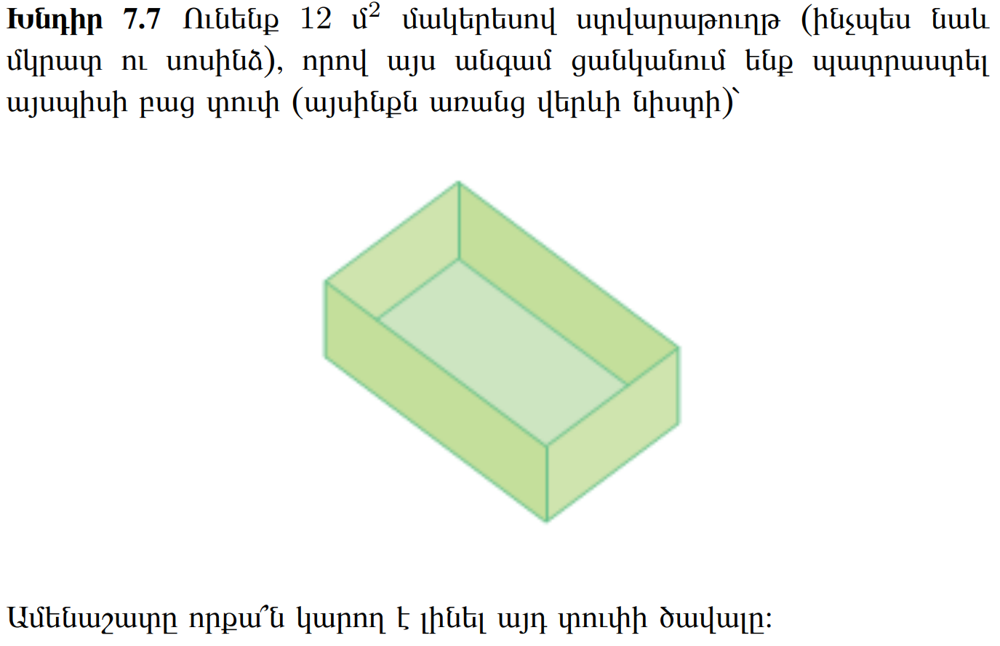

Գյումրի, [լուսանկարի հղումը](https://unsplash.com/photos/b8Iwra4rnRs), Հեղինակ՝ [Naren Hakobyan](https://unsplash.com/@naren735)

# 📚 Նյութը

::: {.callout-tip collapse="true"}
## ⚠️ Note
YouTube links in this section were auto-extracted. If you spot a mistake, please let me know!
:::

## Դասախոսություն
- [📺 Դասախոսություն — Multivariate functions, gradient direction](https://youtu.be/tFiDNbpZNFw)
- [📺 Դասախոսություն — Extrema in multivariate case, Hessian](https://youtu.be/Fc8lIjjDE5U)
- [🎞️ Սլայդեր — L08 Functions of Several Variables](Lectures/L08_Functions_of_Several_Variables.pdf)

## Գործնական
- [📺 Գործնական — Gradient descent, Hessian, multivar Taylor](https://youtu.be/XFF03oPjAyE)
- [🛠️🗂️ Գործնականի PDF-ը](Homeworks/hw_07_multivar_calc.pdf)

# 🏡 Տնային

::: {.callout-note collapse="false"}
1. ❗❗❗ DON'T CHECK THE SOLUTIONS BEFORE TRYING TO DO THE HOMEWORK BY YOURSELF❗❗❗
2. Please don't hesitate to ask questions, never forget about the 🍊karalyok🍊 principle!
3. The harder the problem is, the more 🧀cheeses🧀 it has.
4. Problems with 🎁 are just extra bonuses. It would be good to try to solve them, but also it's not the highest priority task.
5. If the problem involve many boring calculations, feel free to skip them - important part is understanding the concepts.
6. Submit your solutions [here](https://forms.gle/CFEvNqFiTSsDLiFc6) (even if it's unfinished)
:::

### 01 Gradient Descent Algorithm {data-difficulty="2"}

Consider the function $f(x_1, x_2) = x_1^2 + 2x_2^2 + x_1 x_2 + 4x_1 - 2x_2 + 5$.

We want to find the minimum. We could do it analytically, it's just a quadratic function, but quite soon we'll start to work with function for which we can't just find the optimum with pen and paper. So let's use an iterative algorithm. 

0. Open up VS code, or you're favorite IDE.
1. Pick a random starting point. 
2. In what direction should you move so that the function value decreases in the fastest way? 
3. Move in that direction (you may consider first multiplying that direction by some small value, let's say 0.1, that's the so called $\alpha$'learning rate' / 'step size', which we'll learn about later, but it basically controls how big steps you take. Too big step size -> you may overshoot the optimum value and diverge, too small, you may take too long time to converge, but often **"Let it be late, let it be almond"** principle holds) 
4. Keep on iterating like that. Can you come up with a stopping criteria? (e. g. if improvement / change smaller then x let's just stop the algorithm)
5. Plot and print interesting staff, e. g. function value vs iteration number
6. Play around with $\alpha$ and the starting point to see how it affects convergence.

### 02 Boat in Sevan {data-difficulty="1"}
Սևանա լճի $(x, y)$ կոորդինատներով կետում ջրի խորությունը

$$
f(x, y) = xy^2 - 6x^2 - 3y^2
$$

մետր է։ $(5, 3)$ կետում գտնվող «Նորատուս» առագաստանավի նավապետը ցանկանում է շարժվել դեպի մի այնպիսի կետ, որում ջուրն ավելի
խոր է։ Նրա առաջին օգնականն առաջարկում է նավարկել դեպի հյուսիս,
իսկ երկրորդը՝ դեպի հարավ։ Օգնականներից որի՞ խորհուրդը պետք է
լսի նավապետը։

### 03 Topless box {data-difficulty="2"}

Hint:
You may want to first do [this](https://hayktarkhanyan.github.io/python_math_ml_course/math/05_calc_extrema_convexity_taylor.html#box-problem) exercise.
### 04 Smooth Functions and Gradient Properties {data-difficulty="3"}

::: {.callout-note collapse="true"}
### Context: Smoothness
A function $f: \mathbb{R}^n \to \mathbb{R}$ is called **smooth** (or $C^\infty$) if it has continuous partial derivatives of all orders. In practice, we often work with $C^1$ functions (continuously differentiable) or $C^2$ functions (twice continuously differentiable).
:::

Consider the bivariate function $f : \mathbb{R}^2 \to \mathbb{R}$, $(x_1, x_2) \mapsto x_1^2 + 0.5x_2^2 + x_1x_2$.

1. Show that $f$ is smooth (continuously differentiable).
2. Find the direction of greatest increase of $f$ at $\mathbf{x} = (1, 1)$.
3. Find the direction of greatest decrease of $f$ at $\mathbf{x} = (1, 1)$.
4. Find a direction in which $f$ does not instantly change at $\mathbf{x} = (1, 1)$.
5. Assume there exists a differentiable parametrization of a curve $\tilde{\mathbf{x}} : \mathbb{R} \to \mathbb{R}^2$, $t \mapsto \tilde{\mathbf{x}}(t)$ such that $\forall t \in \mathbb{R} : f(\tilde{\mathbf{x}}(t)) = f(1,1)$. Show that at each point of the curve $\tilde{\mathbf{x}}$ the tangent vector $\frac{\partial \tilde{\mathbf{x}}}{\partial t}$ is perpendicular to $\nabla f(\tilde{\mathbf{x}})$.
6. Interpret parts (d) and (e) geometrically.

### 05 Contour Plots, Hessians, and Convexity {data-difficulty="3"}

::: {.callout-note collapse="true"}
### Context: Contour Plots and Convexity
**Contour plots** (or level curves) visualize multivariate functions by showing curves where $f(x_1, x_2) = c$ for various constants $c$. They're essential for understanding the shape of loss landscapes in machine learning.
:::

Let $f : \mathbb{R}^2 \to \mathbb{R}$, $(x_1, x_2) \mapsto -\cos(x_1^2 + x_2^2 + x_1x_2)$.

1. Create a contour plot of $f$ in the range $[-2,2] \times [-2,2]$ with R.
2. Compute $\nabla f$.
3. Compute $\nabla^2 f$ (the Hessian matrix).

Now, define the restriction of $f$ to $S_r = \{(x_1, x_2) \in \mathbb{R}^2 \mid x_1^2 + x_2^2 + x_1x_2 < r\}$ with $r \in \mathbb{R}, r > 0$, i.e., $f|_{S_r} : S_r \to \mathbb{R}, (x_1, x_2) \mapsto f(x_1, x_2)$.

4. Show that $f|_{S_r}$ with $r = \pi/4$ is convex.
5. Find the local minimum $\mathbf{x}^*$ of $f|_{S_r}$.
6. Is $\mathbf{x}^*$ a global minimum of $f$?

### 06 Taylor Expansion {data-difficulty="2"}

Consider the bivariate function $f : \mathbb{R}^2 \to \mathbb{R}, (x_1,x_2) \mapsto \exp(\pi \cdot x_1) - \sin(\pi \cdot x_2) + \pi \cdot x_1 \cdot x_2$.

1. Compute the gradient of $f$ for an arbitrary $x$.
2. Compute the Hessian of $f$ for an arbitrary $x$.
3. State the first order taylor polynomial $T_{1,a}(x)$ expanded around the point $a = (0,1)$.
4. State the second order taylor polynomial $T_{2,a}(x)$ expanded around the point $a = (0,1)$.
5. Determine if $T_{2,a}$ is a convex function.

# 🛠️ Գործնական
- [🛠️📺 Գործնականի տեսագրությունը](https://youtu.be/XFF03oPjAyE)
- [🛠️🗂️ Գործնականի PDF-ը]()

# 🎲 43 (07)
- 🔥[Landmark.am](https://landmark.am/)
- 🔗[Random link](https://youtu.be/9_Gl0MBKrUU?si=ap5LjOjf7UM1hq8a)
- 🇦🇲🎶[Dorians (Ես կուլամ)](https://www.youtube.com/watch?v=0syTeqk9Hes)
- 🌐🎶[Noize MC (Вселенная бесконечна?)](https://www.youtube.com/watch?v=DBnwy46OPFU)
- 🤌[Կարգին ToDo]()

