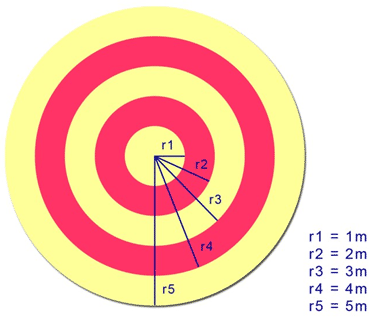
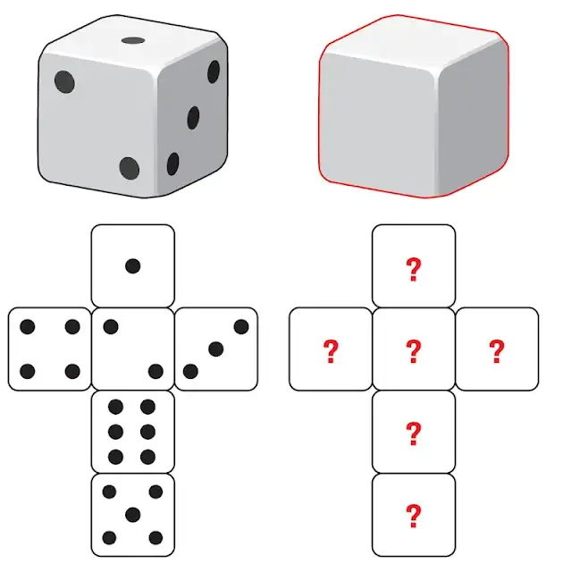

<script src="homework-scripts.js"></script>


Ալավերդի, [լուսանկարի հղումը](https://unsplash.com/photos/ZOTr3ANDvrU), Հեղինակ՝ [Tigran Hambardzumyan](https://unsplash.com/@tigranh47)


# 📚 Նյութը

::: {.callout-tip collapse="true"}
## ⚠️ Note
YouTube links in this section were auto-extracted. If you spot a mistake, please let me know!
:::

## Դասախոսություն
- [📺 Դասախոսություն — Intro to probability theory](https://youtu.be/OhbCxYucA4s)
- [📺 Դասախոսություն — Conditional probability, Bayes, independence](https://youtu.be/KkWwnFRd0YU)
- [📺 Դասախոսություն — Geometric probability](https://youtu.be/7WB-qkVn9lo)
- [🎞️ Սլայդեր — L09 Probability  Independence  Bayes Rule](Lectures/L09_Probability__Independence__Bayes_Rule.pdf)

## Գործնական
- [📺 Գործնական — Probability theory fundamentals](https://youtu.be/twHQTcN_48E)
- [🛠️🗂️ Գործնականի PDF-ը](Homeworks/hw_08_prob_1.pdf)

# 🏡 Տնային

::: {.callout-note collapse="false"}
1. ❗❗❗ DON'T CHECK THE SOLUTIONS BEFORE TRYING TO DO THE HOMEWORK BY YOURSELF❗❗❗
2. Please don't hesitate to ask questions, never forget about the 🍊karalyok🍊 principle!
3. The harder the problem is, the more 🧀cheeses🧀 it has.
4. Problems with 🎁 are just extra bonuses. It would be good to try to solve them, but also it's not the highest priority task.
5. If the problem involve many boring calculations, feel free to skip them - important part is understanding the concepts.
6. Submit your solutions [here](https://forms.gle/CFEvNqFiTSsDLiFc6) (even if it's unfinished)
:::


## Problems by Subtopic

## Basics & Discrete Probability

### 01 Two Dice Probability {data-difficulty="1"}

Suppose we roll two fair dice. What is the probability of getting:

a) 2 on each of them
b) at least one 1
c) exactly one 1
d) one 1 and one 4
e) 1 on the first die and 4 on the second die

::: {.callout-tip collapse="true" title="Solution"}

The sample space has $6 \times 6 = 36$ equally likely ordered outcomes $(d_1, d_2)$. The cleanest approach is to count favorable outcomes and divide by $36$.

**a) Both 2.** Only $(2,2)$. So $P = \dfrac{1}{36}$.

**b) At least one 1.** Easiest via the complement: "no 1" means both dice $\in \{2,3,4,5,6\}$, which has $5 \times 5 = 25$ outcomes.

$$P(\text{at least one 1}) = 1 - \frac{25}{36} = \frac{11}{36}$$

*Why complement?* Events like "at least one ..." overlap in messy ways (the outcome $(1,1)$ would be double-counted if you naively added "first is 1" + "second is 1"). The complement event is a clean intersection of independent events, no double-counting.

**c) Exactly one 1.** Either $d_1 = 1$ and $d_2 \neq 1$, or $d_1 \neq 1$ and $d_2 = 1$. Each gives $1 \cdot 5 = 5$ outcomes; they're disjoint:

$$P = \frac{5 + 5}{36} = \frac{10}{36} = \frac{5}{18}$$

Sanity check: $P(\text{exactly one 1}) + P(\text{both 1}) = \tfrac{10}{36} + \tfrac{1}{36} = \tfrac{11}{36} = P(\text{at least one 1})$. ✓

**d) One 1 and one 4.** Two ordered outcomes: $(1,4)$ and $(4,1)$. So $P = \dfrac{2}{36} = \dfrac{1}{18}$.

**e) 1 on the first die and 4 on the second.** Only $(1, 4)$. So $P = \dfrac{1}{36}$.

*The lesson from (d) vs (e).* "One 1 and one 4" is symmetric — we don't care which die shows what, so we count both orderings. "1 on the **first** die and 4 on the **second**" pins the labels, so only one ordering counts. This kind of distinction trips people up constantly; always ask whether the problem cares about order or not.

:::

### 02 Coin Tosses - Odd Heads {data-difficulty="2"}

A fair coin is tossed 5 times. What is the probability of getting an odd number of heads?

**Can you do the exercise without much computations?**

::: {.callout-tip collapse="true" title="Solution"}

**The slick argument (no computation).** Pair every outcome with its **complement** — the sequence where every flip is reversed. For example, $HHTHT$ pairs with $TTHTH$. Two observations:

1. The map "flip every coin" is a bijection of the $2^5 = 32$ outcomes onto itself.
2. It changes the parity of the number of heads. (If the original has $k$ heads, the flipped version has $5 - k$, and one of $k, 5-k$ is odd, the other even — because $5$ is odd.)

So the outcomes split into pairs (one even-heads, one odd-heads). Therefore exactly **half** the outcomes have an odd number of heads:

$$P(\text{odd heads}) = \frac{1}{2}$$

**The brute-force verification.** Count outcomes with exactly $k$ heads using $\binom{5}{k}$:

$$P(\text{odd}) = \frac{\binom{5}{1} + \binom{5}{3} + \binom{5}{5}}{2^5} = \frac{5 + 10 + 1}{32} = \frac{16}{32} = \frac{1}{2}$$

*Why does this only work for odd $n$?* Because the parity-flipping bijection only flips parity when $n$ is odd. For $n = 4$ (even), $HHTT$ pairs with $TTHH$ — both have $2$ heads, both even. So for even $n$ the symmetry argument fails, and indeed $P(\text{odd heads for } n=4) = \tfrac{8}{16} = \tfrac{1}{2}$ still — but that's a coincidence; the cleaner identity is

$$\sum_{k \text{ odd}} \binom{n}{k} = \sum_{k \text{ even}} \binom{n}{k} = 2^{n-1}$$

for any $n \geq 1$, which comes from $(1+1)^n - (1-1)^n = 2 \sum_{k \text{ odd}} \binom{n}{k}$.

*Takeaway.* When a counting problem has a natural involution (a self-inverse bijection) that reverses some property, you can often read off the answer without summing anything.

:::

### 03 Queen or Heart {data-difficulty="2"}

A standard deck of 52 playing cards is shuffled. What is the probability of drawing either a queen or a heart?

::: {.callout-tip collapse="true" title="Solution"}

Let $Q$ = "card is a queen" and $H$ = "card is a heart". We want $P(Q \cup H)$.

The naive temptation is to add $P(Q) + P(H) = \tfrac{4}{52} + \tfrac{13}{52} = \tfrac{17}{52}$, but this **double-counts the queen of hearts** — that single card belongs to both events.

The fix is **inclusion-exclusion**:

$$P(Q \cup H) = P(Q) + P(H) - P(Q \cap H) = \frac{4}{52} + \frac{13}{52} - \frac{1}{52} = \frac{16}{52} = \frac{4}{13}$$

*Visualizing it.* Think of the favorable cards as a set: $4$ queens (one per suit) plus $13$ hearts. The queen of hearts is in both lists, so the union has $4 + 13 - 1 = 16$ cards.

```{=html}
<svg viewBox="0 0 400 200" xmlns="http://www.w3.org/2000/svg" style="display:block;margin:1em auto;max-width:100%;height:auto;font-family:sans-serif;">
  <circle cx="150" cy="100" r="70" fill="#D90012" fill-opacity="0.25" stroke="#D90012" stroke-width="2"/>
  <circle cx="240" cy="100" r="70" fill="#0033A0" fill-opacity="0.25" stroke="#0033A0" stroke-width="2"/>
  <text x="110" y="60" font-size="13" fill="#D90012" font-weight="bold">Q (4)</text>
  <text x="250" y="60" font-size="13" fill="#0033A0" font-weight="bold">H (13)</text>
  <text x="180" y="105" font-size="11" fill="currentColor">Q∩H = 1</text>
  <text x="170" y="195" font-size="11" fill="currentColor">|Q ∪ H| = 4 + 13 - 1 = 16</text>
</svg>
```

*General principle.* Inclusion-exclusion is the basic correction for counting unions:

$$P(A \cup B) = P(A) + P(B) - P(A \cap B)$$

You'll see it generalize to three or more sets, with alternating signs, throughout combinatorics.

:::

### 04 An Urn {data-difficulty="2"}

An urn contains 3 red balls and 5 blue balls. Two balls are drawn without replacement. What is the probability that both balls are red?

::: {.callout-tip collapse="true" title="Solution"}

Total balls: $8$ ($3$ red, $5$ blue).

**Approach 1: sequential (multiplication rule).** Think of drawing one at a time. The probability the first ball is red is $\tfrac{3}{8}$. **Given** the first was red, only $2$ red balls remain in $7$ total, so the conditional probability the second is also red is $\tfrac{2}{7}$. Multiplying:

$$P(\text{both red}) = \frac{3}{8} \cdot \frac{2}{7} = \frac{6}{56} = \frac{3}{28}$$

**Approach 2: combinations.** Number of ways to choose $2$ red from $3$ is $\binom{3}{2} = 3$. Total ways to choose any $2$ from $8$ is $\binom{8}{2} = 28$.

$$P(\text{both red}) = \frac{\binom{3}{2}}{\binom{8}{2}} = \frac{3}{28}$$

Both routes agree. The first one (multiplication along a draw sequence) generalizes more naturally; the second (counting unordered samples) is often shorter when the problem is symmetric across draws.

*Why "without replacement" matters.* Without replacement, draws are **not independent**: the first draw shifts the composition of the urn, changing the probabilities for the second. This is the conceptual difference between sampling from a finite population and i.i.d. coin flips. In ML you meet this in cross-validation (split data without putting samples back) and bootstrap (sample *with* replacement, deliberately).

:::

### 05 Colored Pencils {data-difficulty="1"}

There are 2 red, 5 blue and 6 yellow pencils (total: 13). Two pencils are drawn randomly. Find the probability that both are:

a) red
b) of the same color
c) of different colors
d) not yellow
e) not green

::: {.callout-tip collapse="true" title="Solution"}

Total ways to pick $2$ pencils from $13$: $\binom{13}{2} = \frac{13 \cdot 12}{2} = 78$.

**a) Both red.** Choose $2$ from $2$ red: $\binom{2}{2} = 1$.

$$P = \frac{1}{78}$$

**b) Same color.** Add up the three same-color cases (red-red, blue-blue, yellow-yellow):

$$\binom{2}{2} + \binom{5}{2} + \binom{6}{2} = 1 + 10 + 15 = 26$$

$$P = \frac{26}{78} = \frac{1}{3}$$

**c) Different colors.** This is the complement of "same color":

$$P = 1 - \frac{1}{3} = \frac{2}{3}$$

(You could also count directly: $2\cdot 5 + 2 \cdot 6 + 5 \cdot 6 = 10 + 12 + 30 = 52$; then $\tfrac{52}{78} = \tfrac{2}{3}$. ✓)

**d) Not yellow.** Both pencils must come from the $7$ non-yellow pencils ($2$ red + $5$ blue):

$$P = \frac{\binom{7}{2}}{\binom{13}{2}} = \frac{21}{78} = \frac{7}{26}$$

**e) Not green.** There are no green pencils, so every pair satisfies "not green" trivially:

$$P = 1$$

*Quick takeaway.* When the question is "both X" or "neither X", you can usually replace "draw from the full set" with "draw from a smaller set". For "at least one X" or "different ...", the complement is often the right move.

:::


### 06 Reading Books {data-difficulty="2"}

There are 15 books: 5 in Armenian, 10 in French. Ruben cannot read French. If he randomly takes 3 books, what is the probability that he can read at least one?

::: {.callout-tip collapse="true" title="Solution"}

"At least one Armenian" is the complement of "all three are French". Counting via $\binom{n}{k}$:

$$P(\text{all French}) = \frac{\binom{10}{3}}{\binom{15}{3}} = \frac{120}{455} = \frac{24}{91}$$

Therefore:

$$P(\text{at least one Armenian}) = 1 - \frac{24}{91} = \frac{67}{91} \approx 0.736$$

*Why complement again?* "At least one" splits into messy disjoint cases (exactly $1$, exactly $2$, exactly $3$ Armenian) that all need to be added. The complement "zero Armenian" is a single tidy event. Whenever "at least one" appears, complement is almost always the move.

*Sanity check by direct count:*

$$P(\text{exactly 1 Arm}) = \frac{\binom{5}{1}\binom{10}{2}}{\binom{15}{3}} = \frac{5 \cdot 45}{455} = \frac{225}{455}$$

$$P(\text{exactly 2 Arm}) = \frac{\binom{5}{2}\binom{10}{1}}{\binom{15}{3}} = \frac{10 \cdot 10}{455} = \frac{100}{455}$$

$$P(\text{exactly 3 Arm}) = \frac{\binom{5}{3}}{\binom{15}{3}} = \frac{10}{455}$$

Sum: $\tfrac{225 + 100 + 10}{455} = \tfrac{335}{455} = \tfrac{67}{91}$. ✓

:::


### 07 Baby-Mother Matching {data-difficulty="2"}

Three babies are given a weekly health check at a clinic, and then returned randomly to their mothers. What is the probability that at least one baby goes to the right mother?

::: {.callout-tip collapse="true" title="Solution"}

Label the babies $1, 2, 3$ and the mothers also $1, 2, 3$. A random return is a uniformly random permutation $\pi$ of $\{1, 2, 3\}$. There are $3! = 6$ permutations, all equally likely. We want the probability that **at least one fixed point** (i.e., some $i$ with $\pi(i) = i$).

**Direct count via complement.** A permutation with **no fixed points** is called a **derangement**. Listing the $6$ permutations of $(1,2,3)$:

| permutation $(\pi(1), \pi(2), \pi(3))$ | fixed points |
|---|---|
| $(1, 2, 3)$ | $1, 2, 3$ |
| $(1, 3, 2)$ | $1$ |
| $(2, 1, 3)$ | $3$ |
| $(2, 3, 1)$ | none ✓ |
| $(3, 1, 2)$ | none ✓ |
| $(3, 2, 1)$ | $2$ |

Exactly $2$ derangements out of $6$. So:

$$P(\text{no baby to its mother}) = \frac{2}{6} = \frac{1}{3}$$

$$P(\text{at least one match}) = 1 - \frac{1}{3} = \frac{2}{3}$$

*Inclusion-exclusion (the way that scales).* Let $A_i$ = "baby $i$ goes to its own mother". Then

$$P(A_1 \cup A_2 \cup A_3) = \sum P(A_i) - \sum P(A_i \cap A_j) + P(A_1 \cap A_2 \cap A_3)$$

- $P(A_i) = \tfrac{2!}{3!} = \tfrac{1}{3}$ for each $i$ (the other two babies permute freely). Three terms: $3 \cdot \tfrac{1}{3} = 1$.
- $P(A_i \cap A_j) = \tfrac{1!}{3!} = \tfrac{1}{6}$. Three pairs: $3 \cdot \tfrac{1}{6} = \tfrac{1}{2}$.
- $P(A_1 \cap A_2 \cap A_3) = \tfrac{1}{6}$.

$$P(\text{at least one match}) = 1 - \frac{1}{2} + \frac{1}{6} = \frac{6 - 3 + 1}{6} = \frac{2}{3} \;\checkmark$$

*A beautiful pattern.* For $n$ babies, the probability of **no match** approaches $1/e \approx 0.368$ as $n \to \infty$. So even with $1{,}000{,}000$ babies, the probability that at least one ends up with the right mother converges to $\approx 0.632$, **not** $1$. Almost as surprising as the birthday paradox: the probability of at least one fixed point is essentially the same regardless of how many people are involved.

:::

### 08 Ruined Photos on Film {.bonus-problem data-difficulty="3"}

After a trip to Garni-Geghard, you bring your camera film to a photography shop. Unfortunately, the shop ruins 4 consecutive photos in a row from your roll of 24 photos of Garni. What is the probability that the ruined photos included the

- a) eighth or ninth or tenth photos,
- b) eighth and ninth and tenth photos

on the roll?

::: {.callout-tip collapse="true" title="Solution"}

The 4 ruined photos form a contiguous block of length $4$ inside positions $1, \ldots, 24$. The block can start at position $k = 1, 2, \ldots, 21$ (since $k + 3 \leq 24$). So there are $21$ equally likely block positions.

**a) Block includes photo 8 OR 9 OR 10.** A block starting at position $k$ covers positions $\{k, k+1, k+2, k+3\}$. The block contains at least one of $\{8, 9, 10\}$ iff its range overlaps $\{8, 9, 10\}$.

Equivalently: the block starts somewhere in $k = 5, 6, 7, 8, 9, 10$:

- $k = 5$: covers $5, 6, 7, 8$ — includes $8$ ✓
- $k = 6$: covers $6, 7, 8, 9$ — includes $8, 9$ ✓
- $k = 7$: covers $7, 8, 9, 10$ — includes all three ✓
- $k = 8$: covers $8, 9, 10, 11$ — includes all three ✓
- $k = 9$: covers $9, 10, 11, 12$ — includes $9, 10$ ✓
- $k = 10$: covers $10, 11, 12, 13$ — includes $10$ ✓

That's $6$ valid starts:

$$P(\text{a}) = \frac{6}{21} = \frac{2}{7}$$

**b) Block includes photo 8 AND 9 AND 10.** All three positions must be inside $\{k, k+1, k+2, k+3\}$. The block has length $4$, so positions $\{8, 9, 10\}$ (a span of $3$) must lie inside the block, meaning $k \leq 8$ and $k + 3 \geq 10$, i.e., $k \in \{7, 8\}$.

That's $2$ valid starts:

$$P(\text{b}) = \frac{2}{21}$$

*Quick sanity check.* (b) ⊂ (a), so we should get $P(\text{b}) \leq P(\text{a})$: $\tfrac{2}{21} \leq \tfrac{6}{21}$. ✓

*A general lesson.* When events are defined by "a window of length $L$ falls in some range", count the number of valid window-start positions. The structure is identical to a 1D version of "convolution" — sliding a fixed-shape kernel along an array — which you'll see again in image processing and CNNs.

:::

### 09 Birthday Paradox {data-difficulty="2"}

In a group of n people, what is the probability that at least two share the same birthday (assume 365 days and ignore leap years)? Approximately how many people are needed for this probability to exceed 50%?

::: {.callout-tip collapse="true" title="Solution"}

Use the complement: easier to compute $P(\text{all }n\text{ birthdays distinct})$.

Imagine adding people one at a time. The first person can have any birthday. The second must avoid the first ($\tfrac{364}{365}$). The third must avoid both ($\tfrac{363}{365}$). And so on:

$$P(\text{all distinct}) = \frac{365}{365} \cdot \frac{364}{365} \cdot \frac{363}{365} \cdots \frac{365 - n + 1}{365} = \prod_{k=0}^{n-1} \frac{365 - k}{365}$$

Therefore:

$$P(\text{at least one shared birthday}) = 1 - \prod_{k=0}^{n-1}\frac{365 - k}{365}$$

**When does this cross $50\%$?** Compute for a few values:

| $n$ | $P(\text{at least one match})$ |
|---|---|
| $10$ | $\approx 0.117$ |
| $20$ | $\approx 0.411$ |
| $22$ | $\approx 0.476$ |
| $23$ | $\approx 0.507$ |
| $30$ | $\approx 0.706$ |
| $50$ | $\approx 0.970$ |
| $70$ | $\approx 0.9992$ |

So the threshold is **$n = 23$** people — strikingly small.

*Why so few? The intuition.* People often guess the answer is around $\tfrac{365}{2} \approx 180$ — confusing "match my birthday" (rare) with "any pair matches" (much easier). With $n$ people there are $\binom{n}{2} = \tfrac{n(n-1)}{2}$ pairs, each colliding with probability $\tfrac{1}{365}$. By $n = 23$ that's $\binom{23}{2} = 253$ pairs — so we'd expect roughly $\tfrac{253}{365} \approx 0.69$ collisions on average. The probability that *none* of these many pairs collide is small.

A clean approximation:

$$1 - \prod_{k=0}^{n-1}\frac{365 - k}{365} \approx 1 - e^{-n(n-1)/(2 \cdot 365)}$$

Setting the right side to $\tfrac{1}{2}$ gives $\tfrac{n(n-1)}{730} \approx \ln 2 \approx 0.693$, so $n(n-1) \approx 506$, $n \approx 23$.

*Why this matters in ML and CS.* This is the "**birthday bound**": collisions in a hash table with $N$ buckets become likely after only $\sqrt{N}$ insertions, not $N$. It's why cryptographic hashes need much larger output spaces than you'd naively expect, and it shows up everywhere in random sampling, deduplication, and approximate counting.

:::

## Geometric Probability

### 10 Dart Throwing {data-difficulty="2"}

A dart is thrown at a circular target with concentric circles. Circle 1 (innermost) has radius 1m, and each subsequent radius increases by 1m. Find the probability that the dart lands in:

a) circle 1
b) a red circle
c) a yellow circle



::: {.callout-tip collapse="true" title="Solution"}

**Reading the colors.** From the image, the rings alternate red and yellow starting from a red center:

| Zone | Radii (m) | Color | Area |
|------|:---------:|:------:|:----:|
| central disk | $[0, 1]$ | red | $\pi \cdot 1^2 = \pi$ |
| 2nd donut | $[1, 2]$ | yellow | $\pi(2^2 - 1^2) = 3\pi$ |
| 3rd donut | $[2, 3]$ | red | $\pi(3^2 - 2^2) = 5\pi$ |
| 4th donut | $[3, 4]$ | yellow | $\pi(4^2 - 3^2) = 7\pi$ |
| 5th donut | $[4, 5]$ | red | $\pi(5^2 - 4^2) = 9\pi$ |

Total board area: $\pi \cdot 5^2 = 25\pi$. Check: $1 + 3 + 5 + 7 + 9 = 25$. ✓

Assuming the dart lands uniformly at random on the board, probabilities are area ratios.

**a) Circle 1 (innermost disk).**
$$P = \frac{\pi}{25\pi} = \frac{1}{25} = 4\%$$

**b) Red region** (central disk + 3rd + 5th donut).
$$P_{\text{red}} = \frac{\pi + 5\pi + 9\pi}{25\pi} = \frac{15}{25} = \frac{3}{5} = 60\%$$

**c) Yellow region** (2nd + 4th donut).
$$P_{\text{yellow}} = \frac{3\pi + 7\pi}{25\pi} = \frac{10}{25} = \frac{2}{5} = 40\%$$

Sanity check: $60\% + 40\% = 100\%$. ✓ (Every dart lands somewhere on the board.)

*The hidden identity.* The ring areas are $1, 3, 5, 7, 9$ (times $\pi$): consecutive odd numbers, summing to $25 = 5^2$. This is the classic identity $\sum_{k=1}^{n}(2k-1) = n^2$, visible here because each donut has area $\pi(r^2 - (r-1)^2) = \pi(2r - 1)$. A neat geometric reason for why integer squares can be built by summing odd numbers in sequence.

:::

### 11 Computing Pi {data-difficulty="2"}

What is the probability that a randomly chosen point inside a square of side length 2 falls within the inscribed circle of radius 1?

::: {.callout-tip collapse="true" title="Solution"}

For "uniformly random point in region $R$", the probability of landing in subregion $A \subseteq R$ is just the **area ratio**:

$$P(\text{point} \in A) = \frac{\text{area}(A)}{\text{area}(R)}$$

Areas:

- Square of side $2$: area $= 2^2 = 4$
- Inscribed circle of radius $1$: area $= \pi r^2 = \pi$

$$P = \frac{\pi}{4} \approx 0.7854$$

```{=html}
<svg viewBox="0 0 200 200" xmlns="http://www.w3.org/2000/svg" style="display:block;margin:1em auto;max-width:240px;height:auto;font-family:sans-serif;">
  <rect x="20" y="20" width="160" height="160" fill="#0033A0" fill-opacity="0.15" stroke="#0033A0" stroke-width="2"/>
  <circle cx="100" cy="100" r="80" fill="#D90012" fill-opacity="0.3" stroke="#D90012" stroke-width="2"/>
  <text x="80" y="105" font-size="14" fill="currentColor">π / 4</text>
</svg>
```

*Why this also gives a Monte-Carlo estimator for $\pi$.* Throw $N$ darts uniformly at the square, count the number $K$ that land inside the circle. Then $K/N \approx \pi/4$, so $\pi \approx 4K/N$. With $N = 10^6$ darts you get $\pi$ accurate to about 3 decimal places. This isn't a fast way to compute $\pi$ (it converges like $1/\sqrt{N}$, painfully slow), but it's the simplest example of **Monte Carlo integration** — turning a hard integral into a ratio of random samples.

The same idea — sample uniformly, take a ratio — drives modern ML techniques like importance sampling, MCMC, and approximate Bayesian inference. Geometric probability is your first encounter with this powerful style of reasoning.

:::

### 12 Meeting at Kinopark {data-difficulty="2"}

Anush and Nairi are shopping at the mall. They agree to split up for a time and then meet for lunch. They plan to meet in front of Kinopark between 12:00 and 13:00. The one who arrives first agrees to wait 15 minutes for the other to arrive. After 15 minutes, that person will leave and continue shopping. What is the probability that they will meet if each one of them arrives at any time between 12:00 and 13:00?

Hint: Represent on the coordinate plane with x = Anush’s arrival, y = Nairi’s arrival.

[📹 Video Solution in Armenian](https://youtu.be/U2AE4TZU4MA) (Շուտ եմ ասել մինչև երկար չմտածեք ինքնուրույն  վիդեոն նայել չկա !)

::: {.callout-tip collapse="true" title="Solution"}

Let $x$ = minutes past 12:00 that Anush arrives, $y$ = same for Nairi. Both $x, y \in [0, 60]$ uniformly and independently. The sample space is the $60 \times 60$ square with area $3600$.

They meet iff their arrival times differ by at most $15$ minutes:

$$|x - y| \leq 15$$

This is the band between the lines $y = x - 15$ and $y = x + 15$ inside the square.

```{=html}
<svg viewBox="0 0 300 300" xmlns="http://www.w3.org/2000/svg" style="display:block;margin:1em auto;max-width:300px;height:auto;font-family:sans-serif;">
  <rect x="40" y="40" width="220" height="220" fill="none" stroke="currentColor" stroke-opacity="0.4" stroke-width="1.5"/>
  <polygon points="40,40 95,40 260,205 260,260 205,260 40,95" fill="#0033A0" fill-opacity="0.25" stroke="#0033A0" stroke-width="1.5"/>
  <polygon points="95,40 260,40 260,205" fill="#D90012" fill-opacity="0.2" stroke="#D90012" stroke-width="1"/>
  <polygon points="40,95 205,260 40,260" fill="#D90012" fill-opacity="0.2" stroke="#D90012" stroke-width="1"/>
  <text x="135" y="155" font-size="11" fill="currentColor">meet</text>
  <text x="195" y="100" font-size="10" fill="currentColor">miss</text>
  <text x="80" y="220" font-size="10" fill="currentColor">miss</text>
  <text x="150" y="280" font-size="11" fill="currentColor">x (Anush)</text>
  <text x="5" y="155" font-size="11" fill="currentColor">y (Nairi)</text>
  <text x="35" y="35" font-size="9" fill="currentColor">0</text>
  <text x="255" y="35" font-size="9" fill="currentColor">60</text>
</svg>
```

**Compute the meeting region by complement.** The two corner triangles (top-left and bottom-right) are where they miss each other. Each triangle has legs of length $60 - 15 = 45$, so each has area $\tfrac{1}{2} \cdot 45 \cdot 45 = \tfrac{2025}{2}$.

Total miss area: $2 \cdot \tfrac{2025}{2} = 2025$.

Meeting area: $3600 - 2025 = 1575$.

$$P(\text{meet}) = \frac{1575}{3600} = \frac{7}{16} = 0.4375$$

*Why translate this into geometry?* Because once you turn "two random arrival times" into "a random point in a square", any condition on those times — like $|x - y| \leq 15$ — becomes a region. Computing probability is then just computing area, which we already know how to do. This trick of **encoding a probability question as a geometric region** is the heart of geometric probability.

*Real-world variants of this same problem.* Two servers must communicate within a $15$-second window or one of them aborts; two trains arriving on overlapping platforms; two people in a queue checking if their tickets clash. Whenever you have "two independent uniform times, must coincide within tolerance $\Delta$", the answer is

$$P = 1 - \left(1 - \tfrac{\Delta}{T}\right)^2$$

(here $T = 60$, $\Delta = 15$, giving $1 - \tfrac{9}{16} = \tfrac{7}{16}$).

:::

### 13 Triangle from Three Random Points {data-difficulty="2"}

Pick three numbers independently and uniformly from the interval $[0, 1]$. What is the probability that they can be the lengths of the sides of a triangle?

[📹 Solution](https://youtu.be/ccNSU_TsUnQ)

::: {.callout-tip collapse="true" title="Solution"}

Let $a, b, c$ be iid Uniform$[0, 1]$. They form a triangle iff each side is less than the sum of the other two:

$$a + b > c, \qquad a + c > b, \qquad b + c > a$$

**Use the complement.** The triangle inequality *fails* iff some side is at least the sum of the other two. By the symmetry across $a, b, c$, the three "fail" events have equal volume; they overlap only on a measure-zero set (if $c \geq a + b$ and simultaneously $a \geq b + c$, then $a \geq b + a + b$ forces $b = 0$). So:

$$P(\text{fail}) = 3 \cdot P(c \geq a + b)$$

**Compute $P(c \geq a + b)$.** For fixed $a, b \in [0, 1]$, the condition $c \geq a + b$ pins $c$ to the interval $[a+b, \, 1]$, which is nonempty only when $a + b \leq 1$:

$$\begin{aligned}
P(c \geq a + b) &= \int_0^1 \!\!\int_0^1 \max(0, \, 1 - a - b) \, da \, db \\
&= \int\!\!\int_{a + b \leq 1} (1 - a - b) \, da \, db \\
&= \int_0^1 \int_0^{1-a} (1 - a - b) \, db \, da \\
&= \int_0^1 \frac{(1 - a)^2}{2} \, da \;=\; \frac{1}{6}
\end{aligned}$$

So the fail volume is $3 \cdot \tfrac{1}{6} = \tfrac{1}{2}$, and:

$$P(\text{triangle}) = 1 - \frac{1}{2} = \frac{1}{2}$$

**The picture.** The unit cube $[0, 1]^3$ has volume $1$. The "fail" set splits cleanly into three corner tetrahedra (one per choice of which side is "too big"), each with volume $\tfrac{1}{6}$. The triangle region is the complement: the central portion of the cube where no coordinate dominates the other two. It has volume exactly $\tfrac{1}{2}$.

*Why so clean?* Each corner tetrahedron is the standard 3-simplex $\{a + b + c \leq 1\}$ shape (volume $\tfrac{1}{6}$), and the factor of $3$ comes from the three symmetric ways one side can be the "too big" one. Everything is exact rationals because the boundary $a + b = c$ is linear and the cube is highly symmetric.

*A useful generalization.* If the sides are iid Uniform$[0, L]$ for any $L > 0$, scaling all three by $L$ leaves the triangle question invariant, so $P(\text{triangle}) = \tfrac{1}{2}$ no matter the $L$. The answer changes only when the *lower* bound is nonzero (e.g., Uniform$[1, 10]$), because that rules out near-zero "needle" sides that would fail the inequality, pushing $P$ above $\tfrac{1}{2}$.

*Connection to ML.* Computing $P(X \in A) = \int_A f(x)\,dx$ over a constraint region is exactly what you do for marginal likelihoods, Bayesian normalization, and rejection sampling. Geometric problems like this train the instinct: turn an event-on-a-random-vector into a volume-of-a-region question, then use linear algebra and calculus.

:::


## Conditional & Bayes

### 14 Spam Filter and "Lottery" {data-difficulty="2"}

A spam filter tags emails as spam or not spam. Based on historical data:

- 80% of spam emails contain the word "lottery".
- 30% of non-spam emails contain the word "lottery".
- 40% of emails are spam.

What is the probability that an email containing the word "lottery" is spam?

::: {.callout-tip collapse="true" title="Solution"}

Let $S$ = "spam", $L$ = "contains the word 'lottery'". The given numbers are:

- $P(L \mid S) = 0.8$
- $P(L \mid \neg S) = 0.3$
- $P(S) = 0.4$, so $P(\neg S) = 0.6$

We want $P(S \mid L)$ — the probability of spam given the word appears. Apply **Bayes' theorem**:

$$P(S \mid L) = \frac{P(L \mid S)\, P(S)}{P(L)}$$

The denominator $P(L)$ comes from the **law of total probability**:

$$P(L) = P(L \mid S)P(S) + P(L \mid \neg S)P(\neg S) = 0.8 \cdot 0.4 + 0.3 \cdot 0.6 = 0.32 + 0.18 = 0.5$$

So:

$$P(S \mid L) = \frac{0.32}{0.5} = 0.64$$

A "lottery" email has a $64\%$ chance of being spam — up from the $40\%$ base rate. The word is suggestive but not damning.

*Pictorial intuition: think in counts.* Out of every $1000$ emails:

- $400$ are spam, of which $0.8 \cdot 400 = 320$ contain "lottery"
- $600$ are not spam, of which $0.3 \cdot 600 = 180$ contain "lottery"
- Total "lottery" emails: $320 + 180 = 500$
- Of these, the spam fraction is $\tfrac{320}{500} = 0.64$

This "natural frequency" framing — counting people instead of multiplying probabilities — is psychologically much easier and lets you avoid Bayes' formula entirely.

*Why this is exactly how a naive Bayes spam classifier works.* For each word $w_i$, you estimate $P(w_i \mid S)$ and $P(w_i \mid \neg S)$ from training data. For a new email, you multiply per-word likelihoods (assuming words are conditionally independent given class — that's the "naive" part), then apply Bayes' rule to compute $P(S \mid \text{words})$. Real-world spam filters in the 2000s were essentially this idea, generalized over thousands of words. It's still one of the cleanest places to see Bayesian reasoning at work.

:::

### 15 Flowers Survival and Neighbor Reliability {data-difficulty="2"}

You ask your neighbor to water your flowers while you are on vacation. If the flowers are watered, they have about 0.85 chance of survival; otherwise, they will only survive with probability 0.2. You are 90 percent sure your neighbor will water the flowers, but when you are back, you see the flowers didn't survive. What is the probability your neighbor didn't water the flowers? Should you trust her anymore?

::: {.callout-tip collapse="true" title="Solution"}

Let $W$ = "neighbor watered", $D$ = "flowers died". Given:

- $P(W) = 0.9$, $P(\neg W) = 0.1$
- $P(D \mid W) = 1 - 0.85 = 0.15$
- $P(D \mid \neg W) = 1 - 0.2 = 0.8$

We want $P(\neg W \mid D)$ — given the flowers died, how likely is it she didn't water them?

**Total probability of death.**

$$\begin{aligned}
P(D) &= P(D \mid W)\,P(W) + P(D \mid \neg W)\,P(\neg W) \\
&= 0.15 \cdot 0.9 + 0.8 \cdot 0.1 \\
&= 0.135 + 0.08 \;=\; 0.215
\end{aligned}$$

**Bayes.**

$$P(\neg W \mid D) \;=\; \frac{P(D \mid \neg W)\,P(\neg W)}{P(D)} \;=\; \frac{0.08}{0.215} \;\approx\; 0.372$$

So there's about a **37%** chance she didn't water — your prior trust ($90\%$ that she did) pulled down to about $63\%$, but it's still more likely she did water than not.

*Should you trust her anymore?* The death is bad evidence against her, but **not** decisive evidence. Even watered flowers die $15\%$ of the time. Your posterior says she probably still watered ($\approx 63\%$ chance). One missed batch isn't enough to abandon the prior — you'd need multiple instances of "I asked, the flowers died" before the evidence accumulated against her.

*Why this is the canonical "evidence updates beliefs" example.* You started with a strong prior that she watered ($P(W) = 0.9$). A piece of bad evidence (flowers dead) lowered your belief — but didn't flip it. The strength of the evidence depends on the **likelihood ratio**:

$$\frac{P(D \mid \neg W)}{P(D \mid W)} = \frac{0.8}{0.15} \approx 5.33$$

Each observation of "flowers died after I asked" multiplies the **odds** of $\neg W$ vs $W$ by about $5.33$. The starting odds are $1:9$ in favor of $W$, so after one observation they become $5.33 : 9 \approx 1 : 1.69$, still slightly favoring $W$. That's the same $\approx 37\%$ for $\neg W$.

This **odds-ratio form of Bayes** is how rational updating from evidence is done in practice — in medical diagnosis, fault detection, A/B test analysis, and Bayesian inference more broadly. Each independent piece of evidence multiplies the odds by its likelihood ratio.

:::

### 16 Commute Modes and Lateness {data-difficulty="2"}

Nune uses her car 30% of the time, walks 30% of the time, and rides the bus 40% of the time to work. She is late 10% of the time when she walks, 3% of the time when she drives, and 7% of the time when she takes the bus.

- a) Yesterday she was late. What is the probability she took the bus?
- b) Today she was on time. Do you think she walked?

::: {.callout-tip collapse="true" title="Solution"}

Let $C$ = car, $W$ = walk, $B$ = bus, $L$ = late.

- Priors: $P(C) = 0.3$, $P(W) = 0.3$, $P(B) = 0.4$
- Likelihoods of being late: $P(L \mid C) = 0.03$, $P(L \mid W) = 0.10$, $P(L \mid B) = 0.07$

**Total probability of being late** (law of total probability):

$$P(L) = 0.3 \cdot 0.03 + 0.3 \cdot 0.10 + 0.4 \cdot 0.07 = 0.009 + 0.030 + 0.028 = 0.067$$

**a) She was late. Probability she took the bus.** Bayes:

$$P(B \mid L) = \frac{P(L \mid B) P(B)}{P(L)} = \frac{0.028}{0.067} \approx 0.418$$

(Compare to her prior bus rate of $40\%$ — the late info nudges it up only slightly.)

For completeness, the other two:

$$P(W \mid L) = \frac{0.030}{0.067} \approx 0.448, \quad P(C \mid L) = \frac{0.009}{0.067} \approx 0.134$$

(Sum: $0.418 + 0.448 + 0.134 \approx 1$ ✓.) Walking went up a lot ($30\% \to 45\%$) because walking has the highest lateness rate; driving plunged ($30\% \to 13\%$) because driving rarely makes her late. The late observation is most consistent with walking.

**b) She was on time. Did she walk?**

$$P(\neg L) = 1 - 0.067 = 0.933$$

$$P(W \mid \neg L) = \frac{P(\neg L \mid W) P(W)}{P(\neg L)} = \frac{0.9 \cdot 0.3}{0.933} = \frac{0.27}{0.933} \approx 0.289$$

So given she was on time, walking has probability $\approx 29\%$, slightly **below** her prior $30\%$. The other modes:

$$P(C \mid \neg L) \approx \frac{0.291}{0.933} \approx 0.312, \quad P(B \mid \neg L) \approx \frac{0.372}{0.933} \approx 0.399$$

**She most likely took the bus** (largest posterior, $\approx 40\%$). She probably did **not** walk — the on-time observation slightly pushes against walking, since walking is the latest mode.

*The takeaway about evidence direction.* When mode $X$ has higher-than-average $P(L \mid X)$, observing "late" raises $P(X)$ and observing "on time" lowers $P(X)$. When $X$ has lower-than-average lateness, the directions flip. In Bayesian terms: the evidence shifts the prior in proportion to how surprising the evidence is under that hypothesis vs the average.

:::

### 17 Two-Headed Coin Bayes {data-difficulty="2"}

Rosie has ten coins. Nine of them are ordinary coins with equal chances of Heads and Tails when tossed, and the tenth has two Heads.

- a) If she takes one of the coins at random from her pocket, what is the probability that it is the coin with two Heads?
- b) If she tosses the coin and it comes up Heads, what is the probability that it is the coin with two Heads?
- c) If she tosses the coin one further time and it comes up Tails, what is the probability that it is one of the nine ordinary coins?

::: {.callout-tip collapse="true" title="Solution"}

Let $T$ = "the chosen coin is the two-headed one", $\neg T$ = "ordinary coin".

**a) Just pulled it from the pocket.** No evidence yet, so this is the prior:

$$P(T) = \frac{1}{10}$$

**b) After one Heads.** Apply Bayes. Likelihoods:

- $P(H \mid T) = 1$ (two-headed coin always shows Heads)
- $P(H \mid \neg T) = \tfrac{1}{2}$ (fair coin)

Total probability of seeing $H$:

$$P(H) = 1 \cdot \tfrac{1}{10} + \tfrac{1}{2} \cdot \tfrac{9}{10} = \tfrac{1}{10} + \tfrac{9}{20} = \tfrac{2 + 9}{20} = \tfrac{11}{20}$$

$$P(T \mid H) = \frac{P(H \mid T) P(T)}{P(H)} = \frac{1 \cdot \tfrac{1}{10}}{\tfrac{11}{20}} = \frac{2}{11} \approx 0.182$$

The Heads almost doubled our belief in the two-headed coin (from $\tfrac{1}{10}$ to $\tfrac{2}{11}$).

**c) After Heads then Tails.** A Tails outcome rules out the two-headed coin *immediately*: that coin has two Heads and zero Tails sides, so it can never produce a Tails. Conditional on observing Tails on the second flip, the coin is certainly ordinary:

$$P(\text{ordinary} \mid \text{H then T}) = 1$$

(Switching to plain text for the outcomes here to avoid clashing with our event symbol $T$ = "two-headed coin".)

The probability it's one of the nine ordinary coins is $\boxed{1}$.

*The lesson.* When some hypothesis $\theta$ assigns probability **zero** to an observation $E$, observing $E$ rules $\theta$ out completely. Bayes' rule handles this automatically: $P(\theta \mid E) \propto P(E \mid \theta) \cdot P(\theta) = 0 \cdot P(\theta) = 0$.

This is why Bayesian reasoning treats "impossible under hypothesis" as a knockout punch — a single contradicting observation can reduce a posterior to zero, no matter how strong the prior was. In machine learning this corresponds to **likelihood-based model rejection**: if your model assigns probability ≈ 0 to data you've observed, the model is wrong, period.

*Related instinct: Cromwell's rule.* "Never assign probability $0$ or $1$ to any uncertain proposition" — because once you do, no evidence can move you. Here it's fine because the two-headed coin truly *can't* produce Tails. But in practice, smoothing your priors slightly away from $0$ is a defensive move against being wrong with infinite confidence.

:::


### 18 Medical Test (Bayes’ Theorem) {data-difficulty="2"}

A disease affects 1 in 1,000 people (0.1%). A test has: true positive rate 99% (if diseased), false positive rate 5% (if healthy). If a person tests positive, what is the probability they actually have the disease?

::: {.callout-tip collapse="true" title="Solution"}

Let $D$ = "has the disease", $+$ = "tests positive". Given:

- $P(D) = 0.001$, $P(\neg D) = 0.999$
- $P(+ \mid D) = 0.99$ (sensitivity / true positive rate)
- $P(+ \mid \neg D) = 0.05$ (false positive rate)

We want $P(D \mid +)$.

**Bayes:**

$$P(+) = P(+ \mid D) P(D) + P(+ \mid \neg D) P(\neg D) = 0.99 \cdot 0.001 + 0.05 \cdot 0.999$$

$$= 0.00099 + 0.04995 = 0.05094$$

$$P(D \mid +) = \frac{P(+ \mid D) P(D)}{P(+)} = \frac{0.00099}{0.05094} \approx 0.0194$$

About **$1.9\%$**. A positive test only gives you a $\sim 2\%$ chance of actually being sick.

**The "natural frequency" view (more intuitive).** Imagine $100{,}000$ people:

- $100$ have the disease. Of these, $99$ test positive (true positives), $1$ tests negative.
- $99{,}900$ are healthy. Of these, $0.05 \cdot 99{,}900 = 4{,}995$ test positive (false positives).
- Total positives: $99 + 4{,}995 = 5{,}094$
- Of these, only $99$ are truly sick: $\tfrac{99}{5{,}094} \approx 1.9\%$.

*Why this feels so wrong: the **base-rate fallacy**.* Most people, on hearing "$99\%$ accurate test, you tested positive", assume their probability of disease is around $99\%$. They're ignoring the **base rate** — that the disease itself is rare. When the disease is much rarer than the false-positive rate ($0.1\%$ vs $5\%$), the false positives outnumber the true positives by $\sim 50\!:\!1$, and a single positive test is almost meaningless on its own.

*Real-world consequences.*

- **Medical screening.** Routine mammograms, prostate-cancer screening, etc. all run into this: most positive screening results are false alarms, which is why follow-up tests (usually with a different mechanism, so errors are independent) are essential.
- **COVID testing.** During low-prevalence periods, a positive rapid antigen test had a similar issue — most positives in a low-prevalence population were false.
- **ML classifiers and class imbalance.** A spam filter that's "$99\%$ accurate" on a dataset that's $99\%$ non-spam can achieve that by predicting "non-spam" for everything. Whenever the positive class is rare, accuracy is misleading and you need precision/recall, ROC curves, etc. The math is exactly the same as this problem.

*The remedy.* Confirm a positive test with a second, independent test. After two independent positives, the math (apply Bayes again, with the first posterior as the new prior) gives $P(D \mid ++)$ around $\tfrac{99 \cdot 0.0194}{99 \cdot 0.0194 + 5 \cdot 0.9806} \approx 28\%$ — still not certain, but a $\sim 14\!\times$ jump from one positive.

:::

### 19 Two Children: Conditional Probabilities {data-difficulty="2"}

Consider a family that has two children. The sample space of genders is S = {(G,G), (G,B), (B,G), (B,B)} where G denotes a girl and B a boy, and all outcomes are equally likely.

- a) What is the probability that both children are girls, given that the first child is a girl?
- b) Suppose the father answers “Yes” to “Do you have at least one daughter?”. Given this information, what is the probability that both children are girls?

::: {.callout-tip collapse="true" title="Solution"}

Sample space: $\{(G,G), (G,B), (B,G), (B,B)\}$, each with probability $\tfrac{1}{4}$.

**a) Both girls given first is a girl.** Condition on $\{(G, G), (G, B)\}$ — the two outcomes where the first is $G$. Each had probability $\tfrac{1}{4}$, conditional on this set each has probability $\tfrac{1}{2}$. Of these, only $(G, G)$ has both girls.

$$P(\text{both girls} \mid \text{first is }G) = \frac{P(\text{first is }G, \text{both girls})}{P(\text{first is }G)} = \frac{1/4}{2/4} = \frac{1}{2}$$

**b) Both girls given at least one girl.** "At least one girl" excludes only $(B, B)$. The remaining three outcomes — $(G, G), (G, B), (B, G)$ — are now equally likely conditional on this event. Only $(G, G)$ has both girls.

$$P(\text{both girls} \mid \text{at least one girl}) = \frac{1/4}{3/4} = \frac{1}{3}$$

*Why does the answer change between (a) and (b)?* This is the famous "**boy-or-girl paradox**" — the answer depends *crucially* on what information you condition on.

- (a) "First child is a girl" rules out two cases: $(B, G)$ and $(B, B)$. Two equally likely outcomes remain.
- (b) "At least one girl" rules out only one case: $(B, B)$. Three equally likely outcomes remain. The mixed pairs $(G, B)$ and $(B, G)$ are *both* possible, so they "outweigh" $(G, G)$.

People intuit these as the same scenario, but they're not. The information "first child is a girl" is more specific than "at least one girl is in the family", and more specific information is generally more powerful.

*This is the same lesson as in Bayesian inference more generally.* The likelihood you compute depends on **exactly which event you observed**, not on a paraphrase. Ambiguity about the precise observation leads to wrong updates. (A famous variant: "I have two children. At least one is a boy born on a Tuesday. What's the probability both are boys?" The Tuesday detail mathematically *changes* the answer — it's not just flavor text.)

:::

### 20 Two Children, One Named Lilia {data-difficulty="2"}

A family has two children. We ask the father: “Do you have at least one daughter named Lilia?”, and he replies “Yes.” What is the probability that both children are girls?

Assume:

- If a child is a girl, her name is Lilia with probability α < 1, independently of other children’s names.
- If the child is a boy, his name will not be Lilia.

::: {.callout-tip collapse="true" title="Solution"}

Let $E$ = "at least one daughter is named Lilia". The four equally likely birth-order outcomes are $\{(G,G), (G,B), (B,G), (B,B)\}$, prior probability $\tfrac{1}{4}$ each. Compute $P(E)$ given each outcome:

- $(G, G)$: at least one is Lilia means **not** "neither is Lilia". $P(E \mid GG) = 1 - (1 - \alpha)^2 = 2\alpha - \alpha^2$.
- $(G, B)$: only the first child can be Lilia. $P(E \mid GB) = \alpha$.
- $(B, G)$: only the second can be Lilia. $P(E \mid BG) = \alpha$.
- $(B, B)$: no Lilia possible. $P(E \mid BB) = 0$.

**Bayes:**

$$P(GG \mid E) = \frac{P(E \mid GG) \cdot \tfrac{1}{4}}{P(E)}$$

$$P(E) = \tfrac{1}{4}\left[(2\alpha - \alpha^2) + \alpha + \alpha + 0\right] = \tfrac{1}{4}(4\alpha - \alpha^2) = \tfrac{\alpha(4 - \alpha)}{4}$$

$$P(GG \mid E) = \frac{(2\alpha - \alpha^2) / 4}{\alpha(4 - \alpha)/4} = \frac{\alpha(2 - \alpha)}{\alpha(4 - \alpha)} = \frac{2 - \alpha}{4 - \alpha}$$

**The eye-catching limits.**

- As $\alpha \to 0$ (Lilia is a very rare name): $P(GG \mid E) \to \tfrac{2}{4} = \tfrac{1}{2}$.
- As $\alpha \to 1$ (every girl is named Lilia): $P(GG \mid E) \to \tfrac{1}{3}$.

**The paradox: the rarer the name, the higher the answer.** When $\alpha = 1$, the question reduces to Problem 19(b) — "at least one daughter" — and we get $\tfrac{1}{3}$. But as $\alpha$ drops, the answer climbs toward $\tfrac{1}{2}$. Why?

Intuition: imagine $\alpha$ is very small (say, $\alpha = 0.001$). Hearing "I have a daughter named Lilia" is *itself* rare. The two-girl families are about *twice as likely* to produce this rare event as one-girl families (each girl is an independent chance). So we update toward two-girl families more aggressively. In the limit of vanishing $\alpha$, the chance the second child is also a girl approaches the unconditional $\tfrac{1}{2}$ — because conditional on the rare event "Lilia", knowing this Lilia exists tells you almost nothing about the other child.

*The deep takeaway.* In Bayes-style reasoning, **a more specific observation gives more information**. The plain question "do you have at least one daughter?" is symmetric across both children, so it gives the $\tfrac{1}{3}$ answer of Problem 19(b). The named-daughter version *picks out a particular girl*, which acts more like Problem 19(a) — "the first daughter we know about is a girl, what about the other?" — pushing the answer toward $\tfrac{1}{2}$.

This is exactly the famous boy-girl-Tuesday puzzle: any extra detail that lets you distinguish *which* child satisfies the property changes the answer.

:::

### 21 Monty Hall Problem {data-difficulty="1"}

You pick one of three doors. The host, who knows where the prize is, opens one of the remaining doors to reveal a goat and offers you to switch to the other unopened door. Should you switch? What is the probability of winning if you switch versus stay?

[📹 Solution](https://youtu.be/kv3Z2yU3lBo)

::: {.callout-tip collapse="true" title="Solution"}

**Yes, switch. Switching wins with probability $\tfrac{2}{3}$, staying wins with probability $\tfrac{1}{3}$.**

**The cleanest argument: track where the prize is.**

When you first pick a door, the prize is behind your door with probability $\tfrac{1}{3}$ (you guessed right) and behind one of the other two doors with probability $\tfrac{2}{3}$.

- **If you guessed right** ($\tfrac{1}{3}$): both other doors have goats. Host opens one. Switching loses.
- **If you guessed wrong** ($\tfrac{2}{3}$): one of the other doors has the prize, one has a goat. The host *knows* which is which and opens the goat door. The remaining unopened door must have the prize. Switching wins.

So:

$$P(\text{win} \mid \text{stay}) = \tfrac{1}{3}, \quad P(\text{win} \mid \text{switch}) = \tfrac{2}{3}$$

**Why intuition fails.** The naive guess says "two doors left, must be $\tfrac{1}{2}$ each". But the two remaining doors are **not symmetric** — the host's choice was *not* random. The host always reveals a goat behind one of the doors *you didn't pick*. That conditional behavior leaks information about your door (none, since you picked uniformly), but a lot of information about the other unopened door.

The host's action effectively "concentrates" the original $\tfrac{2}{3}$ probability that was spread across the two doors-you-didn't-pick onto whichever of those two remained unopened.

**The 100-door version (where intuition flips for everyone).** Suppose there are $100$ doors and you pick one. The host opens $98$ goats among the remaining $99$, leaving one unopened. Would you switch? Now it's obvious: your door had $\tfrac{1}{100}$ chance, and the host has essentially handed you the prize-bearing door from the other $99$. Same logic, just with more doors making it visceral.

*The key lesson — for ML and beyond.* When something gives you information, you must condition on **how that information was generated**. The rule "$P(A \mid B) = P(A \cap B)/P(B)$" is only mechanically correct; what makes it useful is asking **what process produced $B$?** Different processes that yield the same observed event $B$ can lead to different posteriors.

This shows up everywhere: in **selection bias** (your training data wasn't sampled uniformly), in **active learning** (the way labels were chosen affects the inference), in **A/B test interpretation** (early stopping changes what a result means), and in **survey design** (whether non-respondents are missing-at-random). Knowing the data-generating process is half of statistical reasoning. The Monty Hall problem is the world's cleanest one-paragraph example of this principle.

:::

## Հավեսոտ

### 22 Bertrand's Paradox - Random Chords in Circles {.bonus-problem data-difficulty="3"}

Consider two concentric circles with radii 1 and 2. A chord is drawn randomly in the larger circle. What is the probability that this chord intersects the smaller circle?

[📹 Video Solution in Armenian](https://youtu.be/wQQdpYhPTYM) (Շուտ եմ ասել մինչև երկար չմտածեք ինքնուրույն  վիդեոն նայել չկա !)

### 23 Three-Person Duel - Optimal Strategy {.bonus-problem data-difficulty="3"}

Three people (A, B, C) participate in a duel with the following shooting accuracies:

- A hits with probability 0.3
- B hits with probability 1 (never misses)
- C hits with probability 0.5

They shoot in order A → B → C → A → ... until only one survives. What is A's optimal strategy?

[📹 Video Solution in Armenian](https://youtu.be/WNCoVwSMZSs) (Շուտ եմ ասել մինչև երկար չմտածեք ինքնուրույն  վիդեոն նայել չկա !)

### 24 Shakespeare's Monkeys - Infinite Monkey Theorem {.bonus-problem data-difficulty="3"}

A monkey sits at a typewriter and randomly presses keys. The typewriter has 26 letters (a-z), space, and period (28 total keys). What is the probability that the monkey will eventually type all the works of Shakespeare (given infinite time)?

[📹 Video Solution in Armenian](https://youtu.be/-Z6yKs35KF8) (Շուտ եմ ասել մինչև երկար չմտածեք ինքնուրույն  վիդեոն նայել չկա !)

### 25 Զառեր {data-difficulty="2"}

Ունենք երկու զառ, որոնցից մեկը՝ սովորական, 1-6 թվերով, իսկ մյուսը՝ դատարկ, առանց թվերի։ Ի՞նչ թվեր գրենք 2-րդ զառի վրա, որպեսզի երկու զառերը միաժամանակ նետելիս դրանց թվերի գումարի հնարավոր արժեքները լինեն
1, 2, 3, 4, 5, 6, 7, 8, 9, 10, 11, 12

ընդ որում՝ բոլորը **հավասար հավանականությամբ**։



::: {.callout-tip collapse="true" title="Solution"}

We want each of the $12$ sums $\{1, 2, \ldots, 12\}$ to appear with equal probability $\tfrac{1}{12}$ when rolling a standard die (faces $1$ to $6$) and our custom blank die.

There are $6 \times 6 = 36$ ordered (face on die 1, face on die 2) outcomes. To get $12$ equally likely sums, each sum must come from exactly $\tfrac{36}{12} = 3$ outcomes.

**Key constraint: minimum and maximum.** The standard die shows $1$ to $6$. If the second die's faces are $f_1, \ldots, f_6$, then sums range from $1 + \min(f_i)$ to $6 + \max(f_i)$. We want sums $1$ to $12$, so:

$$1 + \min(f_i) = 1 \;\Rightarrow\; \min(f_i) = 0$$

$$6 + \max(f_i) = 12 \;\Rightarrow\; \max(f_i) = 6$$

**Try the labels $\{0, 0, 0, 6, 6, 6\}$.** Three faces are $0$, three are $6$.

- Standard die $\in \{1, \ldots, 6\}$ paired with second die face $0$: sums $\{1, 2, 3, 4, 5, 6\}$, each appearing $3$ times (once per $0$-face).
- Standard die $\in \{1, \ldots, 6\}$ paired with second die face $6$: sums $\{7, 8, 9, 10, 11, 12\}$, each appearing $3$ times.

So every sum from $1$ to $12$ appears exactly $3$ times out of $36$, i.e., with probability $\tfrac{1}{12}$. ✓

**Answer: write three $0$'s and three $6$'s on the second die.**

*Why this works.* The second die acts as a "selector": $0$ leaves the standard die's value alone, $6$ shifts it up by $6$. Three of each is the simplest way to make the bottom range $\{1\!-\!6\}$ and top range $\{7\!-\!12\}$ equally likely.

*Other valid solutions.* Notably, this problem doesn't have a unique answer if we allow other face sets. For example, $\{0, 1, 2, 6, 7, 8\}$ paired with the standard die also produces $12$ sums each with probability $\tfrac{1}{12}$ — try it. The clean one most people give is $\{0, 0, 0, 6, 6, 6\}$.

*Connection to a famous puzzle.* A classic relative of this problem is **Sicherman dice**: find a way to relabel two dice (both with positive integers, not necessarily $1$-$6$) so that the sum distribution from $2$ to $12$ matches that of two standard dice exactly. The unique non-standard answer is $\{1, 2, 2, 3, 3, 4\}$ and $\{1, 3, 4, 5, 6, 8\}$ — discovered via the algebra of generating functions:

$$(x + x^2 + x^3 + x^4 + x^5 + x^6)^2 = (x + 2x^2 + 2x^3 + x^4)(x + x^3 + x^4 + x^5 + x^6 + x^8)$$

Both factorizations encode dice that produce the same sum distribution. Cute application of polynomial factoring to combinatorics.

:::


## Distributions & Moments (Սա հետոյվա)

### 26 Modified Die: Probability and Moments (textbook 10.2) {data-difficulty="2"}

Vahe added a dot on the 4 side of the die, making it 5, and then added two dots on the 1 side, making it 3. What is the probability that the outcome of the die is greater than 4? Find the expectation and variance of the die.

::: {.callout-tip collapse="true" title="Solution"}

Vahe's modifications: $1 \to 3$ (added two dots) and $4 \to 5$ (added one dot). The faces of the modified die are $\{2, 3, 3, 5, 5, 6\}$ (each still equally likely since the underlying die is unchanged).

**Probability $X > 4$.** The faces strictly greater than $4$ are $\{5, 5, 6\}$ — three out of six:

$$P(X > 4) = \tfrac{3}{6} = \tfrac{1}{2}$$

**Expectation.** Average of the six face values:

$$E[X] = \tfrac{2 + 3 + 3 + 5 + 5 + 6}{6} = \tfrac{24}{6} = 4$$

**Variance.** Compute $E[X^2]$ first:

$$E[X^2] = \tfrac{4 + 9 + 9 + 25 + 25 + 36}{6} = \tfrac{108}{6} = 18$$

Then:

$$\operatorname{Var}(X) = E[X^2] - E[X]^2 = 18 - 16 = 2$$

*Sanity check.* For a standard die ($\{1,\ldots,6\}$), $\operatorname{Var} = 35/12 \approx 2.92$. Vahe's die has slightly *less* variance because the original extremes $1$ and $4$ both got pulled toward the middle (to $3$ and $5$).

:::

### 27 Die Game: Expected Value (textbook 10.1) {data-difficulty="2"}

You roll a fair die. If you roll 1, you are paid $25. If you roll 2, you are paid $5. If you roll 3, you win nothing. If you roll 4 or 5, you must pay $10, and if you roll 6, you must pay $15. Do you want to play?

::: {.callout-tip collapse="true" title="Solution"}

Each outcome has probability $1/6$. Tabulate:

| roll | payoff (\$) |
|---|---|
| 1 | $+25$ |
| 2 | $+5$ |
| 3 | $0$ |
| 4 | $-10$ |
| 5 | $-10$ |
| 6 | $-15$ |

Expected payoff:

$$E[\text{payoff}] = \tfrac{1}{6}(25 + 5 + 0 - 10 - 10 - 15) = \tfrac{-5}{6} \approx -\$0.83$$

Negative expected value — on average you **lose about 83 cents per play**. So **don't play**, at least if you're an expected-value maximizer with no liquidity constraints.

*When pure expected value isn't enough.* In real-world decisions you sometimes want to deviate from $\arg\max E$:

- **Asymmetric utility.** If a one-time \$25 win would be life-changing and \$15 loss would be barely noticed, an expected-utility maximizer might still take this game.
- **Risk aversion.** Conversely, even some positive-EV games aren't worth playing if their variance is too high.

This is the gap between *expected value* and *expected utility* — one of the founding ideas of decision theory (Bernoulli, 1738), and the same theme that returns in Problem 36 (St. Petersburg).

:::

### 28 PDF 2x on [0,1]: Moments (textbook 10.5) {data-difficulty="2"}

Let X be a random variable with the PDF

f(x) = { 2x for 0 ≤ x ≤ 1; 0 otherwise }.

Find the expectation and variance of

- a) X,
- b) 2X,
- c) 2X + 7,
- d) (2X + 7) · Y, where Y is the value of an independent fair die roll.

::: {.callout-tip collapse="true" title="Solution"}

**a) Moments of $X$.**

$$E[X] = \int_0^1 x \cdot 2x\, dx = \int_0^1 2x^2\, dx = \tfrac{2}{3}$$

$$E[X^2] = \int_0^1 x^2 \cdot 2x\, dx = \int_0^1 2x^3\, dx = \tfrac{1}{2}$$

$$\operatorname{Var}(X) = E[X^2] - E[X]^2 = \tfrac{1}{2} - \left(\tfrac{2}{3}\right)^2 = \tfrac{1}{2} - \tfrac{4}{9} = \tfrac{9 - 8}{18} = \tfrac{1}{18}$$

**b) Moments of $2X$.**

By the linearity rules $E[aX] = a E[X]$ and $\operatorname{Var}(aX) = a^2 \operatorname{Var}(X)$:

$$E[2X] = 2 \cdot \tfrac{2}{3} = \tfrac{4}{3}, \qquad \operatorname{Var}(2X) = 4 \cdot \tfrac{1}{18} = \tfrac{2}{9}$$

**c) Moments of $2X + 7$.**

Adding a constant shifts the mean but doesn't change the variance:

$$E[2X + 7] = 2 E[X] + 7 = \tfrac{4}{3} + 7 = \tfrac{25}{3}, \qquad \operatorname{Var}(2X + 7) = \operatorname{Var}(2X) = \tfrac{2}{9}$$

*Why does scaling by $a$ multiply the variance by $a^2$ but adding a constant change nothing?* Variance measures *spread* around the mean. Shifting all data by the same amount moves both the data and the mean together, so distances stay the same. Stretching by $a$ multiplies all distances by $a$, hence squared distances by $a^2$.

**d) Moments of $(2X + 7) \cdot Y$, where $Y$ is an independent fair die roll.**

First, compute the moments of $Y \in \{1, 2, \ldots, 6\}$:
$$E[Y] = \tfrac{1 + 2 + \cdots + 6}{6} = \tfrac{7}{2}, \qquad E[Y^2] = \tfrac{1 + 4 + 9 + 16 + 25 + 36}{6} = \tfrac{91}{6}$$
$$\operatorname{Var}(Y) = \tfrac{91}{6} - \tfrac{49}{4} = \tfrac{182 - 147}{12} = \tfrac{35}{12}$$

**Expectation.** For *independent* random variables $U, V$: $E[UV] = E[U] \cdot E[V]$. With $U = 2X + 7$ and $V = Y$:

$$E[(2X + 7) \cdot Y] \;=\; \tfrac{25}{3} \cdot \tfrac{7}{2} \;=\; \tfrac{175}{6} \;\approx\; 29.17$$

**Variance.** For independent $U, V$ the variance of the product is
$$\operatorname{Var}(UV) \;=\; \operatorname{Var}(U)\,\operatorname{Var}(V) \;+\; \operatorname{Var}(U)\,E[V]^2 \;+\; E[U]^2\,\operatorname{Var}(V)$$

Plugging in:
$$\begin{aligned}
\operatorname{Var}\big((2X{+}7)\,Y\big) &= \tfrac{2}{9} \cdot \tfrac{35}{12} \;+\; \tfrac{2}{9} \cdot \tfrac{49}{4} \;+\; \tfrac{625}{9} \cdot \tfrac{35}{12} \\
&= \tfrac{70}{108} + \tfrac{294}{108} + \tfrac{21875}{108} \\
&= \tfrac{22239}{108} \;=\; \tfrac{2471}{12} \;\approx\; 205.92
\end{aligned}$$

*Why this gets large.* The dominant term is $E[U]^2 \operatorname{Var}(V) = (25/3)^2 \cdot (35/12) \approx 202$, which is most of the total $\approx 206$. The intuition: the product's spread is driven by whichever factor has both a large mean and a non-trivial spread. Here $U \approx 8.33$ on average and $V$ has standard deviation $\sqrt{35/12} \approx 1.71$, so the product can swing roughly $8.33 \cdot 1.71 \approx 14$ either way around its mean, and $14^2 \approx 200$.

*A useful identity to remember.* For independent $U, V$:
$$E[UV] = E[U]\,E[V], \qquad \operatorname{Var}(UV) \;\neq\; \operatorname{Var}(U) \cdot \operatorname{Var}(V) \text{ in general.}$$
The variance formula has those two extra cross-terms because the product is nonlinear, even though the expectation is linear-in-the-product.

:::

### 29 PMF and CDF for Two Coin Flips {data-difficulty="2"}

A fair coin is tossed twice. Let X be the number of observed heads.

- a) Find the PMF of X.
- b) Find the CDF of X.
- c) Plot the PMF and the CDF.

::: {.callout-tip collapse="true" title="Solution"}

**a) PMF.** Two fair coin flips give 4 equally-likely outcomes — TT, HT, TH, HH. Counting heads:

| $k$ | outcomes | $P(X = k)$ |
|---|---|---|
| 0 | TT | $1/4$ |
| 1 | HT, TH | $1/2$ |
| 2 | HH | $1/4$ |

Sanity: $1/4 + 1/2 + 1/4 = 1$ ✓

This is $\text{Binomial}(n = 2,\ p = 1/2)$, since $P(X = k) = \binom{2}{k}(1/2)^k (1/2)^{2-k} = \binom{2}{k}/4$.

**b) CDF.** $F_X(x) = P(X \leq x)$ is the running cumulative sum of the PMF:

$$F_X(x) = \begin{cases} 0, & x < 0 \\ 1/4, & 0 \leq x < 1 \\ 3/4, & 1 \leq x < 2 \\ 1, & x \geq 2 \end{cases}$$

**c) Plot.**

```{=html}
<svg viewBox="0 0 480 220" xmlns="http://www.w3.org/2000/svg" style="display:block;margin:1em auto;max-width:100%;height:auto;font-family:sans-serif;">
  <text x="90" y="20" font-size="13" fill="currentColor" font-weight="bold">PMF</text>
  <text x="330" y="20" font-size="13" fill="currentColor" font-weight="bold">CDF</text>
  <line x1="40" y1="180" x2="220" y2="180" stroke="currentColor" stroke-opacity="0.5"/>
  <line x1="60" y1="180" x2="60" y2="40" stroke="currentColor" stroke-opacity="0.5"/>
  <line x1="58" y1="135" x2="62" y2="135" stroke="currentColor" stroke-opacity="0.4"/>
  <text x="38" y="139" font-size="10" fill="currentColor">¼</text>
  <line x1="58" y1="90" x2="62" y2="90" stroke="currentColor" stroke-opacity="0.4"/>
  <text x="38" y="94" font-size="10" fill="currentColor">½</text>
  <line x1="60" y1="180" x2="60" y2="135" stroke="#D90012" stroke-width="3"/>
  <line x1="120" y1="180" x2="120" y2="90" stroke="#0033A0" stroke-width="3"/>
  <line x1="180" y1="180" x2="180" y2="135" stroke="#F2A800" stroke-width="3"/>
  <circle cx="60" cy="135" r="3" fill="#D90012"/>
  <circle cx="120" cy="90" r="3" fill="#0033A0"/>
  <circle cx="180" cy="135" r="3" fill="#F2A800"/>
  <text x="55" y="195" font-size="11" fill="currentColor">0</text>
  <text x="115" y="195" font-size="11" fill="currentColor">1</text>
  <text x="175" y="195" font-size="11" fill="currentColor">2</text>
  <line x1="260" y1="180" x2="460" y2="180" stroke="currentColor" stroke-opacity="0.5"/>
  <line x1="280" y1="180" x2="280" y2="40" stroke="currentColor" stroke-opacity="0.5"/>
  <line x1="278" y1="60" x2="282" y2="60" stroke="currentColor" stroke-opacity="0.4"/>
  <text x="262" y="64" font-size="10" fill="currentColor">1</text>
  <line x1="278" y1="135" x2="282" y2="135" stroke="currentColor" stroke-opacity="0.4"/>
  <text x="258" y="139" font-size="10" fill="currentColor">¼</text>
  <line x1="278" y1="90" x2="282" y2="90" stroke="currentColor" stroke-opacity="0.4"/>
  <text x="258" y="94" font-size="10" fill="currentColor">¾</text>
  <line x1="260" y1="180" x2="280" y2="180" stroke="#0033A0" stroke-width="3"/>
  <line x1="280" y1="135" x2="340" y2="135" stroke="#0033A0" stroke-width="3"/>
  <line x1="340" y1="90" x2="400" y2="90" stroke="#0033A0" stroke-width="3"/>
  <line x1="400" y1="60" x2="460" y2="60" stroke="#0033A0" stroke-width="3"/>
  <circle cx="280" cy="135" r="3" fill="#0033A0"/>
  <circle cx="340" cy="90" r="3" fill="#0033A0"/>
  <circle cx="400" cy="60" r="3" fill="#0033A0"/>
  <text x="275" y="195" font-size="11" fill="currentColor">0</text>
  <text x="335" y="195" font-size="11" fill="currentColor">1</text>
  <text x="395" y="195" font-size="11" fill="currentColor">2</text>
</svg>
```

The CDF is a right-continuous step function — the value *at* each integer $k$ includes the jump there (closed-on-the-left, open-on-the-right segments).

:::

### 30 Exponential PDF and CDF {data-difficulty="2"}

Let X be a continuous random variable with PDF

f_X(x) = { c e^{-x}, x ≥ 0; 0, otherwise }, where c > 0.

- a) Find the value of c.
- b) Find the CDF F_X(x).
- c) Find P(1 < X < 3).

::: {.callout-tip collapse="true" title="Solution"}

**a) Normalization.** The PDF must integrate to $1$:

$$\int_0^\infty c\,e^{-x}\,dx = c \cdot \big[-e^{-x}\big]_0^\infty = c \cdot (0 - (-1)) = c = 1$$

So $c = 1$ and $f_X(x) = e^{-x}$ for $x \geq 0$ — this is the standard $\text{Exponential}(1)$ distribution.

**b) CDF.** Integrate the PDF from $0$ up to $x$:

$$F_X(x) = \int_0^x e^{-t}\,dt = 1 - e^{-x} \quad (x \geq 0), \quad F_X(x) = 0 \text{ for } x < 0$$

**c) Probability of $1 < X < 3$.**

$$P(1 < X < 3) = F_X(3) - F_X(1) = (1 - e^{-3}) - (1 - e^{-1}) = e^{-1} - e^{-3}$$

Numerically: $e^{-1} \approx 0.3679$, $e^{-3} \approx 0.0498$, so $P \approx 0.318$.

*The exponential is "memoryless".* A defining property: $P(X > s + t \mid X > s) = P(X > t)$. If you've already waited $s$ units, the remaining wait still looks like a fresh exponential. This is *exactly* why the exponential models things like radioactive decay, the time between Poisson events, and (approximately) the lifetime of memoryless components — the past gives no information about the future.

:::

### 31 Uniform(a,b) Moments {data-difficulty="2"}

Let X ∼ Uniform(a, b).

- a) Find E[X].
- b) Find Var(X).

::: {.callout-tip collapse="true" title="Solution"}

The PDF of $\text{Uniform}(a, b)$ is constant on the interval: $f(x) = \tfrac{1}{b-a}$ for $x \in [a, b]$, $0$ elsewhere.

**a) Expectation.**

$$E[X] = \int_a^b x \cdot \tfrac{1}{b-a}\,dx = \tfrac{1}{b-a} \cdot \tfrac{b^2 - a^2}{2} = \tfrac{(b-a)(b+a)}{2(b-a)} = \tfrac{a + b}{2}$$

The midpoint — exactly what you'd expect from a symmetric, flat distribution.

**b) Variance.** First compute $E[X^2]$:

$$E[X^2] = \int_a^b \tfrac{x^2}{b - a}\,dx = \tfrac{b^3 - a^3}{3(b-a)} = \tfrac{a^2 + ab + b^2}{3}$$

(using $b^3 - a^3 = (b - a)(b^2 + ab + a^2)$).

Then:

$$\operatorname{Var}(X) = E[X^2] - E[X]^2 = \tfrac{a^2 + ab + b^2}{3} - \tfrac{(a + b)^2}{4}$$

Common denominator $12$:

$$= \tfrac{4(a^2 + ab + b^2) - 3(a^2 + 2ab + b^2)}{12} = \tfrac{a^2 - 2ab + b^2}{12} = \tfrac{(b - a)^2}{12}$$

So $\boxed{\operatorname{Var}(X) = \dfrac{(b - a)^2}{12}}$ — variance scales with the *square* of the interval length.

*A nice consequence.* The standard deviation of $\text{Uniform}(a, b)$ is $\tfrac{b - a}{2\sqrt{3}} \approx 0.289 (b - a)$ — about 29% of the interval width. This shows up in dithering, Monte Carlo, and the noise floor of analog-to-digital converters (which is $\text{Uniform}(-\tfrac{1}{2}, \tfrac{1}{2})$ around each quantization step).

:::

### 32 Uniform Sum Expectation {data-difficulty="3"}

Let X and Y be two continuous random variables with uniform distribution on (0, 2). Find the expectation of X + Y.

::: {.callout-tip collapse="true" title="Solution"}

By **linearity of expectation**:

$$E[X + Y] = E[X] + E[Y]$$

For $X \sim \text{Uniform}(0, 2)$, $E[X] = (0 + 2)/2 = 1$. Same for $Y$.

$$E[X + Y] = 1 + 1 = 2$$

*Why no independence assumption is needed.* Linearity of expectation $E[X + Y] = E[X] + E[Y]$ holds for **any** random variables, independent or not. This is one of the most useful identities in all of probability — you can decompose complicated quantities into sums and pull the expectation through, even when the pieces are correlated. (Independence *is* needed for things like $E[XY] = E[X] E[Y]$ or $\operatorname{Var}(X+Y) = \operatorname{Var}(X) + \operatorname{Var}(Y)$.)

:::

### 33 Find Normalizing Constant (textbook 9.5) {data-difficulty="3"}

Let X be a random variable with PDF

f_X(x) = { a x^5 for 0 ≤ x ≤ 3; 0 otherwise }.

Find the value of the constant a.

::: {.callout-tip collapse="true" title="Solution"}

A valid PDF must satisfy two conditions: it's non-negative everywhere, and it integrates to $1$. Setting up the second:

$$\int_0^3 a x^5\,dx = a \cdot \tfrac{x^6}{6}\bigg|_0^3 = a \cdot \tfrac{729}{6} = \tfrac{243\,a}{2} = 1$$

So:

$$a = \tfrac{2}{243}$$

Non-negativity is automatic since $x^5 \geq 0$ on $[0, 3]$ and $a > 0$.

*General principle.* Whenever a PDF is given as $a \cdot g(x)$ on an interval, the normalizing constant is

$$a = \frac{1}{\int g(x)\,dx}$$

(integral over the support). This same idea drives Bayesian inference — the posterior density is the unnormalized product (likelihood × prior) divided by its integral, often called the *evidence* or *marginal likelihood*.

:::

- [🛠️📺 Գործնականի տեսագրությունը](https://youtu.be/twHQTcN_48E)
- [🛠️🗂️ Գործնականի PDF-ը]()

## Expectation & Variance

### 34 When to Stop (Secretary-lite) {data-difficulty="3"}

You see prices of used laptops one by one, i.i.d. Uniform(0,1). You can accept one price and stop, or reject and continue; once rejected, it’s gone. You must decide a stopping rule.

- a) Consider the rule: “accept the first price ≤ t.” Compute the expected accepted price as a function of t given a maximum of N offers.
- b) Find (approximately) the best t for N = 10.

::: {.callout-tip collapse="true" title="Solution"}

We accept the *first* price below the threshold $t$, and if no price comes in below $t$ in $N$ tries, we're forced to take the last one (a common "must accept something" formulation).

**a) Expected accepted price.**

The probability of accepting at position $k$ (rejecting all earlier offers, then taking the $k$th):

- For $k = 1, \ldots, N - 1$: previous $k-1$ all exceeded $t$, current is $\leq t$ → probability $(1 - t)^{k-1} \cdot t$
- For $k = N$: all previous $N-1$ exceeded $t$, we accept whatever the $N$th is → probability $(1 - t)^{N-1}$

Conditional means:

- Given $X_k \leq t$ (uniform restricted to $[0, t]$): $E[X_k \mid X_k \leq t] = t/2$
- The $N$th price is independent of being-forced-to-accept, so its conditional mean is the unconditional one: $E[X_N] = 1/2$

Putting it together:

$$E[\text{accepted}] = \sum_{k=1}^{N-1}(1-t)^{k-1} \cdot t \cdot \tfrac{t}{2} + (1-t)^{N-1} \cdot \tfrac{1}{2}$$

The geometric sum $\sum_{k=1}^{N-1}(1-t)^{k-1} = \tfrac{1 - (1-t)^{N-1}}{t}$, so:

$$E[\text{accepted}] = \tfrac{t}{2}\left[1 - (1-t)^{N-1}\right] + \tfrac{(1-t)^{N-1}}{2} = \tfrac{t}{2} + \tfrac{(1-t)^N}{2}$$

(after collecting terms — the $(1-t)^{N-1}$ pieces combine into a single $(1-t)^N/2$).

**b) Optimal $t$ for $N = 10$.**

Differentiate $E(t) = \tfrac{t + (1 - t)^N}{2}$ and set to zero:

$$E'(t) = \tfrac{1}{2}\left[1 - N(1-t)^{N-1}\right] = 0 \;\Rightarrow\; (1 - t)^{N-1} = \tfrac{1}{N}$$

For $N = 10$: $(1-t)^9 = 1/10$, so $1 - t = 10^{-1/9} \approx 0.7743$, giving:

$$\boxed{t^* \approx 0.226}$$

The corresponding minimum expected accepted price:

$$E(t^*) = \tfrac{0.226}{2} + \tfrac{(0.7743)^{10}}{2} \approx 0.113 + 0.039 \approx 0.152$$

So with the optimal threshold rule on 10 offers, you expect to pay about $0.152$ — much better than $1/2$ (the no-strategy mean).

*Why the "fair" threshold isn't $t = 1/2$.* Naively you might think "set $t$ to the mean and always do better than average." But setting $t = 1/2$ gives $E = 0.25 + (0.5)^{10}/2 \approx 0.25$ — much worse than $0.152$. With many offers, you can afford to be picky early.

This is the **classical optimal stopping / secretary** setup, and the same strategy underlies job-search models, real-estate negotiations, and dating-search papers.

:::

### 35 Optimal Reroll (Single Reroll Allowed) {data-difficulty="2"}

You roll a die once; you may choose to keep it or reroll once (then must keep). Goal: maximize expected value.

- a) What threshold rule is optimal?
- b) What is the resulting expected value?
- c) Compute the variance of the final payoff under the optimal strategy.

::: {.callout-tip collapse="true" title="Solution"}

**a) Threshold rule.**

If you keep the first roll, the expected final value is exactly $X$ (whatever you rolled). If you reroll, the expected final value is $E[Y] = 3.5$ (mean of a fair die). So:

- **Keep** if $X > 3.5$ — i.e., $X \in \{4, 5, 6\}$
- **Reroll** if $X < 3.5$ — i.e., $X \in \{1, 2, 3\}$

**b) Expected final value.**

$$E[\text{final}] = P(\text{keep}) \cdot E[X \mid \text{keep}] + P(\text{reroll}) \cdot E[\text{reroll}]$$

$$= \tfrac{3}{6} \cdot \tfrac{4 + 5 + 6}{3} + \tfrac{3}{6} \cdot \tfrac{7}{2} = \tfrac{1}{2} \cdot 5 + \tfrac{1}{2} \cdot \tfrac{7}{2} = \tfrac{5}{2} + \tfrac{7}{4} = \tfrac{17}{4} = 4.25$$

So the optimal strategy raises the expected value from $3.5$ (no reroll) to **$4.25$**.

**c) Variance.**

Compute $E[\text{final}^2]$:

$$E[\text{final}^2] = \tfrac{1}{2} \cdot \tfrac{16 + 25 + 36}{3} + \tfrac{1}{2} \cdot E[Y^2]$$

For a fair die, $E[Y^2] = (1 + 4 + 9 + 16 + 25 + 36)/6 = 91/6$. The kept-side mean of squares is $77/3$. So:

$$E[\text{final}^2] = \tfrac{77}{6} + \tfrac{91}{12} = \tfrac{154}{12} + \tfrac{91}{12} = \tfrac{245}{12}$$

$$\operatorname{Var}(\text{final}) = \tfrac{245}{12} - \left(\tfrac{17}{4}\right)^2 = \tfrac{245}{12} - \tfrac{289}{16} = \tfrac{980 - 867}{48} = \tfrac{113}{48} \approx 2.354$$

For comparison, a single die roll has variance $35/12 \approx 2.917$. The reroll strategy *reduces* variance — by rerolling the bad outcomes, you trade some randomness for a higher and more concentrated mean.

*The general principle.* Optimal stopping with reservation values: replace what you have if its value is below the expected value of continuing. This same structure is in real-options pricing, dynamic programming, and Bellman equations. Problem 34 is a multi-step version of the same idea.

:::

### 36 St. Petersburg Game (Bonus) {.bonus-problem data-difficulty="3"}

A fair coin is tossed until the first Heads appears. If Heads appears on toss k, you get 2^k dollars.

- a) Compute the expected payoff.
- b) Why might people still refuse to pay an “infinite fair price” to play?

::: {.callout-tip collapse="true" title="Solution"}

**a) Expected payoff.**

The probability that the first Heads occurs on toss $k$ is $(1/2)^k$ (Geometric distribution). The corresponding payoff is $2^k$. So:

$$E[\text{payoff}] = \sum_{k=1}^{\infty} \tfrac{1}{2^k} \cdot 2^k = \sum_{k=1}^{\infty} 1 = \infty$$

Every term is $1$ — each "branch" of the game contributes exactly one dollar of expected value, and there are infinitely many branches. The expected payoff is **infinite**.

**b) Why the "infinite fair price" is unrealistic.**

If you trust expected value naively, you'd be willing to pay any finite amount to play this game. But almost no one would pay more than \$25 in practice. Why?

1. **Diminishing marginal utility of money.** The first \$1{,}000 changes your life more than the next \$1{,}000{,}000. Bernoulli (1738) proposed using $\log(\text{wealth})$ instead of wealth — under log-utility the expected *utility* of this game is finite (it's $\sum k/2^k = 2$, so equivalent to a fair price of about $\$4$).

2. **Bounded payoff in practice.** No casino can pay $2^{1000}$ dollars even if a long Heads streak happens. Truncating the sum at any realistic upper bound makes the expected payoff finite (and small).

3. **Variance is also infinite.** Even if EV were the right metric, the *risk* is unbounded — most plays pay almost nothing, with a tiny chance of an astronomical jackpot. Risk-averse players prefer the certainty of holding their money.

4. **Time and ergodicity.** Realistic players play *finite* games over their lifetime, not infinite ones. The St. Petersburg game has high "ensemble" expected value (averaging over infinitely many parallel universes) but a much lower "time" expected value (averaging over many plays in a single life).

This is the **St. Petersburg paradox** — the gap between mathematical expected value and rational decision-making. It's a foundational example in:

- **Decision theory** (utility functions, Allais paradox)
- **Behavioral economics** (Kahneman–Tversky prospect theory)
- **Risk management** (Kelly criterion for sizing bets)

:::

### 37 Coupon Collector: Sticker Packs {data-difficulty="3"}

A shop gives one random sticker from a set of n stickers with each purchase (uniform, independent).

- a) Expected number of purchases to collect all n stickers (you may express the answer using harmonic numbers).
- b) For n = 50, give a rough numerical approximation.

::: {.callout-tip collapse="true" title="Solution"}

**a) Expected purchases to collect all $n$ stickers.**

The trick is to break $T$ (total purchases) into stages: $T = T_1 + T_2 + \cdots + T_n$, where $T_i$ is the number of purchases needed to get the $i$-th *new* sticker, given you already have $i - 1$ distinct ones.

Once you have $i - 1$ distinct stickers, each new pack contains a "new" sticker with probability $\tfrac{n - (i-1)}{n} = \tfrac{n - i + 1}{n}$. So $T_i \sim \text{Geometric}\!\left(\tfrac{n - i + 1}{n}\right)$, with expected value $\tfrac{n}{n - i + 1}$.

By linearity of expectation:

$$E[T] = \sum_{i=1}^{n} \tfrac{n}{n - i + 1} = n \sum_{j=1}^{n} \tfrac{1}{j} = n \cdot H_n$$

where $H_n = 1 + \tfrac{1}{2} + \cdots + \tfrac{1}{n}$ is the $n$-th **harmonic number**.

**b) Approximation for $n = 50$.**

Use $H_n \approx \ln n + \gamma + \tfrac{1}{2n}$, where $\gamma \approx 0.5772$ is the Euler–Mascheroni constant:

$$H_{50} \approx \ln 50 + 0.5772 + 0.01 \approx 3.912 + 0.587 \approx 4.499$$

So:

$$E[T] \approx 50 \cdot 4.499 \approx 225$$

To collect all 50 stickers, expect about **225 purchases on average** — about $4.5\times$ the number of stickers.

*Where the time goes.* The hardest sticker to find is the *last* one: $T_{50} \sim \text{Geometric}(1/50)$, with $E[T_{50}] = 50$. So 50 of your 225 expected purchases (more than 20%) are spent waiting for the very last sticker. This is the "long tail" of the coupon collector — a generic phenomenon when collecting independent draws.

*Connections.* This problem appears in:

- Hashing and load balancing — when do all bins receive a ball?
- Network coverage — how many random samples to hit every IP / endpoint?
- ML data curation — how many examples to see at least one of each class? (Almost the same calculation.)

:::

### 38 Distinct Stickers After n Packs: E[D], Var(D) {data-difficulty="3"}

You buy n sticker packs; each pack contains one sticker uniformly from {1,…,m}, independent. Let D be the number of distinct stickers you have after n packs.

- a) Find E[D].
- b) Find Var(D) using indicators and pairwise terms.

::: {.callout-tip collapse="true" title="Solution"}

This is the dual of the coupon collector: instead of asking *how many packs to get all stickers*, we fix the number of packs $n$ and ask *how many distinct stickers we end up with*.

**Setup with indicators.** For sticker $j \in \{1, \ldots, m\}$, let $I_j = 1$ if sticker $j$ appears at least once in the $n$ packs, and $0$ otherwise. Then $D = \sum_{j=1}^m I_j$.

The probability sticker $j$ is **missed** in any one pack is $\tfrac{m-1}{m}$. Across $n$ independent packs:

$$P(I_j = 0) = \left(\tfrac{m-1}{m}\right)^n \;\Rightarrow\; P(I_j = 1) = 1 - \left(\tfrac{m-1}{m}\right)^n$$

Let $p = \tfrac{m-1}{m}$ for shorthand.

**a) $E[D]$ via linearity.**

$$E[D] = \sum_{j=1}^m E[I_j] = m\left(1 - p^n\right) = \boxed{m\left[1 - \left(\tfrac{m-1}{m}\right)^n\right]}$$

*Intuition checks.*

- When $n = 0$ (no packs): $E[D] = 0$ ✓
- When $n \to \infty$: $E[D] \to m$ (collect them all eventually) ✓
- For small $n$: Taylor-expand $(1-1/m)^n \approx 1 - n/m$, giving $E[D] \approx n$ — every pack is essentially a new sticker.

**b) $\operatorname{Var}(D)$ — needs covariance terms.**

The indicators $I_j$ are **not independent** — knowing sticker $j$ never appeared shifts your beliefs about whether $j'$ appeared. Use:

$$\operatorname{Var}(D) = \sum_j \operatorname{Var}(I_j) + \sum_{i \neq j} \operatorname{Cov}(I_i, I_j)$$

*Variance terms* (each $I_j$ is a Bernoulli with success probability $1 - p^n$):

$$\sum_j \operatorname{Var}(I_j) = m \cdot p^n (1 - p^n)$$

*Covariance terms.* Let $q = \tfrac{m-2}{m}$. The probability that **both** stickers $i$ and $j$ are missing across all $n$ packs is $P(I_i = 0, I_j = 0) = q^n$ (each pack must avoid both). So:

$$P(I_i = 1, I_j = 1) = 1 - 2 p^n + q^n$$

(by inclusion-exclusion on the "miss" events). Then:

$$\operatorname{Cov}(I_i, I_j) = (1 - 2 p^n + q^n) - (1 - p^n)^2 = q^n - p^{2n}$$

Note that $q < p^2$ (algebra: $\tfrac{m-2}{m} < \tfrac{(m-1)^2}{m^2}$ iff $m(m-2) < (m-1)^2$ iff $m^2 - 2m < m^2 - 2m + 1$, true). So $\operatorname{Cov}(I_i, I_j) < 0$ — slightly negative, as expected (if sticker $i$ failed to show, packs were spent on the others, slightly raising the chance $j$ showed).

Combining:

$$\boxed{\operatorname{Var}(D) = m\, p^n (1 - p^n) + m(m-1)\left(q^n - p^{2n}\right)}$$

*Where this shows up in ML.* This is essentially the variance analysis for **bag-of-features** / **frequency** estimators: how many distinct words appear in a corpus, how many distinct hash buckets get hit by a stream, how many distinct classes are sampled in a minibatch. The negative covariance reflects the *competition for limited data*: more occurrences of one item mean fewer slots left for others.

:::

## Random Variables (Chapter 9 of the Armenian notes)

### 39 Max of Two Dice: PMF and CDF (textbook 9.1) {data-difficulty="2"}

Roll a fair die twice. Let $X$ = the first die, $Y$ = the second die, and

$$Z = \max\{X, Y\}$$

Find the PMF and CDF of $Z$.

::: {.callout-tip collapse="true" title="Solution"}

**Setup.** The sample space is $\{(X, Y) : X, Y \in \{1, \ldots, 6\}\}$ with $36$ equally likely outcomes. $Z$ takes values in $\{1, 2, \ldots, 6\}$.

**CDF first (easier).** $Z \leq z$ iff *both* dice are $\leq z$. By independence:
$$F_Z(z) \;=\; P(X \leq z) \cdot P(Y \leq z) \;=\; \left(\tfrac{z}{6}\right)^2 \;=\; \tfrac{z^2}{36}, \quad z \in \{1, \ldots, 6\}$$

(For non-integer $z$, $F_Z$ is the step function from the values at integers.)

**PMF.** Take consecutive differences of the CDF (since $Z$ is discrete):
$$p_Z(z) \;=\; F_Z(z) - F_Z(z - 1) \;=\; \frac{z^2 - (z-1)^2}{36} \;=\; \frac{2z - 1}{36}$$

Tabulating:

| $z$ | $p_Z(z)$ | $F_Z(z)$ |
|:---:|:--------:|:--------:|
| $1$ | $1/36$ | $1/36$ |
| $2$ | $3/36$ | $4/36$ |
| $3$ | $5/36$ | $9/36$ |
| $4$ | $7/36$ | $16/36$ |
| $5$ | $9/36$ | $25/36$ |
| $6$ | $11/36$ | $36/36 = 1$ |

Sanity check: $1 + 3 + 5 + 7 + 9 + 11 = 36$. ✓ (Another sighting of the odd-numbers-sum-to-square identity, just like the dart problem.)

*Why the PMF rises linearly in $z$.* Intuitively, larger values of $\max$ are favored because there are more pair patterns that "achieve" a larger maximum. To get $Z = 6$ you need just *one* of the dice to be $6$ (with the other being $\leq 6$), giving $11$ outcomes: $(6, 1), (6, 2), \ldots, (6, 6), (1, 6), (2, 6), \ldots, (5, 6)$. To get $Z = 1$ you need both dice to be $1$, which happens only once.

*Generalizing.* For $n$ iid die rolls, the CDF of the max is $F_{\max}(z) = (z/6)^n$, and the PMF is $(z^n - (z-1)^n)/6^n$. This trick (CDF of the max = product of CDFs, by independence) is one of the most useful in order-statistic problems — much easier than working directly with the PMF.

:::

### 40 Broken Stick: 10 cm Triangle (textbook 9.3) {data-difficulty="2"}

A $10$ cm stick is broken at two random points (each chosen independently and uniformly along the stick), giving three pieces. What is the probability that the three pieces can form a triangle?

*Hint:* call the two break positions $X$ and $Y$. What are the three piece lengths? For a triangle, the sum of any two pieces must exceed the third.

::: {.callout-tip collapse="true" title="Solution"}

This is the famous **broken-stick problem**. The answer is $\tfrac{1}{4}$.

**Setup.** Let $X, Y \sim \mathrm{Uniform}(0, 10)$ independently. The pieces are determined by sorting $X, Y$: if we write $U = \min(X, Y)$ and $V = \max(X, Y)$, the pieces have lengths
$$U, \quad V - U, \quad 10 - V$$

**Triangle condition.** Three sides form a triangle iff *each side is less than the sum of the others*. Equivalently (and more useful here): each side is **less than half the perimeter**. Since the perimeter is $10$, every piece must be less than $5$:
$$U < 5, \qquad V - U < 5, \qquad 10 - V < 5$$

The last gives $V > 5$. So we need
$$U < 5, \quad V > 5, \quad V - U < 5$$

**Compute the area.** Work in the $(X, Y)$-square $[0, 10]^2$ (area $100$). Split into two symmetric halves by whether $X < Y$ or $X > Y$; consider the half where $X < Y$ (so $U = X$, $V = Y$). The triangle region in this half is
$$\{(X, Y) : 0 \leq X < 5, \;\; \max(X, 5) < Y < X + 5\}$$

For $X \in [0, 5]$: $Y$ ranges in $(5, X + 5)$, giving length $X$.

Area in the $X < Y$ half:
$$\int_0^5 X \, dX \;=\; \tfrac{25}{2}$$

By symmetry, the $X > Y$ half contributes the same, so total triangle area is $25$.

$$P(\text{triangle}) \;=\; \frac{25}{100} \;=\; \boxed{\frac{1}{4}}$$

**Why this is famously counter-intuitive.** Many people guess $\tfrac{1}{2}$, reasoning "either you can or you can't, by symmetry." The correct answer is half that. The key constraint is the *biggest* piece: if any single piece exceeds half the stick, you can't form a triangle no matter what the other two are. Geometrically, the constraint $\{U < 5, V > 5, V - U < 5\}$ carves out a small triangle inside the unit square, not half of it.

**Compare to problem 13** (three iid uniforms on $[0, 1]$ forming a triangle, answer $\tfrac{1}{2}$). Both are about "random lengths forming a triangle," but the constraints differ. In problem 13, the three lengths are *independent* uniform draws. Here, the three pieces are coupled: they must sum to $10$. The coupling cuts the probability in half.

*Connection to ML.* The broken-stick problem is the simplest non-trivial example of computing a probability over a **simplex** (the set of non-negative numbers summing to a constant). In machine learning, you'll meet simplex-valued objects constantly: probability vectors over classes, mixture weights, attention distributions. The "geometric reasoning over a simplex" instinct you build here transfers directly.

:::

### 41 Walking, Sleeping, or Studying: Piecewise PDF (textbook 9.6) {data-difficulty="2"}

A computer generates a random number $X$ with PDF
$$f_X(x) = \begin{cases} 1 - |x - 1| & \text{if } 0 \leq x \leq 2 \\ 0 & \text{otherwise} \end{cases}$$

Based on the number, Gevorg decides:

- $X > 1$: he goes for a walk
- $X < 1$: he goes to sleep
- $X = 1$: he studies for the probability theory exam

Find:

a. The CDF of $X$.
b. The probability that Gevorg goes for a walk.
c. The probability that Gevorg does **not** study.

::: {.callout-tip collapse="true" title="Solution"}

**Setup.** The PDF is a tent (triangular distribution): it rises linearly from $0$ at $x = 0$ to $1$ at $x = 1$, then falls linearly back to $0$ at $x = 2$. As a sanity check, the total area under the tent is $\tfrac{1}{2} \cdot 2 \cdot 1 = 1$. ✓ Valid PDF.

**a) CDF.** Integrate $f_X$ from $0$ up to $x$, piece by piece.

*For $0 \leq x \leq 1$:* on this range $|t - 1| = 1 - t$, so $f_X(t) = t$:
$$F_X(x) \;=\; \int_0^x t \, dt \;=\; \tfrac{x^2}{2}$$

*For $1 \leq x \leq 2$:* on this range $|t - 1| = t - 1$, so $f_X(t) = 2 - t$. Build on the result at $x = 1$:
$$\begin{aligned}
F_X(x) &= F_X(1) + \int_1^x (2 - t) \, dt \\
&= \tfrac{1}{2} + \left[2t - \tfrac{t^2}{2}\right]_1^x \\
&= \tfrac{1}{2} + (2x - \tfrac{x^2}{2}) - \tfrac{3}{2} \\
&= 2x - \tfrac{x^2}{2} - 1
\end{aligned}$$

Putting it together:
$$F_X(x) \;=\; \begin{cases} 0 & x < 0 \\ \tfrac{x^2}{2} & 0 \leq x \leq 1 \\ 2x - \tfrac{x^2}{2} - 1 & 1 \leq x \leq 2 \\ 1 & x > 2 \end{cases}$$

Sanity check at the breakpoints: $F_X(0) = 0$ ✓, $F_X(1) = \tfrac{1}{2}$ ✓, $F_X(2) = 4 - 2 - 1 = 1$ ✓.

**b) Probability he goes for a walk** ($X > 1$):
$$P(X > 1) \;=\; 1 - F_X(1) \;=\; 1 - \tfrac{1}{2} \;=\; \tfrac{1}{2}$$

By the symmetry of the tent around $x = 1$, this should have been obvious without any integration.

**c) Probability he does NOT study** ($X \neq 1$):

For a **continuous** random variable, the probability of any single point is zero: $P(X = 1) = 0$. So:
$$P(X \neq 1) \;=\; 1 - P(X = 1) \;=\; 1 - 0 \;=\; 1$$

**Gevorg will (almost surely) never study.** With probability $1$, the computer's random number is *not exactly* $1$. He goes for a walk or to sleep, each with probability $\tfrac{1}{2}$, but the "study" event has probability $0$.

*The subtle distinction this teaches.* "Probability zero" does not mean "impossible." It is mathematically possible for $X = 1$ to happen; it's just that the event has measure zero in the continuous probability space, so we say it occurs with probability $0$. This is the difference between *possible* and *almost surely false*, and it shows up everywhere in continuous probability and measure theory. For practical purposes (running this on a computer, asking whether Gevorg studies), the answer is: he doesn't.

*Related instinct: never bet on continuous equality.* In statistical hypothesis testing the "point null" $H_0 : \theta = \theta_0$ has measure zero under continuous priors, which is why Bayesians sometimes object to it. The same instinct applies in ML when computing densities: $p(x) \cdot dx$ matters, not $p(x)$ at a single point.

:::

# 🎲 xx+37 (xx)
- ▶️[ToDo]()
- 🔗[Random link ToDo]()
- 🇦🇲🎶[ToDo]()
- 🌐🎶[ToDo]()
- 🤌[Կարգին ToDo]()

<a href="http://s01.flagcounter.com/more/1oO"></a>