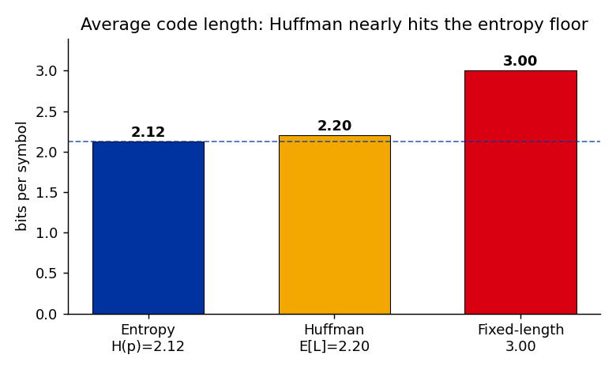

<script src="homework-scripts.js"></script>

# 📚 Նյութը

## Դասախոսություն
- [📺 Դասախոսություն — Entropy, Source Coding, Cross-Entropy, KL](https://youtu.be/MxakqkjXtQY)
- [📺 Գործնական — Information Theory practical](https://youtu.be/MW6aNvmZc0w)
- [🎞️ Սլայդեր — info 01](Lectures/info/info_01.pdf), [📝 Notes](Lectures/info/info_01_notes.pdf)
- [🐍 Գործնականի notebook](Lectures/info/info_01_practical.ipynb)
- [🛠️🗂️ Գործնականի PDF-ը](Homeworks/hw_18_info_theory.pdf)

::: {.callout-note collapse="true"}
## Scope
This practical covers **info_01 only**: entropy, surprisal, source coding, cross-entropy, KL divergence, and differential entropy. Mutual information, MLE, and MaxEnt come in the next lecture (info_02).
:::

# 🏡 Տնային

---

## 01 ✏️🐍 Armenian Alphabet Entropy {data-difficulty="1"}

The Armenian alphabet has **39 letters** (Mashtots' original 36 + ՈՒ, Օ, Ֆ).

**a)** Compute the **uniform entropy**: how many bits per letter if every letter were equally likely?

**b)** English's uniform bound is $\log_2 26 \approx 4.70$ bits/letter, yet real English text has empirical entropy around $1.3$ bits/letter (Shannon, 1951). Explain *why* the empirical entropy is so much smaller than the uniform bound. Name the **two** distinct effects.

**c)** (Python) Estimate the *real* per-letter entropy of Armenian. Use the provided file [`assets/panir_hy.txt`](assets/panir_hy.txt) (the «Պանիր» Wikipedia article), or download fresh text yourself with the snippet below. Keep only Armenian letters, lowercase them, and compute the empirical letter-frequency distribution and its entropy.

```python
# Option A — download the provided text file:
import urllib.request
url = ("https://raw.githubusercontent.com/HaykTarkhanyan/"
       "python_math_ml_course/main/math/assets/panir_hy.txt")
text = urllib.request.urlopen(url).read().decode("utf-8")

# Option B — download any Armenian article's plain text yourself:
import urllib.request, urllib.parse, json
title = "Պանիր"  # try any article title
url = "https://hy.wikipedia.org/w/api.php?" + urllib.parse.urlencode({
    "action": "query", "prop": "extracts", "explaintext": 1,
    "titles": title, "format": "json", "redirects": 1,
})
req = urllib.request.Request(url, headers={"User-Agent": "course/1.0"})
page = next(iter(json.load(urllib.request.urlopen(req))["query"]["pages"].values()))
text = page["extract"]
```

**d)** Compare your empirical entropy to the uniform bound from (a). By roughly how many bits per letter does the frequency skew save you?

**e)** A 100-page Armenian e-book has roughly $200{,}000$ characters. Estimate the entropy **lower bound** on its size (KB). Then explain the catch: you'll get $\approx 4.5$ bits/letter, but a real code must assign a **whole** number of bits to each letter — so how do you actually get close to the entropy?

::: {.callout-tip collapse="true" title="Solution"}

**(a)** A uniform distribution over $g$ outcomes has entropy $\log_2 g$. So
$$H_{\text{uniform}} = \log_2 39 \approx 5.29 \text{ bits/letter}.$$
This is the **maximum** possible per-letter entropy for a 39-letter alphabet.

**(b)** Two separate effects pull the real entropy below the uniform bound:

1. **Non-uniform letter frequencies.** Entropy is maximized *only* by the uniform distribution; any skew lowers it. Common letters (ա, ե, ի, ն, ո) appear far more than rare ones, so each letter carries less than the maximal $5.29$ bits.
2. **Inter-letter correlations.** Real text is not i.i.d. — after «ա» some letters are much likelier than others. Modeling context (letter pairs, words) reduces the per-letter entropy much further. The $1.3$ bits/letter figure for English uses this contextual structure.

**(c)** Full implementation. The one subtlety is filtering to the Armenian Unicode block, or Latin letters from foreign words and references inflate the alphabet to 70+ "letters":

```python
from collections import Counter
import math, urllib.request

url = ("https://raw.githubusercontent.com/HaykTarkhanyan/"
       "python_math_ml_course/main/math/assets/panir_hy.txt")
text = urllib.request.urlopen(url).read().decode("utf-8")

def is_armenian(ch):  # U+0531–U+0556 upper, U+0561–U+0587 lower
    o = ord(ch)
    return 0x0531 <= o <= 0x0556 or 0x0561 <= o <= 0x0587

letters = [c for c in text.lower() if is_armenian(c)]
counts = Counter(letters)
n = len(letters)
H = -sum((c / n) * math.log2(c / n) for c in counts.values())
print(f"{n} letters, {len(counts)} distinct")
print(f"empirical entropy = {H:.3f} bits/letter")
```

Output on the provided file:
```
22417 letters, 39 distinct
empirical entropy = 4.484 bits/letter
```

**(d)** Empirical $4.48$ vs uniform $5.29$ ⇒ the frequency skew saves about $\mathbf{0.8}$ bits/letter. The single most common letter «ա» is already ~15% of all letters. (Contextual modeling would save far more.)

**(e)** Naive entropy lower bound:
$$200{,}000 \times 4.48 \text{ bits} = 896{,}000 \text{ bits} \approx \mathbf{109 \text{ KB}}.$$

**The discrete catch.** Entropy is $4.48$ bits/letter, but a real prefix code assigns an *integer* number of bits per symbol — you can't literally spend $4.48$ bits on one letter. So:

- A **fixed-length** code needs $\lceil\log_2 39\rceil = \mathbf{6}$ bits/letter ⇒ $200{,}000 \times 6 / 8 / 1024 \approx 146$ KB. Easy, but wastes $6 - 4.48 = 1.5$ bits/letter.
- A **Huffman** code on single letters does better (frequent letters get short codewords), landing between $H$ and $H + 1$.
- To actually *approach* $4.48$ you must encode **blocks** of several letters at once (or use arithmetic coding). The source coding theorem is asymptotic: expected bits/symbol $\to H$ only as block length grows. So $4.48$ is the theoretical floor — an *average* you approach with block coding, not a per-letter code length you can use directly.

:::

---

## 02 🐍 Wordle as an Information Game {data-difficulty="2"}

*We may skip this one during the practical (it's a bigger coding task) — it's here for you to enjoy on your own.*

Wordle has $N = 2{,}315$ valid answer words. Each guess comes back as a **color pattern**: every one of the 5 letters is green (right letter, right spot), yellow (right letter, wrong spot), or gray (not in the word). With 3 colors on 5 positions there are $3^5 = 243$ possible patterns.

Grab the official answer list (2,315 words) like this:

```python
import urllib.request
url = ("https://gist.githubusercontent.com/cfreshman/"
       "a03ef2cba789d8cf00c08f767e0fad7b/raw/wordle-answers-alphabetical.txt")
words = urllib.request.urlopen(url).read().decode().split()
assert len(words) == 2315
```

**a)** Think of a guess as a *question* whose answer is the color pattern. At most how many distinct answers can that question have — and therefore how many **bits** can one guess reveal at most?

**b)** How many bits of uncertainty does the answer carry before any guess? Combining (a) and (b), what's the minimum number of guesses an *ideal* solver would need in the best case?

**c)** Implement a greedy solver: for each candidate guess $g$, partition the current answer set by their color pattern against $g$, and compute the **entropy of that partition**. Pick the $g$ with the highest entropy (it splits the candidates most evenly).

```python
from collections import Counter
import math

def feedback(guess: str, answer: str) -> tuple:
    """Color pattern as a 5-tuple of 'G' (green), 'Y' (yellow), '.' (gray).
    Careful: a letter appearing once in the answer but twice in the guess
    earns only one Y/G total."""
    ...

def expected_info(guess, candidates):
    counts = Counter(feedback(guess, a) for a in candidates)
    n = len(candidates)
    return -sum((c/n) * math.log2(c/n) for c in counts.values())
```

**d)** Report the **top-5 first guesses** your solver finds and their entropies in bits. Compare to popular openers (CRANE, SLATE, RAISE).

**e)** Explain in entropy terms why the solver never recommends a word like `FUZZY` or `AAHED` as a first guess.

**f)** **(Bardle — Armenian Wordle.)** The same game exists in Armenian: [Bardle](https://github.com/Iamnerses/Bardle). Re-run your *exact* solver on the Armenian 5-letter answer set [`assets/bardle_hy_5_answers.txt`](assets/bardle_hy_5_answers.txt) (178 words); the allowed-guess list is [`assets/bardle_hy_5_guesses.txt`](assets/bardle_hy_5_guesses.txt) (2,855 words). Then answer:

- How much starting uncertainty (bits) does the 178-word answer set carry, vs English Wordle's 2,315?
- Is the per-guess ceiling still $\log_2 243$? Why or why not — does Armenian's 39-letter alphabet change it?
- Report the top-3 Armenian opening guesses your solver finds.

::: {.callout-tip collapse="true" title="Solution"}

**(a) What $\log_2 243$ represents.** A guess does not return a word — it returns one of the **243 possible color patterns**. So a guess behaves like a *question with up to 243 possible answers*. Any question is most informative when all its answers are equally likely; then the answer carries
$$\log_2(\text{number of possible answers}) = \log_2 243 \approx 7.92 \text{ bits}.$$
That is the ceiling: **no single guess can ever reveal more than $7.92$ bits**, because there are only 243 distinguishable responses to read. (Real guesses reveal less — many of the 243 patterns almost never occur, so they are far from equally likely.)

**(b)** Before guessing, the hidden word is roughly uniform over 2,315 words, so the starting uncertainty is
$$H = \log_2 2315 \approx 11.18 \text{ bits}.$$
If every guess delivered the full $7.92$ bits you'd need $\lceil 11.18 / 7.92 \rceil = 2$ guesses. In reality a guess reveals only $\sim 5$–$6$ bits, so the proven optimum averages about $3.42$ guesses (Selby, 2022).

**A worked turn.** Suppose the hidden word is `ROBIN` and you open with `SLATE`:

| Letter | In ROBIN? | Color |
|--------|-----------|-------|
| S | no | gray `.` |
| L | no | gray `.` |
| A | no | gray `.` |
| T | no | gray `.` |
| E | no | gray `.` |

The pattern is `.....` (all gray). Every answer that contains none of S, L, A, T, E returns this *same* pattern — still hundreds of words — so this particular turn revealed only a few bits. You now keep only answers consistent with "no S, L, A, T, E" and pick the next max-entropy guess. A sharper guess like `CRANE` against `ROBIN` returns a pattern with R and N yellow, which slices the candidate set far more.

**(c)** Full implementation (the greens-before-yellows order with a letter pool is the only tricky part):

```python
from collections import Counter
import math

def feedback(guess, answer):
    res = ['.'] * 5
    pool = Counter(answer)
    for i in range(5):                       # greens first
        if guess[i] == answer[i]:
            res[i] = 'G'; pool[guess[i]] -= 1
    for i in range(5):                       # then yellows from what's left
        if res[i] == '.' and pool[guess[i]] > 0:
            res[i] = 'Y'; pool[guess[i]] -= 1
    return tuple(res)

def expected_info(guess, candidates):
    counts = Counter(feedback(guess, a) for a in candidates)
    n = len(candidates)
    return -sum((c / n) * math.log2(c / n) for c in counts.values())

best = sorted(words, key=lambda g: expected_info(g, words), reverse=True)[:5]
for g in best:
    print(g.upper(), round(expected_info(g, words), 2), "bits")
```

**(d)** This prints top openers like **SALET, REAST, CRATE, TRACE, SLATE**, each $\approx 5.8$–$5.9$ bits. Human favorites (CRANE, RAISE) score nearly as high — that is *why* they are good: they split the answer set evenly.

**(e)** `FUZZY` has a repeated `Z` and rare letters. Most answers contain none of F, U, Z, Y, so they all return the same all-gray pattern — the 2,315 words collapse into a few big buckets. Few buckets ⇒ **low partition entropy** ⇒ little information. Good openers use 5 distinct, common letters to spread answers across many buckets.

**(f)** The color-pattern logic is identical (5 positions, 3 colors), so the *same* `feedback`/`expected_info` code runs unchanged on Armenian strings — it indexes characters generically:

```python
ans = open("assets/bardle_hy_5_answers.txt", encoding="utf-8").read().split()
guesses = open("assets/bardle_hy_5_guesses.txt", encoding="utf-8").read().split()
best = sorted(guesses, key=lambda g: expected_info(g, ans), reverse=True)[:3]
```

- **Starting uncertainty:** $\log_2 178 \approx \mathbf{7.48}$ bits — far less than English Wordle's $\log_2 2315 \approx 11.18$, because Bardle's curated answer set is much smaller.
- **The per-guess ceiling is still $\log_2 243 \approx 7.92$ bits.** It depends only on the number of distinguishable responses ($3^5$ patterns from 5 positions × 3 colors), **not** on the alphabet size — Armenian's 39 letters do not change it. (Notably, the starting uncertainty $7.48$ is *below* the single-guess ceiling, so a perfect opener could in principle pin most answers in just one or two guesses.)
- **Top-3 openers:** **կարեն** (5.34 bits), **նոտար** (5.30), **կարին** (5.25). Fittingly, «Կարեն» — one of the most common Armenian names — is the single best opening guess.

:::

---

## 03 ✏️ Source Coding: Huffman & the Kraft Inequality (Optional) {.bonus-problem data-difficulty="2"}

A source emits 5 symbols with probabilities
$$p = (\,A{:}\,0.4,\; B{:}\,0.2,\; C{:}\,0.2,\; D{:}\,0.1,\; E{:}\,0.1\,).$$

**a)** Compute the entropy $H(p)$ in bits.

**b)** Build a **Huffman code**: repeatedly merge the two least-probable nodes. Draw the final tree and list each codeword and its length.

**c)** Compute the **expected code length** $\mathbb{E}[L] = \sum_i p_i L_i$. Verify Shannon's bound $H(p) \le \mathbb{E}[L] < H(p) + 1$.

**d)** Verify your code satisfies the **Kraft inequality** $\sum_i 2^{-L_i} \le 1$. Is it saturated (equal to 1)? Why does that make sense for a Huffman code?

**e)** A naive fixed-length code needs $\lceil \log_2 5 \rceil = 3$ bits per symbol. How many bits per symbol does Huffman save on average?

::: {.callout-tip collapse="true" title="Solution"}

**(a)** Plug into $H = -\sum_i p_i \log_2 p_i$. Useful values: $\log_2 0.4 = -1.322$, $\log_2 0.2 = -2.322$, $\log_2 0.1 = -3.322$.
$$H(p) = -\big(0.4(-1.322) + 2\cdot 0.2(-2.322) + 2\cdot 0.1(-3.322)\big) = 0.529 + 0.929 + 0.664 = \mathbf{2.12 \text{ bits}}.$$

**(b)** Huffman repeatedly merges the two **least-probable** nodes; the merged node's probability is their sum. Track it step by step:

| Step | Pool (prob) | Merge | New node |
|------|-------------|-------|----------|
| 1 | A·4, B·2, C·2, **D·1, E·1** | D+E | DE = 0.2 |
| 2 | A·4, **B·2, C·2**, DE·2 | B+C | BC = 0.4 |
| 3 | A·4, **DE·2**, BC·4 | DE+A | ADE = 0.6 |
| 4 | **BC·4, ADE·6** | BC+ADE | root = 1.0 |

(probabilities written ×10 for readability). Reading the tree from the root, assigning `0` to the left branch and `1` to the right:

```
              root
          0 /      \ 1
          BC        ADE
        0/  \1     0/   \1
        B    C     A     DE
                       0/   \1
                       D     E
```

| Symbol | $p$ | Codeword | Length $L_i$ | Surprisal $-\log_2 p_i$ |
|--------|-----|----------|--------------|--------------------------|
| A | 0.4 | `10`  | 2 | 1.32 |
| B | 0.2 | `00`  | 2 | 2.32 |
| C | 0.2 | `01`  | 2 | 2.32 |
| D | 0.1 | `110` | 3 | 3.32 |
| E | 0.1 | `111` | 3 | 3.32 |

Notice each length $L_i$ sits right next to the surprisal $-\log_2 p_i$ — Huffman approximates the ideal $L_i = -\log_2 p_i$ using *whole* bits. (Tie-breaking can give a different but equally good tree.)

**(c)**
$$\mathbb{E}[L] = 0.4(2) + 0.2(2) + 0.2(2) + 0.1(3) + 0.1(3) = \mathbf{2.2 \text{ bits}}.$$
Shannon's bound holds: $2.12 \le 2.2 < 3.12$. ✓ Efficiency $H/\mathbb{E}[L] = 2.12/2.2 \approx 0.96$.

**(d)**
$$\sum_i 2^{-L_i} = \underbrace{3\cdot 2^{-2}}_{A,B,C} + \underbrace{2\cdot 2^{-3}}_{D,E} = \tfrac{3}{4} + \tfrac{1}{4} = 1.$$
**Saturated** ($=1$). A Huffman tree has no unused leaves, so there's no spare bit-budget — the same "no room for a 5th codeword" idea from the lecture's Kraft slide.

**(e)** Fixed-length costs $\lceil\log_2 5\rceil = 3$ bits/symbol; Huffman costs $2.2$. Saving $3 - 2.2 = \mathbf{0.8}$ bits/symbol ($\sim 27\%$), landing just above the $2.12$-bit entropy floor:

{width=70%}

:::

---

## 04 ✏️ Cross-Entropy and KL: The Cost of the Wrong Code {data-difficulty="2"}

The true distribution of a 4-symbol source is $p = (\tfrac{1}{2}, \tfrac{1}{4}, \tfrac{1}{8}, \tfrac{1}{8})$. A lazy engineer assumes it's **uniform**, $q = (\tfrac{1}{4}, \tfrac{1}{4}, \tfrac{1}{4}, \tfrac{1}{4})$, and builds the optimal code *for* $q$ (i.e. a fixed-length 2-bit code).

**a)** Compute $H(p)$ and $H(q)$.

**b)** Compute the **cross-entropy** $H(p \| q) = -\sum_x p(x)\log_2 q(x)$ — the average code length when the data really comes from $p$ but we use $q$'s code.

**c)** Compute $D_{\text{KL}}(p \| q)$ and verify the identity $H(p\|q) = H(p) + D_{\text{KL}}(p\|q)$.

**d)** In one sentence: how many bits per symbol does the engineer waste by using the uniform (fixed-length) code instead of the optimal one for $p$?

**e)** Is $D_{\text{KL}}$ symmetric? State whether $D_{\text{KL}}(p\|q) = D_{\text{KL}}(q\|p)$ holds *in general* (you don't need to recompute — just recall the lecture).

::: {.callout-tip collapse="true" title="Solution"}

**(a)**
$$H(p) = \tfrac{1}{2}(1) + \tfrac{1}{4}(2) + \tfrac{1}{8}(3) + \tfrac{1}{8}(3) = \mathbf{1.75 \text{ bits}}, \qquad H(q) = \log_2 4 = \mathbf{2 \text{ bits}}.$$

**(b)** Since $q(x) = \tfrac14$ for all $x$, $\log_2 q(x) = -2$, so
$$H(p\|q) = -\sum_x p(x)(-2) = 2\sum_x p(x) = \mathbf{2 \text{ bits}}.$$
(Makes sense: $q$'s optimal code is the fixed-length 2-bit code, so every symbol costs 2 bits.)

**(c)**
$$D_{\text{KL}}(p\|q) = \sum_x p(x)\log_2\tfrac{p(x)}{q(x)} = \tfrac12\log_2 2 + \tfrac14\log_2 1 + 2\cdot\tfrac18\log_2\tfrac12 = \tfrac12 - \tfrac14 = \mathbf{0.25 \text{ bits}}.$$
Identity check: $H(p) + D_{\text{KL}}(p\|q) = 1.75 + 0.25 = 2 = H(p\|q)$. ✓

**(d)** The engineer wastes exactly $D_{\text{KL}}(p\|q) = \mathbf{0.25}$ bits per symbol — the gap between the $2$-bit wrong code and the $1.75$-bit optimal code.

**(e)** **No** — $D_{\text{KL}}$ is *not* symmetric in general: $D_{\text{KL}}(p\|q) \ne D_{\text{KL}}(q\|p)$ for most pairs. It is a divergence, not a distance. (This particular $p$/uniform-$q$ pair is a special case where the two happen to coincide, but don't be fooled — it fails as soon as $q$ is non-uniform.)

:::

---

## 05 ✏️ Differential Entropy of a Gaussian (and the Units Trap) {data-difficulty="2"}

For a continuous $X$ with density $f$, the differential entropy is $h(X) = -\int f(x)\log_2 f(x)\,dx$. For a Gaussian $N(\mu,\sigma^2)$,
$$h(X) = \tfrac{1}{2}\log_2(2\pi e\,\sigma^2).$$

**a)** Compute $h(X)$ for a standard Gaussian ($\sigma = 1$).

**b)** Find the value of $\sigma$ at which $h(X) = 0$. For smaller $\sigma$, what is the sign of $h(X)$? Give a concrete example. (This is impossible for discrete entropy, where $H \ge 0$ always — what's different?)

**c)** Suppose $X$ is a length measured in **meters**, with $\sigma = 1$ m. You now re-express the same physical quantity in **centimeters**. Using the scaling property $h(aX) = h(X) + \log_2|a|$, compute the new differential entropy. By how many bits did it change?

**d)** The random variable didn't change — only the units did. In one or two sentences, explain why this makes differential entropy a poor stand-alone "amount of information," and name a quantity from the lecture that *is* invariant to such unit changes.

::: {.callout-tip collapse="true" title="Solution"}

**(a)**
$$h(X) = \tfrac{1}{2}\log_2(2\pi e) = \tfrac{1}{2}\log_2(17.08) \approx \mathbf{2.05 \text{ bits}}.$$

**(b)** Set $2\pi e\,\sigma^2 = 1 \Rightarrow \sigma = \dfrac{1}{\sqrt{2\pi e}} \approx \mathbf{0.242}$. For $\sigma < 0.242$, $h(X) < 0$. Example: $\sigma = 0.1$ gives $h = \tfrac12\log_2(2\pi e\cdot 0.01) \approx -1.28$ bits. **Differential entropy can be negative** because it measures bits relative to a *unit-width* interval, not an absolute count — a tightly concentrated density packs into less than one unit of width. Discrete entropy counts actual outcomes, so it's always $\ge 0$.

**(c)** Centimeters means $X \to 100X$, so
$$h(100X) = h(X) + \log_2 100 = 2.05 + 6.64 = \mathbf{8.69 \text{ bits}}.$$
It grew by $\log_2 100 \approx \mathbf{6.64}$ bits.

**(d)** The $+6.64$ bits is pure bookkeeping — finer units mean more bins to distinguish, not more real information. So $h$ alone isn't a meaningful "amount of information": you can inflate it arbitrarily by changing units. **KL divergence** $D_{\text{KL}}(p\|q) = \int p\log_2\tfrac{p}{q}$ is invariant to such re-scalings (the Jacobians cancel), which is why ML objectives lean on KL / cross-entropy rather than raw differential entropy.

:::

---

# 🎲 38 (01) TODO
- ▶️[ToDo]()
- 🔗[Random link]()
- 🇦🇲🎶[ToDo]()
- 🌐🎶[ToDo]()
- 🤌[Կարգին]()


<a href="http://s01.flagcounter.com/more/1oO"></a>
