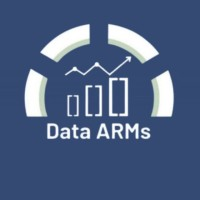

{width=200 fig-align="center"}

A compact probability and statistics course for undergraduates planning to go into data science.
Designed for ~12 weeks (one 90-min lecture + one 60-min practical per week).

**Prerequisites:** Basic calculus (derivatives, integrals) and set theory. No programming required — the semester project uses only a spreadsheet and calculator. Python will be covered in a separate course.

## Course Materials

| Page | Description |
|------|-------------|
| **[Syllabus](syllabus_lite.md)** | 12-week plan with topics, resources, and "why it matters" per week |
| [Warm-Ups](warm-ups.md) | Per-week puzzles and in-class activities |
| [Case Studies](case-studies.md) | Per-week real-world stories and case studies |
| [Assessment](assessment.md) | Grading breakdown, quiz examples, homework schedule |
| [Project Guide](project-guide.md) | Semester project: checkpoints, rubric, peer review, presentation |

---

*A [Data ARMs](https://www.linkedin.com/company/data-arms) course.*
