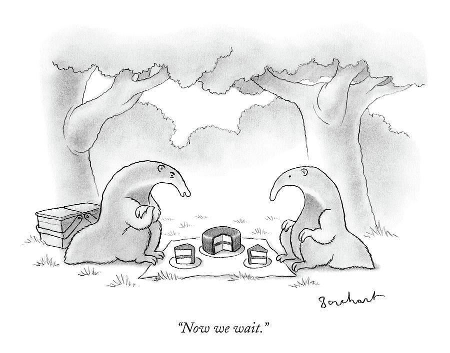

::: {.callout-tip}
✅ [11]–[15] դասերը ձայնագրված են (տեսանյութերը ներքևում)։ Սլայդերը և նախագիծ-տնայինը (ներքևում) պատրաստ են։ Յուրաքանչյուր դասի համար կա և՛ մաքուր PDF, և՛ դասի ընթացքում նշումներով տարբերակը (`_notes`)։
:::

# 🎲 Random

# 📚 Նյութը

Սլայդերը `ml/03_classification/` պանակում․

- **[11] Logistic regression** — binary + multiclass (softmax / one-vs-rest), log-loss, odds ratios. [PDF](https://github.com/HaykTarkhanyan/python_math_ml_course/blob/main/ml/03_classification/11_classification_logreg.pdf) · [PDF (նշումներով)](https://github.com/HaykTarkhanyan/python_math_ml_course/blob/main/ml/03_classification/11_classification_logreg_notes.pdf) · [▶️ [11] Կլասիֆիկացիա։ Լոգիստիկ ռեգրեսիա | Մեքենայական ուսուցում](https://youtu.be/myyPApV6I_8)
- **[12] Classification metrics** — accuracy → precision/recall/F1 → ROC AUC → PR AUC → lift, multi-class averaging. [PDF](https://github.com/HaykTarkhanyan/python_math_ml_course/blob/main/ml/03_classification/12_classification_metrics.pdf) · [PDF (նշումներով)](https://github.com/HaykTarkhanyan/python_math_ml_course/blob/main/ml/03_classification/12_classification_metrics_notes.pdf) · [▶️ [12] Կլասիֆիկացիայի մետրիկաներ | Մեքենայական ուսուցում](https://youtu.be/AtfnxqD9bNs)
- **[13] Threshold tuning** — score → decision: cost-optimal cutoff (closed form), Youden's J, recall floor; `TunedThresholdClassifierCV`. [PDF](https://github.com/HaykTarkhanyan/python_math_ml_course/blob/main/ml/03_classification/13_threshold_tuning.pdf) · [PDF (նշումներով)](https://github.com/HaykTarkhanyan/python_math_ml_course/blob/main/ml/03_classification/13_threshold_tuning_notes.pdf) · [▶️ [13] Threshold tuning | Մեքենայական ուսուցում](https://youtu.be/BwL0nWJLFPg)
- **[14] Calibration** — reliability diagrams, ECE / Brier score, calibration vs discrimination, Platt scaling + isotonic regression in sklearn. [PDF](https://github.com/HaykTarkhanyan/python_math_ml_course/blob/main/ml/03_classification/14_calibration.pdf) · [PDF (նշումներով)](https://github.com/HaykTarkhanyan/python_math_ml_course/blob/main/ml/03_classification/14_calibration_notes.pdf) · [▶️ [14] Կալիբրացիա | Մեքենայական ուսուցում](https://youtu.be/CQNRp__8eG0)
- **[15] Imbalanced learning** — class weights, cost-sensitive learning, under/over/hybrid sampling (ROS, SMOTE), leakage + decalibration traps, decision guide. [PDF](https://github.com/HaykTarkhanyan/python_math_ml_course/blob/main/ml/03_classification/15_imbalanced_learning.pdf) · [PDF (նշումներով)](https://github.com/HaykTarkhanyan/python_math_ml_course/blob/main/ml/03_classification/15_imbalanced_learning_notes.pdf) · [▶️ [15] Data Imbalance | Մեքենայական ուսուցում](https://youtu.be/pYbmFtNxWQw)

# 🏡 Տնային

## Project — Cost-aware bank-marketing classifier 🧀🧀

A bank phone campaign: only ~11% of clients subscribe to a term deposit, and every call costs money. Build a classifier end to end and turn its scores into a **cost-aware decision** — the same arc as the cheese factory in the lectures (logistic regression → the right metric → threshold by cost → calibration).

Starter notebook: <a href="16_bank_marketing_project.ipynb" download>16_bank_marketing_project.ipynb (download)</a> · [view on GitHub](https://github.com/HaykTarkhanyan/python_math_ml_course/blob/main/ml/03_classification/16_bank_marketing_project.ipynb)

Data: `data/bank-full.csv` ([UCI Bank Marketing](https://archive.ics.uci.edu/dataset/222/bank+marketing)), already in the repo next to the notebook.

🎥 **Practical walkthrough:** [▶️ [16] Classification practical: bank marketing | Մեքենայական ուսուցում](https://youtu.be/xKHes8xMeFo)

