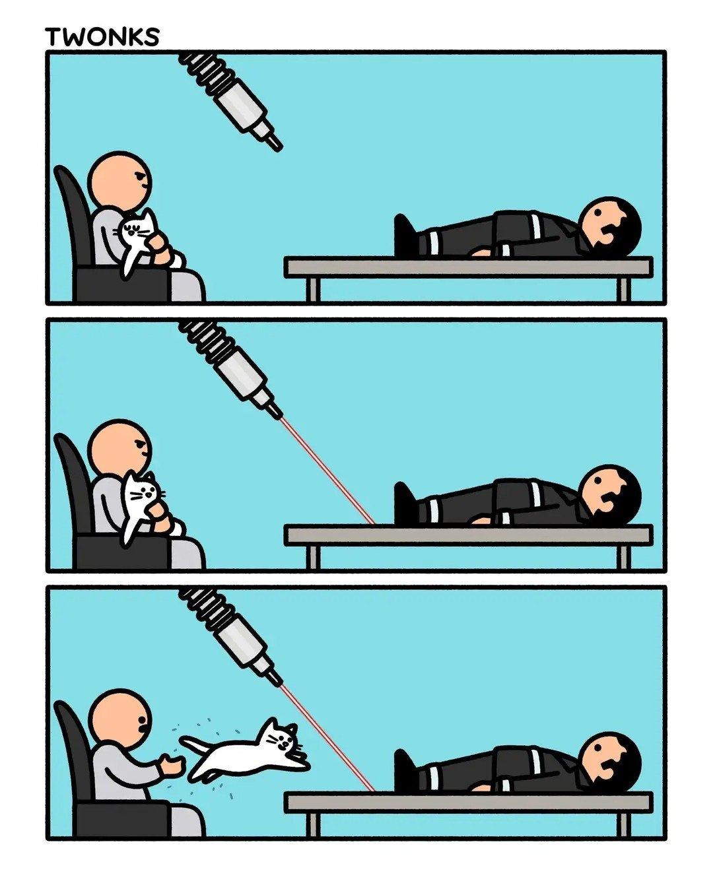

::: {.callout-tip}
🆕 Դասերն անցկացված են։ Սլայդերը և նշումներով PDF-երը ներքևում են։ Տեսանյութերը՝ `TBD`։
:::

# 🎲 Random

Շաբաթվա պատահական հղումը՝ [Interactive RGB / HSV demo](https://math.hws.edu/graphicsbook/demos/c2/rgb-hsv.html) — վեց սահիչ, երեքը RGB, երեքը HSV, բոլորն էլ նույն գույնի վրա։ Շարժիր մեկը, նայիր ինչպես են մյուսներն իրենք իրենց շարժվում։

Առանց պիտակների խմբավորում — և հետո պարզվում է, որ ամբողջ հարցը նրանում է, թե *որ տարածությունում* ես չափում հեռավորությունը 🎨

# 📚 Նյութը

Երկու դասախոսություն․ առաջինը՝ կլաստերիզացիա, երկրորդը՝ գունային տարածությունները, որոնց վրա հենվում են նկարների գործնականները։ Սլայդերը `ml/09_clustering/` պանակում։

- **[32] Կլաստերիզացիա** — խմբավորում առանց պիտակների, k-means (Lloyd-ի ալգորիթմ, k-means++, `k`-ի ընտրություն՝ elbow և silhouette), GMM և EM՝ որպես «փափուկ» ընդհանրացում, k-medoids, խտության վրա հիմնված DBSCAN / HDBSCAN, հիերարխիկ կլաստերիզացիա և դենդրոգրամ, գնահատում առանց ճշմարիտ պիտակների (silhouette) և պիտակների հետ (ARI, AMI), մասշտաբավորման թակարդը՝ չափված։ [🎞️ Սլայդեր](32_clustering.pdf) · [📝 PDF (նշումներով)](32_clustering_notes.pdf) · 📺 Տեսանյութ՝ `TBD`
- **[33] Գունային տարածություններ** — ինչ է իրականում պահվում պիքսելում (կոներ, մետամերիզմ, RGB), գամմա/sRGB կոդավորումը՝ 128-ը լույսի 21.6%-ն է, ոչ թե կեսը, HSV և շրջանաձև երանգի թակարդը, խորությունն ու ստվերումը՝ ինչու են դրանք **պայծառության** խնդիր, մոխրագույնի ձևափոխությունը և երկու իրար հակասող ստանդարտները (PIL ≠ skimage), Lab և ընկալվող հեռավորությունը (ΔE), YCbCr և գունային ենթանմուշարկումը, գունային հիստոգրամները, ու վերջում՝ որ խնդրի համար որ տարածությունը։ [🎞️ Սլայդեր](33_color_spaces.pdf) · [📝 PDF (նշումներով)](33_color_spaces_notes.pdf) · 📺 Տեսանյութ՝ `TBD`

📝 **Թեմայի վերաբերյալ հարցաշար (Google Form):** `TBD`

**References:**

- scikit-learn example: [Color Quantization using K-Means](https://scikit-learn.org/stable/auto_examples/cluster/plot_color_quantization.html)
- 🎛️ [Interactive RGB / HSV demo](https://math.hws.edu/graphicsbook/demos/c2/rgb-hsv.html) — David J. Eck, *Introduction to Computer Graphics* (HWS, v1.4). Linked above as the random link; try setting saturation to 0 and watching what happens to R, G and B.
- [Specification of sRGB](https://www.color.org/chardata/rgb/srgb.pdf) (ICC) — the transfer-function constants used in the gamma frames.
- Charles Poynton, *Digital Video and HD* — the standard reference for the luma (Y′) vs luminance (Y) distinction and the Rec. 601 / Rec. 709 weight sets.
- Bishop, *Pattern Recognition and Machine Learning* (2006), section 9.1.1 (image segmentation / compression with k-means).
- [Sentinel-2 L2A cloud-optimized GeoTIFFs on AWS](https://registry.opendata.aws/sentinel-2-l2a-cogs/) — the satellite data, free and without an account.
- [ESA WorldCover 10 m v200](https://registry.opendata.aws/esa-worldcover-vito/) — the land-cover map used as ground truth (CC-BY 4.0).

***

# 🏡 Տնային

## Project — Image compression with k-means 🧀🧀

An image is just a grid of pixels, and every pixel is a point in **RGB space** (3 numbers). If you run k-means on the pixels and repaint each one with its cluster's centroid color, the result uses only **`k` colors** — a much smaller palette for a small drop in quality. This is **color quantization**, the practical we set up at the end of the lecture.

**Setup.** Use any image you like (a photo, a painting — `img/saryan_mountains.jpg` is provided). Deliver one reproducible notebook, seed `509`, ending with a 3–5 sentence conclusion. Resize the image down first if it is large — k-means on millions of pixels is slow.

**Tasks.**

1. Load the image, reshape it to `(n_pixels, 3)`, and scale the values to `[0, 1]`.
2. Quantize with k-means for several `k` (e.g. 2, 4, 8, 16, 32) and show the results next to the original.
3. Choose a `k`: plot **inertia** (the elbow) and the **silhouette** against `k`, and argue for one value.
4. Show the **palette** — the `k` centroid colors.
5. Measure the compression **honestly**. A quantized image stores a palette (`k × 3` bytes) plus one index per pixel (`ceil(log2 k)` bits), versus `24` bits/pixel originally — compute that ratio and the **reconstruction error** (MSE between original and quantized pixels). Explain in one line why comparing re-saved `.jpg` file sizes is misleading.
6. Where does it break? Find a `k` low enough that **banding / posterization** shows up in smooth gradients (sky, shadows).

**Bonus:** `MiniBatchKMeans` to quantize the full-resolution image fast; try a different color space (e.g. Lab); swap k-means for another algorithm and compare; pick `k` automatically from the elbow.

Լուծումը (ամբողջական walkthrough): <a href="34_image_compression_solution.ipynb" download>34_image_compression_solution.ipynb (download)</a> · [view on GitHub](https://github.com/HaykTarkhanyan/python_math_ml_course/blob/main/ml/09_clustering/34_image_compression_solution.ipynb)

## Project — Land cover of Lake Sevan from space 🧀🧀🧀

Same idea as above, different stakes. A satellite image is also a grid of pixels, but each one carries **six numbers** instead of three — blue, green, red, near-infrared and two short-wave infrared bands — and each covers **20 m of real ground**. Cluster those pixels and the groups are not colors to discard: they are water, fields, bare rock, a town. So this time you have to **name** what came out, and at the end **score yourself against a real land-cover map**.

**Setup.** Everything is pre-cropped into [`data/sevan_s2_crop.npz`](data/sevan_s2_crop.npz): a 20 km square on the south shore of Lake Sevan near Martuni, cloud-free, 2 September 2024, plus ESA's WorldCover labels for the same pixels. It loads with plain `np.load` — no geospatial libraries needed. One reproducible notebook, seed `509`, ending with a 3–5 sentence conclusion.

The stored values are digital numbers; convert to surface reflectance with `bands * reflectance_scale + reflectance_offset`. Some values over water come out slightly negative, which is expected — the atmospheric correction is an estimate.

**Tasks.**

1. Show the scene in **true color** (B04, B03, B02) and in **false color** with near-infrared in the red channel. Say in one line what the second one shows that the first cannot.
2. Reshape to `(n_pixels, 6)`, then choose `k`. Plot both the **elbow** and the **silhouette** — they will not agree. Pick a value and defend it in two sentences.
3. Cluster, map the labels back to `(H, W)`, and **name every cluster from its mean spectrum**. Water, vegetation and bare ground have distinct shapes; work out which is which from the numbers, not by guessing. Deliver the map with a named legend.
4. Build a second feature set from **NDVI and NDWI** and cluster again. Show both maps. Which would you ship, and how could you tell without labels?
5. Now load the WorldCover labels. Compute plain **accuracy** first, explain in one line why the number is meaningless, then report **ARI** and **AMI**.
6. Print the **contingency table** (cluster × true class). Name one pair of real classes your clustering merged and explain *why* the spectra cannot separate them.
7. Recompute ARI on **land pixels only**, with the water cluster dropped. Explain the drop in two sentences.

**Bonus:** agglomerative clustering with a dendrogram on a subsample; `MiniBatchKMeans` or `HDBSCAN`; add a texture feature (local standard deviation) and see whether built-up finally separates from bare ground; or edit `CANDIDATES` in `py_src/fetch_sevan_scene.py` and fetch your own Armenian scene.

Լուծումը (ամբողջական walkthrough): <a href="34_land_cover_solution.ipynb" download>34_land_cover_solution.ipynb (download)</a> · [view on GitHub](https://github.com/HaykTarkhanyan/python_math_ml_course/blob/main/ml/09_clustering/34_land_cover_solution.ipynb)

## Project — Grouping photos by what is in them 🧀🧀

The job your phone does silently: 2000 photographs, no labels, put the ones showing the same kind of thing into the same pile.

You already know clustering pixels gives you **colors**. It will not give you **objects**, and the first task is to prove that to yourself. Then you swap the pixels for a *learned representation* and change nothing else.

**Setup.** [`data/imagenette_clip.npz`](data/imagenette_clip.npz) holds, for 2000 photos: a 512-number **CLIP embedding** each, a small thumbnail, the true class (10 categories, for scoring only at the end), and vectors for **40 English words**. It loads with `np.load` — no torch, no downloads. One reproducible notebook, seed `509`.

Treat CLIP as a black box for now: a model trained on image-caption pairs, so that a picture and its own caption land near each other in one shared space. Chapters 6 and 9 explain how. The one property to remember is that **text lives in the same space as images**.

**Tasks.**

1. Cluster the raw thumbnail pixels with `k=10` and score with **ARI**. Then do the same with a color histogram. Explain in two sentences why both fail — the reason is not that k-means is weak.
2. Cluster the CLIP embeddings instead, everything else unchanged. Report ARI and AMI for all three representations in one table.
3. Choose `k` with the elbow and the silhouette without looking at the labels. Note the silhouette's **value**, compare it with the one you got on the Sevan scene, and explain why a better partition can score lower.
4. **Name every cluster automatically**: take its centre, find the nearest of the 40 word vectors. Report the name, the runner-up and the third choice for each cluster. The runner-ups are the interesting column — say what they tell you about the space.
5. Project to 2D and build a **self-contained interactive HTML map** where hovering a point shows the photo. Inline the plotly bundle so the file works offline.
6. Find the cluster that acts as a **junk drawer** and say why one always appears.

**Bonus:** hover along a boundary between two clusters and collect the genuinely ambiguous photos; try `k` well above 10 and see what splits first; cluster a fine-grained set instead (many similar classes) and watch the score fall; or add your own photos to the map by running `py_src/embed_images_clip.py`.

Լուծումը (ամբողջական walkthrough): <a href="34_image_clusters_solution.ipynb" download>34_image_clusters_solution.ipynb (download)</a> · [view on GitHub](https://github.com/HaykTarkhanyan/python_math_ml_course/blob/main/ml/09_clustering/34_image_clusters_solution.ipynb)

