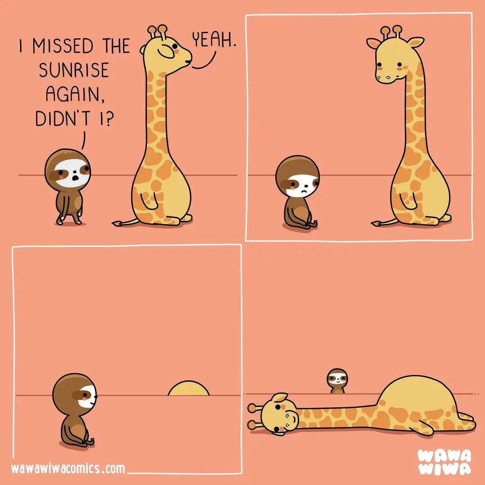

::: {.callout-tip}
🆕 Դասերն անցկացված են։ Սլայդերը, նշումներով PDF-երը և տեսանյութերը ներքևում են՝ երկու դասախոսություն ([36] PCA և SVD, [37] t-SNE և UMAP)։
:::

# 🎲 Random

TBD

# 📚 Նյութը

Երկու դասախոսություն․ առաջինը՝ ինչ է տալիս չափողականության իջեցումը և երբ որ մեթոդին դիմել, երկրորդը՝ ինչպես է UMAP-ն իրականում աշխատում։ Սլայդերը `ml/10_dimensionality_reduction/` պանակում։

- **[36] Չափողականության իջեցում** — ինչու իջեցնել (վիզուալիզացիա, սեղմում, աղմուկազերծում, չափողականության անեծքը), ինչու հենց վարիացիան մաքսիմիզացնել, կովարիացիոն մատրիցի կրկնություն, PCA-ի ամբողջական դուրսբերումը (Լագրանժ → սեփական վեկտորներ), «գծային» ինչ է նշանակում, SVD-ի անատոմիան, քանի կոմպոնենտ պահել (scree, 95%, CV), biplot, գլխավոր ուղղությունները՝ որպես նկարներ, վերականգնում՝ սեղմում և աղմուկազերծում, t-SNE և UMAP՝ որպես ոչ գծային քարտեզներ, ընտրության աղյուսակ, CLIP atlas, և երբ ՉԱՐԺԵ իջեցնել։ [🎞️ Սլայդեր](35_dimensionality_reduction.pdf) · [📝 PDF (նշումներով)](35_dimensionality_reduction_notes.pdf) · [📺 [36] Չափողականության իջեցում. PCA, սեփական վեկտորներ, SVD | Մեքենայական ուսուցում](https://youtu.be/ZYS67FCMTUo)
- **[37] UMAP-ը՝ բացված** — մանիֆոլդի ենթադրությունը, ամեն կետի սեփական «քանոնը» (ρ և σ, բինար որոնում), fuzzy գրաֆ և սիմետրիզացիա, ցածր չափողականության kernel-ը (a, b, `min_dist`), cross-entropy՝ ձգում գումարած վանում, spectral initialization և ազնիվ ծանոթագրությունը (Kobak & Linderman 2021), `n_neighbors` / `min_dist` / seed զգայունությունը, և ինչին կարելի է վստահել UMAP-ի նկարում։ [🎞️ Սլայդեր](36_umap.pdf) · [📝 PDF (նշումներով)](36_umap_notes.pdf) · [📺 [37] Ոչ գծային չափողականության իջեցում. t-SNE և UMAP | Մեքենայական ուսուցում](https://youtu.be/1-3MnkG1wso)

📝 **Թեմայի վերաբերյալ հարցաշար (Google Form):** TBD

**References:**

- Turk & Pentland, [*Eigenfaces for Recognition*](https://www.face-rec.org/algorithms/PCA/jcn.pdf) (1991) — the paper that started face recognition with PCA.
- Belhumeur, Hespanha & Kriegman, [*Eigenfaces vs. Fisherfaces*](https://www.cs.columbia.edu/~belhumeur/journal/fisherface-pami97.pdf) (1997) — why the unsupervised axes are the wrong ones for recognition.
- McInnes, Healy & Melville, [*UMAP*](https://arxiv.org/abs/1802.03426) (2018).
- Coenen & Pearce, [*Understanding UMAP*](https://pair-code.github.io/understanding-umap/) (Google PAIR) — the interactive one; play with it.
- Wattenberg, Viégas & Johnson, [*How to Use t-SNE Effectively*](https://distill.pub/2016/misread-tsne/) (2016).
- scikit-learn example: [Faces dataset decompositions](https://scikit-learn.org/stable/auto_examples/decomposition/plot_faces_decomposition.html).

***

# 🏡 Տնային

::: {.callout-important}
**Հանձնարարվող պրոջեկտը Project 3-ն է** — բոլորն անում են այն, ներառյալ սեփական ֆոտոների քարտեզը վերջում։ Project 1-ը լավ տաքացում է, Project 2-ը՝ «hard mode» ամենահավակնոտների համար․ երկուսն էլ կամավոր են։
:::

## Project 1 — Eigenfaces: a face in a handful of numbers 🧀🧀

A 64×64 face is **4096 numbers**, but faces live near a much smaller subspace. PCA finds that subspace, and its components — drawn back as images — look like ghostly faces (**"eigenfaces"**). In this project you'll compress faces, visualize them in 2-D, and finally *recognize* them, all with the tools from the lecture.

**Setup.** Data: `sklearn.datasets.fetch_olivetti_faces` (40 people × 10 images, 64×64, values in `[0, 1]`). One reproducible notebook, seed `509`, ending with a 3–5 sentence conclusion. Save results to an `out/` subfolder.

**Tasks.**

1. Load the faces, show a few, and flatten to `(400, 4096)`.
2. Fit PCA; display the **mean face** and the top **eigenfaces** (components reshaped to 64×64).
3. Plot the **scree** and **cumulative** explained variance; pick `k` for ~95%.
4. **Reconstruct** a face at several `k` (e.g. 10 / 50 / 150) and plot reconstruction error vs `k`. How few numbers still look like the person?
5. **Visualize** face space: embed in 2-D three ways --- `PCA`, `t-SNE`, and `UMAP` --- colored by person (use ~10 people so it stays readable). Which one separates identities best?
6. **Recognizer:** make a stratified train/test split, fit PCA on the training faces, and classify test faces by nearest neighbor *in PCA space*. Plot accuracy vs number of components, and compare to nearest neighbor on the raw pixels.
7. *(Callback)* Run k-means in PCA space and compare the clusters to the true identities with the **adjusted Rand index**.

**Bonus:** whiten the PCA (`whiten=True`); add a few of your own photos; vary the train/test split.

***

## Project 2 — When eigenfaces meet the real world 🧀🧀🧀

Project 1 works. It works because Olivetti is a **laboratory** dataset: every photo is centered, cropped identically, lit the same way, taken against the same wall, on the same day. Change any of that and the method falls over.

This project is about **making it fail, understanding exactly why, and then fixing it.** You are not following a recipe here — you are diagnosing a broken model. The write-up matters as much as the accuracy number.

**Setup.** Data: `sklearn.datasets.fetch_lfw_people` — Labeled Faces in the Wild, real photographs scraped from news articles. Start with `min_faces_per_person=70, resize=0.4` (≈1288 images, 7 people). Seed `509`, one reproducible notebook, results to `out/`.

::: {.callout-note}
**Heads up on the download.** `fetch_lfw_people` pulls ~200 MB the first time and caches it in `~/scikit_learn_data/`. Do this once, early, not five minutes before the deadline.
:::

### Part A — Break it

1. Run **exactly** your Project 1 pipeline on LFW: PCA, then nearest neighbor in PCA space. Report accuracy next to your Olivetti number.
2. Do not explain the gap yet. Just show it, and show a **confusion matrix** and per-person accuracy. Which person is hardest?
3. Compute the **majority-class baseline** — this subset is badly imbalanced, and one person accounts for a large share of it. Report your accuracy *next to that baseline*. An accuracy that sounds respectable can be much less impressive than it looks.

### Part B — Diagnose it

4. Display the **top 10 eigenfaces** for LFW next to your Olivetti ones. They look different. Describe how.
5. Test the suspicion directly: compute each image's **mean brightness** and correlate it with each of the first five PC scores. Report the five correlations, together with how much variance each of those components explains. One of them will not be subtle.
6. Make the argument visual: colour your 2-D PCA scatter **by brightness**, then colour the same scatter **by person**. Which one looks organized?

::: {.callout-tip}
This is the lecture's "when NOT to reduce" slide, happening to you. PCA ranks directions by **variance**, with no knowledge of `y`. Across web photos, illumination and pose vary far more than identity does — so the fat, high-variance axes are lighting, and identity is hiding in thin ones PCA is happy to throw away.
:::

### Part C — Fix it

Try all three, **measure each one**, and report them in a single table. At least one of them will disappoint you — that is deliberate, and reporting it honestly is part of the task.

7. **Drop the leading components.** Rebuild the recognizer on components `d:k` instead of `0:k` — the classic trick from the Fisherfaces paper. Sweep `d` from 0 to about 8 and plot accuracy against it.
8. **Normalize per image** (standardize each face, or histogram-equalize it) *before* PCA, so brightness cannot become a direction at all. Does this help as much as task 7? If not, work out why — the two fixes sound equivalent but are not.
9. **Use the labels.** Fit **LDA** (`LinearDiscriminantAnalysis`) on top of the PCA scores — this is **Fisherfaces**. Where PCA ranks directions by raw variance, LDA maximizes *between-class* over *within-class* scatter, so it is explicitly hunting the directions that separate people.
10. Now combine your best two fixes. Does the combination beat either alone? If it does not, explain what that tells you about what LDA was already doing.
11. State plainly which fix did the real work, with the numbers side by side.

### Part D — Be honest about it

12. Report your best pipeline's confusion matrix and per-person accuracy. Then actually **look at the misclassified images** and name the failure modes you can see — profile shots? sunglasses? motion blur? someone photographed mostly at a single event, against a single backdrop?
13. Check whether your gains are spread evenly. Did the rare people improve, or did the model just get better at the majority class? A per-person accuracy table answers this and a single number does not.
14. One paragraph: **would you deploy this?** If not, what would you need instead? (You do not have to build it. You have to know what it would take.)

**Bonus (optional).** Add ~10 photos of yourself, cropped and resized to match LFW's geometry, as an eighth person; report whether the recognizer picks you up and what it takes. Skip this if you would rather not put your face in a homework repo — the project is complete without it.

::: {.callout-important}
**What is actually being graded:** Part B and Part D. Anyone can call `PCA` and `LinearDiscriminantAnalysis`. Far fewer people can look at a model that reports 65% and explain precisely which property of the data produced that number.
:::

## Project 3 — Grouping photos by what is in them 🧀🧀

The job your phone does silently: 2000 photographs, no labels, put the ones showing the same kind of thing into the same pile.

Clustering raw pixels gives you **colors**, not **objects** — that was the lesson of the [clustering chapter](../09_clustering/09_clustering.qmd)'s image projects. The first task here is to prove it to yourself again, and then swap the pixels for a *learned representation* and change nothing else. This is a dimensionality-reduction project because the representation is the whole story: 512 learned numbers per photo beat 3072 raw ones, and task 5 asks you to squeeze those 512 down to 2 without losing the structure.

**Setup.** [`data/imagenette_clip.npz`](data/imagenette_clip.npz) holds, for 2000 photos: a 512-number **CLIP embedding** each, a small thumbnail, the true class (10 categories, for scoring only at the end), and vectors for **40 English words**. It loads with `np.load` — no torch, no downloads. One reproducible notebook, seed `509`.

**Given code — you are not asked to write the tooling, only to use it.** The ML (clustering, choosing `k`, the projections, the analysis) is yours; the engineering is provided:

- [`py_src/photo_map.py`](https://github.com/HaykTarkhanyan/python_math_ml_course/blob/main/ml/10_dimensionality_reduction/py_src/photo_map.py) — `make_photo_map(xy, jpegs, ...)` turns your 2-D points + the thumbnails into a self-contained **interactive hover-the-photo HTML map** (one function call; `jpegs_from_npz` unpacks the thumbnails).
- [`py_src/embed_my_photos.py`](https://github.com/HaykTarkhanyan/python_math_ml_course/blob/main/ml/10_dimensionality_reduction/py_src/embed_my_photos.py) — ~60 lines of minimal CLIP usage: point it at a folder of your own photos, get back an npz in the same layout as the chapter's (for task 7; this one needs a one-time `pip install torch transformers` — CPU is fine).

Treat CLIP as a black box for now: a model trained on image-caption pairs, so that a picture and its own caption land near each other in one shared space. Chapters 6 and 9 explain how. The one property to remember is that **text lives in the same space as images**.

**Tasks.**

1. Cluster the raw thumbnail pixels with `k=10` and score with **ARI**. Then do the same with a color histogram. Explain in two sentences why both fail — the reason is not that k-means is weak.
2. Cluster the CLIP embeddings instead, everything else unchanged. Report ARI and AMI for all three representations in one table.
3. Choose `k` with the elbow and the silhouette without looking at the labels. Note the silhouette's **value**, compare it with the one from the [Sevan land-cover project](../09_clustering/09_clustering.qmd), and explain why a better partition can score lower.
4. **Name every cluster automatically**: take its centre, find the nearest of the 40 word vectors. Report the name, the runner-up and the third choice for each cluster. The runner-ups are the interesting column — say what they tell you about the space.
5. Project to 2D (t-SNE or UMAP; add PCA for comparison) and make the **normal matplotlib scatter**, colored by your clusters — that is the deliverable plot. Then hand the *same* 2-D points and the thumbnails to the provided `photo_map.make_photo_map(...)` and open the resulting **interactive map** where hovering a point shows the photo. One function call — building the HTML tool is engineering, not this course.
6. Find the cluster that acts as a **junk drawer** and say why one always appears.
7. **Your own photos — the portfolio finale.** Run the provided `embed_my_photos.py` on a folder of *your own* pictures — trip photos, screenshots, a folder of paintings, anything; **no faces required, and nothing sensitive** — then rerun your pipeline unchanged: cluster, pick `k`, map. Publish the HTML map (GitHub Pages serves a single file out of the box) and write a short README that leads with your task-2 numbers: same k-means, pixels vs embeddings. Every collection gives a different map, so no two portfolios come out alike — this is the part worth showing to people.

**Bonus:** hover along a boundary between two clusters and collect the genuinely ambiguous photos; try `k` well above 10 and see what splits first; cluster a fine-grained set instead (many similar classes) and watch the score fall.

Լուծումը (ամբողջական walkthrough): <a href="37_image_clusters_solution.ipynb" download>37_image_clusters_solution.ipynb (download)</a> · [view on GitHub](https://github.com/HaykTarkhanyan/python_math_ml_course/blob/main/ml/10_dimensionality_reduction/37_image_clusters_solution.ipynb)

