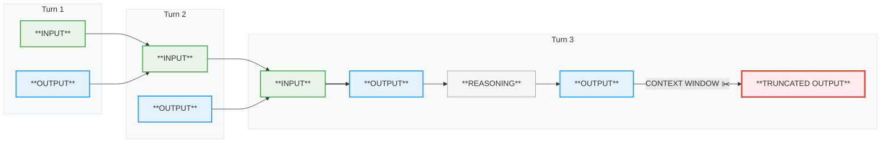
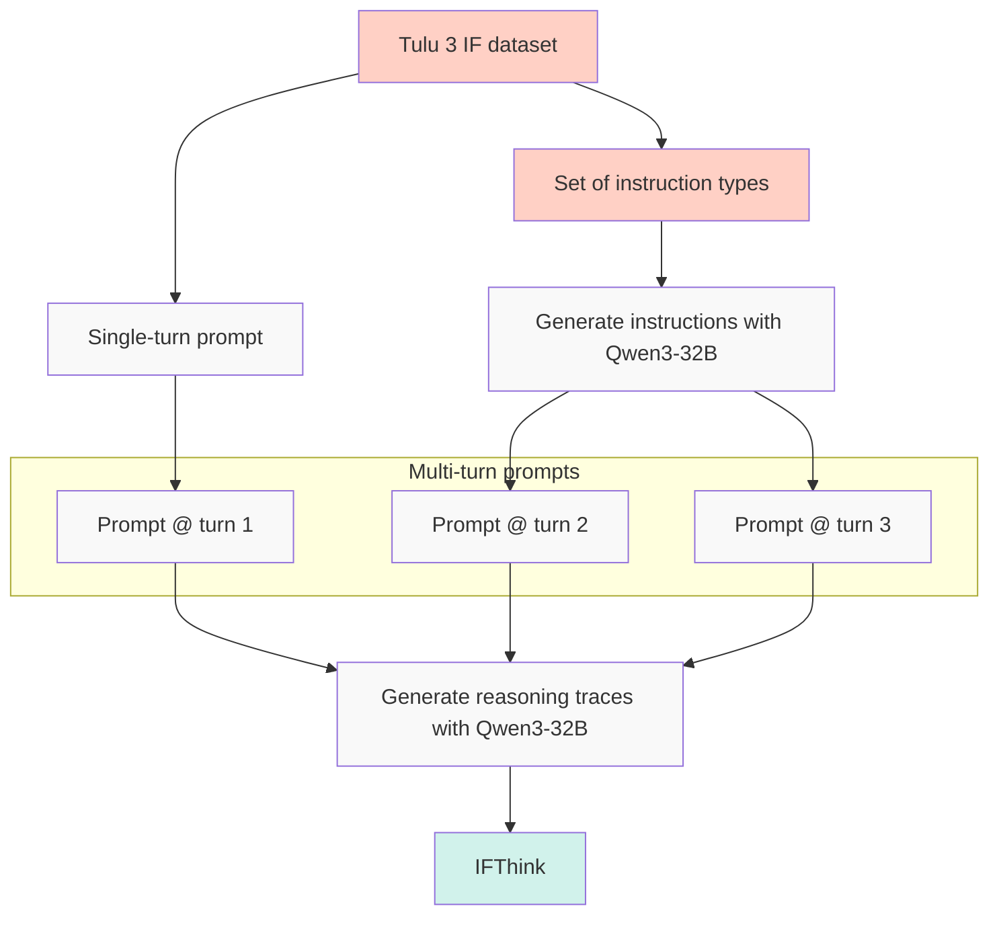
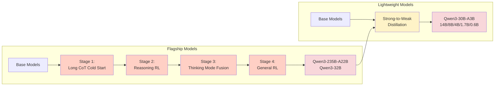
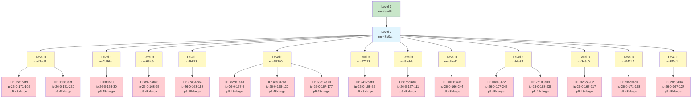

<!-- figmap v1 -->
# The Smol Training Playbook - readable markdown extract

> **Interactive plots and images are NOT rendered in this file.**
> Original (open for figures/plots): https://huggingface.co/spaces/HuggingFaceTB/smol-training-playbook
> Local HTML snapshot: `../materials/blogs/01_smol_training_playbook.html`

## Image / figure map (35 items) - section -> image URL

- **[Training Compass: Why → What → How]** svg+xml;base64,phn2zyb2awv3ym94psiwidagmjqgmjqiigzpbgw9im5vbmuiihn0cm9rzt0iy3vycmvudenvbg9yiibzdhjva2utd2lkdgg9ijiiihn0cm9rzs1saw5ly2fwpsjyb3vuzcigc3ryb2tllwxpbmvqb2lupsjyb3vuzci+phbhdgggzd0ittixide1djrhmiayidagmcaxltigmkg1ytigmiawidagms0yltj2ltqiic8+phbvbhlsaw5lihbvaw50cz0inyaxmcaxmiaxnsaxnyaxmci+pc9wb2x5bgluzt48bgluzsb4mt0imtiiihkxpsixnsigedi9ijeyiib5mj0imyi+pc9saw5lpjwvc3znpg== -> https://huggingfacetb-smol-training-playbook.hf.space/data:image/svg+xml;base64,PHN2ZyB2aWV3Ym94PSIwIDAgMjQgMjQiIGZpbGw9Im5vbmUiIHN0cm9rZT0iY3VycmVudENvbG9yIiBzdHJva2Utd2lkdGg9IjIiIHN0cm9rZS1saW5lY2FwPSJyb3VuZCIgc3Ryb2tlLWxpbmVqb2luPSJyb3VuZCI+PHBhdGggZD0iTTIxIDE1djRhMiAyIDAgMCAxLTIgMkg1YTIgMiAwIDAgMS0yLTJ2LTQiIC8+PHBvbHlsaW5lIHBvaW50cz0iNyAxMCAxMiAxNSAxNyAxMCI+PC9wb2x5bGluZT48bGluZSB4MT0iMTIiIHkxPSIxNSIgeDI9IjEyIiB5Mj0iMyI+PC9saW5lPjwvc3ZnPg==
- **[Setting Up Our Ablation Framework]** svg+xml;base64,phn2zyb2awv3ym94psiwidagmjqgmjqiigfyawetaglkzgvupsj0cnvliibmb2n1c2fibgu9imzhbhnlij48cgf0acbkpsjnmtygmug0yy0xljegmc0yic45ltigmnyxmmgyvjnomtjwmxptmya0sdhjlteumsawltigljktmiaydje0yzagms4xljkgmiayidjomtfjms4xidagmi0uosayltjwn2mwlteums0uos0yltitmnptmcaxnkg4vjdomtf2mtr6iiavpjwvc3znpg== -> https://huggingfacetb-smol-training-playbook.hf.space/data:image/svg+xml;base64,PHN2ZyB2aWV3Ym94PSIwIDAgMjQgMjQiIGFyaWEtaGlkZGVuPSJ0cnVlIiBmb2N1c2FibGU9ImZhbHNlIj48cGF0aCBkPSJNMTYgMUg0Yy0xLjEgMC0yIC45LTIgMnYxMmgyVjNoMTJWMXptMyA0SDhjLTEuMSAwLTIgLjktMiAydjE0YzAgMS4xLjkgMiAyIDJoMTFjMS4xIDAgMi0uOSAyLTJWN2MwLTEuMS0uOS0yLTItMnptMCAxNkg4VjdoMTF2MTR6IiAvPjwvc3ZnPg==
- **[**Understanding What Works: Evaluation**]** e4vk7uw5stecyupd0s_ob.png -> https://cdn-avatars.huggingface.co/v1/production/uploads/651e96991b97c9f33d26bde6/e4VK7uW5sTeCYupD0s_ob.png
- **[**Understanding What Works: Evaluation**]** svg+xml;base64,phn2zybjbgfzcz0ibwwtyxv0bybtaw4tdy02ihbsltiiihdpzhropsixzw0iighlawdodd0imwvtiib2awv3ym94psiwidagmtignyigzmlsbd0ibm9uzsigeg1sbnm9imh0dha6ly93d3cudzmub3jnlziwmdavc3znij48cgf0acbkpsjnmsaxtdygnkwxmsaxiibzdhjva2u9imn1cnjlbnrdb2xvciiglz48l3n2zz4= -> https://huggingfacetb-smol-training-playbook.hf.space/data:image/svg+xml;base64,PHN2ZyBjbGFzcz0ibWwtYXV0byBtaW4tdy02IHBsLTIiIHdpZHRoPSIxZW0iIGhlaWdodD0iMWVtIiB2aWV3Ym94PSIwIDAgMTIgNyIgZmlsbD0ibm9uZSIgeG1sbnM9Imh0dHA6Ly93d3cudzMub3JnLzIwMDAvc3ZnIj48cGF0aCBkPSJNMSAxTDYgNkwxMSAxIiBzdHJva2U9ImN1cnJlbnRDb2xvciIgLz48L3N2Zz4=
- **[**Understanding What Works: Evaluation**]** svg+xml;base64,phn2zybjbgfzcz0iywjzb2x1dgugbgvmdc0zihrvcc0xlzigdhjhbnnmb3jtic10cmfuc2xhdgutes0xlzigcg9pbnrlci1ldmvudhmtbm9uzsb0zxh0lwdyyxktndawiib4bwxucz0iahr0cdovl3d3dy53my5vcmcvmjawmc9zdmciihhtbg5zonhsaw5rpsjodhrwoi8vd3d3lnczlm9yzy8xotk5l3hsaw5riibhcmlhlwhpzgrlbj0idhj1zsigzm9jdxnhymxlpsjmywxzzsigcm9szt0iaw1niib3awr0ad0imwvtiibozwlnahq9ijflbsigchjlc2vydmvhc3bly3ryyxrpbz0iee1pzflnawqgbwvldcigdmlld2jved0imcawidmyidmyij48cgf0acbkpsjnmzagmjguntlmmjiundugmjfbmtegmtegmcaxidagmjegmjiundvmmjguntkgmzb6ttugmtrhosa5idagmsaxidkgowe5idkgmcawidetos05eiigzmlsbd0iy3vycmvudenvbg9yiiavpjwvc3znpg== -> https://huggingfacetb-smol-training-playbook.hf.space/data:image/svg+xml;base64,PHN2ZyBjbGFzcz0iYWJzb2x1dGUgbGVmdC0zIHRvcC0xLzIgdHJhbnNmb3JtIC10cmFuc2xhdGUteS0xLzIgcG9pbnRlci1ldmVudHMtbm9uZSB0ZXh0LWdyYXktNDAwIiB4bWxucz0iaHR0cDovL3d3dy53My5vcmcvMjAwMC9zdmciIHhtbG5zOnhsaW5rPSJodHRwOi8vd3d3LnczLm9yZy8xOTk5L3hsaW5rIiBhcmlhLWhpZGRlbj0idHJ1ZSIgZm9jdXNhYmxlPSJmYWxzZSIgcm9sZT0iaW1nIiB3aWR0aD0iMWVtIiBoZWlnaHQ9IjFlbSIgcHJlc2VydmVhc3BlY3RyYXRpbz0ieE1pZFlNaWQgbWVldCIgdmlld2JveD0iMCAwIDMyIDMyIj48cGF0aCBkPSJNMzAgMjguNTlMMjIuNDUgMjFBMTEgMTEgMCAxIDAgMjEgMjIuNDVMMjguNTkgMzB6TTUgMTRhOSA5IDAgMSAxIDkgOWE5IDkgMCAwIDEtOS05eiIgZmlsbD0iY3VycmVudENvbG9yIiAvPjwvc3ZnPg==
- **[**Attention**]** image_27c1384e-bcac-807c-807b-fac08be1d884.c286jbwa_amd26.webp -> https://huggingfacetb-smol-training-playbook.hf.space/_astro/image_27c1384e-bcac-807c-807b-fac08be1d884.C286JbWA_AmD26.webp
- **[**Attention**]** svg+xml;base64,phn2zyb2awv3ym94psiwidagmjqgmjqiigfyawetaglkzgvupsj0cnvliibmb2n1c2fibgu9imzhbhnliibkyxrhlwfzdhjvlwnpzc02a292m2tpzz4gphbhdgggzd0itteyide2yy0umjygmc0untitljexls43ms0umjlsltutnwexidegmcawidegms40mi0xljqytdexideylju5vjrhmsaxidagmsaxidigmhy4lju5bdmumjktmy4zytegmsawidegmsaxljqyideundjsltugnwmtlje5lje4ls40ns4yos0unzeumjl6ttugmjbhmsaxidagmsaxidatmmgxngexidegmcaxidegmcaysdv6iibkyxrhlwfzdhjvlwnpzc02a292m2tpzyavpia8l3n2zz4= -> https://huggingfacetb-smol-training-playbook.hf.space/data:image/svg+xml;base64,PHN2ZyB2aWV3Ym94PSIwIDAgMjQgMjQiIGFyaWEtaGlkZGVuPSJ0cnVlIiBmb2N1c2FibGU9ImZhbHNlIiBkYXRhLWFzdHJvLWNpZC02a292M2tpZz4gPHBhdGggZD0iTTEyIDE2Yy0uMjYgMC0uNTItLjExLS43MS0uMjlsLTUtNWExIDEgMCAwIDEgMS40Mi0xLjQyTDExIDEyLjU5VjRhMSAxIDAgMSAxIDIgMHY4LjU5bDMuMjktMy4zYTEgMSAwIDEgMSAxLjQyIDEuNDJsLTUgNWMtLjE5LjE4LS40NS4yOS0uNzEuMjl6TTUgMjBhMSAxIDAgMSAxIDAtMmgxNGExIDEgMCAxIDEgMCAySDV6IiBkYXRhLWFzdHJvLWNpZC02a292M2tpZyAvPiA8L3N2Zz4=
- **[Going Sparse: MoE]** image_2931384e-bcac-80c4-ab02-f22c53e6fdee.dhphf60f_z1pe0ji.webp -> https://huggingfacetb-smol-training-playbook.hf.space/_astro/image_2931384e-bcac-80c4-ab02-f22c53e6fdee.dhphF60f_Z1Pe0ji.webp
- **[Going Sparse: MoE]** image_2931384e-bcac-8062-bc11-d1ee3706d996.d6cek-45_10lkf5.webp -> https://huggingfacetb-smol-training-playbook.hf.space/_astro/image_2931384e-bcac-8062-bc11-d1ee3706d996.D6CeK-45_10lKF5.webp
- **[Going Sparse: MoE]** capture_decran_2025-10-20_a_13_25_47_2921384e-bcac-8087-83e5-fa7a40c1f342.asykexku_1s8wtb.webp -> https://huggingfacetb-smol-training-playbook.hf.space/_astro/Capture_decran_2025-10-20_a_13_25_47_2921384e-bcac-8087-83e5-fa7a40c1f342.asYkEXKU_1s8wtB.webp
- **[Going Sparse: MoE]** capture_decran_2025-10-20_a_13_26_08_2921384e-bcac-80b5-ac36-fb73d6374208.d-bbijb7_zs7nqa.webp -> https://huggingfacetb-smol-training-playbook.hf.space/_astro/Capture_decran_2025-10-20_a_13_26_08_2921384e-bcac-80b5-ac36-fb73d6374208.D-BBIjb7_Zs7nQa.webp
- **[Going Sparse: MoE]** 75ae60ff-50be-48e1-aad2-a8fc56120d3d_2921384e-bcac-80c2-984b-d81404e4bb7c.8nxvv-oc_25nha.webp -> https://huggingfacetb-smol-training-playbook.hf.space/_astro/75ae60ff-50be-48e1-aad2-a8fc56120d3d_2921384e-bcac-80c2-984b-d81404e4bb7c.8nxVv-OC_25NHa.webp
- **[Going Sparse: MoE]** capture_decran_2025-10-21_a_11_11_38_2931384e-bcac-8008-ad8d-d5ab0c539d3a.zeq4aq4n_z3eacl.webp -> https://huggingfacetb-smol-training-playbook.hf.space/_astro/Capture_decran_2025-10-21_a_11_11_38_2931384e-bcac-8008-ad8d-d5ab0c539d3a.ZeQ4Aq4n_Z3EACl.webp
- **[Going Sparse: MoE]** capture_decran_2025-10-21_a_15_34_27_2931384e-bcac-8066-834b-c485ae8d1fa5.cix986we_zlidik.webp -> https://huggingfacetb-smol-training-playbook.hf.space/_astro/Capture_decran_2025-10-21_a_15_34_27_2931384e-bcac-8066-834b-c485ae8d1fa5.Cix986wE_ZLIDik.webp
- **[**Scaling Laws for Hyperparameters**]** image_2471384e-bcac-8059-84a4-d4ce5ae3847c.2mt4c1dr_1a8vp7.webp -> https://huggingfacetb-smol-training-playbook.hf.space/_astro/image_2471384e-bcac-8059-84a4-d4ce5ae3847c.2mT4C1Dr_1a8Vp7.webp
- **[Rules of Engagement]** capture_decran_2025-10-27_a_22_10_05_2991384e-bcac-802a-a6e6-dab0f9f410ec.ckoefjct_b6hhb.webp -> https://huggingfacetb-smol-training-playbook.hf.space/_astro/Capture_decran_2025-10-27_a_22_10_05_2991384e-bcac-802a-a6e6-dab0f9f410ec.CKOEFjcT_b6hhb.webp
- **[Picking a Base Model]** screenshot_2025-10-24_at_09_37_24_2961384e-bcac-8055-9e8e-ffbd3a1aa368.c0macoq5_z1irgey.webp -> https://huggingfacetb-smol-training-playbook.hf.space/_astro/Screenshot_2025-10-24_at_09_37_24_2961384e-bcac-8055-9e8e-ffbd3a1aa368.C0macOQ5_Z1iRGEy.webp
- **[Picking a Good Chat Template]** svg+xml;base64,phn2zyb4bwxucz0iahr0cdovl3d3dy53my5vcmcvmjawmc9zdmciigfyawetaglkzgvupsj0cnvliibmawxspsjjdxjyzw50q29sb3iiigzvy3vzywjszt0izmfsc2uiihjvbgu9imltzyigd2lkdgg9ijflbsigagvpz2h0psixzw0iihbyzxnlcnzlyxnwzwn0cmf0aw89inhnawrztwlkig1lzxqiihzpzxdib3g9ijagmcazmiazmii+phbhdgggzd0itti4ldewvji4sdewvjewsdi4btatmkgxmgeyldismcwwldatmiwyvji4ytismiwwldasmcwyldjimjhhmiwyldasmcwwlditmlyxmgeyldismcwwldatmi0ywiigdhjhbnnmb3jtpsj0cmfuc2xhdguomckiic8+phbhdgggzd0ittqsmthimly0qtismiwwldasmsw0ldjimthwneg0wiigdhjhbnnmb3jtpsj0cmfuc2xhdguomckiic8+phjly3qgzmlsbd0ibm9uzsigd2lkdgg9ijmyiibozwlnahq9ijmyiiavpjwvc3znpg== -> https://huggingfacetb-smol-training-playbook.hf.space/data:image/svg+xml;base64,PHN2ZyB4bWxucz0iaHR0cDovL3d3dy53My5vcmcvMjAwMC9zdmciIGFyaWEtaGlkZGVuPSJ0cnVlIiBmaWxsPSJjdXJyZW50Q29sb3IiIGZvY3VzYWJsZT0iZmFsc2UiIHJvbGU9ImltZyIgd2lkdGg9IjFlbSIgaGVpZ2h0PSIxZW0iIHByZXNlcnZlYXNwZWN0cmF0aW89InhNaWRZTWlkIG1lZXQiIHZpZXdib3g9IjAgMCAzMiAzMiI+PHBhdGggZD0iTTI4LDEwVjI4SDEwVjEwSDI4bTAtMkgxMGEyLDIsMCwwLDAtMiwyVjI4YTIsMiwwLDAsMCwyLDJIMjhhMiwyLDAsMCwwLDItMlYxMGEyLDIsMCwwLDAtMi0yWiIgdHJhbnNmb3JtPSJ0cmFuc2xhdGUoMCkiIC8+PHBhdGggZD0iTTQsMThIMlY0QTIsMiwwLDAsMSw0LDJIMThWNEg0WiIgdHJhbnNmb3JtPSJ0cmFuc2xhdGUoMCkiIC8+PHJlY3QgZmlsbD0ibm9uZSIgd2lkdGg9IjMyIiBoZWlnaHQ9IjMyIiAvPjwvc3ZnPg==
- **[Picking a Good Chat Template]** svg+xml;base64,phn2zybjbgfzcz0ib3bhy2l0es0xmdaiihdpzhropsixzw0iighlawdodd0imwvtiib2awv3ym94psiwidagmtigmteiigzpbgw9im5vbmuiihhtbg5zpsjodhrwoi8vd3d3lnczlm9yzy8ymdawl3n2zyi+phbhdgggzd0ittaunzugms4ynugxms4ynu0wljc1idvioum5ljc1idugmteumjugns4znzugmteumjugni44nzvdmteumjugoc4znzugos45otk3nsa4ljc1idkumzc1idgunzvink02idgunzvmny41idcumjvnnia4ljc1tdcunsaxmc4ynu0wljc1idgunzvimy43nsigc3ryb2tlpsjjdxjyzw50q29sb3iiihn0cm9rzs13awr0ad0ims4xmjuiihn0cm9rzs1saw5ly2fwpsjyb3vuzcigc3ryb2tllwxpbmvqb2lupsjyb3vuzciglz48l3n2zz4= -> https://huggingfacetb-smol-training-playbook.hf.space/data:image/svg+xml;base64,PHN2ZyBjbGFzcz0ib3BhY2l0eS0xMDAiIHdpZHRoPSIxZW0iIGhlaWdodD0iMWVtIiB2aWV3Ym94PSIwIDAgMTIgMTEiIGZpbGw9Im5vbmUiIHhtbG5zPSJodHRwOi8vd3d3LnczLm9yZy8yMDAwL3N2ZyI+PHBhdGggZD0iTTAuNzUgMS4yNUgxMS4yNU0wLjc1IDVIOUM5Ljc1IDUgMTEuMjUgNS4zNzUgMTEuMjUgNi44NzVDMTEuMjUgOC4zNzUgOS45OTk3NSA4Ljc1IDkuMzc1IDguNzVINk02IDguNzVMNy41IDcuMjVNNiA4Ljc1TDcuNSAxMC4yNU0wLjc1IDguNzVIMy43NSIgc3Ryb2tlPSJjdXJyZW50Q29sb3IiIHN0cm9rZS13aWR0aD0iMS4xMjUiIHN0cm9rZS1saW5lY2FwPSJyb3VuZCIgc3Ryb2tlLWxpbmVqb2luPSJyb3VuZCIgLz48L3N2Zz4=
- **[Picking a Good Chat Template]** svg+xml;base64,phn2zybjbgfzcz0iyw5pbwf0zs1zcgluihrlehqtehmiihhtbg5zpsjodhrwoi8vd3d3lnczlm9yzy8ymdawl3n2zyigeg1sbnm6egxpbms9imh0dha6ly93d3cudzmub3jnlze5otkvegxpbmsiigfyawetaglkzgvupsj0cnvliibmawxspsjub25liibmb2n1c2fibgu9imzhbhnliibyb2xlpsjpbwciihdpzhropsixzw0iighlawdodd0imwvtiibwcmvzzxj2zwfzcgvjdhjhdglvpsj4twlkwu1pzcbtzwv0iib2awv3ym94psiwidagmtigmtiipjxwyxroignsyxnzpsjvcgfjaxr5ltc1iibmawxslxj1bgu9imv2zw5vzgqiignsaxatcnvszt0izxzlbm9kzcigzd0ittygmemyljy4njigmcawidiunjg2miawidzims44qzeuoca0ljg4nja5idiumjqynsazljgxnzggmy4wmzaxnsazljazmde1qzmuode3ocaylji0mjugnc44odywosaxljggniaxljhwmfpnmtignkmxmia5ljmxmzggos4zmtm4ideyidygmtjwmtaumkm3ljexmzkxidewljigoc4xodiyidkunzu3nsa4ljk2otg1idguoty5odvdos43ntc1idgumtgymiaxmc4yidcumtezotegmtaumia2sdeywiigzmlsbd0iy3vycmvudenvbg9yiiavpjxwyxroignsyxnzpsjvcgfjaxr5lti1iibmawxslxj1bgu9imv2zw5vzgqiignsaxatcnvszt0izxzlbm9kzcigzd0ittmumdmwmtugoc45njk4numzljgxnzggos43ntc1idquodg2mdkgmtaumia2idewljjwmtjdmi42odyyideyidagos4zmtm4idagnkgxljhdms44idcumtezotegmi4yndi1idgumtgymiazljazmde1idguoty5odvattcunja3mjcgmi4xmtk3mum3lja5nzcgms45mdg2nca2lju1mtu1ideuoca2ideuofywqzkumzezocawideyidiunjg2miaxmia2sdewljjdmtaumia1ljq0odq1idewlja5mtqgnc45mdizidkuodgwmjkgnc4zoti3m0m5ljy2otiyidmuodgzmtygos4zntk4nsazljqymde2idguoty5odugmy4wmzaxnum4lju3otg0idiunjqwmtugoc4xmty4ncayljmzmdc4idcunja3mjcgmi4xmtk3mvoiigzpbgw9imn1cnjlbnrdb2xvciiglz48l3n2zz4= -> https://huggingfacetb-smol-training-playbook.hf.space/data:image/svg+xml;base64,PHN2ZyBjbGFzcz0iYW5pbWF0ZS1zcGluIHRleHQteHMiIHhtbG5zPSJodHRwOi8vd3d3LnczLm9yZy8yMDAwL3N2ZyIgeG1sbnM6eGxpbms9Imh0dHA6Ly93d3cudzMub3JnLzE5OTkveGxpbmsiIGFyaWEtaGlkZGVuPSJ0cnVlIiBmaWxsPSJub25lIiBmb2N1c2FibGU9ImZhbHNlIiByb2xlPSJpbWciIHdpZHRoPSIxZW0iIGhlaWdodD0iMWVtIiBwcmVzZXJ2ZWFzcGVjdHJhdGlvPSJ4TWlkWU1pZCBtZWV0IiB2aWV3Ym94PSIwIDAgMTIgMTIiPjxwYXRoIGNsYXNzPSJvcGFjaXR5LTc1IiBmaWxsLXJ1bGU9ImV2ZW5vZGQiIGNsaXAtcnVsZT0iZXZlbm9kZCIgZD0iTTYgMEMyLjY4NjIgMCAwIDIuNjg2MiAwIDZIMS44QzEuOCA0Ljg4NjA5IDIuMjQyNSAzLjgxNzggMy4wMzAxNSAzLjAzMDE1QzMuODE3OCAyLjI0MjUgNC44ODYwOSAxLjggNiAxLjhWMFpNMTIgNkMxMiA5LjMxMzggOS4zMTM4IDEyIDYgMTJWMTAuMkM3LjExMzkxIDEwLjIgOC4xODIyIDkuNzU3NSA4Ljk2OTg1IDguOTY5ODVDOS43NTc1IDguMTgyMiAxMC4yIDcuMTEzOTEgMTAuMiA2SDEyWiIgZmlsbD0iY3VycmVudENvbG9yIiAvPjxwYXRoIGNsYXNzPSJvcGFjaXR5LTI1IiBmaWxsLXJ1bGU9ImV2ZW5vZGQiIGNsaXAtcnVsZT0iZXZlbm9kZCIgZD0iTTMuMDMwMTUgOC45Njk4NUMzLjgxNzggOS43NTc1IDQuODg2MDkgMTAuMiA2IDEwLjJWMTJDMi42ODYyIDEyIDAgOS4zMTM4IDAgNkgxLjhDMS44IDcuMTEzOTEgMi4yNDI1IDguMTgyMiAzLjAzMDE1IDguOTY5ODVaTTcuNjA3MjcgMi4xMTk3MUM3LjA5NzcgMS45MDg2NCA2LjU1MTU1IDEuOCA2IDEuOFYwQzkuMzEzOCAwIDEyIDIuNjg2MiAxMiA2SDEwLjJDMTAuMiA1LjQ0ODQ1IDEwLjA5MTQgNC45MDIzIDkuODgwMjkgNC4zOTI3M0M5LjY2OTIyIDMuODgzMTYgOS4zNTk4NSAzLjQyMDE2IDguOTY5ODUgMy4wMzAxNUM4LjU3OTg0IDIuNjQwMTUgOC4xMTY4NCAyLjMzMDc4IDcuNjA3MjcgMi4xMTk3MVoiIGZpbGw9ImN1cnJlbnRDb2xvciIgLz48L3N2Zz4=
- **[**Vibe-Test Your Baselines**]** screenshot_2025-09-26_at_22_36_40_27a1384e-bcac-8063-94e0-f1c689e7d9b9.vtcw08kn_wobjg.webp -> https://huggingfacetb-smol-training-playbook.hf.space/_astro/Screenshot_2025-09-26_at_22_36_40_27a1384e-bcac-8063-94e0-f1c689e7d9b9.vtcw08KN_wObJG.webp
- **[Boosting Reasoning Through Continued Pretraining]** gtu8dnowsaarueg_28e1384e-bcac-8051-8122-ed6cacf8f632.aunwy38i_z1unntg.webp -> https://huggingfacetb-smol-training-playbook.hf.space/_astro/GtU8DnoWsAAruEG_28e1384e-bcac-8051-8122-ed6cacf8f632.AUNwy38i_Z1Unntg.webp
- **[Boosting Reasoning Through Continued Pretraining]** screenshot_2025-10-01_at_11_31_19_28e1384e-bcac-8005-8c5e-f0af3bf70372.bue895o6_z1ti3sf.webp -> https://huggingfacetb-smol-training-playbook.hf.space/_astro/Screenshot_2025-10-01_at_11_31_19_28e1384e-bcac-8005-8c5e-f0af3bf70372.BuE895O6_Z1ti3sF.webp
- **[Creating Preference Datasets]** 1616186257611-60104afcc75e19ac1738fe70.png -> https://cdn-avatars.huggingface.co/v1/production/uploads/1616186257611-60104afcc75e19ac1738fe70.png
- **[Creating Preference Datasets]** svg+xml;base64,phn2zybjbgfzcz0ibxitms41iib4bwxucz0iahr0cdovl3d3dy53my5vcmcvmjawmc9zdmciihhtbg5zonhsaw5rpsjodhrwoi8vd3d3lnczlm9yzy8xotk5l3hsaw5riibhcmlhlwhpzgrlbj0idhj1zsigzm9jdxnhymxlpsjmywxzzsigcm9szt0iaw1niib3awr0ad0imwvtiibozwlnahq9ijflbsigchjlc2vydmvhc3bly3ryyxrpbz0iee1pzflnawqgbwvldcigdmlld2jved0imcawidmyidmyij48cgf0acbkpsjnmtagmtzmmjagnmwxljqgms40bc04ljygoc42bdgunia4ljzmmjagmjz6iibmawxspsjjdxjyzw50q29sb3iiic8+pc9zdmc+ -> https://huggingfacetb-smol-training-playbook.hf.space/data:image/svg+xml;base64,PHN2ZyBjbGFzcz0ibXItMS41IiB4bWxucz0iaHR0cDovL3d3dy53My5vcmcvMjAwMC9zdmciIHhtbG5zOnhsaW5rPSJodHRwOi8vd3d3LnczLm9yZy8xOTk5L3hsaW5rIiBhcmlhLWhpZGRlbj0idHJ1ZSIgZm9jdXNhYmxlPSJmYWxzZSIgcm9sZT0iaW1nIiB3aWR0aD0iMWVtIiBoZWlnaHQ9IjFlbSIgcHJlc2VydmVhc3BlY3RyYXRpbz0ieE1pZFlNaWQgbWVldCIgdmlld2JveD0iMCAwIDMyIDMyIj48cGF0aCBkPSJNMTAgMTZMMjAgNmwxLjQgMS40bC04LjYgOC42bDguNiA4LjZMMjAgMjZ6IiBmaWxsPSJjdXJyZW50Q29sb3IiIC8+PC9zdmc+
- **[Creating Preference Datasets]** svg+xml;base64,phn2zybjbgfzcz0ibwwtms41ihryyw5zzm9ybsbyb3rhdgutmtgwiib4bwxucz0iahr0cdovl3d3dy53my5vcmcvmjawmc9zdmciihhtbg5zonhsaw5rpsjodhrwoi8vd3d3lnczlm9yzy8xotk5l3hsaw5riibhcmlhlwhpzgrlbj0idhj1zsigzm9jdxnhymxlpsjmywxzzsigcm9szt0iaw1niib3awr0ad0imwvtiibozwlnahq9ijflbsigchjlc2vydmvhc3bly3ryyxrpbz0iee1pzflnawqgbwvldcigdmlld2jved0imcawidmyidmyij48cgf0acbkpsjnmtagmtzmmjagnmwxljqgms40bc04ljygoc42bdgunia4ljzmmjagmjz6iibmawxspsjjdxjyzw50q29sb3iiic8+pc9zdmc+ -> https://huggingfacetb-smol-training-playbook.hf.space/data:image/svg+xml;base64,PHN2ZyBjbGFzcz0ibWwtMS41IHRyYW5zZm9ybSByb3RhdGUtMTgwIiB4bWxucz0iaHR0cDovL3d3dy53My5vcmcvMjAwMC9zdmciIHhtbG5zOnhsaW5rPSJodHRwOi8vd3d3LnczLm9yZy8xOTk5L3hsaW5rIiBhcmlhLWhpZGRlbj0idHJ1ZSIgZm9jdXNhYmxlPSJmYWxzZSIgcm9sZT0iaW1nIiB3aWR0aD0iMWVtIiBoZWlnaHQ9IjFlbSIgcHJlc2VydmVhc3BlY3RyYXRpbz0ieE1pZFlNaWQgbWVldCIgdmlld2JveD0iMCAwIDMyIDMyIj48cGF0aCBkPSJNMTAgMTZMMjAgNmwxLjQgMS40bC04LjYgOC42bDguNiA4LjZMMjAgMjZ6IiBmaWxsPSJjdXJyZW50Q29sb3IiIC8+PC9zdmc+
- **[Creating Preference Datasets]** 1641327454607-608849cadf398c3b285ce95b.png -> https://cdn-avatars.huggingface.co/v1/production/uploads/1641327454607-608849cadf398c3b285ce95b.png
- **[Which Method Should You Use?]** screenshot_2025-10-30_at_13_02_36_29c1384e-bcac-80d6-a72d-ff34bc221b60.cwwwpivt_1vfobg.webp -> https://huggingfacetb-smol-training-playbook.hf.space/_astro/Screenshot_2025-10-30_at_13_02_36_29c1384e-bcac-80d6-a72d-ff34bc221b60.CWwwpiVT_1VFoBG.webp
- **[GPU Memory Hierarchy: From Registers to HBM]** image_2881384e-bcac-80d6-84fe-d705cb1eae0a.dyxajoyz_1ik6k0.webp -> https://huggingfacetb-smol-training-playbook.hf.space/_astro/image_2881384e-bcac-80d6-84fe-d705cb1eae0a.DYXAJOyz_1iK6k0.webp
- **[Once profiling is complete, open the results in the Nsight Compute GUI to view ...]** image_2881384e-bcac-801d-9f3d-c875181b9dd1.ctkk2fla_z2eui4h.webp -> https://huggingfacetb-smol-training-playbook.hf.space/_astro/image_2881384e-bcac-801d-9f3d-c875181b9dd1.CtKK2FLa_Z2eUI4H.webp
- **[Roofline Model]** image_2881384e-bcac-80ed-9bdf-c077977d77b8.dy-eh-v2_z252kai.webp -> https://huggingfacetb-smol-training-playbook.hf.space/_astro/image_2881384e-bcac-80ed-9bdf-c077977d77b8.Dy-eh-v2_Z252kaI.webp
- **[CPU-to-GPU Communication]** lstopo_29c1384e-bcac-80c9-9715-cbfe9e73d86b.dccvpo8q_zpxgss.webp -> https://huggingfacetb-smol-training-playbook.hf.space/_astro/lstopo_29c1384e-bcac-80c9-9715-cbfe9e73d86b.DCCvpO8Q_ZPxGsS.webp
- **[We can see 4 such EFA devices per each PCIe switch]** image_2891384e-bcac-80e2-9cc5-c2c46c7ab39b.b9lkpq-__zcdxhc.webp -> https://huggingfacetb-smol-training-playbook.hf.space/_astro/image_2891384e-bcac-80e2-9cc5-c2c46c7ab39b.B9LkpQ-__ZcdxHc.webp
- **[**Node Health Monitoring and Replacement**]** image_27d1384e-bcac-80b1-9ffb-ec29d0021ccc.d54wwyj9_2jmnno.webp -> https://huggingfacetb-smol-training-playbook.hf.space/_astro/image_27d1384e-bcac-80b1-9ffb-ec29d0021ccc.D54wWyJ9_2jmnNO.webp
- **[Footnotes]** svg+xml;base64,phn2zybjbgfzcz0iymfjay1py29uiib3awr0ad0imtiiighlawdodd0imtiiihzpzxdib3g9ijagmcayncayncigzmlsbd0ibm9uzsigc3ryb2tlpsjjdxjyzw50q29sb3iiihn0cm9rzs13awr0ad0imiigc3ryb2tllwxpbmvjyxa9injvdw5kiibzdhjva2utbgluzwpvaw49injvdw5kiibhcmlhlwhpzgrlbj0idhj1zsigzm9jdxnhymxlpsjmywxzzsi+pgxpbmugede9ijeyiib5mt0imtkiihgypsixmiigeti9ijuipjwvbgluzt48cg9sewxpbmugcg9pbnrzpsi1ideyideyidugmtkgmtiipjwvcg9sewxpbmu+pc9zdmc+ -> https://huggingfacetb-smol-training-playbook.hf.space/data:image/svg+xml;base64,PHN2ZyBjbGFzcz0iYmFjay1pY29uIiB3aWR0aD0iMTIiIGhlaWdodD0iMTIiIHZpZXdib3g9IjAgMCAyNCAyNCIgZmlsbD0ibm9uZSIgc3Ryb2tlPSJjdXJyZW50Q29sb3IiIHN0cm9rZS13aWR0aD0iMiIgc3Ryb2tlLWxpbmVjYXA9InJvdW5kIiBzdHJva2UtbGluZWpvaW49InJvdW5kIiBhcmlhLWhpZGRlbj0idHJ1ZSIgZm9jdXNhYmxlPSJmYWxzZSI+PGxpbmUgeDE9IjEyIiB5MT0iMTkiIHgyPSIxMiIgeTI9IjUiPjwvbGluZT48cG9seWxpbmUgcG9pbnRzPSI1IDEyIDEyIDUgMTkgMTIiPjwvcG9seWxpbmU+PC9zdmc+

---

## [Introduction](#introduction)

What does it actually take to train a high-performance LLM today?

Reading time: 2-4 days.

Published research makes it look straightforward: strategic architecture choices, carefully curated datasets, and sufficient compute. The results are polished, the ablations are structured and clean. Every decision seems obvious in hindsight. But those reports only show what worked and apply a bit of rosy retrospection—they don’t capture the 2 a.m. dataloader debugging sessions, the loss spikes, or the subtle tensor parallelism bug (see later!) that quietly sabotages your training. The reality is messier, more iterative, and full of decisions that don’t make it into the final paper.

Join us as we look behind the scenes of training [SmolLM3](https://huggingface.co/HuggingFaceTB/SmolLM3-3B), a 3B-parameter multilingual reasoning model trained on 11T tokens. This is not an ordinary guide, but rather the untangling of a spiderweb of decisions, discoveries, and dead ends that led to deep insights into what it takes to build world-class language models.

It is also the final opus in our long-form model training series. We’ve worked through building datasets at scale ([FineWeb](https://huggingface.co/spaces/HuggingFaceFW/blogpost-fineweb-v1)), orchestrating thousands of GPUs to sing in unison ([The Ultra-Scale Playbook](https://huggingface.co/spaces/nanotron/ultrascale-playbook)), and selecting the best evaluations at each step of the process ([The LLM Evaluation Guidebook](https://github.com/huggingface/evaluation-guidebook)). Now we’re putting it all together to build a strong AI model. We’ll walk you through the complete journey—not just the final recipe that worked, but the failures, infrastructure breakdowns, and debugging processes that shaped every decision. You’ll see how promising small-scale ablations sometimes don’t translate at scale; why we restarted a training run after 1T tokens; how we balanced the competing objectives of multilinguality, math, and code while maintaining strong English-language performance; and finally how we post-trained a hybrid reasoning model.

We’ve tried to avoid just listing everything we did in favor of presenting an organized story about our adventure. Think of this as a guide for anyone trying to go from “we have a great dataset and GPUs” to “we built a really strong model.” We hope being this open will help close the gap between research and production, and make your next training run a little less chaotic.

### [How to Read This Guide](#how-to-read-this-guide)

You don’t need to read the whole guide from start to finish, and at this point it’s too long to realistically read end to end in one sitting anyway. It’s structured into several distinct pieces, any of which can be skipped or read individually:

- **Training compass:** A high-level discussion about whether you should pretrain your own model. We walk you through fundamental questions to ask yourself before burning through all your VC money, and how to think systematically through the decision process. This is a high-level section; if you want to skip straight to the technical content, that’s fine.
- **Pretraining:** The sections following the training compass cover everything you need to know to build a solid recipe for your own pretraining run: how to run ablations, select evaluations, mix data sources, make architecture choices, tune hyperparameters, and finally endure the training marathon. This section is also relevant if you’re not planning to pretrain from scratch but are interested in continued pretraining (aka mid-training).
- **Post-training:** In this part of the guide you’ll learn all the tricks needed to get most out of your pretrained models. We’ll cover the whole post-training alphabet, starting with SFT, DPO, and GRPO, as well as the dark arts and alchemy of model merging. Most of the knowledge about making these algorithms work well is learned through painful lessons, and we’ll share our experience here to hopefully spare you some of them.
- **Infrastructure:** If pretraining is the cake and post-training is the icing and cherry on top, then infrastructure is the industrial-grade oven. Without it, nothing happens, and if it’s broken, your happy Sunday baking session turns into a fire hazard. Knowledge about how to understand, analyze, and debug GPU clusters is scattered across the internet in various libraries, docs, and forums. This section walks through GPU layout, communication patterns between CPU/GPU/nodes/storage, and how to identify and overcome bottlenecks.

So where do we even start? Pick the section that you find most exciting and let’s go!

If you have questions or remarks, open a discussion on the [Community tab](https://huggingface.co/spaces/HuggingFaceTB/smol-training-playbook/discussions)!

## [Training Compass: Why → What → How](#training-compass-why--what--how)


The field of machine learning has an obsessive relationship with optimization. We fixate on loss curves, model architectures, and throughput; after all, machine learning is fundamentally about optimizing the loss function of a model. Yet before diving into these technical details, there’s a more fundamental question that often goes unasked: *Should we even be training this model?*

As shown in the following heatmap, the open source AI ecosystem releases world-class models on a nearly daily basis: Qwen, Gemma, DeepSeek, Kimi, Llama 🪦, OLMo, the list grows longer every month. These aren’t just research prototypes or toy examples: They’re production-grade models covering an astonishing breadth of use cases, from multilingual understanding to code generation and reasoning. Most of them come with permissive licenses and active communities ready to help you use them.

Search

# Hugging Face Heatmap

Open models, datasets, and apps from popular AI labs in the last year.

\#1


Ai2

\#2


NVIDIA

\#3


Hugging Face

\#4


Meta Llama

\#5


Microsoft

\#6


Qwen

\#7


Google

\#8


ByteDance

\#9


IBM Granite

\#10


Mistral AI\_

\#11


Apple

\#12


Cohere Labs

\#13


Stability AI

\#14


OpenAI

\#15


DeepSeek

\#16


Anthropic

Which raises an uncomfortable point: Maybe *you* *don’t need to train your own model* *.*

This might seem like an odd way to start an “LLM training guide.” But many failed training projects didn’t fail because of bad hyperparameters or buggy code; they failed because someone decided to train a model they didn’t need. So before you commit to training, and dive into *how* to execute it, you need to answer two questions: *Why* are you training this model? *What* model should you train? Without clear answers, you may waste months of compute and engineering time building something the world already has, or worse, something nobody needs.

Let’s start with the *why* , because without understanding your purpose, you can’t make coherent decisions about anything that follows.

📍

About this section

This section is different from the rest of this guide: It’s less about experiments and technical details, more about strategic planning. We’ll walk you through deciding **whether you need to train from scratch and what model to build**. If you’ve already thought deeply about your why and what, feel free to jump to [“Every Big Model Starts with a Small Ablation”](#every-big-model-starts-with-a-small-ablation) for the technical deep dive. But if you’re uncertain, investing time here may well save you a lot of effort later.

### [**Why: The Question Nobody Wants to Answer**](#why-the-question-nobody-wants-to-answer)

Let’s be blunt about what happens in practice. Someone (if they’re lucky) gets access to a GPU cluster, maybe through a research grant, maybe through a company’s spare capacity, and the thought process goes roughly like this: “We have 100 H100s for three months. Let’s train a model!” The model size gets picked arbitrarily, the dataset gets assembled from whatever’s available. Training starts. And six months later, after burning through compute budget and team morale, the resulting model sits unused because nobody ever asked *why.*

Here are some reasons why you shouldn’t train a model:


The allure of “we trained our own model” is powerful, but before investing a lot of time and resources, it makes sense to ask: **Why do we need to train this model?**

The following flowchart guides the thought process one should go through before starting a big pretraining project. From a technical perspective, you should essentially first find out if there’s an existing model that you can either prompt or fine-tune to do the job.


The “why” we discuss is about training from scratch. We don’t cover distillation or pruning in this guide. These are valid paths to efficient models but represent different workflows than training from scratch. We recommend NVIDIA’s [Minitron paper](https://arxiv.org/abs/2408.11796) for an overview of these topics.

There are basically three common areas where custom pretraining can make sense: you want to do novel research, you have very specific needs for your production use case, or you want to fill a gap in the open model ecosystem. Let’s have a quick look at each.

#### [**Research: What Do You Want to Understand?**](#research-what-do-you-want-to-understand)

There’s plenty of research one can do in the LLM space. What LLM research projects have in common is that you normally start with a clearly defined question:

- Can we scale training on this new optimizer to a 10B+ model? (See [“Muon is Scalable for LLM Training.”](https://huggingface.co/papers/2502.16982))
- Can reinforcement learning alone, without supervised fine-tuning (SFT), produce reasoning capabilities? (See [“DeepSeek-R1: Incentivizing Reasoning Capability in LLMs via Reinforcement Learning.”](https://huggingface.co/papers/2501.12948)
- Can we train good small models on purely synthetic textbook data? (See [“Textbooks Are All You Need.”](https://huggingface.co/papers/2306.11644))
- Can we achieve competitive performance by training on only openly licensed data? (See [“The Common Pile v0.1: An 8TB Dataset of Public Domain and Openly Licensed Text.”](https://huggingface.co/papers/2506.05209))

Making the hypothesis as concrete as possible and thinking about the necessary experiment scale increases the chances of success.

#### [**Production: Why Can’t You Use an Existing Model?**](#production-why-cant-you-use-an-existing-model)

There are three main reasons why companies can’t use off-the-shelf models for their use cases. Two of them are technical, and the other is due to governance.

The first reason to train your own model is **domain specificity** : when your data or tasks involve highly specialized vocabulary or structure that existing models can’t handle well. For example, you might want to train:

- A DNA model with a unique vocabulary and long-range dependencies
- A legal or financial model requiring deep familiarity with domain-specific jargon and logic

A second, related reason is **deployment constraints** : when you need a model tailored to your hardware, latency, or privacy requirements. Examples here might be an LLM running on a drone or an on-prem system with custom hardware, like FPGAs.

Here’s a simple test: Spend a few days building on top of Qwen3, Gemma 3, or another current state-of-the-art (SOTA) model. Can you reach your performance goals through prompting, tool use, or post-training? If not, it’s probably time to train your own.

Even if the post-training budget needed to meet your requirements is immense, it might still be cheaper than starting from scratch. Fine-tuning your model for 1T tokens is more economical than starting from scratch to train for 10T+ tokens.

At this point, LLM trainers start to miraculously call it mid-training instead of post-training.

The third reason to build your own in-house language model is **safety and governance** : You need complete control over training data, model behavior, and update cycles because you’re in a regulated industry or high-stakes application. You need to know *exactly* what went into the model and be able to prove it to regulators. In some cases, you might have no other option than building your own model.

These are the main reasons companies train in-house models—but what about companies or organizations that release open models?

#### [**Strategic Open Source: Do You See a Gap You Can Fill?**](#strategic-open-source-do-you-see-a-gap-you-can-fill)

One of the most common reasons experienced AI labs release new open models is that they’ve identified a specific gap or new AI use case in the open source ecosystem.

The pattern typically looks like this: You notice an underexplored area—maybe there are no strong on-device models with very long context, or multilingual models exist but they’re weak on low-resource languages, or the field is moving toward interactive world models like [Genie 3](https://deepmind.google/discover/blog/genie-3-a-new-frontier-for-world-models/) and no good open-weight model exists.

You have reason to believe you can do better; perhaps you’ve curated better training data, developed better training recipes, or have the compute to overtrain where others couldn’t. Your goal is concrete: not “the best model ever,” but “the best 3B model for on-device use” or “the first small model with a 1M-token context window.”

This is a real goal, and success creates value: Developers adopt your model, it becomes infrastructure for others, or it establishes technical credibility. But success requires experience. You need to know what’s actually feasible and how to execute reliably in a competitive space. To make this concrete, let’s look at how we think about this question at Hugging Face.

#### [**Hugging Face’s Journey**](#hugging-faces-journey)

So why does Hugging Face train open models? The answer is simple: We build things that are useful to the open source ecosystem and fill gaps that few others are filling.

Although there are millions of open-weight models, there are very few organizations that train fully open models. In addition to Hugging Face, there’s [Ai2](https://allenai.org/) and [Stanford’s Marin community](https://marin.community/).

This includes datasets, tooling, and training models. Every LLM training project we’ve started began with noticing a gap and believing we could contribute something meaningful.

We started our first LLM project after GPT-3 ([Brown et al., 2020](#bib-gpt3)) was released. At the time, it felt like no one else was building an open alternative, and we were worried that the knowledge would end up locked away in just a few industry labs. So we launched the [BigScience workshop](https://bigscience.huggingface.co/) to train an open version of GPT-3. The resulting model was [BLOOM](https://huggingface.co/bigscience/bloom), created by dozens of contributors who worked for a year to build the training stack, tokenizer, and pretraining corpus to pretrain a 175B-parameter model.

The successor of BLOOM was StarCoder, in 2022 ([Li et al., 2023](#bib-starcoder)). OpenAI had developed Codex for GitHub Copilot ([Chen et al., 2021](#bib-codex)), but it was closed source. Building an open source alternative clearly would provide value to the ecosystem. So, in collaboration with ServiceNow, under the [BigCode](https://huggingface.co/bigcode) umbrella, we built [The Stack](https://huggingface.co/datasets/bigcode/the-stack) dataset, and we trained [StarCoder 15B](https://huggingface.co/bigcode/starcoder) to reproduce Codex. [StarCoder2](https://huggingface.co/collections/bigcode/starcoder2-65de6da6e87db3383572be1a) ([Lozhkov et al., 2024](#bib-starcoder2)) came from learning we could have trained longer, and recognizing that smaller models trained for longer might be more valuable than one large model. We trained a family (3B/7B/15B) on multiple trillions of tokens, far beyond what anyone had done for open code models at the time.

The [SmolLM family](https://huggingface.co/HuggingFaceTB) followed a similar pattern. We noticed there were very few strong small models, and we had just built [FineWeb-Edu](https://huggingface.co/datasets/HuggingFaceFW/fineweb-edu) ([Penedo et al., 2024](#bib-fineweb)), which was a strong pretraining dataset. [SmolLM](https://huggingface.co/collections/HuggingFaceTB/smollm-6695016cad7167254ce15966) (135M/360M/1.7B) was our first version. [SmolLM2](https://huggingface.co/collections/HuggingFaceTB/smollm2-6723884218bcda64b34d7db9) ([Allal et al., 2025](#bib-smollm2)) focused on better data and training longer, reaching SOTA performance on multiple fronts. [SmolLM3](https://huggingface.co/HuggingFaceTB/SmolLM3-3B) scaled to 3B parameters while adding hybrid reasoning, multilinguality, and long context, features that the community values in 2026.

This pattern extends beyond pretraining: We trained [Zephyr](https://huggingface.co/HuggingFaceH4/zephyr-7b-alpha) ([Tunstall et al., 2023](#bib-zephyr)) to show Direct Preference Optimization (DPO) works at scale, started [Open-R1](https://github.com/huggingface/open-r1) to reproduce DeepSeek-R1’s distillation pipeline, and released [OlympicCoder](https://huggingface.co/open-r1/OlympicCoder-7B) for competitive programming, with SOTA performance in the International Olympiad in Informatics. We’ve also explored other modalities with [SmolVLM](https://huggingface.co/collections/HuggingFaceTB/smolvlm-6740bd584b2dcbf51ecb1f39) ([Marafioti et al., 2025](#bib-smolvlm)) for vision and [SmolVLA](https://huggingface.co/lerobot/smolvla_base) ([Shukor et al., 2025](#bib-smolvla)) for robotics.

If you’re curious about the HF science projects, you can find an overview here [](https://huggingface.co/science)<https://huggingface.co/science>

Hopefully, this section has convinced you that there is value in thinking deeply about why you want to train a model.

For the rest of this guide, we’ll assume you’ve done this soul searching and have a legitimate reason to train.

### [What: Translating Goals into Decisions](#what-translating-goals-into-decisions)

Now that you know *why* you’re training, *what* should you train? By “what,” we mean the model type (dense, mixture of experts, hybrid, something new), model size, architecture details, and data mixture. Once you’ve settled on the why, you can derive the what. For example:

- Fast model for on-device → small efficient model
- Multilingual model → large tokenizer vocab
- Super long context → hybrid architecture

Besides decisions driven by the use case, there are also some choices that optimize the training itself, by being more stable, more sample efficient, or faster. These decisions are not always so clear-cut, but you can divide the decision process into roughly these phases:

- **Planning:** Before running experiments, map your use case to the components you need to decide on. Your deployment environment determines model size constraints. Your timeline determines which architectural risks you can take. Your target capabilities determine dataset requirements. This phase is about connecting each constraint from your “why” to concrete specifications in your “what.”
- **Validation:** Once you have a starting point and a list of potential modifications, test systematically. Since testing is expensive, focus on changes that could meaningfully improve performance for your use case or optimize your training. This is where ablations, covered in [“Every Big Model Starts with a Small Ablation,”](#every-big-model-starts-with-a-small-ablation) come in.

📍

Learn to identify what's worth testing, not just how to run tests.

Perfect ablations on irrelevant choices waste as much compute as sloppy ablations on important ones.

In the following chapters, you will learn about all the options you have to define your model and how to narrow down the choices with systematic experiments. Before going there, we want to share a few learnings on how to set up teams and projects that we’ve gained from training our own models as well as observing other amazing teams building great LLMs.

### [Superpower: Speed and Data](#superpower-speed-and-data)

Of course, there are many ways to get to Rome, but we’ve found that what consistently sets successful LLM training teams apart is *iteration speed* . Training LLMs is really a learning-by-doing discipline: The more often you train, the better your team will become. So, between the teams that train a model per year and the ones that train one per quarter, the latter will improve much faster. You can look at the teams from Qwen and DeepSeek for examples. Now household names, they have a long track record of consistently releasing new models on a fast cadence.

Besides iteration speed, by far the most influential aspect of LLM training is *data curation* . There’s a natural tendency to dive into architecture choices to improve the model, but the teams that excel in LLM training are the ones that are obsessed with high-quality data more than anything else.

Another aspect that is tied to iteration speed is *team size* . For the main pretraining tasks, you only need a handful of people equipped with enough compute to execute. To pretrain a model like Llama 3 today, you probably only need two or three people. Once you start to venture into more diverse trainings and downstream tasks (multimodal, multilingual, post-training, etc.), you will need to add a few more people to excel at each domain.

So, start with a small, well-equipped team and build a new model every two or three months, and within a short amount of time you’ll climb to the top. The rest of this guide will focus on the technical day-to-day activities of this team!

## [Every Big Model Starts with a Small Ablation](#every-big-model-starts-with-a-small-ablation)

Before we can start training an LLM, we need to make many decisions that will shape the model’s performance and training efficiency. Which architecture will best serve our use case? What optimizer and learning rate schedule should we use, and which data sources should we mix in?

How these decisions are made is a frequently asked question. People sometimes expect that they require deep thought. And while strategic thinking is essential—as we covered in the [previous section](#training-compass-why--what--how)—reasoning alone isn’t enough. Things are not always intuitive with LLMs, and hypotheses about what should work sometimes don’t pan out in practice.

For example, using what seems like “the highest-quality data” doesn’t always yield stronger models. Take [arXiv](https://arxiv.org/) for example, which is a vast collection of humanity’s scientific knowledge. Intuitively, training on such rich STEM data should produce superior models, right? In practice, it doesn’t, especially for smaller models, where it can even hurt performance ([Shao et al., 2024](#bib-grpo)). Why? While arXiv papers are full of knowledge, they’re highly specialized and written in a narrow academic style that’s quite different from the diverse, general text that models learn best from.

So, how can we know what works if staring at the problem long and hard doesn’t help? We run a lot of experiments, like good empiricists! Machine learning is not pure math, but actually very much an experimental science.

In many ways, machine learning resembles thermodynamics before the discovery of statistical mechanics: We have reliable empirical laws and design principles that work remarkably well, even if deeper theoretical explanations are still emerging.

Since those experiments will guide many of our crucial decisions, it’s really important to set them up well. There are essentially two main attributes we want from them:

1.  **Speed:** They should run as fast as possible so we can iterate often. The more ablations we can run, the more hypotheses we can test.
2.  **Reliability:** They should provide strong discriminative power. If the metrics we look at can’t meaningfully distinguish between different setups early on, our ablations may reveal little (and if they’re noisy, we risk chasing noise!). For more details, check out our [blog post](https://huggingface.co/spaces/HuggingFaceFW/blogpost-fine-tasks) on scaling FineWeb to 1000+ languages.

But before we can set up our ablations, we need to make some foundational choices about architecture type and model size. These decisions—guided by our compass—impact which training framework to use, how to allocate our compute budget, and which baseline to start from.

For SmolLM3, we went with a dense Llama-style architecture at 3B parameters because we were targeting small on-device models. But as you’ll see in [“Designing the Model Architecture,”](#designing-the-model-architecture) a mixture of experts (MoE) or hybrid model might be better suited for your use case, and different model sizes come with different trade-offs. We’ll explore these choices in depth later, and show you how to make these decisions. For now, let’s start with the most practical first step: choosing your baseline.

### [**Choosing Your Baseline**](#choosing-your-baseline)

Every successful model builds on a proven foundation and modifies it for its needs. When Qwen trained their first model family ([Bai et al., 2023](#bib-qwen1)), they started from Llama’s architecture. When Meta trained Llama 3, they started from Llama 2. Kimi K2 started from DeepSeek-V3’s MoE architecture. This applies not only to architectures, but also to training hyperparameters and optimizers.

Why? Designing good architectures and training setups takes years of iteration across many organizations. The standard transformer and optimizers like Adam have been refined through thousands of experiments. People have found their failure modes, debugged instabilities, optimized implementations. Starting from a proven foundation means inheriting all that accumulated knowledge. Starting fresh means rediscovering every problem yourself.

To make a good starting point, an architecture should:

- **Match your constraints** , aligning with your deployment target and use case
- **Be proven at scale** (demonstrated in multi-trillion-token runs at similar or larger sizes)
- **Be well-documented** , with known hyperparameters that have been proven to work in open models
- **Have good framework support** (ideally, it should be supported in the training frameworks you are considering and the inference frameworks you are planning to use)

Here’s a non-exhaustive list of strong 2025 baseline options for various architectures and model sizes, at the time of writing (early 2026):

| Architecture Type | Model Family | Sizes |
|----|----|----|
| **Dense** | [Llama 3.1](https://huggingface.co/collections/meta-llama/llama-31-669fc079a0c406a149a5738f) | 8B, 70B |
| **Dense** | [Llama 3.2](https://huggingface.co/collections/meta-llama/llama-32-66f448ffc8c32f949b04c8cf) | 1B, 3B |
| **Dense** | [Qwen3](https://huggingface.co/collections/Qwen/qwen3-67dd247413f0e2e4f653967f) | 0.6B, 1.7B, 4B, 14B, 32B |
| **Dense** | [Gemma 3](https://huggingface.co/collections/google/gemma-3-release-67c6c6f89c4f76621268bb6d) | 12B, 27B |
| **Dense** | [SmolLM2](https://huggingface.co/collections/HuggingFaceTB/smollm2-6723884218bcda64b34d7db9), [SmolLM3](https://huggingface.co/HuggingFaceTB/SmolLM3-3B) | 135M, 360M, 1.7B, 3B |
| **MoE** | [Qwen3 MoE](https://huggingface.co/collections/Qwen/qwen3-67dd247413f0e2e4f653967f) | 30B-A3B, 235B-A122B |
| **MoE** | [gpt-oss](https://huggingface.co/collections/openai/gpt-oss-68911959590a1634ba11c7a4) | 21B-A3B, 117B-A5B |
| **MoE** | [Kimi Moonlight](https://huggingface.co/moonshotai/Moonlight-16B-A3B-Instruct) | 16B-A3B |
| **MoE** | [Kimi K2](https://huggingface.co/collections/moonshotai/kimi-k2-6871243b990f2af5ba60617d) | 1T-A32B |
| **MoE** | [DeepSeek-V3](https://huggingface.co/deepseek-ai/DeepSeek-V3) | 671B-A37B |
| **Hybrid** | [Zamba2](https://huggingface.co/Zyphra/models?search=zamba2) | 1.2B, 2.7B, 7B |
| **Hybrid** | [Falcon-H1](https://huggingface.co/collections/tiiuae/falcon-h1-6819f2795bc406da60fab8df) | 0.5B, 1.5B, 3B, 7B, 34B |
| **MoE + hybrid** | [Qwen3-Next](https://huggingface.co/Qwen/Qwen3-Next-80B-A3B-Instruct) | 80B-A3B |
| **MoE + hybrid** | [MiniMax-01](https://huggingface.co/MiniMaxAI/MiniMax-Text-01) | 456B-A46B |
| **MoE + hybrid** | [MiMo-V2-Flash](https://huggingface.co/XiaomiMiMo/MiMo-V2-Flash) | 309B-A15B |

Find your architecture type, and pick a baseline close to the number of parameters you’d like your model to have. Don’t overthink it too much, as the architecture you start from is not set in stone. In the next section, you’ll see how to go from a baseline to a final architecture that is optimal for you.

#### [**Modifying Your Baseline: The Discipline of Derisking**](#modifying-your-baseline-the-discipline-of-derisking)

You now have a baseline that works and fits your use case. You could stop here, train it, and (assuming your data mixture is good) likely get a decent model. Many successful projects do exactly that. But baselines aren’t optimized for your specific constraints; they’re designed for the use cases and deployment targets of whoever built them. This means there are probably modifications worth making to better align with your goals. However, every architectural change carries risk: It might boost performance, tank it, or do nothing while wasting your ablation compute.

The discipline that keeps you on track is *derisking* : Never change anything unless you’ve tested that it helps.

📍

What counts as derisked?

A change is derisked when testing shows it either improves performance on your target capabilities or provides a meaningful benefit (e.g., faster inference, lower memory, better stability) without hurting performance beyond your acceptable limits.

The tricky part is that your baseline and training setup have many components you could modify: attention mechanisms, positional encodings, activation functions, optimizers, training hyperparameters, normalization schemes, model layout, and more. Each represents a potential experiment, and these components often interact in nonlinear ways. You have neither the time nor the compute to test everything or explore every interaction.

So, start by testing promising changes against your current baseline. When something works, integrate it to create a new baseline, then test the next change against that. If your compute budget allows it, you could test changes individually and run a leave-one-out analysis. Don’t fall into the trap of running exhaustive grid searches over every hyperparameter or testing every architectural variant that comes out.

Check out the ScaleRL paper ([Khatri et al., 2025](#bib-scalerl)) for an example of this methodology in practice.

🎯

Strategic experimentation

Knowing how to run experiments isn’t enough; you need to know which experiments are worth running. Ask yourself two questions before testing any modification:

- Will this help my specific use case?
- Will this optimize my training?

If a modification doesn’t clearly address either goal, skip it.

Now that you know how to identify what’s promising through strategic planning, it’s time to move on to empirical validation. In the next sections, we’ll show you how to actually test these changes in practice. We’ll cover how to set up reliable experiments, interpret results, and avoid common pitfalls. Then, in the following chapters, we’ll walk through concrete examples of testing popular architectural, data, infrastructure, and training decisions.

### [Picking a Training Framework](#picking-a-training-framework)

The first decision we need to make is which framework to use for training our model and, by extension, for running all our ablations.

Don’t be a hero and switch the training framework between ablations and your final run. That is the road to suffering.

This choice involves balancing three key considerations:

1.  The framework must support our target architecture, or let us easily extend it.
2.  It needs to be stable and production-ready, and not prone to mysteriously breaking midway through training.
3.  It should deliver strong throughput so we can iterate quickly and make the most of our compute budget.

In practice, these requirements might pull against each other, creating trade-offs. Let’s look at some of the available options:

| Framework | Features | Battle-Tested | Optimized | Lines of Code (Core / Total) | Extensibility & Debugging |
|----|----|----|----|----|----|
| **Megatron-LM** | ✅ Extensive | ✅ Kimi K2, Nemotron | ✅ Pioneers of 3D parallelism | 93k / 269k | ⚠️ Hard for beginners |
| **DeepSpeed** | ✅ Extensive | ✅ BLOOM, GLM | ✅ Pioneers of ZeRO & 3D parallelism | 94k / 194k | ⚠️ Hard for beginners |
| **TorchTitan** | ⚡ Growing feature set | ⚠️ Newer but tested by PyTorch team | ⚡Optimized for dense models, MoE improvements underway | 7k / 9k | ⚡ Moderate: requires parallelism know-how |
| **Nanotron** | 🎯 Minimal, tailored for HF pretraining | ✅ Yes (StarCoder, SmolLM) | ✅ Optimized (UltraScale Playbook) | 15k / 66k | ⚡ Moderate: requires parallelism know-how |

This table summarizes the key trade-offs between popular frameworks. Lines of code for the first three frameworks are from the TorchTitan technical report ([Liang et al., 2025](#bib-torchtitan)). Let’s discuss each in more detail:

- [Megatron-LM](https://github.com/NVIDIA/Megatron-LM) from NVIDIA has been around for years and is battle-tested. It’s what powers models like Kimi’s K2 ([Team et al., 2025](#bib-kimik2)); it delivers solid throughput and has most of the production features we’d want. But that maturity comes with complexity: The codebase can be hard to navigate and modify when you’re new to it.
- [DeepSpeed](https://github.com/deepspeedai/DeepSpeed) falls into a similar category. It’s the pioneer of ZeRO optimization and powered models like BLOOM and GLM. Like Megatron-LM, it’s extensively battle-tested and optimized, but it shares the same complexity challenges. The large codebase (194k total lines) can be intimidating when you’re getting started, particularly for implementing custom features or debugging unexpected behavior.
- On the other side, PyTorch’s recent [TorchTitan](https://github.com/pytorch/torchtitan) library is much lighter and simpler to navigate, thanks to its compact and modular codebase. It has the core features needed for pretraining and is great for rapid experimentation. However, being newer, it isn’t as battle-tested and can still be a bit unstable as it’s actively developed.
- [Nanotron](https://github.com/huggingface/nanotron) is a framework we built from scratch. This gave us full flexibility and a deep understanding of large-scale pretraining—insights that later evolved into the [Ultra-Scale Playbook](https://huggingface.co/spaces/nanotron/ultrascale-playbook). Since we open sourced the library, we also got valuable feedback from the community, though for most cases we had to battle-test features ourselves first. The framework now supports all the production features we need for training, but we’re still building out areas like MoE support.

Building from scratch made sense in our case, but it demands major investment in team expertise and time to debug issues and add missing features. A strong alternative is forking an existing framework and enhancing it for your needs. For example, Thinking Machines Lab built their internal pretraining library as [a fork of TorchTitan](https://x.com/cHHillee/status/1949470943291805832).

Ultimately, your choice will depend on your team’s expertise, your target features, and how much time you’re willing to invest in development versus using the most production-ready option.

If multiple frameworks support your needs, compare their throughput on your specific hardware. For quick experiments and speed runs, simpler codebases often win.

### [Ablation Setup](#ablation-setup)

With the framework chosen, we now need to design our ablation setup. We need experiments that are fast enough to iterate on quickly, but large enough that the results give us signal and transfer to the final model.

#### [Setting Up Our Ablation Framework](#setting-up-our-ablation-framework)

The goal of ablations is to run experiments at a small scale and get results we can confidently extrapolate to our final production run.

There are two main approaches. First, we can take our target model size and train it on fewer tokens. For the SmolLM3 ablations, we trained the full 3B model on 100B tokens instead of the final 11T. Second, if our target model is too large, we can train a smaller proxy model for ablations. For example, when Kimi were developing their 1T parameter K2 model with 32B active parameters, using the full size for all ablations would have been prohibitively expensive, so they ran some ablations on a 3B MoE with 0.5B active parameters ([Team et al., 2025](#bib-kimik2)).

One key question is whether these small-scale findings actually transfer. In our experience, if something hurts performance at small scale, you can confidently rule it out for large scale. But if something works at small scale, you’ll want to make sure you’ve trained on a reasonable number of tokens to conclude with high probability that these findings will extrapolate to larger scales. The longer you train and the closer the ablation models are to the final model, the better.

We decided to use a baseline vanilla transformer for all ablations. Our main setup is a 1B transformer following the [Llama 3.2 1B](https://huggingface.co/meta-llama/Llama-3.2-1B) architecture trained on 45B tokens. This takes about a day and a half to train on a node of eight H100s using [this](https://huggingface.co/datasets/HuggingFaceTB/training-guide-nanotron-configs/blob/main/baseline_config_1B.yaml) Nanotron config (42k tokens per second per GPU).

We train for 45B tokens to ensure we get stable signal, though ~35B is [Chinchilla-optimal](https://arxiv.org/abs/2203.15556) for this model size.

Our baseline 1B config captures all the essential training details in a structured YAML format. Here are the key sections:


``` astro-code
## Datasets and mixing weights
data_stages:
- data:

    dataset:
      dataset_folder:
      - fineweb-edu
      - stack-edu-python
      - finemath-3plus

      dataset_weights:
      - 0.7
      - 0.2
      - 0.1

## Model architecture, Llama 3.2 1B configuration
model:
  model_config:
    hidden_size: 2048
    num_hidden_layers: 16
    num_attention_heads: 32
    num_key_value_heads: 8  
    intermediate_size: 8192
    max_position_embeddings: 4096
    rope_theta: 50000.0
    tie_word_embeddings: true

## Training hyperparameters, AdamW with cosine schedule
optimizer:
  clip_grad: 1.0
  learning_rate_scheduler:
    learning_rate: 0.0005
    lr_decay_starting_step: 2000
    lr_decay_steps: 18000
    lr_decay_style: cosine
    lr_warmup_steps: 2000
    lr_warmup_style: linear
    min_decay_lr: 5.0e-05
  optimizer_factory:
    adam_beta1: 0.9
    adam_beta2: 0.95
    adam_eps: 1.0e-08
    name: adamW

## Parallelism, 1 node
parallelism:
  dp: 8  # Data parallel across 8 GPUs
  tp: 1  # No tensor or pipeline parallelism needed at 1B scale
  pp: 1 

## Tokenizer
tokenizer:
  tokenizer_max_length: 4096
  tokenizer_name_or_path: HuggingFaceTB/SmolLM3-3B

## Batch size, sequence length and total training for 30B tokens
tokens:
  batch_accumulation_per_replica: 16
  micro_batch_size: 3 # GBS (global batch size)=dp * batch_acc* MBS * sequence=1.5M tokens
  sequence_length: 4096
  train_steps: 20000 # GBS * 20000 = 30B
 
...
```

For our ablations, we’ll modify different sections depending on what we’re testing while keeping everything else constant: the `model` section for [architecture choices](#architecture-choices), the `optimizer` section for [optimizer and training hyperparameters](#optimiser-and-training-hyperparameters), and the `data_stages` section for [data curation](#the-art-of-data-curation).

☝️

Modify one thing at a time

Change only one variable per ablation, while keeping everything else constant. If you change multiple things and performance improves, you won’t know what caused it. Test modifications individually, then combine successful ones and reassess.

When running ablations, some architectural changes can significantly alter the parameter count. For instance, switching from tied to untied embeddings doubles our embedding parameters, while using grouped query or multi-query attention instead of multi-head attention decreases our attention parameters substantially (we’ll talk about all of these things shortly).

To ensure fair comparisons, we need to track parameter counts and occasionally adjust other hyperparameters (like hidden size or layer count) to keep model sizes roughly the same. Here is a simple function that we use to estimate parameter counts for different configurations:


``` astro-code
from transformers import LlamaConfig, LlamaForCausalLM

def count_parameters(
    tie_embeddings=True,
    num_key_value_heads=4,
    num_attention_heads=32,
    hidden_size=2048,
    num_hidden_layers=16,
    intermediate_size=8192,
    vocab_size=128256,
    sequence_length=4096,
):
    config = LlamaConfig(
        hidden_size=hidden_size,
        num_hidden_layers=num_hidden_layers,
        num_attention_heads=num_attention_heads,
        num_key_value_heads=num_key_value_heads,
        intermediate_size=intermediate_size,
        vocab_size=vocab_size,
        max_position_embeddings=sequence_length,
        tie_word_embeddings=tie_embeddings,
    )
    model = LlamaForCausalLM(config)  
    return f"{sum(p.numel() for p in model.parameters())/1e9:.2f}B"
```

We also provide an interactive tool to visualize LLM parameter distributions, in the case of a dense transformer. This can come in handy when making architecture decisions or setting up configs for ablations.


This calculator assumes standard architectural choices: gated feedforward networks, standard head dimensions for attention ( *hidden_size* / *num_heads* ), and two layer norms per transformer layer. It doesn’t include bias terms (if used).

#### [**Understanding What Works: Evaluation**](#understanding-what-works-evaluation)

Once we launch our ablations, how do we know what works and what doesn’t?

The first instinct of anyone who trains models might be to look at the loss, and yes, that is important. You want to see it decreasing smoothly, without wild spikes or instability. For many architectural choices, the loss correlates well with downstream performance and can be sufficient ([Y. Chen et al., 2025](#bib-chen2025)). However, looking only at the loss is not always reliable. Taking the example of data ablations, you would find that training on Wikipedia gives a lower loss than training on web pages (the next token is easier to predict), but that doesn’t mean you’d get a more capable model. Similarly, if we change the tokenizer between runs, the losses aren’t directly comparable since text gets split differently. Some changes might also specifically affect certain capabilities, like reasoning and math, but get washed away in the average loss. Last but not least, models can continue improving on downstream tasks even after pretraining loss has converged ([Liu et al., 2022](#bib-liu2022)).

We need more fine-grained evaluation to see the full picture and understand these nuanced effects. A natural approach is to use downstream evaluations that test knowledge, understanding, reasoning, and whatever other domains matter for us.

For these ablations, it’s useful to focus on tasks that give good early signal and avoid noisy benchmarks. In [FineTasks](https://huggingface.co/spaces/HuggingFaceFW/blogpost-fine-tasks) and [FineWeb2](https://arxiv.org/pdf/2506.20920), reliable evaluation tasks are defined by four key principles:

- **Monotonicity:** The benchmark scores should consistently improve as models train longer.
- **Low noise:** When we train models with the same setup but different random seeds, the benchmark scores shouldn’t vary wildly.
- **Above-random performance:** Many capabilities only emerge later in training, so tasks that show random-level performance for extended periods aren’t useful for ablations. This is the case, for example, for MMLU in multiple choice format, as we will explain later.
- **Ranking consistency:** If one approach outperforms another at early stages, this ordering should remain stable as training continues.

The quality of a task also depends on the task formulation (how we ask the model questions) and metric choice (how we compute the answer score).

Three common task formulations are *multiple choice format (MCF)* , *cloze formulation (CF)* , and *free-form generation (FG)* . MCF requires models to select an option from a number of choices explicitly presented in the prompt and prefixed with A/B/C/D (as is done in MMLU, for example). In CF, we compare the likelihood of the different choices to see which one is more likely without having provided them in the prompt. In FG, we look at the accuracy of the greedy generation for a given prompt. FG requires a lot of latent knowledge in the model and is usually too difficult a task for the model to be really useful in short pretraining ablations before a full training run. We thus focus on multiple choice formulations when running small-sized ablations (MCF or CF).

📍

Heads‑up

For post-trained models, FG becomes the primary formulation since we’re evaluating whether the model can actually generate useful responses. We’ll cover evaluation for these models in [“Beyond Base Models—Post-Training.”](#beyond-base-models--post-training-in-2025)

Research has also shown that models struggle with MCF early in training, making CF better for early signal ([Du et al., 2025](#bib-du2025); [Gu et al., 2025](#bib-olmes); J. [Li et al., 2025](#bib-datacomp)). We thus use CF for small ablations and integrate MCF in the main run (as it gives better signal at later stages of training). To score a model’s answer in sequence likelihood evaluations like CF, we compute accuracy as the percentage of questions where the the correct answer has the highest log probability normalized by character count. This normalization prevents a bias toward shorter answers.

The point at which MMLU MCF becomes non-random depends on the model size and training data. For a 7B transformer, the OLMES paper ([Gu et al., 2025](#bib-olmes)) found the model starts showing non-random performance after 500B tokens. For a 1.7B model, we found this happens after 6T tokens in SmolLM2 ([Allal et al., 2025](#bib-smollm2)). [Du et al. (2025)](#bib-du2025) argue this is fundamentally about the pretraining loss reaching a certain threshold.

Our ablations evaluation suite includes the benchmarks from [FineWeb](https://huggingface.co/spaces/HuggingFaceFW/blogpost-fineweb-v1) ablations, except for SIQA, which we found to be too noisy. We add math and code benchmarks like GSM8K and HumanEval and the long context benchmark RULER for long context ablations. This aggregation of tasks tests world knowledge, reasoning, and common sense across a variety of formats, as shown in the following table. To speed up evaluations at the expense of some additional noise, we only evaluate on 1,000 questions from each benchmark (except for GSM8K, HumanEval, and RULER, which we use in full for the 3B SmolLM3 ablations but omit from the 1B experiments). We use CF to evaluate all multiple-choice benchmarks, as explained previously. Note that for multilingual ablations and actual training, we add more benchmarks to test multilinguality, which we detail later. These evaluations are run using [LightEval](https://github.com/huggingface/lighteval). Here’s a summary of the key characteristics of each benchmark:

| Benchmark | Domain | Task Type | Questions | What It Tests |
|----|----|----|----|----|
| MMLU | Knowledge | Multiple choice | 14k | Broad academic knowledge across 57 subjects |
| ARC | Science & reasoning | Multiple choice | 7k | Grade school science reasoning |
| HellaSwag | Common-sense reasoning | Multiple choice | 10k | Common-sense reasoning about everyday situations (narrative completion) |
| WinoGrande | Common-sense reasoning | Binary choice | 1.7k | Pronoun resolution requiring world knowledge |
| CommonSenseQA | Common-sense reasoning | Multiple choice | 1.1k | Common-sense reasoning about everyday concepts |
| OpenBookQA | Science | Multiple choice | 500 | Elementary science facts with reasoning |
| PIQA | Physical common sense | Binary choice | 1.8k | Physical common sense about everyday objects |
| GSM8K | Math | Free-form generation | 1.3k | Grade school math word problems |
| HumanEval | Code | Free-form generation | 164 | Python function synthesis from docstrings |

Let’s look at a few example questions from each to get a concrete sense of what these evaluations actually test:

[](/HuggingFaceTB)


[HuggingFaceTB](/HuggingFaceTB)

/

[llm-benchmarks-viewer](/datasets/HuggingFaceTB/llm-benchmarks-viewer)

[ Hugging Face](/datasets/HuggingFaceTB/llm-benchmarks-viewer)

Subset (1)

default · 36 rows 

default (36 rows)

Split (9)

mmlu · 4 rows 

mmlu (4 rows)arc (4 rows)hellaswag (4 rows)winogrande (4 rows)commonsenseqa (4 rows)openbookqa (4 rows)piqa (4 rows)gsm8k (4 rows)humaneval (4 rows)


[TABLE]

You can browse through the examples in the [interactive version](https://huggingface.co/datasets/HuggingFaceTB/llm-benchmarks-viewer/viewer) to see the types of questions in each benchmark. Notice how MMLU and ARC test factual knowledge with multiple choices, GSM8K requires computing numerical answers to math problems, and HumanEval requires generating complete Python code. This diversity ensures we’re testing different aspects of model capability throughout our ablations.

**Which Data Mixture for the Ablations?**

For *architecture ablations* , we train on a fixed mix of high-quality datasets that provide early signal across a wide range of tasks. We use English ([FineWeb-Edu](https://huggingface.co/datasets/HuggingFaceFW/fineweb-edu)), math ([FineMath](https://huggingface.co/datasets/HuggingFaceTB/finemath)), and code ([Stack-Edu-Python](https://huggingface.co/datasets/HuggingFaceTB/stack-edu)). Architectural findings should extrapolate well to other datasets and domains, including multilingual data, so we can keep our data mixture simple.

For *data ablations* , we take the opposite approach: We fix the architecture and systematically vary the data mixtures to understand how different data sources affect model performance.

Sometimes the differences in the evaluations can be small. If you have enough compute, it might be worth rerunning the same ablations with different seeds to see how much the results vary.

The real value of a solid ablation setup goes beyond just building a good model. When things go wrong during our main training run (and they will, no matter how much we prepare), we want to be confident in every decision we made and able to quickly identify which components weren’t tested. This preparation saves debugging time and protects our future mental sanity.

#### [Estimating Ablation Cost](#estimating-ablation-cost)

Ablations are amazing, but they require GPU time. It’s worth understanding the cost of these experiments. The following table shows our complete compute breakdown for SmolLM3 pretraining: the main run (accounting for occasional downtime), ablations before and during training, plus compute spent on an unexpected scaling issue that forced a restart and some debugging (which we’ll detail later).

| Phase                      | GPUs      | Days  | GPU Hours   |
|----------------------------|-----------|-------|-------------|
| Main pretraining run       | 384       | 30    | 276,480     |
| Ablations (pretraining)    | 192       | 15    | 69,120      |
| Ablations (mid-training)   | 192       | 10    | 46,080      |
| Training reset / debugging | 384 / 192 | 3 / 4 | 46,080      |
| **Total cost**             | \-        | \-    | **437,760** |

We estimate evaluation costs to be slightly under 10,000 GPU hours. Our full evaluation suite (English, multilingual, math & code) takes around 1.5 hours per GPU, and we evaluate every 10B tokens throughout the 11T tokens, in addition to numerous ablations. The long context evaluations were particularly expensive, taking around 1 hour on 8 GPUs per run.

The numbers reveal an important fact: Ablations and debugging consumed a total of 161,280 GPU hours, **more than half the cost of our main training run** (276,480 GPU hours). We ran over 100 ablations across SmolLM3’s development: We spent 20 days on pretraining ablations, 10 days on mid-training ablations, and 7 days recovering from the aforementioned unexpected training issue.

This highlights why ablation costs must be factored into your compute budget: Plan for training cost plus ablations plus a buffer for surprises. If you’re targeting SOTA performance, implementing new architecture changes, or don’t already have a proven recipe, ablations become a substantial cost center rather than minor experiments.

When [DeepSeek-V3](https://huggingface.co/deepseek-ai/DeepSeek-V3) came out, [the world fixated](https://www.forbes.com/sites/markminevich/2025/02/06/the-6-million-ai-bombshell-how-deepseek-shook-wall-street-and-ai-leadership/) on its reported \$5.6M training cost. Many interpreted that number as the full R&D cost. In reality, it only reflects the final training run. The much larger—and usually invisible—expense is in the research itself: the ablations, failed runs, and debugging that lead to a final recipe. Given the scale and novelty of the model, the research costs were certainly higher.

Before we move on to designing the model architecutre, let’s establish some ground rules that every person running experiments should follow.

### [Rules of Engagement](#rules-of-engagement)

> TL;DR: Be paranoid.

**Validate your evaluation suite.** Before training any models, make sure your evaluation suite can reproduce the published results of models you will compare against. If any benchmarks are generative in nature (e.g., GSM8k), be extra paranoid and manually inspect a few samples to ensure that the prompt is formatted correctly and that any post-processing is extracting the correct information. Since evals will guide every single decision, getting this step right is crucial for the success of the project!

**Test every change, no matter how small.** Don’t underestimate the impact of that seemingly innocent library upgrade or the commit that “only changed two lines.” These small changes can introduce subtle bugs or performance shifts that will contaminate your results. You need a library with a strong test suite on the cases that matter to you to avoid regression.

In some cases, a bug can be solved by upgrading the library to the latest version. For a beautiful example of this with some detective debugging, see Elana Simon’s [blog post](https://elanapearl.github.io/blog/2025/the-bug-that-taught-me-pytorch/?t=1).

**Change one thing at a time.** Keep everything else identical between experiments. Some changes can interact with each other in unexpected ways, so you want to assess the individual contribution of each change first, then try combining them to see their overall impact.

**Train on enough tokens and use sufficient evaluations.** As we mentioned earlier, you need to make sure you have good coverage in your evaluation suite and train long enough to get reliable signal. Cutting corners here will lead to noisy results and bad decisions.

Following these rules might feel overly cautious, but the alternative is spending days debugging mysterious performance drops that turn out to have been caused by an unrelated dependency update from days earlier. The golden principle: Once you have a good setup, *no change should go untested!*

## [Designing the Model Architecture](#designing-the-model-architecture)

Now that we have our experimental framework in place, it’s time to make the big decisions that will define our model. Every choice we make, from model size to attention mechanisms to tokenizer, creates constraints and opportunities that will affect model training and usage.

Remember the [training compass](#training-compass-why--what--how): Before making any technical choices, we need clarity on the *why* and *what* . Why are we training this model, and what should it look like?

It sounds obvious, but as we explained earlier, being deliberate here shapes our decisions and keeps us from getting lost in the endless space of possible experiments. Are we aiming for a SOTA model in English? Is long context a priority? Or are we trying to validate a new architecture? The training loop may look similar in all these cases, but the experiments we run and the trade-offs we accept will be different. Answering these questions early helps us decide how to balance our time between data and architecture work and how much to innovate in each before starting the run.

So, let’s lead by example and walk through the goals that guided SmolLM3’s design. We wanted a strong model for on-device applications with competitive multilingual performance, solid math and coding capabilities, and robust long context handling. As we mentioned previously, this led us to a dense model with 3B parameters: large enough for strong capabilities but small enough to fit comfortably on phones. We went with a dense transformer rather than MoE or hybrid, given the memory constraints of edge devices and our project timeline (roughly three months).

We had a working recipe from SmolLM2 for English at a smaller scale (1.7B parameters), but scaling up meant revalidating everything and tackling new challenges, like multilinguality and extended context length. Having defined goals shaped our approach. For example, in SmolLM2, we struggled to extend the context length at the end of pretraining, so for SmolLM3 we made architectural choices from the start—like using NoPE and intra-document masking (see later)—to maximize our chances of getting it right, and it worked.

SmolLM2 was our previous generation of small language models, with three variants at 135M, 360M, and 1.7B parameters designed for on-device deployment. They were English-only with 8k context length.

Once our goals are clear, we can start making the technical decisions that will bring them to life. In this chapter, we’ll go through our systematic approach to these core decisions: architecture, data, and hyperparameters. Think of this as the strategic planning phase—getting these fundamentals right will save you from costly mistakes during the actual training marathon.

### [Architecture Choices](#architecture-choices)

If you look at recent models like Qwen3, Gemma 3, or DeepSeek-V3, you’ll see that despite their differences, they all share the same foundation: the transformer architecture introduced in 2017 ([Vaswani et al., 2023](#bib-transformer)). Its fundamental structure hasn’t changed much over the years, but there have been refinements to its core components. Whether you’re building a dense model, a mixture of experts model, or a hybrid architecture, you’re working with the same building blocks.

The refinements emerged from teams pushing for better performance and tackling specific challenges: memory constraints during inference, training instability at scale, the need to handle longer contexts. Some modifications, like shifting from multi-head attention to more compute-efficient attention variants like grouped query attention ([Ainslie et al., 2023](#bib-gqa)), have been widely adopted. Others, such as different positional encoding schemes, are still being debated. Eventually, today’s experiments will crystallize into tomorrow’s baselines.

So what do LLMs actually use today? Let’s look at what leading models have converged on. Unfortunately, not all models disclose their training details, but we have enough transparency from families like DeepSeek, OLMo, Kimi, and SmolLM to see the current landscape:

| Model | Architecture | Parameters | Training Tokens | Attention | Context Length (Final) | Positional Encoding | Precision | Init (Std) | Optimizer | Max LR | LR Schedule | Warmup Steps | Batch Size |
|----|----|----|----|----|----|----|----|----|----|----|----|----|----|
| DeepSeek LLM 7B | Dense | 7B | 2T | GQA | 4k | RoPE | BF16 | 0.006 | AdamW | 4.2×10⁻⁴ | Multi-step | 2k | 9.4M |
| DeepSeek LLM 67B | Dense | 67B | 2T | GQA | 4k | RoPE | BF16 | 0.006 | AdamW | 3.2×10⁻⁴ | Multi-step | 2k | 18.9M |
| DeepSeek-V2 | MoE | 236B (21B active) | 8.1T | MLA | 128k | Partial RoPE | \- | 0.006 | AdamW | 2.4×10⁻⁴ | Multi-step | 2k | 9.4M→37.7M (warmup 225B) |
| DeepSeek-V3 | MoE | 671B (37B active) | 14.8T | MLA | 128k | Partial RoPE | FP8 | 0.006 | AdamW | 2.2×10⁻⁴ | Multi-step + cosine | 2k | 12.6M→62.9M (warmup 469B) |
| MiniMax-01 | MoE + hybrid | 456B (45.9 active) | 11.4T | Linear attention + GQA | 4M | Partial RoPE | \- | Xavier init with DeepNorm scaling | AdamW | 2×10⁻⁴ | Multi-step | 500 | 16M→32M→64M→128M |
| Kimi K2 | MoE | 1T (32B active) | 15.5T | MLA | 128k | Partial RoPE | BF16 | Likely 0.006 | MuonClip | 2×10⁻⁴ | WSD | 500 | 67M |
| OLMo 2 7B | Dense | 7B | 5T | MHA | 4k | RoPE | BF16 | 0.02 | AdamW | 3×10⁻⁴ | Cosine | 2k | 4.2M |
| SmolLM3 | Dense | 3B | 11T | GQA | 128k | NoPE | BF16 | 0.02 | AdamW | 2×10⁻⁴ | WSD | 2k | 2.3M |

If you don’t understand some of these terms yet, such as MLA, NoPE, or WSD, don’t worry; we’ll explain each one in this section. For now, just notice the variety: different attention mechanisms (MHA, GQA, MLA), positional encodings (RoPE, NoPE, partial RoPE), and learning rate schedules (cosine, multi-step, WSD).

Looking at this long list of architecture choices, it’s a bit overwhelming to even figure out where to start. As in most such situations, we’ll take it step by step and gradually build up all the necessary know-how. We’ll focus on the simplest base architecture first (a dense model) and investigate each architectural aspect in detail. Later, we’ll dive deep into MoE and hybrid models and discuss when using them is a good choice. Finally, we’ll explore the tokenizer, an often-overlooked and underrated component. Should we use an existing one or train our own? How do we even evaluate whether our tokenizer is good?

📍

Ablation setup

Throughout the rest of this chapter, we validate most of the architectural choices through ablations using the setup described in the previoius chapter: our 1B baseline model (following the Llama 3.2 1B architecture) trained on 45B tokens from a mix of FineWeb-Edu, FineMath, and Python-Edu. For each experiment, we show both training loss curves and downstream evaluation scores to assess the impact of each modification. You can find the configs for all the runs in [HuggingFaceTB/training-guide-nanotron-configs](https://huggingface.co/datasets/HuggingFaceTB/training-guide-nanotron-configs/tree/main).

Sebastian Raschka’s [“Big LLM Architecture Comparison”](https://sebastianraschka.com/blog/2025/the-big-llm-architecture-comparison.html) gives a good overview of modern LLM architectures in 2025.

We’ll begin with the core of every LLM: the attention mechanism.

#### [**Attention**](#attention)

One of the most active areas of research around transformer architectures is the attention mechanism. While feedforward layers dominate compute during pretraining, attention becomes the main bottleneck at inference (especially with long contexts), where it drives up compute cost and GPU memory requirements, reducing throughput. Let’s take a quick tour around the main attention mechanisms and how they trade off capacity and speed.

**How Many Heads for My Attention?**

*Multi-head attention (MHA)* is the standard attention mechanism introduced with the original transformer architecture ([Vaswani et al., 2023](#bib-transformer)). The main idea is that you have *N* attention heads each independently doing the same retrieval task: Transform the hidden state into queries, keys, and values, then use the current query to retrieve the most relevant token by match on the keys (K), and finally forward the value (V) associated with the matched tokens. At inference time, we don’t need to recompute the KV values for past tokens; we can reuse them. The memory for past KV values is called the *KV cache* . As context windows grow, this cache can quickly become an inference bottleneck and consume a large share of GPU memory. Here’s a simple calculation to estimate the KV cache size $`s_{KV}`$ for the Llama 3 architecture with MHA and a sequence length of 8,192:

``` math
\begin{equation} 
\begin{aligned} 
s_{KV} &= 2 \times n_{bytes} \times seq \times n_{layers} \times n_{heads} \times dim_{heads} \\
&= 2 \times 2 \times8192 \times 32 \times 32 \times 128  =4 \text{ GB} \textit{ (Llama 3 8B)} \\
&= 2 \times 2 \times8192 \times 80 \times 64 \times 128  =20 \text{ GB} \textit{ (Llama 3 70B)}
\end{aligned} 
\end{equation}
```

Check out [Jay Alamar’s famous blog post](https://jalammar.github.io/illustrated-transformer/) for a quick refresher!

Note that the leading factor of 2 comes from storing both key and value caches. As you can see, the cache size increases linearly with sequence length—but context windows have grown exponentially, now reaching millions of tokens. Improving the efficiency of the cache would make scaling context at inference time much easier.

The natural question to ask is: Do we really need new KV values for each head? Probably not, and both *multi-query attention (MQA)* ([Shazeer, 2019](#bib-mqa)) and *grouped query attention (GQA)* ([Ainslie et al., 2023](#bib-gqa)) address this. The simplest option is to share the KV values across all heads, thus dividing the size of the KV cache by $`n_{heads}`$ (a 64× decrease for Llama 3 70B)! This is the idea of MQA, and it was used in some models, like StarCoder, as an alternative to MHA. However, this approach might give away a bit more attention capacity than we are willing to. Another option is to share the KV values across groups of heads—e.g., we might have four heads sharing the same KV values. This is the GQA approach, which strikes a middle ground between MQA and MHA.

More recently, DeepSeek-V2 introduced *multi-head latent attention (MLA)* ([DeepSeek-AI et al., 2024](#bib-deepseekv2)), which uses a different strategy to compress the cache (also used in V3): Rather than reducing the number of KV values, it reduces their size and simply stores a latent variable that can be decompressed into KV values at runtime. With this approach, DeepSeek managed to reduce the cache to the equivalent of GQA with 2.25 groups while giving stronger performance than MHA! To make it work with RoPE (Rotary Positional Embedding), a small tweak with an extra small latent vector is needed. For DeepSeek-V2, $`4*dim_{head}`$ was chosen for the main latent variable and $`1/2*dim_{head}`$ for the RoPE part, for a total of $`4.5*dim_{head}`$ . This is used for both K and V simultaneously, thus dropping the leading factor of 2.

RoPE (Rotary Position Embeddings) is a method for encoding positional information by rotating query and key vectors based on their positions in the sequence. It’s commonly used in today’s LLMs; we’ll dicuss it further when we look at positional encodings later in this chapter.

You can see a visual explanation of each attention mechanism in the following graphic:


A simplified illustration of multi-head attention (MHA), grouped query attention (GQA), multi-query attention (MQA), and multi-head latent attention (MLA). Through jointly compressing the keys and values into a latent vector, MLA significantly reduces the KV cache size during inference.

The following table compares the attention mechanisms discussed in this section. For simplicity, we compare the parameters used per token; if you want to compute total memory, simply multiply by bytes per parameter (typically 2) and sequence length.

| Attention Mechanism | KV Cache Parameters per Token |
|----|----|
| MHA | $`= 2 \times n_{heads} \times n_{layers} \times dim_{head}`$ |
| MQA | $`= 2 \times 1 \times n_{layers} \times dim_{head}`$ |
| GQA | $`= 2 \times g \times n_{layers} \times dim_{head} \text { (typically g=2,4,8 )}`$ |
| MLA | $`= 4.5 \times n_{layers} \times dim_{head}`$ |

Now let’s see how these attention mechanisms fare in real experiments!

**Ablation—GQA Beats MHA**

Our [baseline](https://huggingface.co/datasets/HuggingFaceTB/ablations-training-configs/blob/main/baseline_config_1B.yaml) model uses 32 query heads and 8 KV heads, which corresponds to GQA with ratio 32 / 8 = 4. How would performance change if we used MHA, or if we went with fewer KV heads and a higher GQA ratio?

Some libraries call this the GQA ratio: Query groups = Query heads / KV heads.

Changing the number of KV heads affects parameter count, especially for the MHA case. For consistency, we adjust the number of layers for the MHA run, since it would otherwise have a 100M+ parameter discrepancy; for the rest, we keep the default 16 layers. We’ll compare MHA, MQA, and four setups for GQA (ratios 2, 4, 8, 16). You can find the Nanotron configs [here](https://huggingface.co/datasets/HuggingFaceTB/training-guide-nanotron-configs/tree/main/attention).

| Attention Type | Query Heads | KV Heads | Layers | Parameter Count | Notes |
|----|----|----|----|----|----|
| MQA | 32 | 1 | 16 | 1.21B |  |
| GQA (ratio 16) | 32 | 2 | 16 | 1.21B |  |
| GQA (ratio 8) | 32 | 4 | 16 | 1.22B | **Our baseline** |
| GQA (ratio 4) | 32 | 8 | 16 | 1.24B |  |
| GQA (ratio 2) | 32 | 16 | 15 | 1.22B | Reduced layers |
| MHA | 32 | 32 | 14 | 1.20B | Reduced layers |
| GQA (ratio 2) | 32 | 16 | 16 | 1.27B | Too large—not ablated |
| MHA | 32 | 32 | 16 | 1.34B | Too large—not ablated |

Looking at the ablation results, we find that MQA and GQA with 16 groups (using only 1 and 2 KV heads, respectively) underperform MHA significantly. On the other hand, GQA configurations with 2, 4, and 8 groups roughly match MHA performance:


The results are consistent across both loss curves and downstream evaluations. We observe this clearly in benchmarks like HellaSwag, MMLU, and ARC, while benchmarks like OpenBookQA and WinoGrande show a bit of noise.

Based on these ablations, GQA is a solid alternative to MHA. It preserves performance while being more efficient at inference. Some recent models have adopted MLA for even greater KV cache compression, though it hasn’t been as widely adopted yet. We didn’t ablate MLA, since it wasn’t implemented in Nanotron at the time of the ablations. For SmolLM3, we used GQA with 4 groups.

Beyond the attention architecture itself, the attention pattern we use during training also matters. Let’s take a look.

**Document Masking**

How we apply attention across our training sequences impacts both computational efficiency and model performance. This brings us to *document masking* and the broader question of how we structure our training samples in the dataloader.

During pretraining, we train with fixed sequence lengths, but our documents have variable lengths. A research paper might have 10k tokens, while a short code snippet might only have a few hundred. How do we fit variable-length documents into fixed-length training sequences? Padding shorter documents to reach our target length wastes compute on meaningless padding tokens. Instead, we use *packing* : We shuffle and concatenate documents with end-of-sequence (EOS) tokens, then split the result into fixed-length chunks matching the sequence size.

Another option is to add beginning-of-sequence (BOS) tokens at the start of documents. In this case, you’ll notice a different `bos_token_id` present in the model/tokenizer configs.

Here’s what this looks like in practice:


``` astro-code
File 1: "Recipe for granola bars..." (400 tokens) <EOS>
File 2: "def hello_world()..." (300 tokens) <EOS>  
File 3: "Climate change impacts..." (1000 tokens) <EOS>
File 4: "import numpy as np..." (3000 tokens) <EOS>
...

After concatenation and chunking into 4k sequences:
Sequence 1: [File 1] + [File 2] + [File 3] + [partial File 4]
Sequence 2: [rest of File 4] + [File 5] + [File 6] + ...
```

A training sequence might contain one complete file if it’s long enough to fill our 4k context, but most files are shorter than that, so sequences generally contain concatenations of multiple random files.

With standard causal masking, tokens can attend to all previous tokens in the packed sequence. In the example above, a token in the Python script of file 4 can attend to the granola bars recipe, the function definition, and the climate change article.

Let’s take a look at what a typical 4k pretraining context would contain. A quick [analysis](https://www.harmdevries.com/post/context-length/) reveals that a substantial portion (about 80–90%) of files in the Common Crawl and GitHub datasets are shorter than 2k tokens. The following chart examines token distributions for the more recent datasets used throughout this guide:


More than 80% of documents in FineWeb-Edu, DCLM, FineMath, and Python-Edu also contain fewer than 2k tokens. This means with a 2k or 4k training sequence and standard causal masking, the vast majority of tokens would spend compute attending to unrelated documents packed together.

Longer documents in PDFs

While most web-based datasets consist of short documents, PDF-based datasets contain substantially longer content. [FinePDFs](https://huggingface.co/datasets/HuggingFaceFW/fineweb-2) documents are on average 2× longer than web text, and mixing them with FineWeb-Edu and DCLM documents improves performance.

Besides the issue of computational inefficiency, [Zhao et al. (2024)](#bib-zhao2024) find that this approach introduces noise from unrelated content that can degrade performance. They suggest using *intra-document masking* , where we modify the attention mask so tokens can only attend to previous tokens within the same document. The following visualization illustrates the difference.


[Zhu et al. (2025)](#bib-skyladder) found similar benefits from intra-document masking in SkyLadder, but they offer a different explanation: They found that shorter context lengths work better for training, and intra-document masking effectively reduces the average context length.


These plots from SkyLadder demonstrate multiple findings: (a) shorter contexts often perform better during pretraining (lower validation perplexity), (b) intra-document masking (IntraDoc) achieves lower perplexity than both random packing (Random) and semantic grouping (BM25), (c) the shorter context advantage holds even without positional encoding, and (d) IntraDoc creates a distribution skewed toward shorter effective context lengths.

Meta also trained Llama 3 ([Grattafiori et al., 2024](#bib-llama3)) with intra-document masking; they found limited impact during short context pretraining but significant benefits for long context extension, where the attention overhead becomes more significant. In addition, the ProLong paper ([Gao et al., 2025](#bib-prolong)) showed that using document masking to extend Llama 3 8B’s context in continual pretraining benefits both long context and short context benchmarks.

We decided to run an ablation on our 1B baseline model and test whether document masking impacted short context performance. You can find the config [here](https://huggingface.co/datasets/HuggingFaceTB/training-guide-nanotron-configs/blob/main/doc_masking/doc_masking.yaml). To enable document masking in Nanotron, simply set the `_use_doc_masking` flag to `true` :


``` astro-code
model_config:
  _attn_implementation: flash_attention_2
  _fused_rms_norm: true
  _fused_rotary_emb: true
- _use_doc_masking: false
+ _use_doc_masking: true
```

The results showed identical loss curves and downstream evaluation scores compared to standard causal masking, as shown in the following charts.


As with Llama 3, we don’t observe a noticeable impact on short context tasks, except for a small improvement on PIQA. However, document masking becomes crucial when scaling to long sequences to speed up the training. This is particularly important for our long context extension, where we scale from 4k to 64k tokens (as detailed in [“The Training Marathon”](#the-training-marathon)). We therefore adopted it for SmolLM3 throughout the full training run.

In this section, we’ve covered how attention processes sequences. Now let’s look at another major parameter block in transformers: the embeddings.

#### [**Embedding Sharing**](#embedding-sharing)

If you look at the [config](https://huggingface.co/datasets/HuggingFaceTB/training-guide-nanotron-configs/blob/main/baseline_config_1B.yaml) of our baseline ablation model, one thing that’s different from a standard transformer is embedding sharing, enabled by the flag `tie_word_embeddings` .

LLMs have two embedding components: the input embeddings, which serve as a token-to-vector lookup table (of size *vocab_size* × *hidden_dim* ), and the output embeddings, which are the final linear layer mapping hidden states to vocabulary logits ( *hidden_dim* × *vocab_size* ). In the classic case where these are separate matrices, there are a total of 2 × *vocab_size* × *hidden_dim* embedding parameters. Therefore, in small language models, embeddings can constitute a large portion of the total parameter count, especially if the vocabulary size is large. This makes embedding sharing (reusing input embeddings in the output) a natural optimization for small models.


Larger models don’t typically use this technique, since embeddings represent a smaller fraction of their parameter budget. For example, total embeddings without sharing account for only 13% of the parameters in Llama 3.2 8B and 3% in Llama 3.1 70B, as shown in the following pie chart.


**Ablation—Models with Tied Embeddings Match Larger Untied Variants**

Let’s assess the impact of embedding sharing on our ablation model. We’ll draw insights from [MobileLLM’s](https://arxiv.org/abs/2402.14905) comprehensive ablations on this technique at 125M scale, which demonstrated that sharing reduced the number of parameters by 11.8% with minimal accuracy degradation.

Since untied embeddings increase our parameter count from 1.2B to 1.46B, we will train another model with untied embeddings but fewer layers so it matches the baseline 1.2B model in parameter count. We’ll then compare the two 1.2B models—our baseline with tied embeddings (16 layers) and an untied version with 12 layers—with the 1.46B model with untied embeddings and the same layer count as our baseline as an additional reference point. You can find the Nanotron configs [here](https://huggingface.co/datasets/HuggingFaceTB/training-guide-nanotron-configs/blob/main/baseline_config_1B.yaml).


The loss and evaluation results demonstrate that our baseline 1.2B model with tied embeddings achieves comparable performance to the 1.46B untied equivalent on all the benchmarks except for WinoGrande, despite having 18% fewer parameters. The 1.2B model with untied embeddings and reduced layers (12 vs. 16) underperforms both configurations, exhibiting higher loss and lower downstream evaluation scores. This suggests that increasing model depth provides greater benefits than untying embeddings at equivalent parameter budgets.

Based on these results, we kept tied embeddings for our SmolLM3-3B model.

Embeddings alone don’t capture the order of tokens in a sequence, however; providing this information is the role of positional encodings. In the next section, we will look at how positional encoding strategies have evolved, from standard RoPE to newer approaches like NoPE (No Positional Embedding) that enable more effective modeling for long contexts.

#### [**Positional Encoding and Long Context**](#positional-encoding-and-long-context)

When transformers process text, they face a fundamental challenge: They naturally have no sense of word order, since they consume entire sequences simultaneously through parallel attention operations. This enables efficient training but creates a problem. Without explicit position information, “Adam beats Muon” looks similar to “Muon beats Adam” from the model’s perspective.

The solution is *positional embeddings* : mathematical encodings that give each token a unique “address” in the sequence. But as we push toward longer and longer contexts—from the 512 tokens of early BERT to today’s multi-million-token models—the choice of positional encoding becomes increasingly critical for both performance and computational efficiency.

**The Evolution of Positional Encoding**

Early transformers used simple *absolute positional embeddings* , essentially learned lookup tables that mapped each position (1, 2, 3…) to a vector that got added to token embeddings \*\*\*\* ([Vaswani et al., 2023](#bib-transformer)). This worked fine for short sequences but had a major limitation: Models’ max input sequence lengths were limited to the max input sequence lengths they were trained on. They had no out-of-the-box capability to generalize to longer sequences.

The field thus evolved toward *relative positional embeddings* that capture the distance between tokens rather than their absolute positions. This makes intuitive sense: whether two words are 3 positions apart matters more than whether they’re at positions (5,8) versus (105,108).

For a deeper dive into positional encoding, [this blog](https://huggingface.co/blog/designing-positional-encoding) walks through the step-by-step development from basic positioning to rotational encoding.

ALiBi (Attention with Linear Biases) ([Press et al., 2022](#bib-alibi)), in particular, modifies the attention scores based on token distance. The further apart two tokens are, the more their attention gets penalized through simple linear biases applied to attention weights. You can find a detailed implementation of ALiBi on [labml.ai](http://labml.aihttps//nn.labml.ai/transformers/alibi/index.html).

The technique that has dominated recent large language models, however, is RoPE ([Su et al., 2023](#bib-rope)).

**RoPE: Position as Rotation**

RoPE’s core insight is to encode position information as rotation angles in a high-dimensional space. Instead of adding position vectors to token embeddings, RoPE rotates the query and key vectors by angles that depend on their absolute positions.

The intuition is that we treat each pair of dimensions in our embeddings as coordinates on a circle and rotate them by an angle determined by:

- The token’s position in the sequence
- Which dimension pair we’re working with (different pairs rotate at different frequencies, which are exponents of a base/reference frequency)


``` astro-code
import torch

def apply_rope_simplified(x, pos, dim=64, base=10000):
    """
    Rotary Positional Embedding (RoPE)

    Idea:
    - Each token has a position index p (0, 1, 2, ...).
    - Each pair of vector dimensions has an index k (0 .. dim/2 - 1).
    - RoPE rotates every pair [x[2k], x[2k+1]] by an angle θ_{p,k}.

    
    Formula:
      θ_{p,k} = p * base^(-k / (dim/2))

    - Small k (early dimension pairs) → slow oscillations → capture long-range info.
    - Large k (later dimension pairs) → fast oscillations → capture fine detail.

    """
    rotated = []
    for i in range(0, dim, 2):
        k = i // 2  # index of this dimension pair

        # Frequency term: higher k → faster oscillation
        inv_freq = 1.0 / (base ** (k / (dim // 2)))
        theta = pos * inv_freq  # rotation angle for position p and pair k

        cos_t = torch.cos(torch.tensor(theta, dtype=x.dtype, device=x.device))
        sin_t = torch.sin(torch.tensor(theta, dtype=x.dtype, device=x.device))

        x1, x2 = x[i], x[i+1]

        # Apply 2D rotation
        rotated.extend([x1 * cos_t - x2 * sin_t,
                        x1 * sin_t + x2 * cos_t])

    return torch.stack(rotated)
    
    
## Q, K: [batch, heads, seq, d_head]
Q = torch.randn(1, 2, 4, 8)
K = torch.randn(1, 2, 4, 8)

## 👉 apply RoPE to Q and K *before* the dot product
Q_rope = torch.stack([apply_rope(Q[0,0,p], p) for p in range(Q.size(2))])
K_rope = torch.stack([apply_rope(K[0,0,p], p) for p in range(K.size(2))])

scores = (Q_rope @ K_rope.T) / math.sqrt(Q.size(-1))
attn_weights = torch.softmax(scores, dim=-1)
```

This code might seem complex, so let’s break it down with a concrete example. Consider the word “fox” from the phrase “The quick brown fox.” In our baseline 1B model, each attention head works with a 64-dimensional query/key vector. RoPE groups this vector into 32 pairs: (x₁, x₂), (x₃, x₄), (x₅, x₆), and so on. We work on pairs because we rotate around circles in 2D space. For simplicity, let’s focus on the first pair, (x₁, x₂). The word “fox” appears at position 3 in our phrase, so RoPE will rotate this first dimension pair by:


``` astro-code
rotation_angle = position × θ₀ 
                = 3 × (1/10000^(0/32))
                = 3 × 1.0 
                = 3.0 radians 
                = 172° degrees
```

Our base frequency is 10,000, but for the first dimension pair ( *k* =0) our exponent is 0, so the base frequency doesn’t affect the calculation (we raise to the power of 0). The following visualization illustrates this.


Now the magic happens, when two tokens interact through attention. The dot product between their rotated representations directly encodes their relative distance through the phase difference between their rotation angles (where `m` and `n` are the token positions):

``` astro-code
dot_product(RoPE(x, m), RoPE(y, n)) = Σₖ [xₖ * yₖ * cos((m-n) * θₖ)]
```

The attention pattern depends only on ( `m-n` ), so tokens that are five positions apart will always have the same angular relationship, regardless of their absolute positions in the sequence. Therefore, the model learns distance-based patterns that work at any absolute position in the sequence and can extrapolate to longer sequences.

**Configuring RoPE Frequency**

In practice, most LLM pretraining starts with relatively short context lengths (2–4k tokens) using RoPE base frequencies like 10k or 50k. Training with very long sequences from the start would be computationally expensive due to attention’s quadratic scaling with sequence length and the limited availability of long context data (samples \> 4k context length), as we saw earlier when we looked at [document masking](#document_masking). Research also suggests it can hurt short context performance ([Zhu et al., 2025](#bib-skyladder)). Models typically start by learning short-range correlations between words, so long sequences don’t help much. The typical approach is to do most pretraining with shorter sequences, then do continual pretraining or spend the final few hundred billion tokens on longer sequences. However, as sequence lengths grow, the rotation angles, which are proportional to token positions, also grow, which can cause attention scores for distant tokens to decay too rapidly ([Rozière et al., 2024](#bib-rozière2024codellamaopenfoundation); [Xiong et al., 2023](#bib-xiong2023effectivelongcontextscalingfoundation)):

``` astro-code
θ = position x 1 / (base^(k/(dim/2)))
```

The solution is to increase the base frequency as the sequence length is increased in order to prevent such decaying, using methods like ABF and YaRN.

*RoPE ABF (RoPE with Adjusted Base Frequency)* ([Xiong et al., 2023b](#bib-ropeabf)) addresses the attention decay problem in long contexts by increasing the base frequency in RoPE’s formulation. This adjustment slows down the rotation angles between token positions, preventing distant tokens’ attention scores from decaying too rapidly. ABF can be applied in a single stage (direct frequency boost) or multiple stages (gradual increases as context grows). The method is straightforward to implement and distributes embedded vectors with increased granularity, making distant positions easier for the model to differentiate.

While simple and effective, ABF’s uniform scaling across all dimensions may not be optimal for extremely long contexts. *YaRN (Yet another RoPE extensioN)* ([Peng et al., 2023](#bib-yarn)) takes a more sophisticated approach by interpolating frequencies unevenly across RoPE dimensions using a ramp or scaling function. Unlike ABF’s uniform adjustment, YaRN applies different scaling factors to different frequency components, optimizing the extended context window. It includes additional techniques like dynamic attention scaling and temperature adjustment in attention logits, which help preserve performance at very large context sizes. YaRN enables efficient “train short, test long” strategies, requiring fewer tokens and less fine-tuning for robust extrapolation. While more complex than ABF, YaRN generally delivers better empirical performance for extremely long contexts by providing smoother scaling and mitigating catastrophic attention loss. It can also be leveraged in inference alone without any fine-tuning.

These frequency adjustment methods slow down the attention score decay effect and maintain the contribution of distant tokens. For instance, the training of Qwen3 involved increasing the frequency from 10k to 1M using ABF as the sequence length was extended from a 4k to a 32k context window (the team then applied YaRN to reach 131k, 4× extrapolation). Note that there’s no strong consensus on optimal values, and it’s usually good to experiment with different RoPE values during the context extension phase to find what works best for your specific setup and evaluation benchmarks.

Most major models today use RoPE: Llama, Qwen, Gemma, and many others. The technique has proven robust across different model sizes and architectures (dense, MoE, hybrid).

**Hybrid Positional Encoding Approaches**

As models push toward increasingly large contexts ([Meta AI, 2025](#bib-llama4); [Yang et al., 2025](#bib-qwen1million)), however, even RoPE starts to hit performance challenges. The standard approach of increasing RoPE’s frequency during long context extension has limitations when evaluated on long context benchmarks more challenging than Needle in a Haystack (NIAH) ([Kamradt, 2023](#bib-niah)), such as RULER and HELMET ([Hsieh et al., 2024](#bib-ruler); [Yen et al., 2025](#bib-helmet)). Newer techniques have been introduced to help.

We started this section by saying that transformers need positional information to understand token order, but recent research has challenged this assumption. What if explicit positional encodings weren’t necessary after all?

*NoPE* ([Kazemnejad et al., 2023](#bib-nope)) trains transformers without any explicit positional encoding, allowing the model to implicitly learn positional information through causal masking and attention patterns. The authors show that this approach demonstrates better length generalization compared to ALiBi and RoPE. Without explicit positional encoding to extrapolate beyond training lengths, NoPE naturally handles longer contexts. In practice, though, NoPE models tend to show weaker performance than RoPE models on short context reasoning and knowledge tasks ([B. Yang et al., 2025](#bib-rnope)). This suggests that while explicit positional encodings may limit extrapolation, they provide useful inductive biases for tasks within the training context length.

Given these trade-offs, [B. Yang et al. (2025)](#bib-rnope) suggest that combining different positional encoding strategies might be interesting. The hybrid approach they introduce, RNoPE, alternates between RoPE and NoPE layers throughout the model. RoPE layers provide explicit positional information and handle local context with recency bias, while NoPE layers improve information retrieval across long distances. This technique was recently used in Llama 4, Command A, and SmolLM3.

📍

Naming convention

We’ll call RNoPE “NoPE” for the rest of this guide, to keep things simple. (You’ll often see people use “NoPE” to mean “RNoPE” in discussions of long context models.)

**Ablation—NoPE Matches RoPE on Short**Context\*\* **Documents**

Let’s test the hybrid NoPE approach. We’ll compare a pure RoPE 1B ablation baseline against a NoPE variant that removes positional encoding every fourth layer and a third configuration combining NoPE with document masking, to test the interaction between these techniques. Our base question is: Can we maintain strong short context performance while gaining long context capabilities?


The loss and evaluation results show similar performance across all three configurations, indicating that NoPE maintains strong short context capabilities while providing the foundation for better long context handling. Given these results, we adopted the NoPE + document masking combination for SmolLM3.

Another complementary idea is to apply RoPE on only a subset of the model dimension. Unlike RNoPE, which alternates entire layers between RoPE and NoPE, *partial RoPE* mixes them within the same layer. Recent models such as GLM‑4.5 ([5 Team et al., 2025](#bib-glm45)) and MiniMax-01 ([MiniMax et al., 2025](#bib-minimax01)) adopt this strategy, but it was also present in older models such as GPT-J ([Wang & Komatsuzaki, 2021](#bib-gptj)). You will also see partial RoPE in every model using MLA, since it’s a must-have for reasonable inference costs.

🔧

Technical explanation: Why partial RoPE is essential for MLA

MLA makes inference efficient with projection absorption: Instead of storing per-head keys $`k_i^{(h)}`$ , it caches a small shared latent $`c_i = x_i W_c \in \mathbb{R}^{d_c}`$ and merges the head’s query/key maps so each score is cheap. With $`q_t^{(h)} = x_t W_q^{(h)}`$ and $`k_i^{(h)} = c_i E^{(h)}`$ , define $`U^{(h)} = W_q^{(h)} E^{(h)}`$ to get:

``` math
s_{t,i}^{(h)} \;=\; \tfrac{1}{\sqrt{d_k}}\,\big(q_t^{(h)}\big)^\top k_i^{(h)}\;=\; \tfrac{1}{\sqrt{d_k}}\,\big(x_t U^{(h)}\big)^\top c_i
```

You then compute with $`\tilde q_t^{(h)} = x_t U^{(h)} \in \mathbb{R}^{d_c}`$ against the tiny cache $`c_i`$ (no per-head $`k`$ is stored). RoPE breaks this because it inserts a pair-dependent rotation between the two maps. With full-dimension RoPE,

``` math
s_{t,i}^{(h)} \;=\; \tfrac{1}{\sqrt{d_k}}\,\big(x_t W_q^{(h)}\big)^\top
\underbrace{R_{t-i}}_{\text{depends on } t-i}\,\big(c_i E^{(h)}\big)
```

so you can’t pre-merge $`W_q^{(h)}`$ and $`E^{(h)}`$ into a fixed $`U^{(h)}`$ . Partial RoPE provides the fix: Split head dimensions $`d_k = d_{\text{nope}} + d_{\text{rope}}`$ , apply no rotation on the big block (absorb as before: $`(x_t U_{\text{nope}}^{(h)})^\top c_i`$ ), and apply RoPE on only a small block.

**Limiting Attention Scope for Long Contexts**

So far, we’ve explored how to handle positional information for long contexts: activating RoPE, disabling it (NoPE), applying it partially on some layers (RNoPE) or on some hidden dimensions (partial RoPE), or adjusting its frequency (ABF, YaRN). These approaches modify how the model encodes position to handle sequences longer than those seen during training. But there’s a complementary strategy: Instead of adjusting positional encodings, we can limit which tokens attend to each other.

To see why this matters, consider a model pretrained with sequences of 8 tokens. At inference time, we want to process 16 tokens (more than the training length). Positions 8–15 are out of distribution for the model’s positional encodings. While techniques like RoPE ABF address this by adjusting position frequencies, attention scope methods take a different approach: They strategically restrict which tokens can attend to each other, keeping attention patterns within familiar ranges while still processing the full sequence. This reduces both computational cost and memory requirements.

The following diagram compares five strategies for handling our 16-token sequence with a pretraining window of 8.


*Chunked attention* divides the sequence into fixed-size chunks, where tokens can only attend within their chunk. In our example, the 16 tokens are split into two 8-token chunks (0 to 7 and 8 to 15). Notice how tokens 8 through 15 cannot attend back to the earlier chunk at all. This creates isolated attention windows that reset at chunk boundaries. Llama 4 ([Meta AI, 2025](#bib-llama4)) uses chunked attention with 8,192-token chunks in RoPE layers (three out of four decoder layers), while NoPE layers maintain full context access. This reduces memory requirements by limiting the KV cache size per layer, though the inability of tokens in one chunk to attend to previous chunks may impact some long context tasks.

*Sliding window attention (SWA)* , popularized by Mistral 7B ([Child et al., 2019](#bib-child2019generating); [Jiang et al., 2023](#bib-jiang2023mistral7b)), takes a different approach based on the intuition that recent tokens are most relevant. Instead of hard chunk boundaries, each token attends only to the most recent *N* tokens. As shown in the diagram, each token can see up to 8 positions back, creating a sliding window that moves continuously through the sequence. Notice how token 15 can attend to positions 8 through 15, while token 10 attends to positions 3 through 10. The window slides forward, maintaining local context across the entire sequence without the artificial barriers of chunking. Gemma 3 combines SWA with full attention in alternating layers, similar to how hybrid positional encoding approaches mix different strategies.

*Dual Chunk Attention (DCA)* ([An et al., 2024](#bib-dca)) is a training-free method that extends chunked attention while maintaining cross-chunk information flow. In our example, we use chunk size *s* =4, dividing the 16 tokens into 4 chunks (visualize 4×4 squares along the diagonal). DCA combines three mechanisms:

1.  Intra-chunk attention, where tokens attend normally within their chunk (the diagonal pattern)
2.  Inter-chunk attention, where queries use position index *c* −1=7 to attend to previous chunks, creating relative positions capped at 7
3.  Successive chunk attention with local window *w* =3 that preserves locality between neighboring chunks

This keeps all relative positions within the training distribution (0 to 7) while maintaining smooth transitions across chunk boundaries. DCA enables models like Qwen2.5 to support ultra-long context windows (up to 1 million tokens) at inference time, without requiring continual training on million-token sequences.

📊

Attention sinks

An interesting phenomenon emerges in transformer models with long contexts: The model assigns unusually high attention scores to the initial tokens in the sequence, even when they aren’t semantically important. These initial tokens act as a stabilization mechanism for the attention distribution, serving as a “sink” where attention can accumulate ([Xiao et al., 2024](https://arxiv.org/abs/2309.17453)).

The practical insight is that keeping the KV cache of just the initial few tokens alongside a sliding window of recent tokens largely maintains performance when context exceeds the cache size. This simple modification enables models to handle much longer sequences without fine-tuning or performance degradation.

Modern implementations leverage attention sinks in different ways. The original research suggests adding a dedicated placeholder token during pretraining to serve as an explicit attention sink. More recently, models like gpt-oss implement attention sinks as *learned per-head bias logits* that are appended to the attention scores rather than actual tokens in the input sequence. This approach achieves the same stabilization effect without modifying the tokenized inputs.

Interestingly, gpt-oss also uses bias units in the attention layers themselves, a design choice rarely seen since GPT-2. While these bias units are generally considered redundant for standard attention operations (empirical results from [Dehghani et al.](https://arxiv.org/pdf/2302.08626) show minimal impact on test loss), they can serve the specialized function of implementing attention sinks. The key insight: Whether implemented as special tokens, learned biases, or per-head logits, attention sinks provide a stable “anchor” for attention distributions in long context scenarios, allowing the model to store generally useful information about the entire sequence even as context grows arbitrarily long.

We’ve now covered the core components of attention: the different head configurations that balance memory and compute (MHA, GQA, MLA), the positional encoding strategies that help models understand token order (RoPE, NoPE, and their variants), and the attention scope techniques that make long contexts tractable (sliding windows, chunking, and attention sinks). We’ve also examined how embedding layers should be configured and initialized. These architectural choices define how your model processes and represents sequences.

But having the right architecture is only half the battle. Even well-designed models can suffer from training instability, especially at scale. Let’s look at some techniques that help keep training stable.

#### [Improving Stability](#improving-stability)

We’re now going to turn to one of the biggest challenges in LLM pretraining: instabilities. Often manifesting as loss spikes or sudden jumps in training loss, these issues become especially common at scale.

While we’ll dive deeper into the different types of spikes and how to handle them in [“The Training Marathon”](#the-training-marathon) (exploring topics such as floating-point precision, optimizers, and learning rate), certain architectural and training techniques can also help us reduce instability, so let’s take a moment to study them. We’ll cover a few simple techniques used in recent large-scale training runs (e.g., OLMo 2 ([OLMo et al., 2025](#bib-olmo2)) and Qwen3 ([A. Yang, Li, et al., 2025](#bib-qwen3))) to improve stability: Z-loss, removing weight decay from embeddings, and QK-norm.

**Z-loss**

Z-loss ([Chowdhery et al., 2022](#bib-palm)) is a regularization technique that prevents the final output logits from growing too large by adding a penalty term to the loss function. The regularization encourages the denominator of the softmax over the logits to stay within a reasonable range, which helps maintain numerical stability during training:

``` math
\mathcal{L}_{\text{z-loss}} = \lambda \cdot \log^2(Z)
```

The ablation results on our 1B model show that adding Z-loss doesn’t impact the training loss or downstream performance. For SmolLM3, we ended up not using it because our Z-loss implementation introduced some training overhead that we hadn’t optimized by the time we started training.


**Removing Weight Decay from Embeddings**

Weight decay is commonly applied to all model parameters as a regularization technique, but [OLMo et al. (2025)](#bib-olmo2) found that excluding embeddings from weight decay improves training stability. The reasoning is that weight decay causes embedding norms to gradually decrease during training, which can lead to larger gradients in early layers since the Jacobian of layer normalization is inversely proportional to the input norm ([Takase et al., 2025](#bib-takase2025spikemorestabilizingpretraining)).

We tested this approach by training three configurations: our baseline with standard weight decay, a variant with no weight decay on embeddings, and a third configuration combining all our adopted changes (no weight decay on embeddings + NoPE + document masking) to ensure there were no negative interactions between techniques. The loss curves and evaluation results were nearly identical across all three configurations, so we adopted all three changes in SmolLM3 training.


**QK-norm**

QK-norm ([Dehghani et al., 2023](#bib-dehghani2023scalingvisiontransformers22)) applies layer normalization to both the query and key vectors before computing attention. This technique helps prevent attention logits from becoming too large and has been used in many recent models to improve stability.

However, [B. Yang et al. (2025)](#bib-rnope) found that QK-norm degrades performance on long context tasks. Their analysis revealed that QK-norm results in lower attention mass on relevant tokens (needles) and higher attention mass on irrelevant context. They argue this occurs because the normalization operation removes magnitude information from the query–key dot product, which makes the attention logits closer in terms of magnitude. For this reason, we didn’t use QK-norm in SmolLM3. (Additionally, as a small 3B-parameter model, it faces less risk of training instability compared to the larger models where QK-norm has proven most beneficial.)

#### [Additional Considerations](#additional-considerations)

Beyond the components we’ve covered so far, there are a few other architectural decisions worth noting for completeness.

To initialize parameters, modern models typically use truncated normal initialization (mean=0, std=0.02 or std=0.006) or an initialization scheme like μP ([G. Yang & Hu, 2022](#bib-mup)) (for instance, Cohere’s Command A ([Cohere et al., 2025](#bib-commandacohere))). This could be another topic for ablations.

In terms of activation functions, SwiGLU has become a de facto standard in modern LLMs (except Gemma 2, which uses GeGLU, and NVIDIA, which uses ReLU^2 ([Nvidia et al., 2024](#bib-nvidia2024nemotron4340btechnicalreport); [NVIDIA et al., 2025](#bib-nvidia2025nvidianemotronnano2))), replacing older choices like ReLU or GELU.

At a broader scale, architectural layout choices also play a role in shaping model behavior. Although the total parameter count largely determines a language model’s capacity, how those parameters are distributed across depth and width also matters. [Petty et al. (2024)](#bib-petty2024impactdepthcompositionalgeneralization) found that deeper models outperform equally sized wider ones on language modeling and compositional tasks until the benefit saturates. This “deep and thin” strategy works well for sub-billion-parameter LLMs in MobileLLM ablations ([Z. Liu et al., 2024](#bib-mobilellm)), whereas wider models tend to offer faster inference thanks to greater parallelism. Modern architectures reflect this trade-off differently, as Sebastian Raschka notes in his [LLM architecture comparison](https://sebastianraschka.com/blog/2025/the-big-llm-architecture-comparison.html).

We have now covered the most important aspects of the dense transformer architecture worth optimizing for your training run. However, recently other architectural interventions that concern the model as a whole have emerged, including MoE and hybrid models. Let’s take a look what they have to offer, starting with MoEs.

#### [Going Sparse: MoE](#going-sparse-moe)

The intuition of mixture of experts models is that we don’t need the full model for every token prediction, similarly to how our brain activates different areas depending on the task at hand (e.g., the visual or motor cortex). For an LLM, this could mean that the parts that learned about coding syntax don’t need to be used when the model performs a translation task. If we can do this well, we can save a lot of compute as it means we only need to run parts of the full model at inference time.

On a technical level, MoEs have a simple goal: Grow total parameters without increasing the number of “active” parameters for each token. Somewhat simplified, the total parameters impact the total learning capacity of the model, while the active parameters determine the training cost and inference speed. That’s why you see many frontier systems (e.g., DeepSeek-V3, Kimi K2, and closed source models like Gemini, Grok, etc.) using MoE architectures these days. The following plot from the Ling 1.5 paper ([L. Team et al., 2025](#bib-ling15)) compares the scaling laws of MoE and dense models.


If this is your first time encountering MoEs, don’t worry, the mechanics are not complicated. Let’s start with the standard dense architecture and see what changes are necessary for the MoE (figure by [Sebastian Raschka](https://github.com/rasbt/LLMs-from-scratch/tree/main/ch04/07_moe)):


With MoEs, we replace the single multilayer perceptron (MLP) with multiple MLPs (“experts”) and add a learnable router before the MLPs. For each token, the router selects a small subset of experts to execute. This is where the distinction between total parameters and active parameters comes from: The model has many experts, but any given token only uses a few.

Designing an MoE layer raises a few core questions:

- **Expert shape & sparsity:** Should you use many small experts or fewer large ones? How many experts should be active per token, and how many do you need in total (i.e., the sparsity or “top- *k* ”)? Should some experts be universal and thus always active?
- **Utilization & specialization:** How do you select the routed experts and keep them well used (i.e., avoid idle capacity) while still encouraging them to specialize? In practice, this is a load-balancing problem that has a significant impact on training and inference efficiency.

Here, we focus on one objective: Given a fixed compute budget, how do we choose an MoE configuration that minimizes loss? That’s a different question from pure system efficiency (throughput/latency), and we’ll come back to it later.

Much of this section follows the analysis in Ant Group’s MoE scaling laws paper ([Tian et al., 2025](#bib-antgroup)). We’ll use their notion of *efficiency leverage (EL)* . Simply put, EL measures how much dense compute you’d need to match the loss achieved by an MoE design where the unit of measurement is floating-point operations (FLOPs). A higher EL means the MoE configuration is delivering more loss improvement per unit of compute compared to dense training.


Let’s take a closer look at how we can set up the sparsity of the MoE to improve the efficiency leverage.

**Sparsity/Activation Ratio**

> TL;DR: More sparsity → Better FLOPs efficiency → Diminishing returns at very high sparsity → Sweet spot depends on your compute budget.

Our goal in this section is to find out which MoE setting is best. Asymptotically, it’s easy to see that the two extremes are not ideal settings. On the one hand, activating all experts all the time brings us back to the dense setting where all parameters are used all the time. On the other hand, if the number of active parameters is very low (as an extreme, think of just one parameter being active), clearly it won’t be enough to solve a task even in a narrow domain. So, we need to find some middle ground. Before we get deeper into finding the optimal setup, it’s useful to define two quantities, the *activation ratio* and its inverse, the *sparsity:*

``` math
\text{activation ratio} \;=\; \frac{\#\text{activated experts}}{\#\text{total experts}}
```
``` math
\text{sparsity} \;=\; \frac{\#\text{total experts}}{\#\text{activated experts}} \;=\; \frac{1}{\text{activation ratio}}
```

From a compute perspective, the cost is driven by active parameters only. If you keep the number (and size) of activated experts fixed and increase the total number of experts, your inference/training FLOPs budget stays more or less the same, but you’re adding model capacity, so the model should generally be better as long as you train long enough.

There are some interesting empirical takeaways if you survey recent MoE papers: Holding the number and size of active experts fixed, increasing the total number of experts (i.e., lowering activation ratio/increasing sparsity) improves loss, with diminishing returns once sparsity gets very high.

Consider the following figures:

- The Kimi K2 plot ([K. Team et al., 2025](#bib-kimik2)) shows both effects: Higher sparsity improves performance, but gains taper off as sparsity grows.
- The Ant Group plot ([Tian et al., 2025](#bib-antgroup)) shows the same conclusion, with the additional result that higher-sparsity MoEs benefit more from increasing compute.


The following table lists the sparsity of some MoE models:

| Model | Total Experts | Activated per Token (Incl. Shared) | Sparsity |
|----|----|----|----|
| Mixtral-8×7B | 8 | 2 | 4.0 |
| Grok-1 | 8 | 2 | 4.0 |
| Grok-2 | 8 | 2 | 4.0 |
| OLMoE-1B-7B-0924 | 64 | 8 | 8.0 |
| gpt-oss 20b | 32 | 4 | 8 |
| Step-3 | 48 routed + 1 shared = 49 | 3 routed + 1 shared = 4 | 12.25 |
| GLM-4.5-Air | 128 routed + 1 shared = 129 | 8 routed + 1 shared = 9 | 14.3 |
| Qwen3-30B-A3B | 128 | 8 | 16.0 |
| Qwen3-235B-A22B | 128 | 8 | 16.0 |
| GLM-4.5 | 160 routed + 1 shared = 161 | 8 routed + 1 shared = 9 | 17.8 |
| DeepSeek-V2 | 160 routed + 2 shared = 162 | 6 routed + 2 shared = 8 | 20.25 |
| DeepSeek-V3 | 256 routed + 1 shared = 257 | 8 routed + 1 shared = 9 | 28.6 |
| gpt-oss 120b | 128 | 4 | 32 |
| Kimi K2 | 384 routed + 1 shared = 385 | 8 routed + 1 shared = 9 | 42.8 |
| Qwen3-Next-80B-A3B-Instruct | 512 routed + 1 shared = 513 | 10 total active + 1 shared = 11 | 46.6 |

The recent trend is clear: MoE models are getting sparser. That said, the optimal sparsity still depends on hardware and end-to-end efficiency. For example, Step-3 targets peak efficiency and intentionally doesn’t max out sparsity to fit specific hardware and bandwidth constraints, while gpt-oss-20b has a low sparsity due to on-device memory constraints (the passive expert still takes some memory).

**Granularity**

Beyond sparsity, we need to decide how large each expert should be. This is captured by *granularity* , a metric introduced by Ant Group. Let’s pin down what we mean by this term, as terminology varies across papers and some use slightly different formulas. Here, we’ll use the definition that matches the plots we reference:

``` math
G = \frac{\alpha*d_{model}}{d_{expert}} \text{ with } \alpha = 2 \text{ or } 4
```

A higher granularity value corresponds to having more experts with smaller dimension (given a fixed number of parameters). This metric is a ratio between the expert dimension ( $`d_{expert}`$ ) and the model dimension ( $`d_{model}`$ ).

In dense models, a common rule of thumb is to have the dimension of the MLP set to $`d_{intermediate} = 4 * d_{model}`$ . If $`\alpha = 4`$ (following [Krajewski et al. (2024)](#bib-krajewski2024scalinglawsfinegrainedmixture)), you can loosely view granularity as how many experts it would take to match the dense MLP width ( $`4\, d_{\text{model}} = d_{\text{intermediate}} = G\, d_{\text{expert}}`$ ).

This interpretation is only a rough heuristic: Modern MoE designs often allocate much larger total capacity than a single dense MLP, so the one-to-one match breaks down in practice. The Ant Group team chose $`\alpha = 2`$ , which is simply a different normalization choice. For consistency, we will pick this convention and stick to it.

Because $`G`$ scales with $`d_{\text{model}}`$, cross-model comparisons can be tricky when model widths differ.

Still, here’s a table with the different values for some recent MoE releases:

| Model | $`(d_\text{model})`$ | $`(d_\text{expert})`$ | $`(G = 2 d_\text{model} / d_\text{expert})`$ | Year |
|----|----|----|----|----|
| Mixtral-8x7B | 4,096 | 14,336 | 0.571 | 2023 |
| gpt-oss-120b | 2880 | 2880 | 2.0 | 2025 |
| gpt-oss-20b | 2880 | 2880 | 2.0 | 2025 |
| Grok 2 | 8,192 | 16,384 | 1.0 | 2024 |
| StepFun Step-3 | 7,168 | 5,120 | 2.8 | 2025 |
| OLMoE-1B-7B | 2,048 | 1,024 | 4.0 | 2025 |
| Qwen3-30B-A3B | 2,048 | 768 | 5.3 | 2025 |
| Qwen3-235B-A22B | 4,096 | 1,536 | 5.3 | 2025 |
| GLM-4.5-Air | 4,096 | 1,408 | 5.8 | 2025 |
| DeepSeek-V2 | 5,120 | 1,536 | 6.6 | 2024 |
| GLM-4.5 | 5,120 | 1,536 | 6.6 | 2025 |
| Kimi K2 | 7,168 | 2,048 | 7.0 | 2025 |
| DeepSeek-V3 | 7168 | 2048 | 7.0 | 2024 |
| Qwen3-Next-80B-A3B | 2048 | 512 | 8.0 | 2025 |

Let’s talk about how granularity shapes behavior. From [Ant Group’s paper](https://arxiv.org/pdf/2507.17702):


Granularity doesn’t look like the primary driver of EL—it helps, especially for values above 2, but it’s not the dominant factor determining the loss. And there’s a sweet spot: Pushing granularity higher helps up to a point, and then gains flatten. So, granularity is a useful tuning knob with a clear trend toward higher values in recent releases, but it shouldn’t be optimized in isolation.

Another method that is used widely to improve MoEs is the concept of *shared experts* . Let’s have a look!

**Shared Experts**

A shared expert setup routes every token to a small set of always-on experts. These shared experts absorb the basic, recurring patterns in the data so the remaining experts can specialize more aggressively. In practice, you usually don’t need many of them; model designers commonly choose one, at most two. As granularity increases (e.g., moving from a Qwen3-style setting to something closer to Qwen3-Next), shared experts tend to become more useful. Looking at the following plot from [Tian et al. (2025)](#bib-antgroup), the overall impact is modest; it doesn’t dramatically change the EL. A simple rule of thumb works well in most cases: Just use one shared expert. This matches choices in models like DeepSeek-V3, Kimi K2, and Qwen3-Next and tends to maximize efficiency without adding unnecessary complexity.


So, a shared expert is an expert where some tokens are always routed through. What about the other experts? How do we learn when to route to each one, and make sure that we don’t just use a handful of experts and leave others idle? Next we’ll discuss load balancing, which tackles exactly that problem.

**Load Balancing**

Load balancing is the critical piece in MoE. If it’s set up poorly, it can undermine every other design choice. To see why poor load balancing will cause us a lot of pain, consider a very simple distributed training setup where we have four GPUs, and we distribute the four experts of our model evenly across the GPUs. If the routing collapses and all tokens are routed to expert 1, this means that only a quarter of our GPUs are utilized, which is very bad for training and inference efficiency. The effective learning capacity of our model will also decrease, as not all experts are activated.

To address this issue, we can we can add an extra loss term to the router. Here you can see the standard auxiliary loss–based load balancing:

``` math
\mathcal{L}_{\text{Bal}} \;=\; \alpha \sum_{i=1}^{N_{r}} f_{i}\, P_{i}
```

This simple formula uses just three factors: the coefficient $`\alpha`$ determines the strength of the loss, $`f_i`$ is the traffic fraction (the fraction of tokens going through expert $`i`$ ), and $`P_i`$ is the probability mass, which simply sums the probability of the tokens going through the expert. They are both necessary: $`f_i`$ corresponds to the actual balancing, while $`P_i`$ is smooth and differentiable, allowing the gradient to flow.

If we achieve perfect load balancing, we get $`f_i=P_i=1/N_r`$ . However, we need to be careful how we tune $`\alpha`$ : If it’s too small, we don’t guide routing enough, and if it’s too big, routing uniformity becomes more important than the primary language model loss.

💡

Loss-free load balancing

It’s also possible to achieve balancing without an explicit loss term. DeepSeek-V3 ([DeepSeek-AI et al., 2025](#bib-deepseekv3)) introduced a simple bias term added to the affinity scores that go into the routing softmax. If a router is overloaded, the score is decreased a bit (by a constant factor $`\gamma`$ ), thus making it less likely to be selected, and it’s increased by $`\gamma`$ if the expert is underutilized. This simple adaptive rule achieves load balancing.

A key detail is the scope at which you compute routing statistics: Are $`f_i`$ and $`P_i`$ computed per local batch (each worker’s mini-batch) or globally (aggregated across workers/devices)? The Qwen team’s analysis ([Qiu et al., 2025](#bib-qiu2025demonsdetailimplementingload)) shows that when there isn’t enough token diversity in each local batch, local computation can hurt both expert specialization (a good proxy for routing health) and overall model performance. Expert specialization is the phenomenon where one or more experts are activated more often than others for a specific domain. In other words, if a local batch is narrow, its routing stats become noisy/biased and don’t lead to good balancing. This implies that we should use global statistics (or at least cross-device aggregation) whenever feasible. Notably, at the time of that paper, many frameworks—including Megatron—computed these statistics locally by default.

The following plot from the Qwen paper illustrates the difference between micro-batch and global batch aggregation and its impact on performance and specialization:


Generally, ablating architecture choices around MoE is tricky as there is an interplay with many aspects. For example, the usefulness of a shared expert might depend on the granularity of the model. It’s worth spending some time to make sure you have a good set of experiments to really get the insights you are looking for!

We’ve covered the fundamentals of MoEs, but there’s still more to discover. Here’s a non-exhaustive list of items you might want to explore:

- Zero-computation experts, MoE layer rescaling, and training monitoring (the [LongCat-Flash paper](https://arxiv.org/abs/2509.01322))

- Orthogonal loss load balancing (as in [ERNIE 4.5](https://github.com/PaddlePaddle/ERNIE))

- Scheduling the load-balancing coefficient over training

- Architecture/optimization interactions with MoE, like:

  - Whether optimizer rankings change for MoE
  - How to apply μP to MoE
  - How to adapt the learning rate for MoE (since the experts don’t see the same number of token per batch)

- Number of dense layers at the start

We leave it up to you, eager reader, to go further down the rabbit hole, while we now move on to the last major architecture choice: hybrid models!

#### [Excursion: Hybrid Models](#excursion-hybrid-models)

A recent trend is to augment the standard dense or MoE architecture with state space models (SSMs) or linear attention mechanisms ([MiniMax et al., 2025](#bib-minimax01); [Zuo et al., 2025](#bib-falconh1)). These new classes of models try to address some of the fundamental weaknesses of transformers in dealing efficiently with very long contexts. They take a middle ground between recurrent models, which can process arbitrarily long contexts with linear scaling but may struggle to fully leverage contextual information, and transformers, which get very expensive at long context lengths but can leverage the patterns in the context very well.

There have been some studies that aimed to understand the strengths and weaknesses of SSMs. For example, [Waleffe et al. (2024)](#bib-waleffe2024empiricalstudymambabasedlanguage) looked at Mamba models (a form of SSM) and found that they perform well on many benchmarks but underperform on MMLU and a few other tasks. They hypothesize that it’s the lack of in-context learning causing the gap. Combining SSMs with blocks from dense or MoE models gives the best of both worlds, thus the name *hybrid models* .

The core idea behind these linear attention mechanisms is to reorder computations so attention no longer costs $`O(n^2d)`$ , which becomes intractable at long context lengths. How does that work? First, recall the attention formulation at inference. Producing the output for token $`t`$ looks like:

``` math
\mathbf{o}_{t} \;=\; \sum_{j=1}^{t} \frac{\exp\!\big(\mathbf{q}_{t}^{\top}\mathbf{k}_{j}\big) \mathbf{v}_{j}}{\sum_{l=1}^{t} \exp\!\big(\mathbf{q}_{t}^{\top}\mathbf{k}_{l}\big)} \,
```

Now drop the softmax:

``` math
o_t = \sum_{j=1}^{t} (q_t^\top k_j)\, v_j
```

Reordering gives:

``` math
\quad\sum_{j=1}^{t}(q_t^\top k_j)\,v_j = \Big(\sum_{j=1}^{t} v_j k_j^\top\Big) q_t.
```

We define the running state:

``` math
S_t \triangleq \sum_{j=1}^{t} k_j v_j^\top = K_{1:t}^\top V_{1:t} \in \mathbb{R}^{d\times d}
```

with the simple update:

``` math
S_t = S_{t-1} + k_t v_t^\top 
```

So we can write:

``` math
o_t = S_t q_t    = S_{t-1} q_t + v_t (k_t^\top q_t)
```

Why is the reordering important? The left form $`\sum_{j\le t}(q_t^\top k_j)v_j`$ means “for each past token $`j`$ , take a dot $`q_t^\top k_j`$ (a scalar), use it to scale $`v_j`$ , and add up those $`t`$ vectors”—that’s about $`O(td)`$ work at step $`t`$ . The right form rewrites this as $`\big(\sum_{j\le t} v_j k_j^\top\big) q_t`$ . You keep a single running state matrix $`S_t=\sum_{j\le t} v_j k_j^\top\in\mathbb{R}^{d\times d}`$ that already summarizes all past $`(k_j,v_j)`$ . Each new token updates it with one outer product $`v_t k_t^\top`$ at cost $`O(d^2)`$ ; then the output is just one matrix–vector multiply, $`S_t q_t`$ (also $`O(d^2)`$ ). So, generating $`T`$ tokens from scratch with the left form is $`O(T^2 d)`$ , while maintaining $`S_t`$ and using the right form is $`O(T d^2)`$ . Intuitively: left = “many small dot-scale-adds each step”; right = “one pre-summarized matrix times the query,” trading dependence on sequence length for dependence on dimension. We focus on inference and recurring form here, but it’s also more efficient in training, where the reordering is as simple as the following equation:

``` math
\underset{n\times n}{(QK^\top)}\,V \;=\; Q\,\underset{d\times d}{(K^\top V)}
```

This now looks very similar to an RNN-like structure. We’ve solved our issue, right? Almost. In practice, the softmax plays an important stabilizing role, and the naive linear attention can be unstable without some normalization. To address this, a few practical variants have been proposed.

**Lightning Attention**

Building on the NormAttention idea ([Qin et al., 2022](#bib-qin2022devillineartransformer)), which replaces softmax normalization with norm-based scaling to control attention magnitude and improve stability, the [Lightning Attention variant](https://arxiv.org/abs/2405.17381) focuses on making the implementation fast and efficient, with a few important architectural tweaks. Here are the formulas for each:

**NormAttention:**

``` math
\text{RMSNorm}(Q(K^TV))
```

**Lightning Attention:**

Step 1: QKV projection + SiLU

``` math
Q = \text{SiLU}(Q), \; K = \text{SiLU}(K), \; V = \text{SiLU}(V), \; G = \sigma(G)
```

Step 2: Decay factor and ( $`S_t = KV_t`$ in the previous notation)

``` math
KV_t = \lambda \, KV_{t-1} + k_t^\top v_t
```
``` math
o_t = q_t \, KV_t
```

Step 3: RMSNorm + gate

``` math
Y = G \odot \text{RMSNorm}(O)
```

Empirically, hybrid models with Lightning Attention match softmax attention on most tasks, according to [MiniMax et al. (2025)](#bib-minimax01).


What’s interesting here is that on retrieval tasks like NIAH it can do much much better than full softmax attention, which might indicate that there is some synergy between the softmax and the linear layer.

MiniMax M2

Surprisingly, the recently released MiniMax-M2 does not use hybrid or linear attention. According to the team’s [pretraining lead](%5Bhttps://x.com/zpysky1125/status/1983383094607347992%5D(https://x.com/zpysky1125/status/1983383094607347992)), while early MiniMax-M1 experiments with Lightning Attention looked promising at smaller scales on the benchmarks popular at the time (MMLU, BBH, MATH), they found it had “clear deficits in complex, multi-hop reasoning tasks” at larger scales. They also cite numerical precision issues during reinforcement learning (RL) training and infrastructure maturity as key blockers, concluding that designing a new architecture at scale is a multivariable problem that is hard and compute-intensive due to the sensitivity to other parameters (data distribution, optimizer, etc.). However, they acknowledge that “as GPU compute growth slows while data length keeps increasing, the benefits of linear and sparse attention will gradually emerge.” This highlights both the complexity of architecture ablations and the gap between research and production reality.

Now, let’s take a look at some other attention methods and see how they can be understood within a unified framework.

**Advanced Linear Attention**

A helpful lesson from recurrent models is to let the state occasionally let go of the past. In practice, that means introducing a gate $`\mathbf{G}_t`$ for the previous state:

``` math
\mathbf{S}_t \;=\; \mathbf{G}_t \odot \mathbf{S}_{t-1} \;+\; \mathbf{v}_t \mathbf{k}_t^{\top}
```

Almost all recent linear attention mechanisms have this gating component, with different implementations of $`\mathbf{G}_t`$ . Here’s a list of variants for the gate and the corresponding architectures from [Yang et al., 2024](https://arxiv.org/abs/2312.06635).

| Model | Parameterization | Learnable Parameters |
|----|----|----|
| Mamba ([A. Gu & Dao, 2024](#bib-mamba)) | $`\mathbf{G}_t = \exp(-(\mathbf{1}^\top \boldsymbol{\alpha}_t) \odot \exp(\mathbf{A})), \quad \boldsymbol{\alpha}t = \text{softplus}(\mathbf{x}t \mathbf{W}{\alpha_1} \mathbf{W}{\alpha_2})`$ | $`\mathbf{A} \in \mathbb{R}^{d_k \times d_v}, \quad \mathbf{W}{\alpha_1} \in \mathbb{R}^{d \times \frac{d}{16}}, \quad \mathbf{W}{\alpha_2} \in \mathbb{R}^{\frac{d}{16} \times d_v}`$ |
| Mamba-2 ([Dao & Gu, 2024](#bib-mamba2)) | $`\mathbf{G}_t = \gamma_t \mathbf{1}^\top \mathbf{1}, \quad \gamma_t = \exp(-\text{softplus}(\mathbf{x}t \mathbf{W}{\gamma})\exp(a))`$ | $`\mathbf{W}_{\gamma} \in \mathbb{R}^{d \times 1}, \quad a \in \mathbb{R}`$ |
| mLSTM ([Beck et al., 2025](#bib-beck2025tiledflashlinearattention); H. [Peng et al., 2021](#bib-peng2021randomfeatureattention)) | $`\mathbf{G}_t = \gamma_t \mathbf{1}^\top \mathbf{1}, \quad \gamma_t = \sigma(\mathbf{x}t \mathbf{W}{\gamma})`$ | $`\mathbf{W}_{\gamma} \in \mathbb{R}^{d \times 1}`$ |
| Gated Retention ([Sun et al., 2024](#bib-sun2024cacheoncedecoderdecoderarchitectures)) | $`\mathbf{G}_t = \gamma_t \mathbf{1}^\top \mathbf{1}, \quad \gamma_t = \sigma(\mathbf{x}t \mathbf{W}{\gamma})^{\frac{1}{\tau}}`$ | $`\mathbf{W}_{\gamma} \in \mathbb{R}^{d \times 1}`$ |
| DFW ([Mao, 2022](https://arxiv.org/abs/2210.04243); [Pramanik et al., 2023](https://arxiv.org/abs/2310.15719)) | $`\mathbf{G}_t = \boldsymbol{\alpha}_t^\top \boldsymbol{\beta}_t, \quad \boldsymbol{\alpha}_t = \sigma(\mathbf{x}t \mathbf{W}{\alpha}), \quad \boldsymbol{\beta}_t = \sigma(\mathbf{x}t \mathbf{W}{\beta})`$ | $`\mathbf{W}{\alpha} \in \mathbb{R}^{d \times d_k}, \quad \mathbf{W}{\beta} \in \mathbb{R}^{d \times d_v}`$ |
| GateLoop ([Katsch, 2024](#bib-katsch2024gateloopfullydatacontrolledlinear)) | $`\mathbf{G}_t = \boldsymbol{\alpha}_t^\top \mathbf{1}, \quad \boldsymbol{\alpha}_t = \sigma(\mathbf{x}t \mathbf{W}{\alpha_1})\exp(\mathbf{x}t \mathbf{W}{\alpha_2} \mathrm{i})`$ | $`\mathbf{W}{\alpha_1} \in \mathbb{R}^{d \times d_k}, \quad \mathbf{W}{\alpha_2} \in \mathbb{R}^{d \times d_k}`$ |
| HGRN-2 ([Qin et al., 2024](#bib-qin2024hgrn2gatedlinearrnns)) | $`\mathbf{G}_t = \boldsymbol{\alpha}_t^\top \mathbf{1}, \quad \boldsymbol{\alpha}_t = \gamma + (1-\gamma)\sigma(\mathbf{x}t \mathbf{W}{\alpha})`$ | $`\mathbf{W}_{\alpha} \in \mathbb{R}^{d \times d_k}, \quad \gamma \in (0,1)^{d_k}`$ |
| RWKV-6 ([B. Peng et al., 2024](#bib-peng2024eaglefinchrwkvmatrixvalued)) | $`\mathbf{G}_t = \boldsymbol{\alpha}_t^\top \mathbf{1}, \quad \boldsymbol{\alpha}_t = \exp(-\exp(\mathbf{x}t \mathbf{W}{\alpha}))`$ | $`\mathbf{W}_{\alpha} \in \mathbb{R}^{d \times d_k}`$ |
| Gated Linear Attention (GLA) ([Yang et al., 2024](https://arxiv.org/abs/2312.06635)) | $`\mathbf{G}_t = \boldsymbol{\alpha}_t^\top \mathbf{1}, \quad \boldsymbol{\alpha}t = \sigma(\mathbf{x}t \mathbf{W}{\alpha_1} \mathbf{W}{\alpha_2})^{\frac{1}{\tau}}`$ | $`\mathbf{W}{\alpha_1} \in \mathbb{R}^{d \times 16}, \quad \mathbf{W}{\alpha_2} \in \mathbb{R}^{16 \times d_k}`$ |

Gated linear attention formulations of recent models, which vary in their parameterization of \$G_t\$. The bias terms are omitted.

One notable variant is Mamba-2 ([Dao & Gu, 2024](#bib-mamba2)); it’s used in several hybrid models, such as Nemotron-H ([NVIDIA, :, Blakeman, et al., 2025](#bib-nemotronh)), Falcon H1 ([Zuo et al., 2025](#bib-falconh1)), and Granite-4.0-h ([IBM Research, 2025](#bib-granite4)). However, it’s still early days, and there’s important nuance to consider when scaling to large hybrid models.

While these attention mechanisms show promise, MiniMax’s experience with M2 highlights that benefits at small scale don’t always translate to large-scale production systems. That said, hybrid models are moving quickly and remain a solid choice for frontier training. Qwen3-Next, which includes a gated DeltaNet update ([Qwen Team, 2025](#bib-qwen3next)), reports that they are faster at inference for long contexts, faster to train, and perform better on standard benchmarks. We’re also looking forward to Kimi’s next model, which will most likely use their new [Kimi Delta Attention](https://arxiv.org/abs/2510.26692). And we should mention Sparse Attention, which addresses the long-context scaling problem by computing attention only for selected blocks or queries. Some examples are Native Sparse Attention ([Yuan et al., 2025](#bib-nsa)), DeepSeek Sparse Attention ([DeepSeek-AI, 2025](#bib-dsa)), and InfLLM v2 ([M. Team et al., 2025](#bib-minicpm4)).

Now that you know what the architecture options are, how do you choose between them? Let’s get that out of the way before moving on to tokenizers.

#### [**To MoE or Not to MoE: Choosing a Base Architecture**](#to-moe-or-not-to-moe-choosing-a-base-architecture)

The decision of whether to use a dense, MoE, or hybrid model typically depends on a few central factors: where you’ll deploy the model, your team’s expertise, and your timeline. Let’s briefly go over the pros and cons of each option and build a simple decision tree for making that choice.

**Dense transformers** are the standard decoder-only transformer architecture, where every parameter activates for every token. See the Harvard NLP blog post [“The Annotated Transformer”](https://nlp.seas.harvard.edu/2018/04/03/attention.html) for the math and Jay Alammar’s [“The Illustrated Transformer”](https://jalammar.github.io/illustrated-transformer/) to build your intuition.

Pros: Widely supported, well understood, stable training, good performance per parameter.

Cons: Compute scales linearly with size; a 70B model costs ~23× more than 3B.

This is usually the default choice for memory-constrained use cases or new LLM trainers.

**Mixture of experts** models replace feedforward layers in the transformer with multiple “experts.” A gating network routes each token to just a few experts. The result is the capacity of a large network at a fraction of the compute. For example, [Kimi K2](https://huggingface.co/moonshotai/Kimi-K2-Instruct) has 1T total parameters but only 32B active per token. The catch is that all experts must be loaded in memory. For a visual guide, check out Maarten Grootendorst’s [blog post](https://newsletter.maartengrootendorst.com/p/a-visual-guide-to-mixture-of-experts).

Pros: Better performance per compute for training and inference.

Cons: High memory demands (all experts must be loaded) and more complex training than dense transformers. Framework support is improving but less mature than for dense models, and distributed training is complex with expert placement, load balancing, and all-to-all communication challenges.

Use when you’re not memory-constrained and want maximum performance per compute.

**Hybrid models** combine transformers with state space models like Mamba, offering linear complexity for some operations, compared with attention’s quadratic scaling. Some useful resources here are Sasha Rush’s [blog post](https://srush.github.io/annotated-mamba/hard.html) and Maarten Grootendorst’s [visual guide](https://newsletter.maartengrootendorst.com/p/a-visual-guide-to-mamba-and-state) to Mamba and SSMs.

Pros: Potentially better long context handling. More efficient for very long sequences.

Cons: Less mature than dense and MoE architectures, with fewer proven training recipes. Limited framework support.

Use if you want to scale to very large contexts while reducing the inference overhead of standard transformers.

We’re also now seeing some teams explore diffusion models for text, but these models (and other experimental alternatives) are currently at such a early stage that we consider them out of scope for this document.

To make your decision, start by asking where your model will be deployed. Then consider your team’s expertise and your training timeline to assess how much exploration you can afford.


For SmolLM3, we wanted to build a strong small model for on-device deployment, we had roughly a three-month timeline, and we’ve mostly trained dense models in the past. This ruled out MoE (memory constraints) and hybrid (short timeline for exploration, dense models capable of supporting the target context length of 128k tokens) architectures, so we went for a dense Llama-style model.

With the model architecture out of the way, let’s now turn our attention to the tokenizer, which forms the bridge between the data and our model.

#### [The Tokenizer](#the-tokenizer)

The tokenization scheme is likely one of the most underrated components of any language model. Think of it as the translator between human language and the mathematical world the model lives in. Though architecture innovations tend to hog the spotlight, just like with any translator, the quality of the translation matters a lot. So how do we build or choose the right tokenizer for our needs?

**Tokenizer Fundamentals**

At its core, a tokenizer converts raw text into sequences of numbers that our model can process, by segmenting a running text into individual processable units called tokens. Before diving into the technical details, we should first answer some fundamental questions that will guide our tokenizer design:

- **What languages do we want to support?** If we’re building a multilingual model but our tokenizer has only seen English, the model will be inefficient when encountering non-English text, which will get split into many more tokens than necessary. This directly impacts performance, training cost, and inference speed.
- **Which domains matter to us?** Beyond languages, domains like math and code require careful representation of digits.
- **What is our target data mixture?** If we plan to train our tokenizer from scratch, ideally we should train it on a sample that mirrors our final training mixture.

Once we’ve answered these questions, we can examine the main design decisions.

The [“Tokenization” section](https://github.com/huggingface/evaluation-guidebook/blob/main/contents/general-knowledge/tokenization.md) of our LLM Evaluation Guidebook provides an introduction to tokenizers and links to a number of useful resources. For a deep dive into tokenization fundamentals, Andrej Karpathy’s [“Let’s Build the GPT Tokenizer”](https://www.youtube.com/watch?v=zduSFxRajkE) is an excellent hands-on tutorial.

**Vocabulary Size**

The vocabulary is essentially a dictionary listing all the tokens (minimal text units, like words, subwords, or symbols) our model recognizes.

Larger vocabularies typically compress text more efficiently since we generate fewer tokens per sentence, but there’s a computational trade-off: The vocabulary size directly affects the size of our embedding matrices. If we have vocabulary size *V* and hidden dimension *h* , the input embeddings have *V* × *h* parameters, and the output layer has another *V* × *h* parameters. For smaller models, this can amount to a significant chunk of the total parameters (as we saw in [“Embedding Sharing”](#embedding-sharing)), but the relative cost shrinks as models scale up.

The sweet spot depends on our target coverage and model size. For English-only models, around 50k tokens usually suffice, but multilingual models often need 100k+ to efficiently handle diverse writing systems and languages. Modern state-of-the-art models like Llama 3 have adopted vocabularies in the 128k+ range to improve token efficiency across diverse languages. Smaller models in the same family apply embedding sharing to reduce the percentage of embedding parameters while still benefiting from the larger vocabulary.

[Dagan et al. (2024)](#bib-dagan2024gettingtokenizerpretrainingdomain) analyze the impact of vocabulary size on compression, inference, and memory. They observe that compression gains from larger vocabularies decrease exponentially, suggesting an optimal size exists. For inference, larger models benefit from bigger vocabularies because compression saves more on the forward pass than the additional embedding tokens cost in softmax. For memory, the optimal size depends on sequence length and batch size: Longer contexts and large batches benefit from larger vocabularies due to KV cache savings from having fewer tokens.

Set the vocabulary size to a multiple of 128 (e.g., 50,304 instead of 50,000) to optimize throughput. Modern GPUs perform matrix operations better when dimensions are divisible by higher powers of 2, as this ensures efficient memory alignment and reduces overhead from misaligned memory accesses. Horace He has written a useful [blog post](https://www.thonking.ai/p/what-shapes-do-matrix-multiplications) on this.

**Tokenization**Algorithm\*\*

Now that we’ve seen the key parameters that define a tokenizer, we face a practical decision: Should we use an existing tokenizer or train one from scratch? The answer depends on coverage, or whether existing tokenizers with our target vocabulary size handle our languages and domains well.

Among existing tokenizers, byte-pair encoding (BPE) ([Sennrich et al., 2016](#bib-sennrich2016neuralmachinetranslationrare)) remains the most popular choice. Other algorithms exist, such as WordPiece and SentencePiece, but they are less widely adopted. (There’s also growing research interest in tokenizer-free approaches that work directly on bytes or characters, potentially eliminating tokenization altogether.)

As for the question of coverage, consider the following figure, which compares how GPT-2’s English-only BPE tokenizer ([Radford et al., 2019](#bib-gpt2)) and Gemma 3’s multilingual SentencePiece tokenizer ([G. Team et al., 2025](#bib-gemma3)) segment the same English and Arabic sentences.


While both tokenizers seem to perform similarly on English, the difference becomes striking for Arabic: GPT-2 breaks the text into over a hundred fragments, while Gemma 3 produces far fewer tokens thanks to its multilingual training data and larger, more inclusive vocabulary.

But to evaluate a tokenizer’s quality, we can’t just eyeball a few tokenization examples and call it good, the same way we can’t make architecture changes based on intuition without running ablations. We need concrete metrics.

**Measuring Tokenizer Quality**

To evaluate how well a tokenizer performs, we can employ two key metrics used in FineWeb2 ([Penedo et al., 2025](#bib-fineweb2)):

- **Fertility** measures the average number of tokens needed to encode a word (the *words-to-tokens ratio* ). Lower fertility means better compression, which translates to faster training and inference.
- **Proportion of continued words** tells us what percentage of words get split into multiple pieces. Lower percentages are better since it means fewer words get fragmented, leading to more efficient tokenization.

The fertility metric is defined around the concept of words because it provides meaningful cross-linguistic comparisons when appropriate word tokenizers are available, for example in [Spacy](https://spacy.io/) or [Stanza](https://stanfordnlp.github.io/stanza) ([Penedo et al., 2025](#bib-fineweb2)). When comparing tokenizers for a single language, you can use the number of characters or bytes instead of words to get the characters-to-tokens ratio or bytes-to-tokens ratio ([Dagan et al., 2024](#bib-dagan2024gettingtokenizerpretrainingdomain)). However, these metrics have limitations for cross-linguistic comparison. Bytes can be skewed because characters in different scripts require different byte representations (e.g., Chinese characters use 3 bytes in UTF-8 while Latin characters use 1 or 2 bytes). Similarly, using the number of characters doesn’t account for the fact that words vary dramatically in length across languages. For instance, Chinese words tend to be much shorter than German compound words.

We can implement these metrics as follows:


``` astro-code
import numpy as np

def compute_tokenizer_metrics(tokenizer, word_tokenizer, text):
    """
    Computes fertility and proportion of continued words.
    
    Returns:
        tuple: (fertility, proportion_continued_words)
            - fertility: average tokens per word (lower is better)
            - proportion_continued_words: percentage of words split into 2+ tokens (lower is better)

    """
    words = word_tokenizer.word_tokenize(text)
    tokens = tokenizer.batch_encode_plus(words, add_special_tokens=False)
    tokens_per_word = np.array(list(map(len, tokens["input_ids"])))
    
    fertility = np.mean(tokens_per_word).item()
    proportion_continued_words = (tokens_per_word >= 2).sum() / len(tokens_per_word)
    
    return fertility, proportion_continued_words
```

For specialized domains like code and math, though, besides fertility we need to dig deeper and look at how well the tokenizer handles domain-specific patterns. Most modern tokenizers do single-digit splitting, so “123” becomes \[“1”, “2”, “3”\] ([Chowdhery et al., 2022](#bib-palm); [DeepSeek-AI et al., 2024](#bib-deepseekv2)). It might seem counterintuitive to break numbers apart, but it actually helps models learn arithmetic patterns more effectively. If “342792” is encoded as one indivisible token, the model must memorize what happens when you add, subtract, or multiply that specific token with every other number token, but when it’s split, the model learns how digit-level operations work. Some tokenizers, like Llama 3’s ([Grattafiori et al., 2024](#bib-llama3)), encode numbers from 1 to 999 as unique tokens, and the rest are composed of these tokens.

For a deeper dive, [“From Digits to Decisions: How Tokenization Impacts Arithmetic in LLMs”](https://huggingface.co/spaces/huggingface/number-tokenization-blog) compares different tokenization schemes on math tasks.

**Evaluating Tokenizers**

To compare tokenizers across different languages, we’ll use the setup from FineWeb2’s tokenizer analysis ([Penedo et al., 2025](#bib-fineweb2)), using Wikipedia articles as our evaluation corpus. For each language, we’ll sample 100 articles to get a meaningful sample while keeping computation manageable.

First, let’s install dependencies and define which tokenizers and languages we want to compare:


``` astro-code
pip install transformers datasets sentencepiece 'datatrove[multilingual]'
## we need datatrove to load word tokenizers
```


``` astro-code
tokenizers = [
    ("Llama3", "meta-llama/Llama-3.2-1B"),
    ("Gemma3", "google/gemma-3-1b-pt"),
    ("Mistral (S)", "mistralai/Mistral-Small-24B-Instruct-2501"),
    ("Qwen3", "Qwen/Qwen3-4B")
]

languages = [
    ("English", "eng_Latn", "en"),
    ("Chinese", "cmn_Hani", "zh"),
    ("French", "fra_Latn", "fr"),
    ("Arabic", "arb_Arab", "ar"),
]
```

Now let’s load our Wikipedia samples. We use streaming to avoid downloading entire datasets:


``` astro-code
from datasets import load_dataset

wikis = {}
for lang_name, lang_code, short_lang_code in languages:
    wiki_ds = load_dataset("wikimedia/wikipedia", f"20231101.{short_lang_code}", streaming=True, split="train")
    wiki_ds = wiki_ds.shuffle(seed=42, buffer_size=10_000)
    # Sample 100 articles per language
  ds_iter = iter(wiki_ds)
  wikis[lang_code] = "\n".join([next(ds_iter)["text"] for _ in range(100)])
```

With our data ready, we can now evaluate each tokenizer on each language. For each combination, we load the appropriate word tokenizer from [DataTrove](https://github.com/huggingface/datatrove) and compute both metrics:


``` astro-code
from transformers import AutoTokenizer
from datatrove.utils.word_tokenizers import load_word_tokenizer
import pandas as pd

results = []
    
for tokenizer_name, tokenizer_path in tokenizers:
    tokenizer = AutoTokenizer.from_pretrained(tokenizer_path, trust_remote_code=True)
    
    for lang_name, lang_code, short_lang_code in languages:
        word_tokenizer = load_word_tokenizer(lang_code)
        
        # Compute metrics on Wikipedia
        fertility, pcw = compute_tokenizer_metrics(tokenizer, word_tokenizer, wikis[lang_code])
        
        results.append({
            "tokenizer": tokenizer_name,
            "language": lang_name,
            "fertility": fertility,
            "pcw": pcw
        })

df = pd.DataFrame(results)
print(df)
```


``` astro-code
      tokenizer    language  fertility       pcw
0        Llama3     English   1.481715  0.322058
1        Llama3     Chinese   1.601615  0.425918
2        Llama3      French   1.728040  0.482036
3        Llama3     Spanish   1.721480  0.463431
4        Llama3  Portuguese   1.865398  0.491938
5        Llama3     Italian   1.811955  0.541326
6        Llama3      Arabic   2.349994  0.718284
7        Gemma3     English   1.412533  0.260423
8        Gemma3     Chinese   1.470705  0.330617
9        Gemma3      French   1.562824  0.399101
10       Gemma3     Spanish   1.586070  0.407092
11       Gemma3  Portuguese   1.905458  0.460791
12       Gemma3     Italian   1.696459  0.484186
13       Gemma3      Arabic   2.253702  0.700607
14  Mistral (S)     English   1.590875  0.367867
15  Mistral (S)     Chinese   1.782379  0.471219
16  Mistral (S)      French   1.686307  0.465154
17  Mistral (S)     Spanish   1.702656  0.456864
18  Mistral (S)  Portuguese   2.013821  0.496445
19  Mistral (S)     Italian   1.816314  0.534061
20  Mistral (S)      Arabic   2.148934  0.659853
21        Qwen3     English   1.543511  0.328073
22        Qwen3     Chinese   1.454369  0.307489
23        Qwen3      French   1.749418  0.477866
24        Qwen3     Spanish   1.757938  0.468954
25        Qwen3  Portuguese   2.064296  0.500651
26        Qwen3     Italian   1.883456  0.549402
27        Qwen3      Arabic   2.255253  0.660318
```

The results reveal some winners and trade-offs, depending on your priorities.

##### Fertility (tokens per word)

Lower is better

##### Proportion of Continued Words (%)

Lower is better


Gemma 3’s tokenizer achieves low fertilities and word-splitting rates across multiple languages—notably English, French, and Spanish—which can be explained by its multilingual training data and very large vocabulary size (262k tokens, roughly 2× larger than Llama 3’s 128k). Qwen3’s tokenizer excels on Chinese but falls behind Llama 3’s on English, French, and Spanish. Mistral Small’s tokenizer ([Mistral AI, 2025](#bib-mistralsmall)) does best on Arabic but underperforms the others on English and Chinese.

**Choosing Between Existing and Custom Tokenizers**

Currently, there’s a good selection of strong tokenizers available. Many recent models start with something like GPT-4’s tokenizer ([OpenAI et al., 2024](#bib-gpt4)) and augment it with additional multilingual tokens. Llama 3’s tokenizer performs well on average across multilingual text and code, while Qwen2.5’s excels particularly on Chinese and some low-resource languages. How do you decide whether to use one of the available options or train your own? Here are a few guidelines to help you choose:

- **When to use existing tokenizers:** If your target use case matches the language or domain coverage of the tokenizers compared above, these are solid choices that have been battle-tested. For SmolLM3 training, we chose Llama 3’s tokenizer: It offers competitive tokenization quality on our target languages (English, French, Spanish, Portuguese, German, and Italian) with a modest vocabulary size that made sense for our small model size. For larger models where embeddings are a smaller fraction of total parameters, Gemma3’s efficiency gains become more attractive.
- **When to train your own:** If you’re training for low-resource languages or have a unique data mixture, you’ll likely need to train your own tokenizer to ensure good coverage. In this case, it’s important that you train the tokenizer on a dataset close to what you believe the final training mixture will look like. This creates a bit of a chicken-and-egg problem, since you need a tokenizer to run data ablations and find the right mixture, but you can retrain the tokenizer before launching the final run and verify that downstream performance improves and fertilities are still good.

Your choice of tokenizer might seem like a technical detail, but it ripples through every aspect of your model’s performance. Don’t be afraid to invest time in getting it right.

#### [SmolLM3](#smollm3)

Now that we’ve explored the architectural landscape and run some ablations, let’s see how this all comes together in practice for a model like SmolLM3.

The SmolLM family is about pushing the boundaries of what’s possible with small models. SmolLM2 delivered three capable models at 135M, 360M, and 1.7B parameters, all designed to run efficiently on-device. For SmolLM3, we wanted to scale up performance while staying small enough for phones, and tackle SmolLM2’s weak spots: multilinguality, very long context handling, and strong reasoning capabilities. We chose 3B parameters as the sweet spot for this balance.

Since we were scaling up a proven recipe, we naturally gravitated toward dense transformers. MoE wasn’t implemented in Nanotron yet, and we already had the expertise and infrastructure for training strong small dense models. More importantly, for edge device deployment we’re memory-bound; an MoE with many parameters, even if only a few are active, would be limiting since we would still need to load all the experts into memory, making dense models the more practical choice.

We started with SmolLM2 1.7B’s architecture as our foundation, then trained a 3B ablation model on 100B tokens using the Qwen2.5-3B layout. This gave us a solid baseline to test each modification individually. Each architecture change needed to either improve the loss and downstream performance on English benchmarks or provide measurable benefits, like inference speed, without quality degradation.

Here’s what we tested before launching the run that made the cut:

- **Tokenizer:** Before diving into architecture modifications, we needed to choose a tokenizer. We found a good set of candidates that covered our target languages and domains. Based on our fertility analysis, Llama 3.2’s tokenizer gave us the best trade-off between performance for our six target languages while keeping the vocabulary at 128k—large enough for multilingual efficiency but not so large that it bloated our 3B parameter count with embedding weights.
- **Grouped query attention:** We reconfirmed our earlier finding that GQA with four groups matches MHA’s performance, but this time at 3B scale with 100B tokens. The KV cache efficiency gains were too good to pass up, especially for on-device deployment where memory is precious.
- **NoPE for long context:** We implemented a hybrid positional encoding scheme, with NoPE applied every fourth layer and RoPE used in the remaining layers. Our 3B ablation confirmed our previous findings: NoPE improved long context handling without sacrificing short context performance.
- **Intra-document attention masking:** We prevented cross-document attention during training to help with training speed and stability when training on very large sequences. Again, we found that this didn’t impact downstream performance.
- **Model layout optimization:** We compared layouts from recent 3B models in the literature, some prioritizing depth, others width. We tested Qwen2.5-3B (3.1B), Llama 3.2-3B (3.2B), and Falcon3-H1-3B (3.1B) layouts on our training setup, where depth and width varied. The results were interesting: All layouts achieved nearly identical loss and downstream performance, despite Qwen2.5-3B actually having fewer parameters, but Qwen2.5-3B’s deeper architecture aligned with research showing that network depth benefits generalization ([Petty et al., 2024](#bib-petty2024impactdepthcompositionalgeneralization)). Therefore, we went with the deeper layout, betting it would help as training progressed.
- **Stability improvements:** We kept tied embeddings from SmolLM2 but added a new trick inspired by OLMo 2, removing weight decay from embeddings. Our ablations showed this didn’t hurt performance while lowering embedding norms, which can help prevent training divergence.

The beauty of the systematic ablations approach is that we could confidently combine all these modifications, knowing each had been validated.

💡

Combining changes in ablations

In practice, we test changes incrementally: Once a feature is validated, it becomes part of the baseline for testing the next feature. Testing order matters. Start with the battle-tested features first (tied embeddings → GQA → document masking → NoPE → remove weight decay).

#### [Rules of Engagement](#rules-of-engagement-1)

> TL;DR: Your use case drives your choices.

**Let your deployment target guide architectural decisions.** Consider how and where your model will actually run when evaluating new architectural innovations.

**Strike the right balance between innovation and pragmatism.** We can’t afford to ignore major architectural advances—using MHA when better alternatives (like GQA) exist would be a poor technical choice. Stay informed about the latest research and adopt techniques that offer clear, validated benefits at scale. But resist the temptation to chase every new paper that promises marginal gains (unless you have the resources to do so or your goal is architecture research).

**Systematic beats intuitive.** Validate every architecture change, no matter how promising it looks on paper. Test modifications individually before combining them to understand their impact.

**Scale effects are real—re-ablate at target size when possible.** Don’t assume your small-scale ablations will hold perfectly at your target model size. If you have the compute, try to reconfirm them.

**Validate tokenizer efficiency on your actual domains.** Fertility metrics across your target languages and domains matter more than following what the latest model used. A 50k English tokenizer won’t cut it for serious multilingual work, but you don’t need a 256k vocabulary either if you’re not covering that many languages.

Now that the model architecture is decided, it’s time to tackle the optimizer and hyperparameters that will drive the learning process.

``` math
```
``` math
```
``` math
```

### [Optimizer and Training Hyperparameters](#optimizer-and-training-hyperparameters)

The pieces are coming into place. We’ve run our ablations, settled on the architecture, and chosen a tokenizer. But before we can actually launch the training, there are still some crucial decisions to make: Which optimizer should we use? What learning rate and batch size? How should we schedule the learning rate over training?

The tempting approach here is to just borrow values from another strong model in the literature. After all, if it worked for big labs, it should work for us, right? And in many cases that approach will work just fine, if we’re taking values from a similar architecture and model size.

However, we risk leaving performance on the table by not tuning these values for our specific setup. Hyperparameters reported in the literature will have been optimized for specific data and constraints, and sometimes those constraints aren’t even about performance. Maybe the learning rate was picked early in development and never revisited. Even when model authors do thorough hyperparameter sweeps, those optimal values were found for their exact combination of architecture, data, and training regime, not ours. Literature values are always a good starting point, but it’s a good idea to explore whether we can find better values in the neighborhood.

In this section, we’ll explore the latest optimizers (and see if trusty old AdamW ([Kingma, 2014](#bib-kingma2014adam)) still stands the [test of time](https://blog.iclr.cc/2025/04/14/announcing-the-test-of-time-award-winners-from-iclr-2015/)), dive into learning rate schedules that go beyond the standard cosine decay, and figure out how to tune the learning rate and batch size given a model and data size.

Let’s start with the optimizer wars.

#### [Optimizers: AdamW and Beyond](#optimizers-adamw-and-beyond)

The optimizer is at the heart of the whole LLM training operation. It decides for every parameter what the actual update step will be, based on the past updates, the current weights, and the gradients derived from the loss. At the same time, it is also a [memory- and compute-hungry beast](https://huggingface.co/spaces/nanotron/ultrascale-playbook?section=profiling_the_memory_usage) and thus can impact how many GPUs you need and how fast your training is.

If you’re uncertain what an optimizer is and what it’s useful for, check out Sebastian Ruder’s [blog on Gradient Descent and optimizers](https://www.ruder.io/optimizing-gradient-descent/), which notably compares cool optimizers.

We didn’t spare any effort to summarize the current landscape of optimizers used for LLM pretraining:

| Model            | Optimizer |
|------------------|-----------|
| Kimi K2, GLM 4.5 | Muon      |
| Everyone else    | AdamW     |

So, you might wonder, why is everyone using AdamW?

The person writing this part of the guide thinks it’s because “people are lazy” (hi, it’s [Elie](https://x.com/eliebakouch)), but others might more realistically say that AdamW has been working well/better than the competition at different scales for a long time, and it’s always a bit scary to change such a core component—especially if it’s hard (i.e., expensive) to test how well it does in very long training runs.

Moreover, comparing optimizers fairly is harder than it looks. Scale changes the dynamics in ways that can be hard to simulate in small ablations, so hyperparameter tuning is complex. You could say, “It’s OK, I’ve tuned my AdamW for weeks, I can just reuse the same hyperparameters to compare!” We wish so much this were true. But unfortunately, for each optimizer, you need to do a proper hyperparameter search (1D? 2D? 3D?), which makes optimizer research hard and costly.

Often, the baseline is not tuned very well, so new optimizers are compared against weak AdamW settings. A recent study ([Wen et al., 2025](#bib-wen2025fantasticpretrainingoptimizers)) shows how much that alone skews reported gains.

So, let’s start with the classic, and the foundation of Durk Kingma’s scary [Google Scholar](https://scholar.google.com/citations?user=yyIoQu4AAAAJ&hl=en) domination: AdamW.

**AdamW**

Adam (Adaptive Momentum Estimation) is a first-order optimization technique, which means it looks only at the gradients. It adapts the learning rate for each parameter using momentum derived from past gradients.

The careful reader might wonder: Hey there, aren’t you missing a W? Indeed! We specifically add the W (weight decay) because whereas in standard stochastic gradient descent (SGD) we can simply add a $`\lambda \theta^2`$ (where $`\theta`$ are the weights) to the loss to apply L2 regularization, if we do the same with Adam, the adaptive learning rate will also affect the L2 regularization. This means the regularization strength becomes dependent on gradient magnitudes, weakening its effect. This is not what we want; AdamW applies it decoupled from the main optimization loop to fix this issue.

Interestingly, over the last few years the AdamW hyperparameters have barely moved:

- β₁ = 0.9, β₂ = 0.95
- Grad norm clipping = 1.0
- Weight decay = 0.1 (Llama 3 405B drops this to 0.01)

The same triplet is reused in Llama 1, 2, and 3 and DeepSeek-V1, V2, and V3-671B, with no changes. Was Durk Kingma right all along, or can we do better?

**Muon in One Line**

Adam is a first-order method, as it only uses the gradients. Muon is a second-order optimizer that acts on the *matrix view* of a parameter tensor:

``` math
\begin{aligned}
G_t &= \nabla_{\theta}\mathcal{L}_t(\theta_{t-1}) \\
B_t &= \mu\, B_{t-1} + G_t \\
O_t &= \mathrm{NewtonSchulz5}(B_t) \ \approx\ U V^\top \quad \text{if } B_t = U\Sigma V^\top \text{ (SVD)} \\
\theta_t &= \theta_{t-1} - \eta\, O_t
\end{aligned}
```

Looking at these equations, you might wonder why is this a second-order method—I only see gradients, and no higher order terms! The second-order optimization actually happens inside the Newton Schulz step, but we won’t go into further detail on that here. There are plenty of high-quality resources that explain Muon in depth, so we’ll just cover the three key ideas:

To learn more about Muon, we recommend the blog posts by [Keller Jordan](https://kellerjordan.github.io/posts/muon/) and [Jeremy Bernstein](https://jeremybernste.in/writing/deriving-muon) as well as Jia-Bin Huang’s [video](https://www.youtube.com/watch?v=bO5nvE289ec), which is a great starting point.

1.  **Matrix-wise geometry versus parameter-wise updates:** AdamW preconditions *per parameter* (diagonal second moment). Muon treats each weight *matrix* as a single object and updates along $`G=UV^{\top}`$ , which captures row/column subspace structure.
2.  **Isotropic steps via orthogonalization:** Decomposing $`G=U\Sigma V^{\top}`$ with singular value decomposition (SVD) separates magnitude ( $`\Sigma`$ ) from directions (the left/right subspaces $`U,V`$ ). Replacing $`G`$ by $`UV^{\top}`$ discards singular values and makes the step *isotropic* in the active subspaces. It’s a bit counterintuitive at first, since throwing away $`\Sigma`$ looks like losing information, but it reduces axis-aligned bias and encourages exploration of directions that would otherwise be suppressed by very small singular values. Whether this kind of exploration bakes different capabilities into the model that aren’t obvious if you only look at the loss is still an open question.
3.  **Empirical tolerance to larger batch sizes:** In practice, Muon often tolerates higher batch sizes. We’ll talk about this in more depth in the batch size section, but this might be a key motivator for Muon adoption!

For years, the community mostly settled on AdamW, and the optimizer recipes of frontier labs are often kept secret (Qwen don’t talk about theirs, for instance), but recently Muon has seen uptake in high-profile releases (e.g., Kimi K2 and GLM-4.5). Hopefully we’ll see more open and robust recipes to use it in the future.

There is a wild zoo of optimizers, and the only thing researchers are more creative at than combining possible momentums and derivates is coming up with names for them: Shampoo, SOAP, PSGD, CASPR, DION, Sophia, Lion… even AdamW has its own variants, like NAdamW, StableAdamW, and so on. Diving into all these optimizers would be worth its own guide, but we’ll keep that for another time. In the meantime, we recommend the amazing paper by Stanford’s Marin team ([Wen et al., 2025](#bib-wen2025fantasticpretrainingoptimizers)), who benchmarked many different optimizers to show how important hyperparameter tuning is when doing comparisons.

A question that goes hand in hand with almost every optimizer choice is how strong the weight update should be. This is determined by the learning rate, which typically appears as a scalar in the optimizer equations. This is a seemingly simple topic, but as you’ll see in the next section, there are many facets to it.

#### [Learning Rate](#learning-rate)

The learning rate (LR) is one of the most important hyperparameters we have to set. At each training step, it controls how much we adjust our model weights based on the computed gradients. Choosing a learning rate that’s too low will make training painfully slow, and we risk getting trapped in a bad local minimum. The loss curves will look flat, and we’ll burn through our compute budget without making meaningful progress. On the other hand, setting the learning rate too high causes the optimizer to take massive steps that overshoot optimal solutions and never converge (or the unimaginable may happen: the loss diverges and shoots to the moon).

But the best learning rate isn’t even constant, since the learning dynamics change during training. High learning rates work early, when we’re far from good solutions, but cause instability near convergence. This is where learning rate schedules come in: Warm up from zero to avoid early chaos, then decay to settle into a good minimum. These patterns (warmup + cosine decay, for example) have been validated for neural network training over many years.

💡

Warmup steps

Most modern LLMs use a fixed number of warmup steps (for example, 2,000) regardless of model size and length of training, as shown in the [table](#llms-landscape-pretrain) at the start of the “Architecture Choices” section. Using 1–5% of training steps is common for very short training runs. For longer runs, we’ve found that increasing the number of warmup steps doesn’t generally affect performance.

Let’s look at some common schedules, then discuss how to pick the peak value.

**Learning Rate Schedules: Beyond Cosine Decay**

It has been known for years that changing the learning rate helps convergence ([Smith & Topin, 2018](#bib-smith2018superconvergencefasttrainingneural)), and for a long time cosine decay ([Loshchilov & Hutter, 2017](#bib-loshchilov2017sgdrstochasticgradientdescent)) was the go-to schedule for training LLMs: Start at a peak learning rate after warmup, then smoothly decrease it following a cosine curve. This approach is simple and works well. Its main disadvantage is inflexibility; we need to know how many steps we’re going to train for up front, as the cosine cycle length must match the total training duration. This becomes a problem in several common scenarios, such as if your model hasn’t plateaued yet and you get access to more compute and want to train longer, or you’re running scaling laws and need to train the same model on different token counts. Cosine decay forces you to restart from scratch.

Interestingly, this inflexibility skewed early scaling laws research ([Kaplan et al., 2020](#bib-kaplan2020scalinglawsneurallanguage)) because the authors used a fixed cosine schedule length when training models on varying token counts, underestimating the impact of data size. The Chinchilla study ([Hoffmann et al., 2022](#bib-hoffmann2022trainingcomputeoptimallargelanguage)) corrected this and matched the schedule length to each model’s actual training duration.

Many teams now use schedules where you don’t need to start decaying immediately after warmup. This is the case for the *warmup–stable–decay (WSD)* ([Hu et al., 2024](#bib-hu2024minicpmunveilingpotentialsmall)) and *multi-step* ([DeepSeek-AI, :, et al., 2024](#bib-deepseekai2024deepseekllmscalingopensource)) variants shown in the following plot: You maintain a constant high learning rate for most of training, then either sharply decay in the final phase (typically the last 10–20% of tokens) for WSD or do discrete drops (steps) to decrease the learning rate. For example, DeepSeek LLM uses a multi-step learning rate schedule with drops at 80% and 90% of training.


These schedules offer practical advantages over cosine decay. We can extend training mid-run without restarting, decay early to get a clearer view of training progress, and run scaling law experiments across different token counts within a single main training run. Moreover, studies show that both WSD and multi-step match the performance of cosine decay (DeepSeek-AI, :, et al., 2024; Hägele et al., 2024[)](#bib-deepseekai2024deepseekllmscalingopensource)[](#bib-wsdhagele) while being more practical for real-world training scenarios.

Recently, GLM-4.5 ([5 Team et al., 2025](#bib-glm45)) mentions that WSD performs worse than cosine decay on general benchmarks (SimpleQA, MMLU), but they don’t provide any results.

But you probably noticed that these schedules introduce new hyperparameters compared to cosine decay. How long should the decay phase last in WSD? And how long should each step be in the multi-step variant?

- **For WSD:** The required cooldown duration to match cosine performance decreases with longer training runs. In general, it is recommended to allocate 10–20% of total tokens to the decay phase ([Hägele et al., 2024](#bib-wsdhagele)). We will confirm this setup matches cosine in our ablations in the next section.
- **For multi-step:** DeepSeek LLM’s ablations revealed that while their baseline 80/10/10 split (stable until 80%, first step from 80–90%, second step from 90–100%) matches cosine, it’s possible to outperform it by tweaking these proportions (e.g., using 70/15/15 and 60/20/20 splits).

We can get even more innovative with learning rate schedules. Let’s look at the schedules used in some of the other DeepSeek models:


DeepSeek LLM used the baseline multi-step schedule (80/10/10). DeepSeek V2 ([DeepSeek-AI, Liu, et al., 2024](#bib-deepseekv2)) adjusted the proportions to 60/30/10, giving more time to the first decay step. DeepSeek V3 ([DeepSeek-AI et al., 2025](#bib-deepseekv3)) took the most creative approach: Instead of maintaining a constant learning rate followed by two sharp steps, it transitioned from the constant phase with a cosine decay (from 67% to 97% of training), then applied a brief constant phase before the final sharp step.

DeepSeek schedule changes

DeepSeek-V2 and V3’s technical reports don’t include ablations on these schedule changes. For your setup, start with simple WSD or multi-step schedules, then consider tuning the parameters through ablations.

Let’s stop our survey of exotic learning rate schedules here and burn some GPU hours to determine what works in practice!

**Ablation—WSD Matches Cosine**

It’s time for an ablation. Let’s test whether WSD actually matches cosine’s performance. We won’t show multi-step ablations here, but we recommend you check out DeepSeek LLM’s ablations, which show that multi-step matches cosine with different phase splits.

We’ll compare cosine decay against WSD with two decay windows: 10% and 20%.


The evaluation results show similar final performance across all three configurations. Looking at the loss and evaluation curves (specifically HellaSwag), we see an interesting pattern: Cosine achieves better loss and evaluation scores during the stable phase (before WSD’s decay begins). However, once WSD enters its decay phase, there’s an almost linear improvement in both loss and downstream metrics, allowing WSD to catch up to cosine by the end of training.

This confirms that WSD’s 10–20% decay window is sufficient to match cosine’s final performance while maintaining the flexibility to extend training mid-run. We opted for WSD with 10% decay for SmolLM3.

⚠️

Comparing models trained with different schedulers mid-run

If you’re comparing intermediate checkpoints between cosine and WSD during the stable phase, make sure to apply a decay to the WSD checkpoint for a fair comparison.

Now that we have a good overview of popular learning rate schedules, the next question is: What should the learning rate actually be?

**Finding the Optimal Learning Rate**

To find the optimal learning rate for our specific scheduler and training setup, we could run learning rate sweeps on short ablations like we did for architecture choices. But optimal learning rate depends on training duration: The learning rate that converges fastest in a short ablation might not be the best one for the full run. And we can’t afford to run expensive multi-week trainings multiple times just to test different learning rates.

Let’s start by looking at some simple sweeps we can run that help us quickly rule out learning rates that are much too high or low. Then we’ll discuss scaling laws for hyperparameters.

**Ablation—LR Sweeps**

To illustrate the impact of learning rates, let’s do at a sweep on our 1B ablation model trained on 45B tokens. We’ll train the same model, under the same setup, with four different learning rates: 1e-4, 5e-4, 5e-3, 5e-2. The results clearly show the dangers at both extremes.


LR 5e-2 diverges almost immediately: The loss spikes early and never recovers, making the model unusable. LR 1e-4 is too conservative; while it trains stably, it converges much more slowly than the other learning rates. The middle-ground options, LR 5e-4 and LR 5e-3, show better convergence and comparable performance.

For SmolLM3, we trained 3B models on 100B tokens with AdamW using the WSD schedule, comparing several learning rates. We found that 2e-4 converged much faster than 1e-4 in both loss and downstream performance, while 3e-4 was only slightly better than 2e-4. The marginal gains from 3e-4 came with increased risk of instability during long training runs, so we chose 2e-4 as our sweet spot.

These sweeps help us rule out learning rates that are clearly too high (divergence) or too low (slow convergence)—but running sweeps for every model size gets expensive quickly, and more importantly, the results for these shorter training runs may not translate exactly to what we see in a full run. This is where scaling laws become invaluable.

Before we dive into scaling laws for hyperparameters, though, let’s discuss the other critical hyperparameter that interacts with learning rate: batch size.

#### [Batch Size](#batch-size)

The batch size is the number of samples processed before updating model weights. It directly impacts both training efficiency and final model performance. Increasing the batch size improves throughput if your hardware and training stack scale well across devices. But beyond a certain point, larger batches start to hurt data efficiency: The model needs more total tokens to reach the same loss. The breakpoint where this happens is known as the *critical batch size* ([McCandlish et al., 2018](#bib-mccandlish2018empiricalmodellargebatchtraining)).

Throughput is the number of tokens processed per second during training.

There are two ways to scale the batch size:

- **Increasing the batch size while staying below critical:** After increasing the batch size and retuning the learning rate, you reach the same loss with the same number of tokens as for the smaller batch size run; no data is wasted.
- **Increasing the batch size while staying above critical:** Larger batches start to sacrifice data efficiency; reaching the same loss now requires more total tokens (and thus more money), even if wall-clock time drops, because more chips are busy.

Let’s consider why retuning the learning rate is necessary and see how to estimate the critical batch size.

When the batch size grows, each mini-batch gradient becomes a better estimate of the true gradient. This allows you to safely take a larger step (i.e., increase the learning rate) and reach a target loss in fewer updates. The question is how to scale it.

Averaging over $`B`$ samples:

- Batch gradient: $`\tilde{g}_{B} \;=\; \frac{1}{B}\sum_{i=1}^{B} \tilde{g}^{(i)}`$
- Mean stays the same: $`\mathbb{E}\!\left[\tilde{g}_{B}\right] \;=\; g`$
- But covariance shrinks: $`\mathrm{Cov}\!\left(\tilde{g}_{B}\right) \;=\; \frac{\Sigma}{B}`$

The SGD parameter update is:

- $`\Delta w \;=\; -\,\eta \,\tilde{g}_{B}`$

The variance of this update is proportional to:

- $`\mathrm{Var}(\Delta w) \;\propto\; \eta^{2}\,\frac{\Sigma}{B}`$

So to keep the update variance roughly constant, if you scale the batch size by $`k`$ , you want to scale the learning rate by $`\sqrt k`$ . Let’s say you’ve computed your optimal batch size and learning rate, and you’ve found that increasing to the critical batch size is possible and increases throughput. You’ll need to adapt the optimal learning rate as well:

``` math
B_{\text{critical}} \;\rightarrow\; kB_{\text{optimal}} \quad\Rightarrow\quad \eta_{\text{critical}} \;\rightarrow\; \sqrt{k}\eta_{\text{optimal}}
```

See Jianlin Su’s [amazing series](https://kexue.fm/archives/11260) for more math on this.

A useful rule of thumb for optimizers like AdamW or Muon is *square root* *LR scaling* as batch size grows, but exactly how this works depends on the optimizer. For instance, using AdamW, there are interactions with `beta1` / `beta2` that can introduce very different behavior. A pragmatic alternative suggested by [Merrill et al. (2025)](#bib-merrill2025criticalbatchsizerevisited) is to branch training for a brief window: Keep one run at the original batch size, start a second with the larger batch size and a rescaled LR, and only adopt the larger size if the two loss curves align after the rescale. They warm up the learning rate and reset the optimizer state when switching the batch size. They also set a tolerance and a time window to decide whether the losses “match,” with both knobs chosen empirically. Their results indicate that the $`B_\text{simple}`$ estimate—which is also noisy—is underestimating the “actual” critical batch size. This gives you a quick, low-risk way to check that the new batch/LR pair preserves training dynamics.

The critical batch size isn’t fixed; it grows as training progresses. Early in training, the model is making big gradient steps, so $`\lVert g\rVert^2`$ is big. That means $`B_\text{simple}`$ is small, hence the model has a smaller critical batch size. Later, as the model updates stabilize, larger batches become more effective. This is why some large-scale training runs don’t keep the batch size constant and use what we call *batch size warmup* . For example, DeepSeek-V3 begins with a 12.6M batch for the first ~469B tokens, then increases it to 62.9M for the remainder of training. A batch size warmup schedule like this serves the same purpose as learning rate warmup: It keeps the model on the efficient frontier as the gradient noise scale increases, maintaining stable and efficient optimization throughout.

Another interesting approach is treating the loss as a proxy for the critical batch size. MiniMax-01 used this, and in the last stage they trained with a 128M batch size! They didn’t increase the learning rate, so their batch size schedule acted like a learning rate decay schedule.

Tuning batch size and learning rate

In practice, here’s how you can choose the batch size and learning rate:

- First, pick the batch size and learning rate you consider optimal, either based on scaling laws (see the next section) or from the literature.
- Then tune the batch size to see if you can improve the training throughput.

The key insight is that there’s often a range between your starting batch size and the critical batch size where you can increase it to improve hardware utilization without sacrificing data efficiency, but you must retune the learning rate accordingly. If the throughput gain isn’t significant, or if testing a larger batch size (with rescaled learning rate) shows worse data efficiency, stick with the previous values.

As mentioned in the note above, one way to pick your starting points for the batch size and learning rate is through scaling laws. Let’s see how these laws work.

#### [**Scaling Laws for Hyperparameters**](#scaling-laws-for-hyperparameters)

The optimal learning rate and batch size aren’t just about model architecture and size; they also depend on compute budget, which is determined by the number of model parameters and the number of training tokens. In practice, these factors interact to determine how aggressive or conservative our updates should be. This is where scaling laws come in.

Scaling laws establish empirical relationships describing how model performance evolves as we increase training scale, whether that’s through larger models or more training data (see the section at the end of this chapter for the full history). But they can also help us predict how to adjust key hyperparameters, like the learning rate and batch size, as we scale up training, as was demonstrated in recent work by [DeepSeek LLM](https://arxiv.org/abs/2401.02954) and [Qwen2.5](https://arxiv.org/abs/2412.15115). This allows us to set principled defaults rather than relying entirely on hyperparameter sweeps.

To apply scaling laws in this context, we need a way to quantify training scale. The standard metric is the compute budget, denoted $`C`$ , which can be approximated as $`C\approx 6×N×D`$ , where $`N`$ is the number of model parameters (e.g., 1B = 1e9) and $`D`$ is the number of training tokens. This is often measured in FLOPs, a hardware-agnostic way of quantifying how much actual computation is being done. If FLOPs feel too abstract, just think of it this way: Training a 1B-parameter model on 100B tokens consumes about 2× fewer FLOPs than training a 2B-parameter model on 100B tokens or a 1B-parameter model on 200B tokens.

The constant 6 comes from empirical estimates of how many floating-point operations are required to train a transformer: roughly 6 FLOPs per parameter per token.

If you want a more precise measure taking into account MoE layers and hybrid layers, check out the [`num_floating_point_operations`](https://github.com/NVIDIA/Megatron-LM/blob/f34fa11af6f5dc65f5342f2a785c3227446cebfd/megatron/training/training.py#L158) function in Megatron-LM.

Now, how does this relate to learning rate? We can derive scaling laws that predict optimal learning rates and batch sizes as functions of total compute budget ( $`C`$ ). They help answer questions like:

- How should the learning rate change as I scale from 1B to 7B parameters?
- If I double my training data, should I adjust the learning rate?

Let’s see how this works by walking through the approach DeepSeek LLM used. First we choose our learning rate schedule, ideally WSD for its flexibility. Then we train models across a range of compute budgets (e.g., 1e17, 5e17, 1e18, 5e18, 1e19, 2e19 FLOPs) with different combinations of batch sizes and learning rates. In simpler terms: We train different model sizes for different numbers of tokens, testing different hyperparameter settings. This is where the WSD schedule shines, as we can extend the same training run to different token counts without restarting.

For each setup, we perform sweeps over learning rate and batch size and identify the configurations that result in near-optimal performance, typically defined as being within a small margin (e.g., 0.25%) of the best validation loss (computed on an independent validation set, with a similar distribution to the training set). Each near-optimal configuration gives us a data point—a tuple of (compute budget $`C`$ , optimal learning rate $`η`$ ) or ( $`C`$ , optimal batch size $`B`$ ). When plotted on a log–log scale, these relationships typically follow power law behavior, appearing as approximately straight lines (as shown in the figure below). By fitting these data points, we can extract scaling laws that describe how optimal hyperparameters evolve with compute.

An important finding from this process is that for a fixed model size and compute budget, performance remains stable across a wide range of hyperparameters. This means there’s a broad sweet spot rather than a narrow optimum. We don’t need to find the perfect value, just a value that’s close enough, which makes the whole process much more practical.

Here you can see the results of the scaling laws DeepSeek LLM derived, where each dot represents a near-optimal setting:


The core intuition behind these results is that as training becomes larger and longer, we want *more stable updates* (smaller learning rates) and *more efficient gradient estimation* (larger batch sizes).

These scaling laws give us starting points for the learning rate and batch size. But the objective is not “optimal samples per gradient” but “lower loss reachable within our time and number of GPUs constraints” while still extracting the full signal from every token.

In practice, you may be able to increase the batch size beyond the predicted optimal batch size to significantly improve throughput without meaningfully hurting data efficiency, up to the critical batch size we discussed earlier.

#### [SmolLM3](#smollm3-1)

So what did we end up using for SmolLM3? During ablations, we compared AdamW, AdEMAMix, and Muon on a 1B model trained on 100B tokens. Muon was able to outperform AdamW when properly tuned but was sensitive to learning rate and prone to divergence. AdeMAMix achieved similar loss to Muon but was less sensitive. AdamW was the most stable but reached a higher final loss than the tuned alternatives.

However, when we scaled up to 3B, we encountered more frequent divergence with Muon and AdeMAMix. This may have been due to a parallelism bug we discovered after finishing the ablations (see [“The Training Marathon”](@the-training-marathon)), though we haven’t confirmed this. We decided to use AdamW (beta1: 0.9, beta2: 0.95) with weight decay 0.1 and gradient clipping 1. Ultimately, a very vanilla setting.

For the learning rate schedule, we chose WSD. We had used it successfully in SmolLM2, and it proved to be one of our best decisions for ease of use and flexibility regarding total training duration plus the ability to run mid-training decay experiments. We ran learning rate sweeps and settled on 2e-4. For the global batch size, we tested values from 2M to 4M tokens but found minimal impact on the loss or downstream performance, so we chose 2.36M tokens, the size that gave us the best throughput.

#### [Rules of Engagement](#rules-of-engagement-2)

> **TL;DR:** Balance exploration and execution. Done is better than perfect.

We’ve talked a lot about the “what” (optimizer, learning rate, batch size), but just as important is the “how.” How do we decide what’s worth experimenting with? How do we structure our time? When do we stop exploring and just train?

**Allocate your time wisely between exploration and execution.** Spending weeks perfecting a minor improvement from a new method is less valuable than investing that same compute in better data curation or more thorough architecture ablations. From our experience, though it might disappoint architecture enthusiasts, the biggest performance gains usually come from data curation.

**When in doubt, choose flexibility and stability over peak performance.** If two methods perform equally well, pick the one that offers more flexibility or that has better implementation maturity and stability. A learning rate schedule like WSD that lets you extend training or run mid-training experiments is more valuable than a rigid schedule that might converge slightly better.

**Know when to stop optimizing and start training.** There’s always one more hyperparameter to tune or one more optimizer to try. Set a deadline for exploration and stick to it—the model you actually finish training will always beat the perfect model you never start training.


One more ablation won't hurt! (Spoiler: It did.) Credit to [sea_snell](%5Bhttps://x.com/sea_snell/status/1905163154596012238%5D(https://x.com/sea_snell/status/1905163154596012238)).

Perfect is the enemy of good, especially when we’re working with finite compute budgets and deadlines.

### [Scaling Laws: How Many Parameters, How Much Data?](#scaling-laws-how-many-parameters-how-much-data)

In the early days of deep learning, before language models (and the clusters they were trained on) were “large,” training runs were often not heavily constrained by compute. When training a model, you’d just pick the largest model and batch size that fit on your hardware and train until the model started overfitting or you ran out of data. However, even in those early days there was a sense that scale was helpful—for example, [Hestness et al.](https://arxiv.org/abs/1712.00409) provided a comprehensive set of results in 2017 showing that training larger models for longer produced predictable gains.

In the era of large language models, we are *always* compute-constrained. Why? The early notions of scalability were formalized by Kaplan et al.’s work in [“Scaling Laws for Neural Language Models,”](https://arxiv.org/abs/2001.08361) where it was shown that language model performance is remarkably predictable across many orders of magnitude of scale. This set off an explosion in the sizes and training durations of language models, because it provided a way to *accurately predict* how much increasing scale would improve performance. Consequently, the race to build better language models became a race to train larger models on larger amounts of data with ever-growing compute budgets, and the development of language models quickly became compute-constrained.

When faced with compute constraints, the most important question is whether to train a larger model or to train on more data. Surprisingly, Kaplan et al.’s scaling laws suggested that it was advantageous to allocate much more compute to model scale than previous best practices—motivating, for example, training the gargantuan (175B parameters) GPT-3 model on a relatively modest token budget (300B tokens). On reexamination, [Hoffman et al. (2022)](https://arxiv.org/abs/2203.15556) found a methodological issue with Kaplan et al.’s approach, ultimately re-deriving scaling laws that suggested allocating much more compute to training duration—which indicated, for example, that compute-optimal training of the 175B-parameter GPT-3 should have consumed 3.7T tokens! Hoffman et al.’s revised scaling laws became known as the Chinchilla laws, named after the Chinchilla model that motivated the update.

This development shifted the field from “make models bigger” to “train them longer and better.” However, most modern training runs still don’t strictly follow the Chinchilla laws, because they have a shortcoming: They aim to predict the model size and training duration that achieve the best performance given a certain compute budget, but they fail to account for the fact that larger models are more expensive *after* training. Put another way, we might actually prefer to use a given compute budget to train a smaller model for longer, even if this isn’t “compute-optimal,” because it will make inference costs cheaper ([Sardana et al., 2025](https://arxiv.org/abs/2401.00448); [de Vries, 2023](https://www.harmdevries.com/post/model-size-vs-compute-overhead/)). This could be the case if we expect that a model will be see a lot of inference usage (for example, because it’s being released openly 🤗). Recently, this practice of “overtraining” models beyond the training duration suggested by scaling laws has become standard practice, and it’s the approach we took when developing SmolLM3.

While scaling laws provide a suggestion for the model size and training duration given a particular compute budget, choosing to overtrain means you have to decide on these factors yourself. For SmolLM3, we started by picking a target model size of 3B parameters. Based on recent models of a similar scale, like Qwen3-4B, Gemma 3 4B, and Llama 3.2 3B, we considered 3B to be large enough for the model to have meaningful capabilities (such as reasoning and tool calling), but small enough to enable super-fast inference and efficient local usage. To pick a training duration, we first noted that recent models have been *extremely* overtrained—for example, the aforementioned Qwen3 series claims to have been trained for 36T tokens! As a result, training duration is often dictated by the amount of compute available. We secured 384 H100s for roughly a month, which provided a budget for training on 11T tokens (assuming a model FLOPs utilization of ~30%).

The value of scaling laws

Despite these deviations, scaling laws remain practically valuable. They provide baselines for experimental design, people often use Chinchilla-optimal setups to get signal on ablations, and they help predict whether a given model size can reach a target performance. As Harm de Vries notes in [“Go Smol or Go Home,”](%5Bhttps://www.harmdevries.com/post/model-size-vs-compute-overhead/%5D(https://www.harmdevries.com/post/model-size-vs-compute-overhead/)) by scaling down model size you can hit a critical model size: the minimal capacity required to reach a given loss, below which you start getting diminishing returns.

Now that we’re settled on our model architecture, training setup, model size, and training duration, we need to prepare two critical components: the data mixture that will teach our model, and the infrastructure that will train it reliably. With SmolLM3’s architecture set at 3B parameters, we needed to curate a data mixture that would deliver strong multilingual, math, and code performance and set up infrastructure robust enough for 11T tokens of training data. Getting these fundamentals right is essential—even the best architectural choices won’t save us from poor data curation or unstable training systems.

## [The Art of Data Curation](#the-art-of-data-curation)

Picture this: You’ve spent weeks perfecting your architecture, tuning hyperparameters, and setting up the most robust training infrastructure. Your model converges beautifully, and then… it can’t write coherent code, struggles with basic math, and maybe even switches languages mid-sentence. What went wrong?

The answer usually lies in the data. While we obsess over fancy architectural innovations and hyperparameter sweeps, data curation often determines whether our model becomes genuinely useful or is just another expensive experiment.

If model architecture defines *how* your model learns, then data defines *what* it learns, and no amount of compute or optimizer tuning can compensate for training on the wrong content. It’s the difference between random web crawls versus carefully curated, high-quality datasets that actually teach the skills we want our model to learn. But getting the training data right isn’t just about having good datasets. It’s about assembling the right *mixture* : balancing conflicting objectives (like strong English vs. robust multilinguality) and tuning data proportions to align with our performance goals. This process is less about finding a universal “best” mix and more about asking the right questions and devising concrete plans to answer them:

- What do we want our model to be good at?
- Which datasets are best for each domain, and how do we mix them?
- Do we have enough high-quality data for our target training scale?

This chapter will hep you navigate these questions, using a mix of principled methods, ablation experiments, and a little bit of alchemy to turn a pile of great datasets into a great training mixture.

### [What’s a Good Data Mixture, and Why Does It Matter So Much?](#whats-a-good-data-mixture-and-why-does-it-matter-so-much)

We expect a lot from our language models. They should be able to help us write code, give us advice, answer questions about pretty much anything, complete tasks using tools, and more. Plentiful pretraining data sources, like the web, don’t cover the full range of knowledge and capabilities needed for these tasks. As a result, recent models additionally rely on more specialized pretraining datasets that target specific domains, such as math and coding. We’ve done a lot of work in the past on curating datasets, but for SmolLM3 we primarily made use of preexisting datasets. (To learn more about dataset curation, check out our reports on building [FineWeb and FineWeb-Edu](https://huggingface.co/spaces/HuggingFaceFW/blogpost-fineweb-v1), [FineWeb2](https://arxiv.org/abs/2506.20920), and [Stack-Edu and FineMath](https://arxiv.org/abs/2502.02737).)

#### [**The Unintuitive Nature of Data Mixtures**](#the-unintuitive-nature-of-data-mixtures)

If you’re new to training language models, finding a good data mixture might seem straightforward: Identify your target capabilities, gather high-quality datasets for each domain, and combine them. The reality is more complex, since some domains might compete with each other for your training budget. When focusing on some particular capability, like coding, it can be tempting to upweight task-relevant data, like source code. However, upweighting one source implicitly downweights all of the other sources, which can harm the language model’s capabilities in other settings. Training on a collection of different sources therefore involves striking some kind of balance between downstream capabilities.

Additionally, across all these sources and domains, there’s often a subset of “high-quality” data that is especially helpful at improving the language model’s capabilities. Why not just throw out all the lower-quality data and train on only the highest-quality data? For a model with a large training budget, like SmolLM3’s 11T tokens, doing such extreme filtering would result in repeating data many times. Prior work has shown that this kind of repetition can be harmful ([Muennighoff et al., 2025](#bib-muennighoff2025scalingdataconstrainedlanguagemodels)), so we should ideally be able to make use of higher- and lower-quality data while still maximizing model performance.

To balance data across sources and ensure we have enough high-quality data, we need to carefully design the *mixture* : the relative proportion of training documents from each source. Since a language model’s performance on any given task or domain depends heavily on the amount of data it has seen that is relevant to that task, tuning the mixing weights provides a direct way of balancing the model’s capabilities across domains. Because these trade-offs are model-dependent and difficult to predict, ablations are essential.

In addition, the mixture doesn’t have to stay fixed throughout training. By adjusting the mixture as training progresses—what we call *multi-stage* or *curriculum training* —we can make better use of both high-quality and lower-quality data.

#### [**The Evolution of Training Curricula**](#the-evolution-of-training-curricula)

In the early days of large language model training, the standard approach was to fix a single data mixture for the entire training run. Models like GPT-3 and early versions of Llama trained on a static mixture from start to finish. More recently, the field has shifted toward a multi-stage approach ([Allal et al., 2025](#bib-smollm2)), where the data mixture changes over the course of training. The main motivation is that a language model’s final behavior is strongly influenced by data seen toward the end of training ([Y. Chen et al., 2025b](#bib-chen2025scalinglawspredictingdownstream)). This insight enables a practical strategy: upweighting more plentiful sources early in training and mixing in smaller, higher-quality sources toward the end.

A common question is: How do you decide when to change the mixture? There’s no universal rule, but we typically follow these principles:

1.  **Performance-driven interventions:** Monitor evaluation metrics on key benchmarks and adapt dataset mixtures to address specific capability bottlenecks. For example, if math performance plateaus while other capabilities continue improving, that’s a signal to introduce higher-quality math data.
2.  **Reserve high-quality data for late stages:** Small, high-quality math and code datasets are most impactful when introduced during the annealing phase (the final stage, with learning rate decay).

Now that we’ve established why mixtures matter and how curricula work, let’s discuss how to tune both.

### [Ablation Setup: How to Systematically Test Data Recipes](#ablation-setup-how-to-systematically-test-data-recipes)

When testing data mixtures, our approach is similar to how we run architecture ablations, with one difference: We try to run them at the target model scale. Small and large models have different capacities. For example, a very small model might struggle to handle many languages, while a larger one can absorb them without sacrificing performance elsewhere. Therefore, running data ablations at too small a scale risks drawing the wrong conclusions about the optimal mix.

For SmolLM3, we ran our main data ablations directly on the 3B model, using shorter training runs of 50B and 100B tokens. We also used another type of ablation setup: *annealing experiments* . Instead of training from scratch with different mixtures, we took an intermediate checkpoint from the main run (for example, at 7T tokens) and continued training with modified data compositions. This approach, used in recent work such as SmolLM2, Llama 3, and OLMo 2, allows us to test data mixture changes for multi-stage training. For evaluation, we expanded our benchmark suite to include multilingual tasks alongside our standard English evaluations, ensuring we could properly assess the trade-offs between different language ratios.


Recent work has proposed automated approaches for finding optimal data proportions. For example:

- **DoReMi** ([Xie et al., 2023](#bib-xie2023doremioptimizingdatamixtures)) uses a small proxy model to learn domain weights that minimize validation loss.
- **RHO-LOSS** ([Mindermann et al., 2022](#bib-mindermann2022prioritizedtrainingpointslearnable)) selects individual training points based on a holdout loss, prioritizing samples that are learnable, task-relevant, and not yet learned by the model.
- **RegMix** ([Q. Liu et al., 2025](#bib-liu2025regmixdatamixtureregression)) determines optimal data mixture proportions through regularized regression that balances performance across multiple evaluation objectives and data domains.

We experimented with DoReMi and RHO-LOSS in past projects but found they tended to converge toward distributions that roughly mirror the natural distribution of dataset sizes, essentially suggesting to use more of what we have more of. While theoretically appealing, they didn’t outperform careful manual ablations in our setting. Recent SOTA models still rely on manual mixture tuning through systematic ablations and annealing experiments, which is the approach we adopted for SmolLM3.

### [SmolLM3: Curating the Data Mixture](#smollm3-curating-the-data-mixture)

For SmolLM3, we wanted a model that could handle English and multilingual content and excel at math and code. These content types are common in most LLMs, but the process we’ll describe here applies equally if you’re training for a low-resource language or a specific domain such as finance or healthcare. The method is the same: Identify good candidate datasets, run ablations, and design a mixture that balances all the target domains.

We won’t cover how to build high-quality datasets here, since we’ve already detailed that extensively in earlier work. Instead, this section focuses on how we *combine* those datasets into an effective pretraining mixture.

#### [**Building on Proven Foundations**](#building-on-proven-foundations)

When it comes to pretraining data, the good news is that we rarely have to start from scratch. The open source community has already built strong datasets for most common domains. Sometimes we need to create something new, as we did with the Fine series (FineWeb, FineMath, etc.), but more often the challenge is in selecting and combining existing sources rather than reinventing them.

That was our situation with SmolLM3. SmolLM2 had already established a strong recipe at 1.7B parameters for English web data and identified the best math and code datasets we had access to. Our goal was to scale that success to 3B parameters while adding capabilities such as robust multilinguality, stronger math reasoning, and better code generation.

#### [**English Web Data: The Foundation Layer**](#english-web-data-the-foundation-layer)

Web text forms the backbone of any general-purpose LLM, but quality matters as much as quantity.

From SmolLM2, we knew that FineWeb-Edu and DCLM were the strongest open English web datasets at the time of training. Together, they gave us 5.1T tokens of high-quality English web data. The challenge was determining the optimal mixing ratio: FineWeb-Edu helps on educational and STEM benchmarks, while DCLM improves common-sense reasoning.

Following the SmolLM2 methodology, we ran a sweep on our 3B model over 100B tokens, testing FineWeb-Edu/DCLM ratios of 20/80, 40/60, 50/50, 60/40, and 80/20. We found that mixing them at a ratio of 60/40 or 50/50 provided the best balance across benchmarks, matching our SmolLM2 findings. We decided to use a 50/50 ratio for stage 1. We also added a few other datasets, like [pes2o](https://huggingface.co/datasets/allenai/dolmino-mix-1124/tree/main/data/pes2o), [Wikipedia & Wikibooks](https://huggingface.co/datasets/allenai/dolmino-mix-1124/tree/main/data/wiki), and [StackExchange](https://huggingface.co/datasets/HuggingFaceTB/stackexchange_2025_md). This didn’t have any impact on the performance, but we included them to improve diversity.

#### [**Multilingual Web Data**](#multilingual-web-data)

For multilingual capability, we targeted five other languages: French, Spanish, German, Italian, and Portuguese. We selected them from FineWeb2-HQ, which gave us a totall of 628B tokens. We also included 10 other languages at smaller ratios, such as Chinese, Arabic, and Russian, not to target state-of-the-art performance for them but to allow people to easily do continual pretraining of SmolLM3 on these languages. We used FineWeb2 for the languages not supported in FineWeb2-HQ.

The key question was: How much of our web data should be non-English? We know that the more data a model sees in a language or domain, the better it gets at that language or domain. However, our fixed compute budget meant that increasing data for one language required reducing data for the other languages, including English.

Through ablations on the 3B model, we found that 12% multilingual content (about 14% of the overall web mix) struck the right balance, improving multilingual performance without degrading English benchmarks. This fit SmolLM3’s expected usage, where English would remain the primary language. It’s also worth noting that with only 628B tokens of non-English data versus 5.1T English tokens, going much higher would have required more repetition of the multilingual data.

#### [**Code Data**](#code-data)

Our code sources for stage 1 were extracted from the [StarCoder2 and The Stack v2](https://arxiv.org/abs/2402.19173) training corpus. We included:

- [The Stack v2](https://huggingface.co/datasets/bigcode/the-stack-v2) (16 languages) as our basis, filtered as StarCoder2Data
- StarCoder2 GitHub pull requests for real-world code review reasoning
- Jupyter and [Kaggle notebooks](https://huggingface.co/datasets/HuggingFaceTB/issues-kaggle-notebooks) for executable, step-by-step workflows
- [GitHub issues](https://huggingface.co/datasets/HuggingFaceTB/issues-kaggle-notebooks) and [Stack Exchange](https://huggingface.co/datasets/HuggingFaceTB/stackexchange_2025_md) threads for contextual discussions around code

[Aryabumi et al. (2024)](#bib-aryabumi2024codecodeexploringimpact) highlight that code improves language models’ performance beyond coding, for example on natural language reasoning and world knowledge, and recommend using 25% code in the training mixture. Motivated by this, we started our ablations with 25% code in the mixture. However, we observed significant degradation on English benchmarks (HellaSwag, ARC-C, MMLU). Reducing to 10% code, we didn’t see improvements on our English benchmark suite compared to 0% code, but we included it anyway since code generation was a very important capability to have in the model.

We delayed adding Stack-Edu—our educationally filtered subset of StarCoder2Data—until later stages, following the principle of staging high-quality data for maximum late-training impact.

#### [**Math Data**](#math-data)

We followed a similar philosophy for math as for code. Early on, we used the larger, more general sets FineMath3+ and InfiWebMath3+. Later, we upsampled FineMath4+ and InfiWebMath4+ and introduced a few new high-quality datasets:

- MegaMath ([Zhou et al., 2025](#bib-zhou2025megamathpushinglimitsopen))
- Instruction and reasoning datasets like OpenMathInstruct ([Toshniwal et al., 2024](#bib-toshniwal2024openmathinstruct118millionmath)) and OpenMathReasoning ([Moshkov et al., 2025](#bib-moshkov2025aimo2winningsolutionbuilding))

We used 3% math data in stage 1, equally split between FineMath3+ and InfiWebMath3+. With only 54B tokens available and an estimated 8T- to 9T-token stage 1, using more than this would have required more than five epochs on the dataset.

#### [**Finding the Right Mixture for New Stages**](#finding-the-right-mixture-for-new-stages)

While we ran ablations from scratch to determine the best stage 1 mixture, to test new datasets for the next stages (in our case, two of them) we used annealing ablations. We took a checkpoint at around 7T tokens (late in stage 1) and ran 50B-token annealing experiments with the following setup:

- **40% baseline mixture:** The exact stage 1 mixture we’d been training on.
- **60% new dataset:** The candidate dataset we wanted to evaluate.

For example, to test whether MegaMath would improve our math performance, we ran an annealed mixture consisting of 40% stage 1 data (maintaining the 75/12/10/3 domain split) and 60% MegaMath data.

You’ll find details on the composition of all three stages in the following chapter.

With our data carefully curated and our mixture validated through ablations, we were ready to embark on the actual training journey. What follows is the story of SmolLM3’s month-long training run: the preparation, the unexpected challenges, and the lessons learned along the way.

## [The Training Marathon](#the-training-marathon)

Well done on making it this far—the real fun is about to begin!

At this point, we have everything in place: a validated architecture, a finalized data mixture, and tuned hyperparameters. The only thing left to do is set up the infrastructure and hit “train.”

For SmolLM3, we trained on 384 H100 GPUs (48 nodes) for nearly a month, processing 11 trillion tokens. This section walks you through what actually happens during a long training run: the preflight checks, the inevitable surprises, and how we kept things stable. You’ll see firsthand why both solid ablation practices and reliable infrastructure matter. We cover the technical infrastructure details of GPU hardware, storage systems, and optimizing throughput in the [final chapter](#infrastructure---the-unsung-hero).

Our team has been through this many times: from StarCoder and StarCoder2 to SmolLM, SmolLM2, and now SmolLM3. Every single run is different. Even if you’ve trained a dozen models, each new run finds a fresh way to surprise you. Our aim here is to show you how to stack the odds in your favor so you’re ready for those surprises.

### [Preflight Checklist: What to Verify Before Training Starts](#preflight-checklist-what-to-verify-before-training-starts)

Before hitting “train,” we go through a checklist to ensure everything works end-to-end. This includes:

- **Infrastructure readiness:**

  - If your cluster supports Slurm reservations, use them. For SmolLM3, we had a fixed 48-node reservation for the entire run. That meant no queueing delays, consistent throughput, and the ability to track node health over time.
  - Stress-test GPUs before launch (we use [GPU Fryer](https://github.com/huggingface/gpu-fryer) and [DCGM Diagnostics](https://docs.nvidia.com/datacenter/dcgm/latest/user-guide/dcgm-diagnostics.html)) to catch throttling or performance degradation. For SmolLM3, we found two GPUs throttling and replaced them before starting the run.
  - Avoid storage bloat. Our system uploads each checkpoint to S3, then deletes the local copy right after saving the next one, so we never store more than one on the fast local SSDs.

- **Evaluation setup:** Evaluations are deceptively time-consuming. Running them manually, logging results, and making plots can eat up hours. Automate them completely if you can, and ensure they are running and logging correctly before the run starts. For SmolLM3, every saved checkpoint automatically triggered an evaluation job on the cluster that got logged to Wandb and [Trackio](https://github.com/gradio-app/trackio).

- **Checkpoint & auto-resume system:** Verify that checkpoints are saved correctly and that the training job can resume from the latest one without manual intervention. On Slurm, we use the `--requeue` option so a failed job gets automatically relaunched, resuming from the most recent checkpoint.

- **Metrics logging:** Confirm that you’re logging all the metrics you care about: evaluation scores, throughput (tokens/sec), training loss, gradient norm, node health (GPU utilization, temperature, memory usage), and any custom debug metrics specific to your run.

- **Training configuration sanity check:** Double-check your training config, launch scripts, and Slurm submission commands.

Infrastructure deep dive

For detailed guidance on GPU testing, storage benchmarking, monitoring setup, and building resilient training systems, see the [Infrastructure chapter](#infrastructure---the-unsung-hero).

### [Scaling Surprises](#scaling-surprises)

After running extensive ablations for SmolLM3, we were ready for the full-scale run. Our 3B ablations on 100B tokens looked promising. The architectural changes compared to SmolLM2 (detailed in [“Architecture Choices”](#architecture-choices): GQA, NoPE, document masking, tokenizer) either improved or maintained performance, and we found a good data mixture that balanced English, multilingual, code, and math performance (see [“SmolLM3: Curating the Data Mixture”](#smollm3-curating-the-data-mixture)). We optimized our configuration for around 30% model flops utilization (MFU) on 384 GPUs (48 nodes).

We ran some ablations on 48 nodes to validate the throughput before launching the run. You can find more details about them in the Infrastructure chapter.

We were ready for the big one: 11T tokens. That’s when reality started throwing curveballs.

#### [**Mystery \#1—The Vanishing Throughput**](#mystery-1the-vanishing-throughput)

Within hours of launch, throughput plummeted. It was a steep fall, with repeated sharp drops.

📍

Why throughput matters

Throughput measures how many tokens per second our system processes during training. It directly impacts training time—a 50% drop in throughput means our month-long run becomes a two-month run. In the Infrastructure chapter, we’ll show how we optimized throughput for SmolLM3 before starting the run.


This didn’t happen in any ablation run, so what had changed? Three things:

1.  The size of the training datasets. We were now using the full ~24 TB training dataset instead of the smaller subsets used for ablations, though the data sources themselves were the same.
2.  The number of training steps. We set the real step count for 11T tokens instead of the short 100B-token ablation horizon.
3.  Potentially, hardware state. GPUs that worked fine in ablations might fail and network connections might degrade under sustained load.

Everything else remained exactly the same as in the throughput ablations: number of nodes, dataloader configuration, model layout, parallelism setup…

Intuitively, neither dataset size nor step count should cause throughput drops, so we naturally suspected hardware issues first. We checked our node-monitoring metrics, which showed that the big throughput fall correlated with spikes in disk read latency. That pointed us straight at our data storage.

📍

Storage options in our cluster

Our cluster has three storage tiers for training data:

- **FSx:** Network-attached storage that uses [Weka](https://www.weka.io/), a “keep-hot” caching model that stores frequently accessed files locally and evicts inactive “cold” files to S3 as capacity fills up.
- **Scratch (Local NVMe RAID):** Fast local storage on each node (8 × 3.5 TB NVMe drives in RAID), which is faster than FSx but limited to local node access.
- **S3:** Remote object storage for cold data and backups.

You can find more details in the [Infrastructure chapter](#infrastructure---the-unsung-hero).

For SmolLM3’s 24 TB dataset, we initially stored the data in FSx (Weka). But with 24 TB of training data, on top of storage already used by several other teams, we were pushing Weka’s storage to the limit. It started evicting dataset shards mid-training, which meant we had to fetch them back, creating stalls, which explained the big throughput dropoff.

**Fix \#1—Changing Data Storage**

We couldn’t find a way to pin our dataset folders as hot for the full training in Weka, so we tried to change the storage method. Streaming directly from S3 was slow, so we decided to store the data on each node in its local scratch storage.

This came with a catch: If a node died and was replaced, the new replacement GPUs had no data. Downloading 24 TB from S3 with `s5cmd` took 3 hours. We cut that to 1.5 hours by copying from another healthy node using `fpsync` instead of going through S3. This was faster because all the nodes were in the same datacenter.

Still, 1.5 hours of downtime per node failure, and the need to manually copy the data to the new node immediately, was painful. The hack that finally made it bearable was reserving a spare node in our Slurm reservation with the dataset preloaded. If a node died, we swapped it instantly with the spare node, so there was zero recovery delay. While idle, the spare ran evals or dev jobs, so it wasn’t wasted.

This fixed Mystery \#1… or so we thought.

#### [**Mystery \#2—The Persistent Throughput Drops**](#mystery-2the-persistent-throughput-drops)

Even after moving the data to scratch, the individual throughput drops kept happening, although we didn’t find any anomalies in the hardware monitoring metrics. The following chart compares the throughput we got after fixing the storage issue (in orange) to the throughput we were getting during the ablations (in blue). As you can see, the drops actually became much sharper.


Still suspecting hardware, we decided to test on fewer nodes. With 384 GPUs, there’s a high chance something could be failing. Surprisingly, we were able to reproduce the exact same throughput drops on a single node, no matter which specific node we tested. This ruled out hardware issues.

Remember the three things that had changed from our ablations? We had already addressed the data storage issue by moving to local node storage. Hardware was now eliminated as well. That left only one variable: the step count. We tested this by rolling back to smaller step counts (from 3M to 32k), and the throughput drops became smaller! Larger step counts produced sharper, more frequent drops.

Here are the exact configs we used, with everything else remaining unchanged:


``` astro-code
## Short run (32k steps)
- "lr_decay_starting_step": 2560000
- "lr_decay_steps": 640000
- "train_steps": 3200000

## Long run (3.2M steps)
+ "lr_decay_starting_step": 26000
+ "lr_decay_steps": 6000
+ "train_steps": 32000
```

The results, as shown in the following figure, were clear: Shorter runs produced small throughput drops, while longer step counts produced sharper, more frequent drops. So the issue was not the hardware, but a software bottleneck—likely in the dataloader, given that most other training components process each batch identically regardless of step count.


That’s when we realized we’d never actually done large-scale pretraining with Nanotron’s dataloader. SmolLM2 had been trained with steady throughput using a Megatron-LM-derived dataloader ( [`TokenizedBytes`](https://github.com/huggingface/nanotron/blob/7bc9923285a03069ebffe994379a311aceaea546/src/nanotron/data/tokenized_bytes.py#L80) ) through an internal wrapper around Nanotron. For SmolLM3, we’d switched to Nanotron’s built-in dataloader ( `nanosets` ).

After a deep dive into its implementation, we found that it was naively building one giant index that grew with each training step. For very large steps, this caused higher shared memory usage, which triggered throughput drops.

**Fix \#2—Bringing in the TokenizedBytes Dataloader**

To confirm that the dataloader was indeed the culprit, we launched the same configuration with our internal SmolLM2 framework using the `TokenizedBytes` dataloader. We got no drops on 48 nodes using the same datasets.

Fastest path forward: Copy this dataloader into Nanotron. The drops were gone and the throughput back to target.

We were ready to relaunch… until the next curveball.

#### [**Mystery \#3—The Noisy Loss**](#mystery-3the-noisy-loss)

With the new dataloader, we didn’t have throughput drops, but the loss curve looked noisier.

`nanosets` had been producing smoother loss, and the difference rang a bell from an old debugging war: A few years ago, we’d found a shuffling bug in our pretraining code where documents were shuffled but sequences inside a batch were not, leading to small spikes.

Checking our new dataloader confirmed it: It was reading sequences sequentially from each document. That’s fine for short files, but with domains like code, a single long low-quality file can fill an entire batch and cause loss spikes.

**Fix \#3—Shuffling at the Sequence Level**

We had two options:

1.  Change the dataloader to do random access (risk: higher memory usage).
2.  Pre-shuffle tokenized sequences offline.

With the time pressure to start the run and our cluster reservation running, we went with option \#2 as the safer, faster fix. Tokenized data was already on each node, so reshuffling locally was cheap (~1 h). We generated shuffled sequences for each epoch with different seeds to avoid repeating shuffling patterns across epochs.

Know when to patch vs. fix

When facing urgent deadlines, it might be faster to adopt a proven solution or quick workaround than to debug your own broken implementation. Earlier, we plugged in the `TokenizedBytes` dataloader rather than fixing the index implementation in `nanosets` . Here, we chose offline pre-shuffling over dataloader changes. Be careful about taking too many shortcuts, though, or you’ll end up with a patchwork system that’s hard to maintain or optimize.

#### [**Launch, Take Two**](#launch-take-two)

By now we had:

- **Stable throughput** (scratch storage + spare node strategy)
- **No step count–induced drops** ( `TokenizedBytes` dataloader)
- **Clean, sequence-level shuffling** (offline pre-shuffle per epoch)

We relaunched. This time, everything held. The loss curve was smooth, throughput was consistent, and we could finally focus on training instead of firefighting.

#### [**Mystery \#4—Unsatisfactory Performance**](#mystery-4unsatisfactory-performance)

We trained smoothly for the first two days. Nothing in the logs suggested any problems. At around the 1T token mark, however, the evaluations revealed something unexpected.

As part of our monitoring, we evaluate intermediate checkpoints and compare them to historical runs. For instance, we had the [intermediate checkpoints](https://huggingface.co/HuggingFaceTB/SmolLM2-1.7B-intermediate-checkpoints) from SmolLM2 (1.7B) trained on a similar recipe, so we could track how both models progressed at the same stages of training. The results were puzzling: Despite having more parameters and a better data mixture, the 3B model was performing worse than the 1.7B model at the same training point. Loss was still decreasing, and benchmark scores were improving, but the improvement rate was clearly below expectations.

Given that we had thoroughly tested every architecture and data change introduced in SmolLM3 compared to SmolLM2, we turned our attention to the training framework. There were only a few remaining untested differences between the two training setups. The most obvious was tensor parallelism (TP): SmolLM2 could fit on a single GPU and was trained without TP, while SmolLM3 required TP=2 to fit in memory. We hadn’t thought of testing it before, since TP was used in the 3B ablations and their results made sense.

**Fix \#4—The Final Fix**

To test the TP bug hypothesis, we trained a 1.7B model with the exact same setup as SmolLM3—same architecture changes (document masking, NoPE), same data mixture, same hyperparameters—both with and without TP. The difference was immediately clear: The TP version consistently had a higher loss and lower downstream performance than the non-TP version. That confirmed we were looking at a TP-related bug.

We then examined the TP implementation in detail, comparing weights from TP and non-TP runs. The problem turned out to be subtle but significant: We were using identical random seeds across all TP ranks, when each rank should have been initialized with a different seed. This caused correlated weight initialization across shards, which affected convergence. The effect was not catastrophic—the model still trained and improved—but it introduced enough inefficiency to explain the gap we observed at scale.

Here’s the bug fix:


``` astro-code
diff --git a/src/nanotron/trainer.py b/src/nanotron/trainer.py
index 1234567..abcdefg 100644
--- a/src/nanotron/trainer.py
+++ b/src/nanotron/trainer.py
@@ -185,7 +185,10 @@ class DistributedTrainer:
     ):
         # Set random states
-        set_random_seed(self.config.general.seed)
+        # Set different random seed for each TP rank to ensure diversity
+        tp_rank = dist.get_rank(self.parallel_context.tp_pg)
+        set_random_seed(self.config.general.seed + tp_rank)

+
```


Once we had fixed the seeds so that each TP rank used a different seed, we repeated the ablation experiments and confirmed that TP and non-TP runs now matched in both loss curves and downstream performance. To make sure there were no other hidden issues, we ran additional sanity checks: a SmolLM2-style (architecture and data-wise) run at 3B parameters, and a separate SmolLM3 run at 3B parameters, comparing both to SmolLM2’s checkpoints. The results now aligned with expectations: The 1.7B SmolLM2 performed worse than the 3B SmolLM2 variant, which in turn was outperformed by SmolLM3-3B.


This debugging process reinforced one of the core principles we outlined earlier: “The real value of a solid ablation setup goes beyond just building a good model. When things go wrong during our main training run (and they will, no matter how much we prepare), we want to be confident in every decision we made and able to quickly identify which components weren’t properly tested and could be causing the issues. This preparation saves debugging time and protects our future mental sanity.”

There’s nothing worse than staring at a mysterious training failure with no idea where the bug could be hiding. Because every other component in our training setup had been validated, we were able to pinpoint TP as the only plausible cause and fix the bug within a single day of detecting the performance gap.

With that, we had resolved the last in a series of unexpected issues that had surfaced since launch. Third time’s the charm: From that point on, the rest of the month of training was relatively uneventful—just the steady work of turning trillions of tokens into a finished model, interrupted by occasional restarts due to node failures.

### [Staying the Course](#staying-the-course)

As the previous section showed, scaling from ablations to full pretraining wasn’t just “plug and play.” It brought unexpected challenges, but we successfully identified and resolved each issue. This section covers the essential monitoring setup and considerations for large-scale training runs. We’ll address critical questions: When should you restart training after encountering problems? How do you handle issues that surface deep into a run? Which metrics truly matter? Should you maintain a fixed data mixture throughout training?

#### [Training Monitoring: Beyond Loss Curves](#training-monitoring-beyond-loss-curves)

The reason we caught the tensor parallelism bug was not the loss curve, which looked fine, but the fact that downstream evaluations were lagging behind expectations. Additionally, having evaluations from SmolLM2’s intermediate checkpoints was critical, as they gave us an early indication that the 3B model wasn’t on the right track. So, if you’re training large models, start running downstream evaluations early, and if you’re comparing to an open source model, ask whether the authors can provide intermediate checkpoints. Those can be invaluable as reference points.

On the infrastructure side, the most important metric is throughput, measured in tokens per second. For SmolLM3, we expected stable throughput between 13,500–14,000 tokens/sec across the run, and any sustained deviation was a red flag. But throughput alone is not enough: You also need continuous hardware health monitoring to anticipate and detect hardware failures. Some of the key metrics we tracked included GPU temperatures, memory usage, and compute utilization. We logged them into Grafana dashboards and set up real-time Slack alerts for hardware anomalies.

#### [Fix and Restart vs. Fix on the Fly](#fix-and-restart-vs-fix-on-the-fly)

Given that we restarted our run after 1T tokens, an important question arises: Do you always need to restart when something goes wrong? The answer depends on the severity and root cause of the issue.

In our case, the TP seeding bug meant we were starting on the wrong foot; half our weights weren’t properly initialized. The model was showing performance similar to SmolLM2’s and plateauing at similar points, meaning we’d likely end up with a model that performed the same but cost almost twice as much to train. Restarting made sense. However, many issues can be course-corrected mid-run to avoid wasting compute. The most common issue involves loss spikes, those sudden jumps in training loss that can signal either minor hiccups or divergence.

As Stas Bekman nicely puts it in the [Machine Learning Engineering Open Book,](https://github.com/stas00/ml-engineering/blob/master/training/instabilities/training-loss-patterns.md) “Training loss plots are similar to heartbeat patterns—there’s the good, the bad, and the you-should-worry ones.”

Loss spikes fall into two categories:

- **Recoverable spikes:** These may recover either quickly (immediately after the spike) or slowly (requiring several more training steps to return to the pre-spike trajectory). You can usually continue training through them. If recovery is very slow, you can try rewinding to a previous checkpoint to skip problematic batches.
- **Non-recoverable spikes:** With these, the model either diverges or plateaus at worse performance than before the spike. They require more significant intervention than simply rewinding to a previous checkpoint.

While we don’t fully understand training instabilities, we know they become more frequent at scale. Common culprits, assuming a conservative architecture and optimizer, include:

- **High learning rates:** These cause instability early in training and can be fixed by reducing the learning rate.
- **Bad data:** This is usually the main cause of recoverable spikes, though recovery may be slow. Issues can arise deep into training, when the model encounters low-quality data.
- **Data–parameter state interactions:** PaLM ([Chowdhery et al., 2022](#bib-palm)) observed that spikes often result from specific combinations of data batches and model parameter states, rather than “bad data” alone. Training on the same problematic batches from a different checkpoint didn’t reproduce the spikes.
- **Poor initialization:** Recent work by OLMo 2 ([OLMo et al., 2025](#bib-olmo2)) showed that switching from scaled initialization to a simple normal distribution (mean=0, std=0.02) improved stability.
- **Precision issues:** While no one trains with FP16 anymore, [BLOOM](https://arxiv.org/abs/2211.05100) found it highly unstable compared to BF16.

What can you do?

**Before Spikes Happen, Build in Stability**

Small models with conservative learning rates and good data rarely spike, but larger models require proactive stability measures. As more teams have trained at scale, we’ve accumulated a toolkit of techniques that help prevent training instability. These include:

- **Data filtering and shuffling:** By this point, you’ve noticed how often we circle back to data. Making sure your data is clean and well-shuffled can prevent spikes. For instance, OLMo 2 found that removing documents with repeated *n* -grams (32+ repetitions of 1- to 13-token spans) significantly reduced spike frequency.
- **Training modifications:** Z-loss regularization keeps output logits from growing too large without affecting performance. Excluding embeddings from weight decay also helps.
- **Architectural changes:** QK-norm (normalizing query and key projections before attention) has proven effective. OLMo2 and other teams found it helps with stability, and interestingly, the [Marin team](https://wandb.ai/marin-community/marin/reports/Marin-32B-Work-In-Progress--VmlldzoxMzM1Mzk1NQ) found that it can even be applied mid-run to fix divergence issues.

**When Spikes Happen Anyway—Damage Control**

Even with these precautions, spikes can still occur. Here are some options for fixing them:

- **Skip problematic batches:** Rewind to before the spike and skip the problematic batches. This is the most common fix for spikes. The Falcon team ([Almazrouei et al., 2023](#bib-almazrouei2023falconseriesopenlanguage)) skipped 1B tokens to resolve their spikes, while the PaLM team ([Chowdhery et al., 2022](#bib-palm)) found that skipping 200–500 batches around the spike location prevented recurrence.
- **Tighten gradient clipping:** Reduce the gradient norm threshold temporarily.
- **Apply architectural fixes:** As mentioned above, QK-norm may be effective.

We’ve walked through the scaling challenges we encountered (from throughput drops to the TP bug), monitoring practices to catch problems early, and strategies for preventing and fixing loss spikes. We’ll finish this chapter by discussing how multi-stage training can enhance your model’s final performance.

### [Mid-Training](#mid-training)

Modern LLM pretraining typically involves multiple stages with different data mixtures, often followed by a final phase to extend context length. For example, Qwen3 ([A. Yang, Li, et al., 2025](#bib-qwen3)) uses a three-stage approach: a general stage on 30T tokens at 4k context length, a reasoning stage with 5T higher-quality tokens emphasising STEM and coding, and finally a long context stage on hundreds of billions of tokens at 32k context length. SmolLM3 follows a similar philosophy, with planned interventions to introduce higher-quality datasets and extend context alongside reactive adjustments based on performance monitoring.

As we explained in the previous chapter, the data mixture doesn’t have to stay fixed throughout training. Multi-stage training allows us to strategically shift dataset proportions as training progresses. Some interventions are planned from the start: For SmolLM3, we knew we’d introduce higher-quality FineMath4+ and Stack-Edu in stage 2, then add curated Q&A and reasoning data during the final decay phase. Other interventions are reactive, driven by monitoring performance during training. For example, in SmolLM2, when we found math and code performance lagging behind our targets, we curated entirely new datasets (FineMath and Stack-Edu) and introduced them mid-training. This flexibility—whether following a planned curriculum or adapting to emerging gaps—is what allows us to maximize the value of our compute budget.

#### [Stage 2 and Stage 3 Mixtures](#stage-2-and-stage-3-mixtures)

The following chart shows our three training stages and the progression of our web/code/math ratios during training. The SmolLM3 training configs for each stage are available in the [SmolLM GitHub repository](https://github.com/huggingface/smollm/tree/main/text/pretraining/smollm3), with exact data weights. For more details on the rationale behind the composition of each stage, refer to [“The Art of Data Curation.”](#the-art-of-data-curation)


**Stage 1—Base training (8T tokens, 4k context):** The foundation stage uses our core pretraining mixture of web data (FineWeb-Edu, DCLM, FineWeb2, FineWeb2-HQ), code from The Stack v2 and StarCoder2, and math from FineMath3+ and InfiWebMath3+. All training happens at 4k context length.

**Stage 2—High-quality injection (2T tokens, 4k context):** In this stage, we introduce higher-quality filtered datasets, including Stack-Edu for code, FineMath4+ and InfiWebMath4+ for math, and MegaMath for advanced mathematical reasoning (we add the Qwen Q&A data, synthetic rewrites, and text–code interleaved blocks).

**Stage 3—LR decay with reasoning and Q&A data (1.1T tokens, 4k context):** During the learning rate decay phase, we further upsample high-quality code and math datasets while introducing instruction and reasoning data like OpenMathReasoning, OpenCodeReasoning, and OpenMathInstruct. The Q&A samples are simply concatenated and separated by newlines.

#### [Long Context Extension: From 4k to 128k Tokens](#long-context-extension-from-4k-to-128k-tokens)

Context length determines how much text your model can process. It’s crucial for tasks like analyzing long documents, maintaining coherent multi-turn conversations, and processing entire codebases. SmolLM3 started training at 4k tokens, but we needed to scale to 128k for real-world applications.

**Why Extend Context Mid-Training?**

Training on long contexts from the start is computationally expensive because attention mechanisms scale quadratically with sequence length. Moreover, research shows that extending context with a few dozen to a hundred billion tokens toward the end of training, or during continual pretraining, is enough to reach good long context performance ([Gao et al., 2025](#bib-prolong)).

**Sequential Scaling: 4k → 32k → 64k**

We didn’t jump straight to 128k. Instead, we gradually extended the context in stages, giving the model time to adapt at each length before pushing further. We ran two long context stages: first increasing from 4k to 32k, then from 32k to 64k (the 128k capability comes from inference-time extrapolation, not training). We found that starting a fresh learning rate schedule for each stage over 50B tokens worked better than extending context during the last 100B tokens of the main decay phase. At each stage, we ran ablations to find a good long context data mix and RoPE theta value, and evaluated on the RULER benchmark.

💡

Long context evals on the base model

During the long context ablations, we found the [HELMET](https://arxiv.org/abs/2410.02694) benchmark to be very noisy on base models (the same training with different seeds gives variable results). [Gao et al. (2025)](https://arxiv.org/abs/2410.02660) recommend doing supervised fine-tuning on top to reduce variance on the benchmarks’ tasks. We instead we opted for RULER, which we found to give more reliable signal at the base model level.

During this phase, it’s common to upsample long context documents such as lengthy web pages and books to improve long context performance ([Gao et al., 2025](#bib-prolong)). We ran several ablations upsampling books, articles, and even synthetically generated documents for tasks like retrieval and fill-in-the-middle, following Qwen2.5-1M’s approach ([A. Yang, Yu, et al., 2025](#bib-qwen1million)) with FineWeb-Edu and Python-Edu. Surprisingly, we didn’t observe any improvement over just using the baseline mixture from stage 3, which was already competitive with other state-of-the-art models like Llama 3.2 3B and Qwen2.5-3B on RULER. We hypothesize that this is because the baseline mixture naturally includes long documents from web data and code (estimated at 10% of tokens), and that using NoPE helped.

For more insights into long context extension, we recommend reading the paper [“How to Train Long-Context Language Models (Effectively).”](https://arxiv.org/abs/2410.02660)

**RoPE with Adjusted Base Frequency (ABF)**

When extending the context length from 4k to 32k, we increased the RoPE base frequency (theta) to 2M, and when extending the context length from 32k to 64k we increased it to 5M. We found that using larger values, like 10M, slightly improved the RULER score but hurt some short context tasks, such as GSM8k, so we kept it at 5M, which didn’t impact those tasks.

During this context extension phase, we also took the opportunity to further upsample math, code, and reasoning Q&A data, and we added few hundred thousand samples in ChatML format.

We also experimented with sliding window attention (window sizes of 4k, 8k, and 16k) during the 4k→32k extension, but found it performed worse on RULER compared to full attention.

**YARN Extrapolation: Reaching 128k**

We wanted SmolLM3 to handle 128k at inference, but training on 128k sequences would have been prohibitively expensive. Instead, we used YARN (Yet Another RoPE extensioN method) ([B. Peng et al., 2023](#bib-yarn)), which allows the model to extrapolate beyond its training length.

In theory, YARN allows a four-fold increase in sequence length. We found that using the 64k checkpoint gave better performance at 128k than using the 32k checkpoint, confirming the benefit of training closer to the target inference length. However, pushing to 256k (4 × 64k) showed degraded RULER performance, so we recommend only using the model up to 128k.

And with that, we’ve walked through the full pretraining journey for SmolLM3, from planning and ablations to the final training run, with all the behind-the-scenes challenges along the way.

### [Wrapping Up Pretraining](#wrapping-up-pretraining)

We’ve covered a lot of ground, from the training compass that helps decide why and what to train, through strategic planning and systematic ablations that validate every architectural choice, to the actual training marathon where, in our case, surprises emerged at scale (throughput mysteriously collapsing, dataloader bottlenecks, and a subtle tensor parallelism bug that forced a restart at 1T tokens).

The messy reality behind all those polished technical reports is now visible: *Training LLMs is as much about disciplined experimentation and rapid debugging as it is about architectural innovations and data curation.* Planning identifies what’s worth testing. Ablations validate each decision. Monitoring catches problems early. And when things inevitably break, systematic derisking tells you exactly where to look.

For SmolLM3 specifically, this process delivered what we set out to build: a 3B model trained on 11T tokens that’s competitive on math, code, multilingual understanding, and long context tasks, in the Pareto frontier of Qwen3 models.


The win rate of base models evaluated on HellaSwag, ARC, WinoGrande, CommonsenseQA, MMLU-CF, MMLU Pro CF, PIQA, OpenBookQA, GSM8K, MATH, HumanEval+, and MBPP+.

With our base model checkpoint saved and training complete, we might be tempted to call it done. After all, we have a model that predicts text well, achieves strong benchmark scores, and demonstrates the capabilities we targeted. All set, right?

Not quite. Because what people want today are assistants and coding agents, not raw next-token predictors.

This is where post-training comes in. And just like with pretraining, the reality is messier than you might think.

## [Beyond Base Models—Post-Training in 2025](#beyond-base-modelspost-training-in-2025)

> Once the pre-training finishes, we should have an SFT baseline within a day.
>
> —Lewis Tunstall, optimistic LLM expert


Choose your own (post-training) adventure.

Pretraining gave us SmolLM3’s raw ability, but before the GPUs have cooled down we enter the next frontier of model capabilities: *post-training* . This includes supervised fine-tuning, reinforcement learning, model merging, and more—all designed to bridge the gap between “a model that predicts text” and “a model people can actually use.” If pretraining is about brute-forcing knowledge into weights, post-training is about sculpting that raw capability into something reliable and steerable. And once again, the polished post-training papers don’t capture the late-night surprises: GPU meltdowns, finicky data mixtures, or the way a seemingly minor chat template decision can ripple through downstream benchmarks. In this chapter, we’ll show how we navigated the messy world of post-training to turn SmolLM3 from a strong base model into a state-of-the-art hybrid reasoner.

📍

What is a hybrid reasoning model?

A hybrid reasoning model operates in two distinct modes: one for concise, direct responses and another for extended step-by-step reasoning. Typically, the operating mode is set by the user in the system message. Following Qwen3, we make this explicit with lightweight commands: “/think” invokes extended reasoning, while “/no_think” enforces concise answers. This way, the user controls whether the model prioritizes depth or speed.

### [Post-Training Compass: Why → What → How](#post-training-compass-why--what--how)

Just like pretraining, post-training benefits from a clear compass to avoid wasted research and engineering cycles. Here’s how to frame it:

1.  **Why post-train?** The three motivations for training that we outlined in the [pretraining compass](#training-compass-why--what--how) apply equally to post-training. For example, you might be exploring whether reinforcement learning can unlock new reasoning capabilities in an existing model (research), or you might need to distill a large model into a smaller one for latency reasons (production), or you may have identified a gap where no strong open model exists for a specific use case (strategic open source). The distinction is that post-training builds on existing capabilities rather than creating them from scratch. But before reaching for your GPUs, ask yourself:

    - Do you really need to post-train? Many open-weight models now rival proprietary ones on a wide range of tasks. Some can even be run locally with quantization and modest compute. If you want a generalist assistant, an off-the-shelf model from the [Hugging Face Hub](https://huggingface.co/models) may already meet your needs.
    - Do you have access to high-quality domain-specific data? Post-training makes most sense when you are targeting a specific task or domain where a generalist model underperforms. With the right data, you can tune the model to produce more accurate outputs for the applications you care most about.
    - Can you measure success? Without clear evaluation criteria, you won’t know if post-training really helps.

2.  **What should post-training achieve?**  This depends on your priorities. Do you want:

    - A crisp instruction follower that rarely drifts off topic?
    - A versatile assistant that can switch tones and roles on demand?
    - A reasoning engine that can tackle math, code, or agentic problems?
    - A model that can converse in multiple languages?

3.  **How will you get there?**  This is where recipes matter. We’ll cover:

    - **Supervised fine-tuning (SFT)**  to instill core capabilities
    - **Preference optimization (PO)** to learn directly from human or AI preferences
    - **Reinforcement learning (RL)**  to refine reliability and reasoning beyond supervised data
    - **Data curation**  to strike the right balance between diversity and quality
    - **Evaluation**  to track progress and catch regressions early

This compass keeps the chaos of post-training grounded. The  *why*  gives direction, the  *what*  sets priorities, and the  *how* turns ambitions into a practical training loop.

Let’s walk through how we answered these questions for SmolLM3:

- **Why?** For us, the “why” was straightforward as we had a base model that needed post-training before release. At the same time, hybrid reasoning models like Qwen3 were becoming increasingly popular, yet open recipes showing how to train them were scarce. SmolLM3 gave us an opportunity to address both goals: Prepare a model for real-world use and contribute a fully open recipe to sit on the Pareto front alongside Qwen3’s 1.7B and 4B models.
- **What?** We set out to train a hybrid reasoning model that was tailored to SmolLM3’s strengths, chiefly that reasoning quality should hold up across languages other than English. And since real-world use increasingly involves tool calling and long context workflows, those became core requirements in our post-training recipe.
- **How?** That’s what you’ll find out in the rest of this chapter!

Just like with pretraining, with post-training we start with the fundamentals, evals and baselines, because every big model starts with a small ablation. But there’s a key difference in how we ablate. In pretraining, “small” usually means smaller models and datasets. In post-training, “small” means smaller datasets and *simpler* *algorithms* . We almost never use a different base model for ablations because behavior is too model-dependent, and runs are short enough to iterate on the target model directly.

The main exception to this rule is when you’re using an off-the-shelf base model from the Hugging Face Hub. In this case, ablating base models can make sense, since there’s a world of difference between a model trained on 1T tokens and another on 10T, even if they have the same size.

Let’s start with the topic many model trainers avoid until too late into a project: evals.

### [First Things First: Evals Before Everything Else](#first-things-first-evals-before-everything-else)

The very first step in post-training—just like in pretraining—is to decide on the right set of evals. Since most LLMs today are used as assistants, we’ve found that aiming for a model that “works well” is a better goal than chasing abstract benchmarks of “intelligence” like [ARC-AGI](https://arcprize.org/arc-agi). So what does a good assistant need to do? At minimum, it should be able to:

- Handle ambiguous instructions
- Plan step by step
- Write code
- Call tools when appropriate

These behaviors draw on a mix of reasoning, long context handling, and skills with math, code, and tool use. Models as small as or even smaller than 3B parameters can work well as assistants, though performance usually falls off steeply below 1B.

It remains an interesting yet open question whether tiny models can use tool calling to offset their limited capacity and thus act as viable assistants. See the models from [LiquidAI](https://huggingface.co/LiquidAI/LFM2-1.2B-Tool) for recent work in this direction.

At Hugging Face, we use a layered eval suite, echoing the pretraining principles (monotonicity, low noise, above-random signal, ranking consistency) that we detailed in the [ablations section](#every-big-model-starts-with-a-small-ablation).

📍

Keep your evals current

The list of evals to consider is continuously evolving as models improve. The ones discussed here reflect our focus in mid-2025. See the [LLM](https://github.com/huggingface/evaluation-guidebook/blob/main/yearly_dives/2025-evaluations-for-useful-models.md) [Evaluation Guidebook](https://github.com/huggingface/evaluation-guidebook/blob/main/yearly_dives/2025-evaluations-for-useful-models.md) for a comprehensive overview of post-training evals.

There are many ways one can evaluate a post-trained model. These include:

1.  **Capability evals.** This class of evals targets fundamental skills:

    - **Knowledge:**  We currently use GPQA Diamond ([Rein et al., 2024](#bib-gpqa)) as the main eval for scientific knowledge. This benchmark consists of graduate-level, multiple-choice questions. For small models, it’s far from saturated and gives better signal than MMLU and friends, while being much faster to run. Another good test of factuality is SimpleQA ([Wei et al., 2024](#bib-simpleqa)), although small models tend to struggle significantly on this benchmark due to their limited knowledge.
    - **Math:**  To measure mathematical ability, most models today are evaluated on the latest version of AIME (currently the 2025 version). MATH-500 ([Lightman et al., 2023](#bib-openaiprm)) remains a useful sanity test for small models, but it’s largely saturated by reasoning models. For a more comprehensive set of math evals, we recommend those from [MathArena](https://matharena.ai/).
    - **Code:**  We use the latest version of [LiveCodeBench](https://livecodebench.github.io/leaderboard.html) to track coding competency. Although targeted toward competitive programming problems, we’ve found that improvements on LiveCodeBench do translate into better coding models, albeit limited to Python. [SWE-bench Verified](https://openai.com/index/introducing-swe-bench-verified/) is a more sophisticated measure of coding skill, but it tends to be too hard for small models and thus is not one we usually consider.
    - **Multilinguality:** Unfortunately, there are not many options when it comes to testing the multilingual capabilities of models. We currently rely on Global MMLU ([Singh et al., 2025](#bib-globalmmlu)) to target the main languages our models should perform well in, with MGSM ([Shi et al., 2022](#bib-mgsm)) included as a test of multilingual mathematical ability.

2.  **Integrated task evals.** These evals test capabilities that are similar to those we were looking to ship:

    - **Long context use:**  The most commonly used test for long context retrieval is Needle in a Haystack (NIAH) ([Kamradt, 2023](#bib-niah)), where a random fact (“needle”) is placed in somewhere within a long document (“haystack”) and the model has to retrieve it. However, this benchmark is too superficial to discriminate long context understanding, so the community has developed more comprehensive evals, like RULER ([Hsieh et al., 2024](#bib-ruler)) and HELMET ([Yen et al., 2025](#bib-helmet)). More recently, OpenAI has released the [MRCR](https://huggingface.co/datasets/openai/mrcr) and [GraphWalks](https://huggingface.co/datasets/openai/graphwalks) benchmarks, which extend the difficulty of long context evals.

See also this [excellent](https://nrehiew.github.io/blog/long_context/) [blog post](https://nrehiew.github.io/blog/long_context/) on the limitations of long-context evals and how to design realistic ones.

- **Instruction**following:\*\*  IFEval ([J. Zhou et al., 2023](#bib-ifeval)) is currently the most popular eval to measure instruction following; it uses automatic scoring against “verifiable instructions.” IFBench ([Pyatkin et al., 2025](#bib-ifbench)) is an extension from Ai2 that includes a more diverse set of constraints than IFEval and mitigates some benchmaxxing^([1](#user-content-fn-f1)) that has occurred in recent model releases. For multi-turn instruction following, we recommend Multi-IF ([He et al., 2024](#bib-multiif)) or MultiChallenge ([Sirdeshmukh et al., 2025](#bib-multichallenge)).
- **Alignment:** Measuring how well models align to user intent is typically done by human annotators or through public leaderboards like [LMArena](https://lmarena.ai/). This is because qualities such as free-form generation, style, and overall helpfulness are difficult to measure quantitatively with automated metrics. However, it’s very expensive to run these evaluations, which is why the community has resorted to using LLMs as a proxy for human preferences. The most popular benchmarks of this flavor include AlpacaEval ([Dubois et al., 2025](#bib-alpacaeval)), ArenaHard ([T. Li et al., 2024](#bib-arenahard)), and MixEval ([Ni et al., 2024](#bib-mixeval)), with the latter having the strongest correlation with human Elo ratings on LMArena.
- **Tool calling:**  The [Berkeley Function Calling Leaderboard (BFCL)](https://gorilla.cs.berkeley.edu/leaderboard.html) provides a comprehensive test of tool calling, albeit one that is often saturated quite quickly. TAU-Bench ([Barres et al., 2025](#bib-taubench)), which provides a test of a model’s ability to use tools and resolve user problems in simulated customer service settings, has also become a popular benchmark to report on.

1.  **Overfitting prevention evals.** To test whether our models are overfitting to a specific skill, we include some robustness or adaptability evals in our set, like GSMPlus ([Q. Li et al., 2024](#bib-gsmplus)), which perturbs problems from GSM8k ([Cobbe et al., 2021](#bib-gsm8k)) to test whether models can still solve problems of similar difficulty.
2.  **Internal evals**.\*\* Although public benchmarks can provide some useful signal during model development, they are no substitute for implementing your own internal evals to target specific capabilities, or asking internal experts to interact with your model. For example, for SmolLM3 we needed a benchmark to evaluate whether the model was capable of multi-turn reasoning, so we implemented a variant of Multi-IF to measure this.

This is especially true if you are building an AI product. See Hamel Husain’s wonderful [](https://hamel.dev/blog/posts/evals/)[blog post](https://decodingml.substack.com/?utm_source=navbar&utm_medium=web) for specific advice on this topic.

1.  **Vibe evals and arenas.** Similarly, we have found that “vibe testing” intermediate checkpoints (aka interacting with the model) is essential for uncovering subtle quirks in model behavior that are not captured by eval scores. As we discuss later, vibe testing uncovered a bug in our data processing code where all system messages were deleted from the corpus! This is also something that can be done at scale to measure human preference, like on the popular LMArena. However, crowdsourced human evaluation tends to be brittle (favoring sycophancy and flowery speech over actual usefulness), so it’s important to see it as a low-signal feedback.

☝️

Decontaminate your training data

One risk with relying on public benchmarks is that models can easily overfit to them, especially when synthetic data is used to generate prompts and responses that are similar to the target benchmarks. For this reason, it is essential to decontaminate your training data against the evals you will use to guide model development. You can do this with *n* -gram matching using scripts like those in [Open-R1](https://github.com/huggingface/open-r1/blob/main/scripts/decontaminate.py).

For SmolLM3, we wanted a hybrid reasoning model that could reliably follow instructions and reason well in popular domains like mathematics and code. We also wanted to ensure we preserved the base model’s capabilities of multilinguality and long context retrieval.

This led us to the following set of evals:

| Benchmark | Category | Number of Prompts | Metric |
|----|----|----|----|
| AIME25 | Competitive mathematics | 30 | `avg@64` |
| LiveCodeBench v4 (v5 for final release) | Competitive programming | 100 (268) | `avg@16` |
| GPQA Diamond | Graduate-level reasoning | 198 | `avg@8` |
| IFEval | Instruction following | 541 | Accuracy |
| MixEval Hard | Alignment | 1000 | Accuracy |
| BFCL v3 | Tool use | 4441 | Mixed |
| Global MMLU (lite for validation) | Multilingual Q&A | 590,000 (6,400) | Accuracy |
| GSMPlus (mini for validation) | Robustness | 10,000 (2,400) | Accuracy |
| RULER | Long context | 6,500 | Accuracy |

Let’s look at a few example questions to get a concrete sense of what these evaluations actually test.

[](/HuggingFaceTB)


[HuggingFaceTB](/HuggingFaceTB)

/

[post-training-benchmarks-viewer](/datasets/HuggingFaceTB/post-training-benchmarks-viewer)

[ Hugging Face](/datasets/HuggingFaceTB/post-training-benchmarks-viewer)

Subset (9)

aime25 · 5 rows 

aime25 (5 rows)bfcl_v3 (5 rows)global_mmlu (5 rows)gpqa_diamond (5 rows)gsm_plus (5 rows)ifeval (5 rows)livecodebench_v4 (5 rows)mixeval_hard (5 rows)ruler (5 rows)

Split (1)

test · 5 rows 

test (5 rows)


[TABLE]

You can browse through the examples in the [interactive viewer](https://huggingface.co/datasets/HuggingFaceTB/post-training-benchmarks-viewer/embed/viewer) to see the types of questions in each benchmark. Notice how the diversity of domains ensures we’re testing different aspects of model capability throughout our ablations.

For the 3B model scale we were working with, we felt these evals, which would run faster than training itself, would give us actionable signal and confidence that any improvements were real and not just noise from sampling. We also tracked our pretraining evals (see the [ablation section](#every-big-model-starts-with-a-small-ablation) for a full list) to make sure we weren’t regressing too much on the base model performance.

☝️

Prioritize your evals

The story above suggests that we got together as a team, converged on the set of evals, and had them ready to go before we started training. The reality was far messier: We had a tight deadline and rushed ahead with model training before many of the above evals were implemented (e.g., RULER was not available until a few days before the model release 🙈). In hindsight, this was a mistake; we should have discussed with the pretraining team which core evals should be preserved across post-training and prioritized implementing them long before the base model was finished training. In other words, prioritize your evals before all else!

#### [Rules of Engagement](#rules-of-engagement-3)

Let’s summarize this section with a few lessons we’ve learned the hard way, through evaluating thousands of models:

- Use **small subsets** to accelerate evals during model development. For example, LiveCodeBench v4 is highly correlated with v5 but runs in half the time. Alternatively, use methods like those from tinyBenchmarks ([Polo et al., 2024](#bib-tinybenchmarks)), which seek to find the smallest subset of prompts that reliably match the full evaluation.
- For  **reasoning models** , strip the chain of thought from the  **scored**  output. This eliminates false positives and also directly impacts benchmarks like IFEval which penalize responses that violate constraints like “write a poem in under 50 words.”
- If an eval uses LLM judges,  **pin the judge and version** for apples-to-apples comparisons over time. Even better, use an open-weight model so that the eval is reproducible even if a provider deprecates the judge model.
- Be wary of  **contamination**  in the base models. For example, most models released before AIME 2025 performed substantially worse on that than on AIME 2024, suggesting some benchmaxxing was at play.
- If possible, treat anything used during ablations as  **validation** , not  **test.** This means keeping a set of held-out benchmarks for the final model reports, similar to the Tulu 3 evaluation framework ([Lambert et al., 2025](#bib-tulu3)).
- Always include a small set of  **“vibe evals”**  on your own data and tasks to catch overfitting to public suites.
- For evals with a small number of problems (typically less than ~2k), sample *`k`* times and report the `avg@` *`k`* accuracy. This is important to mitigate noise, which can lead to incorrect decisions during development.
- When implementing a new eval, make sure you can **replicate the published results** of a few models (within some error). Failing to do this can lead to wasting a lot of time later if you need to fix the implementation and reevaluate many checkpoints.
- When in doubt, always **go back to the evaluation data** , and inspect what you are prompting your models with.

With the evals in hand, it’s time to train some models! But before doing that, we need to pick a post-training framework.

### [Tools of the Trade](#tools-of-the-trade)

Behind every post-training recipe lies a toolbox of frameworks and libraries that enable large-scale experimentation. Each frameworks brings its own set of supported algorithms, fine-tuning methods, and scalability features. The following table summarizes the main areas of support, from supervised fine-tuning to preference optimization and reinforcement learning:

| Framework | SFT | PO | RL | Multi-modal | FullFT | LoRA | Distributed |
|----|----|----|----|----|----|----|----|
| [**TRL**](https://github.com/huggingface/trl) | ✅ | ✅ | ✅ | ✅ | ✅ | ✅ | ✅ |
| [**Axolotl**](https://github.com/axolotl-ai-cloud/axolotl) | ✅ | ✅ | ✅ | ✅ | ✅ | ✅ | ✅ |
| [**OpenInstruct**](https://github.com/allenai/open-instruct) | ✅ | ✅ | ✅ | ❌ | ✅ | ✅ | ✅ |
| [**Unsloth**](https://github.com/unslothai/unsloth) | ✅ | ✅ | ✅ | ✅ | ✅ | ✅ | ✅ |
| [**vERL**](https://github.com/volcengine/verl) | ✅ | ❌ | ✅ | ✅ | ✅ | ✅ | ✅ |
| [**Prime RL**](https://github.com/PrimeIntellect-ai/prime-rl) | ✅ | ❌ | ✅ | ❌ | ✅ | ✅ | ✅ |
| [**PipelineRL**](https://github.com/ServiceNow/PipelineRL) | ❌ | ❌ | ✅ | ❌ | ✅ | ✅ | ✅ |
| [**ART**](https://github.com/OpenPipe/ART/tree/main) | ❌ | ❌ | ✅ | ❌ | ❌ | ✅ | ❌ |
| [**TorchForge**](https://github.com/meta-pytorch/torchforge) | ✅ | ❌ | ✅ | ❌ | ✅ | ❌ | ✅ |
| [**NemoRL**](https://github.com/NVIDIA-NeMo/RL) | ✅ | ✅ | ✅ | ❌ | ✅ | ❌ | ✅ |
| [**OpenRLHF**](https://github.com/OpenRLHF/OpenRLHF) | ✅ | ✅ | ✅ | ❌ | ✅ | ✅ | ✅ |

Here, *FullFT*  refers to  **full fine-tuning** , where all model parameters are updated during training.  *LoRA*  stands for  **Low-Rank Adaptation** , a parameter-efficient approach that updates only small low-rank matrices while keeping the base model frozen. *Multi-modal* refers to whether support for training on modalities beyond text (e.g., images) is supported, and *Distributed* indicates whether training models on more than one GPU is possible.

At Hugging Face, we develop and maintain TRL, so it’s our framework of choice and the one we used to post-train SmolLM3.

📍

Fork your frameworks

Given the fast-moving pace of the field, we’ve found it quite effective to run our experiments on an internal fork of TRL. This allows us to add new features very quickly, which are later upstreamed to the main library. If you’re comfortable working with your framework’s internals, adopting a similar workflow can be a powerful approach for rapid iteration.

#### [Why Bother with Frameworks at All?](#why-bother-with-frameworks-at-all)

There is a class of researchers that love to bemoan the use of training frameworks and argue that you should implement everything from scratch, all the time. The implicit claim here is that “real” understanding only comes from reimplementing every RL algorithm, manually coding every distributed training primitive, or hacking together a one-off eval harness.

But this position ignores the reality of modern research and production. Take RL, for example. Algorithms like PPO and GRPO are notoriously tricky to implement correctly ([Huang et al., 2024](#bib-ndetailsrlhf)), and tiny mistakes in normalization or Kullback–Leibler (KL) penalties can lead to days of wasted compute and effort.

Similarly, although it may be tempting to write a single-file implementation of some algorithm, can that same script scale from 1B to 100B+ parameters?

Frameworks exist precisely because the basics are already well understood, and endlessly reinventing them is a poor use of time. That’s not to say there’s no value in low-level tinkering. Implementing PPO from scratch once is an excellent learning exercise. Writing a toy transformer without a framework teaches you how attention really works. But in most cases, you’re better off just picking a framework you like and hacking it for your purposes.

With that rant out of the way, let’s take a look at where we often start our training runs.

### [Why (Almost) Every Post-Training Pipeline Starts with SFT](#why-almost-every-post-training-pipeline-starts-with-sft)

If you spend any time on X these days, you probably think reinforcement learning is the only game in town. Every day brings new acronyms, [algorithmic tweaks](https://x.com/agarwl_/status/1981518825007853891), and heated debates ([Chu et al., 2025](#bib-chu2025); [Yue et al., 2025](#bib-yue2025)) about whether RL can elicit new capabilities or not.

As we’ll see later in this chapter, RL really does work, but it comes with practical trade-offs.

RL isn’t new, of course. OpenAI and other labs relied heavily on RL from human feedback (RLHF) ([Lambert et al., 2022](#bib-rlhf)) to align their early models, but it wasn’t until the release of DeepSeek-R1 ([DeepSeek-AI, Guo, et al., 2025](#bib-deepseekr1)) that RL-based post-training really caught on in the open source ecosystem.

One thing hasn’t changed, though: Almost every effective post-training pipeline still begins with supervised fine-tuning. The reasons are straightforward:

- **It’s cheap:** SFT requires modest compute compared to RL. You can usually get meaningful gains without needing to burn a bonfire of silicon, and in fraction of the time required for RL.
- **It’s stable:** Unlike RL, which is notoriously sensitive to reward design and hyperparameters, SFT “just works.”
- **It’s the right baseline: A** good SFT checkpoint usually gives most of the gains you’re after, and it makes later methods like DPO or RLHF far more effective.

In practice, this means SFT isn’t just the first step because it’s easy; it’s the step that consistently improves performance and makes the most sense before anything more complex is attempted. This is especially true when you’re working with base models, which, with a few exceptions, are too unrefined to benefit from advanced post-training methods.

📍

What about DeepSeek-R1-Zero?

At the frontier, the usual reasons for starting with SFT don’t always apply. There’s no stronger model to distill from, and human annotations are too noisy for complex behaviors like long chain-of-thought reasoning. That’s why DeepSeek skipped SFT and went straight to RL with R1-Zero; to *discover* reasoning behaviors that couldn’t be taught with standard supervision.

If you’re in that regime, starting with RL can make sense. But if you’re operating there, you probably aren’t reading this anyway.

So, if SFT is where most pipelines begin, the next question is:  *What*  should you fine-tune? That starts with choosing the right base model.

#### [Picking a Base Model](#picking-a-base-model)

When choosing a base model for post-training, a few practical dimensions matter most:

- **Model size:** Although smol models have dramatically improved over time, it is still the case today that larger models generalize better, and often with fewer samples. Pick a model size that is representative of how you plan to use or deploy the model after training. On the [Hugging Face Hub](https://huggingface.co/models?pipeline_tag=text-generation&num_parameters=min%3A0%2Cmax%3A32B&sort=trending), you can filter models by modality and size to find suitable candidates.


- **Architecture (MoE vs. dense):** MoE models activate a subset of parameters per token and offer higher capacity per unit of compute. They’re great for large-scale serving but trickier to fine-tune, in our experience. By contrast, dense models are simpler to train and often outperform MoEs at smaller scales.
- **Post-training track record:** Benchmarks are useful, but it’s even better if the base model has already spawned a collection of strong post-trained models that resonate with the community. This provides a proxy for whether the model trains well.

The [LocalLLaMa subreddit](https://www.reddit.com/r/LocalLLaMA/) is a great place to understand the broad vibes of new models. [Artificial Analysis](https://artificialanalysis.ai) and [LMArena](https://lmarena.ai) also provide independent evaluations of new models, although these platforms are sometimes [benchmaxxed by model providers.](https://huggingface.co/papers/2504.20879)

In our experience, the base models from Qwen, Mistral, and DeepSeek are the most amenable to post-training, with Qwen being a clear favorite since each model series typically covers a large parameter range (Qwen3 models range in size from 0.6B to 235B!). This feature makes scaling far more straightforward.

Once you’ve chosen a base model that matches your deployment needs, the next step is to establish a simple, fast SFT baseline to probe its core skills.

#### [Training Simple Baselines](#training-simple-baselines)

For SFT, a good baseline should be fast to train, focused on the model’s core skills, and simple to extend with more data when a particular capability isn’t up to scratch. Choosing which datasets to use for an initial baseline involves some taste and familiarity with those that are likely to be of high quality. In general, avoid over-indexing on public datasets that report high scores on academic benchmarks and instead focus on those that have been used to train great models, like [OpenHermes](https://huggingface.co/datasets/teknium/OpenHermes-2.5). For example, in the development of SmolLM, we initially ran SFT on [WebInstruct](https://huggingface.co/datasets/TIGER-Lab/WebInstructFull), which is a great dataset on paper. However, during our vibe tests, we discovered it was too science-focused—the model would respond with equations to simple greetings like “How are you?”

The use of vibe testing to uncover quirks in the training data is a recurrent theme in this chapter—don’t underestimate the power of just chatting with your model!

This led us to create the [Everyday Conversations](/2421384ebcac800cb22cdf0bb34c69f7) dataset, which turned out to be crucial for instilling basic chat capabilities in small models.

For SmolLM3, we set out to train a hybrid reasoning model and initially picked a small set of datasets to target reasoning, instruction following, and steerabilty. The following table shows the statistics of each dataset:^([2](#user-content-fn-f3))

| Dataset | Reasoning Mode | \# of Examples | % of Examples | \# of Tokens (M) | % of Tokens | Avg. \# of Tokens per Example | Avg. \# of Tokens in Context | Avg. \# of Tokens in Response | Avg. \# of Turns |
|----|----|----|----|----|----|----|----|----|----|
| Everyday Conversations | `/no_think` | 2,260 | 2.3 | 0.6 | 0.8 | 260.2 | 222.3 | 94.0 | 7.8 |
| SystemChats 30k | `/no_think` | 33,997 | 35.2 | 21.5 | 28.2 | 631.9 | 422.8 | 267.7 | 6.3 |
| Tulu 3 SFT Personas IF | `/no_think` | 29,970 | 31.0 | 13.3 | 17.5 | 444.5 | 119.8 | 380.7 | 2 |
| Everyday Conversations (Qwen3-32B) | `/think` | 2,057 | 2.1 | 3.1 | 4.1 | 1,522.4 | 376.8 | 1,385.6 | 4 |
| SystemChats 30k (Qwen3-32B) | `/think` | 27,436 | 28.4 | 29.4 | 38.6 | 1070.8 | 84.6 | 1,042.7 | 2 |
| s1k-1.1 | `/think` | 835 | 0.9 | 8.2 | 10.8 | 8,859.3 | 370.9 | 9,728.5 | 2 |
| Total | \- | 96,555 | 100.0 | 76.1 | 100.0 | 2,131.5 | 266.2 | 2,149.9 | 4.0 |

Data mixture for hybrid reasoning baselines

As we learned throughout the development of SmolLM3, training hybrid reasoning models is trickier than standard SFT because you can’t just mix datasets together; you need to  *pair*  data across modes. Each example has to clearly indicate whether the model should engage in extended reasoning or give a concise answer, and ideally you want parallel examples that teach it when to switch modes. Another thing to note from this table is that you should balance your data mixture in terms of *tokens* , not *examples* : for instance, the s1k-1.1 dataset is ~1% of the total examples but accounts for ~11% of the total tokens due to the long reasoning responses.

This gave us basic coverage across the skills we cared about most, but also introduced a new challenge: Each dataset had to be formatted differently, depending on whether it should enable extended thinking or not. To unify these formats, we needed a consistent chat template.

#### [Picking a Good Chat Template](#picking-a-good-chat-template)

When it comes to choosing or designing a chat template, there isn’t a one-size-fits-all solution. In practice, we’ve found there are a few questions worth asking up front:

- **Can users customize the system role?**  If users should be able to define their own system prompts (e.g., “act like a pirate”), the template needs to handle that cleanly.
- **Does the model need tools?** If your model needs to call APIs, the template needs to accommodate structured outputs for tool calls and responses.
- **Is it a reasoning model?** Reasoning models use templates like `<think> ... </think>` to separate the model’s “thoughts” from its final answer. Some models discard the reasoning tokens across turns in a conversation, and the chat template needs to handle that logic.
- **Will it work with inference engines?** Inference engines like vLLM and SGLang have dedicated parsers for reasoning and tools.^([3](#user-content-fn-f2)) Compatibility with these parsers saves a lot of pain later, especially in complex agent benchmarks where consistent tool calls are essential.^([4](#user-content-fn-f4))

The following table shows a few popular chat templates and how they compare across the key considerations:

| **Chat Template** | **System Role Customization** | **Tools** | **Reasoning** | **Inference Compatibility** | **Notes** |
|----|----|----|----|----|----|
| ChatML | ✅ | ✅ | ❌ | ✅ | Simple and good for most use cases |
| Qwen3 | ✅ | ✅ | *✅* | ✅ | Hybrid reasoning template |
| DeepSeek-R1 | ❌ | ❌ | ✅ | ✅ | Prefills reasoning content with `<think>` |
| Llama 3 | ✅ | ✅ | ❌ | ✅ | Has built-in tools like a Python code interpreter |
| Gemma 3 | ✅ | ❌ | ❌ | ❌ | System role customization defined at the first user turn |
| Command A Reasoning | ✅ | ✅ | ✅ | ❌ | Multiple chat templates per model |
| gpt-oss | ✅ | ✅ | ✅ | ✅ | Based on the [Harmony response format](https://cookbook.openai.com/articles/openai-harmony); complex, yet versatile |

In most cases, we’ve found that ChatML or Qwen’s chat templates are an excellent place to start. For SmolLM3, we needed a template for hybrid reasoning and found that Qwen3 was one of the few that struck a good balance across the dimensions we cared about. However, it had one quirk that we weren’t entirely happy with: The reasoning content is discarded for all but the final turn in a conversation. As shown in the following figure, this is similar to how [OpenAI’s reasoning models](https://platform.openai.com/docs/guides/reasoning/how-reasoning-works) work:



Although this makes sense for *inference* (to avoid blowing up the context), we concluded that for *training* it is important to retain the reasoning tokens across all turns in order to condition the model appropriately.

So, we decided to craft our own chat template with the following features:

- A structured system prompt, like [Llama 3’s](https://huggingface.co/spaces/huggingfacejs/chat-template-playground?modelId=meta-llama%2FLlama-3.1-8B-Instruct) and those [jailbroken from proprietary models](https://github.com/elder-plinius/CL4R1T4S). We also wanted to offer the flexibility to override the system prompt entirely.
- Support for [code agents](https://huggingface.co/learn/agents-course/en/unit2/smolagents/code_agents), which execute arbitrary Python code instead of making JSON tool calls.
- Explicit control of the reasoning mode via the system message.

To iterate on the design of the chat template, we used the [Chat Template Playground](https://huggingface.co/spaces/huggingfacejs/chat-template-playground). This handy application, developed by our colleagues at Hugging Face, makes it easy to preview how messages are rendered and debug formatting issues. Here’s what it looks like:

JSON Input

 Copy


![](data:image/svg+xml;base64,PHN2ZyBjbGFzcz0iYW5pbWF0ZS1zcGluIHRleHQteHMiIHhtbG5zPSJodHRwOi8vd3d3LnczLm9yZy8yMDAwL3N2ZyIgeG1sbnM6eGxpbms9Imh0dHA6Ly93d3cudzMub3JnLzE5OTkveGxpbmsiIGFyaWEtaGlkZGVuPSJ0cnVlIiBmaWxsPSJub25lIiBmb2N1c2FibGU9ImZhbHNlIiByb2xlPSJpbWciIHdpZHRoPSIxZW0iIGhlaWdodD0iMWVtIiBwcmVzZXJ2ZWFzcGVjdHJhdGlvPSJ4TWlkWU1pZCBtZWV0IiB2aWV3Ym94PSIwIDAgMTIgMTIiPjxwYXRoIGNsYXNzPSJvcGFjaXR5LTc1IiBmaWxsLXJ1bGU9ImV2ZW5vZGQiIGNsaXAtcnVsZT0iZXZlbm9kZCIgZD0iTTYgMEMyLjY4NjIgMCAwIDIuNjg2MiAwIDZIMS44QzEuOCA0Ljg4NjA5IDIuMjQyNSAzLjgxNzggMy4wMzAxNSAzLjAzMDE1QzMuODE3OCAyLjI0MjUgNC44ODYwOSAxLjggNiAxLjhWMFpNMTIgNkMxMiA5LjMxMzggOS4zMTM4IDEyIDYgMTJWMTAuMkM3LjExMzkxIDEwLjIgOC4xODIyIDkuNzU3NSA4Ljk2OTg1IDguOTY5ODVDOS43NTc1IDguMTgyMiAxMC4yIDcuMTEzOTEgMTAuMiA2SDEyWiIgZmlsbD0iY3VycmVudENvbG9yIiAvPjxwYXRoIGNsYXNzPSJvcGFjaXR5LTI1IiBmaWxsLXJ1bGU9ImV2ZW5vZGQiIGNsaXAtcnVsZT0iZXZlbm9kZCIgZD0iTTMuMDMwMTUgOC45Njk4NUMzLjgxNzggOS43NTc1IDQuODg2MDkgMTAuMiA2IDEwLjJWMTJDMi42ODYyIDEyIDAgOS4zMTM4IDAgNkgxLjhDMS44IDcuMTEzOTEgMi4yNDI1IDguMTgyMiAzLjAzMDE1IDguOTY5ODVaTTcuNjA3MjcgMi4xMTk3MUM3LjA5NzcgMS45MDg2NCA2LjU1MTU1IDEuOCA2IDEuOFYwQzkuMzEzOCAwIDEyIDIuNjg2MiAxMiA2SDEwLjJDMTAuMiA1LjQ0ODQ1IDEwLjA5MTQgNC45MDIzIDkuODgwMjkgNC4zOTI3M0M5LjY2OTIyIDMuODgzMTYgOS4zNTk4NSAzLjQyMDE2IDguOTY5ODUgMy4wMzAxNUM4LjU3OTg0IDIuNjQwMTUgOC4xMTY4NCAyLjMzMDc4IDcuNjA3MjcgMi4xMTk3MVoiIGZpbGw9ImN1cnJlbnRDb2xvciIgLz48L3N2Zz4=)

Output

 Copy


![](data:image/svg+xml;base64,PHN2ZyBjbGFzcz0iYW5pbWF0ZS1zcGluIHRleHQteHMiIHhtbG5zPSJodHRwOi8vd3d3LnczLm9yZy8yMDAwL3N2ZyIgeG1sbnM6eGxpbms9Imh0dHA6Ly93d3cudzMub3JnLzE5OTkveGxpbmsiIGFyaWEtaGlkZGVuPSJ0cnVlIiBmaWxsPSJub25lIiBmb2N1c2FibGU9ImZhbHNlIiByb2xlPSJpbWciIHdpZHRoPSIxZW0iIGhlaWdodD0iMWVtIiBwcmVzZXJ2ZWFzcGVjdHJhdGlvPSJ4TWlkWU1pZCBtZWV0IiB2aWV3Ym94PSIwIDAgMTIgMTIiPjxwYXRoIGNsYXNzPSJvcGFjaXR5LTc1IiBmaWxsLXJ1bGU9ImV2ZW5vZGQiIGNsaXAtcnVsZT0iZXZlbm9kZCIgZD0iTTYgMEMyLjY4NjIgMCAwIDIuNjg2MiAwIDZIMS44QzEuOCA0Ljg4NjA5IDIuMjQyNSAzLjgxNzggMy4wMzAxNSAzLjAzMDE1QzMuODE3OCAyLjI0MjUgNC44ODYwOSAxLjggNiAxLjhWMFpNMTIgNkMxMiA5LjMxMzggOS4zMTM4IDEyIDYgMTJWMTAuMkM3LjExMzkxIDEwLjIgOC4xODIyIDkuNzU3NSA4Ljk2OTg1IDguOTY5ODVDOS43NTc1IDguMTgyMiAxMC4yIDcuMTEzOTEgMTAuMiA2SDEyWiIgZmlsbD0iY3VycmVudENvbG9yIiAvPjxwYXRoIGNsYXNzPSJvcGFjaXR5LTI1IiBmaWxsLXJ1bGU9ImV2ZW5vZGQiIGNsaXAtcnVsZT0iZXZlbm9kZCIgZD0iTTMuMDMwMTUgOC45Njk4NUMzLjgxNzggOS43NTc1IDQuODg2MDkgMTAuMiA2IDEwLjJWMTJDMi42ODYyIDEyIDAgOS4zMTM4IDAgNkgxLjhDMS44IDcuMTEzOTEgMi4yNDI1IDguMTgyMiAzLjAzMDE1IDguOTY5ODVaTTcuNjA3MjcgMi4xMTk3MUM3LjA5NzcgMS45MDg2NCA2LjU1MTU1IDEuOCA2IDEuOFYwQzkuMzEzOCAwIDEyIDIuNjg2MiAxMiA2SDEwLjJDMTAuMiA1LjQ0ODQ1IDEwLjA5MTQgNC45MDIzIDkuODgwMjkgNC4zOTI3M0M5LjY2OTIyIDMuODgzMTYgOS4zNTk4NSAzLjQyMDE2IDguOTY5ODUgMy4wMzAxNUM4LjU3OTg0IDIuNjQwMTUgOC4xMTY4NCAyLjMzMDc4IDcuNjA3MjcgMi4xMTk3MVoiIGZpbGw9ImN1cnJlbnRDb2xvciIgLz48L3N2Zz4=)

You can [try it out yourself](https://huggingfacejs-chat-template-playground.hf.space/). Select different examples from the drop-down to see how the chat template works for multi-turn dialogues, reasoning, or tool use. You can even change the JSON input manually to enable different behavior. For example, see what happens if you provide `enable_thinking: false` or append `/no_think` to the system message.

Once you’ve settled on some initial datasets and a chat template, it’s time to train some baselines!

#### [Baby Baselines](#baby-baselines)

Before we dive into optimization and squeezing out every point of performance, we need to establish some “baby baselines.” These baselines aren’t about reaching state of the art (yet), but aim to validate that the chat template does what we want and that the initial set of hyperparameters produce stable training. Only after we have this foundation do we start heavily tuning hyperparameters and training mixtures.

When it comes to training SFT baselines, here are the main things to consider:

- Will you use full fine-tuning or parameter-efficient methods like LoRA or QLoRA (Quantized LoRA)? As described in the wonderful [blog post](https://thinkingmachines.ai/blog/lora/) by Thinking Machines, LoRA can match FullFT under certain conditions (usually determined by the size of the dataset).
- What type of parallelism do you need? For small models or those trained with LoRA, you can usually get by with data parallelism. For larger models, you will need [FSDP2](https://huggingface.co/docs/accelerate/en/concept_guides/fsdp1_vs_fsdp2) or [DeepSpeed ZeRO-3](https://huggingface.co/docs/accelerate/v0.11.0/en/deepspeed) to shard the model weights and optimizer states. For models trained with long context, use methods like [context parallelism](https://huggingface.co/docs/trl/v0.23.0/en/reducing_memory_usage#context-parallelism).
- Use kernels like FlashAttention and Liger if your hardware supports them. Many of these kernels are hosted on the [Hugging Face Hub](https://huggingface.co/models?other=kernel) and can be set via a [simple argument](https://huggingface.co/docs/trl/kernels_hub) in TRL to dramatically lower the VRAM usage.
- Mask the loss to [train only on assistant tokens](https://huggingface.co/docs/trl/sft_trainer#train-on-assistant-messages-only). As we discuss later, this can be achieved by wrapping the assistant turns of your chat template with a special `` keyword.
- Tune the learning rate. Aside from the data, this is the most important factor that determines whether your model is “meh” or “great.”
- [Pack the training samples](https://huggingface.co/docs/trl/v0.23.0/en/reducing_memory_usage#packing) and tune the sequence length to match the distribution of your data. This will dramatically speed up training. TRL has a handy [application](https://huggingface.co/docs/trl/v0.23.0/en/reducing_memory_usage#how-to-choose-the-maxlength-value) to do this for you.

Let’s look at how some of these choices panned out for SmolLM3. For our first baseline experiments, we wanted a simple sanity check: Does the chat template actually elicit hybrid reasoning? To test this, we compared three data mixtures from our [table](#sft-datasets):

- **Instruct:** Train on the non-reasoning examples.
- **Thinking:** Train on the reasoning examples.
- **Hybrid:** Train on all examples.

For each mixture, we ran SFT on [SmolLM3-3B-Base](https://huggingface.co/HuggingFaceTB/SmolLM3-3B-Base) using FullFT with a learning rate of 1e-5 and an effective batch size of 128, and trained for 1 epoch.

We have found that for most models and datasets, this choice of hyperparameters works well as a baseline.

Since these are small datasets, we did not use packing, capping sequences at 8,192 tokens for the Instruct subset and 32,768 tokens for the rest. On one node of eight H100s, these experiments were quick to run, taking between 30–90 minutes depending on the subset. The following figures compare the performance of each subset for the corresponding reasoning mode.


These results quickly showed us that hybrid models exhibit a type of “split brain,” where the data mixture for one reasoning mode has little effect on the other. This is evident by most evals having similar scores across the Instruct, Thinking, and Hybrid subsets, with LiveCodeBench v4 and IFEval being the exceptions where hybrid data boosts the overall performance.

#### [**Vibe-Test Your Baselines**](#vibe-test-your-baselines)

Although the evals looked OK, when we tried getting the hybrid model to act in different personas (e.g., like a pirate), it consistently ignored anything we placed in the system message. After a bit of digging, we found the reason was due to the way we had formatted the data:


In the design of our chat template, we’d exposed a `custom_instructions` argument to store the system prompts. For example, here’s how we set a persona in a dialogue:


``` astro-code
from transformers import AutoTokenizer

tok = AutoTokenizer.from_pretrained("HuggingFaceTB/SmolLM3-3B")

messages = [
    {
        "content": "I'm trying to set up my iPhone, can you help?",
        "role": "user",
    },
    {
        "content": "Of course, even as a vampire, technology can be a bit of a challenge sometimes [TRUNCATED]",
        "role": "assistant",
    },
]
chat_template_kwargs = {
    "custom_instructions": "You are a vampire technologist",
    "enable_thinking": False,
}
rendered_input = tok.apply_chat_template(
    messages, tokenize=False, **chat_template_kwargs
)
print(rendered_input)
## <|im_start|>system
### Metadata

## Knowledge Cutoff Date: June 2025
## Today Date: 28 October 2025
## Reasoning Mode: /no_think

### Custom Instructions

## You are a vampire technologist

## <|im_start|>user
## I'm trying to set up my iPhone, can you help?<|im_end|>
## <|im_start|>assistant
## <think>

## </think>
## Of course, even as a vampire, technology can be a bit of a challenge sometimes # [TRUNCATED]<|im_end|>
```

The issue was that our data samples looked like this:


``` astro-code
{
    "messages": [
        {
            "content": "I'm trying to set up my iPhone, can you help?",
            "role": "user",
        },
        {
            "content": "Of course, even as a vampire, technology can be a bit of a challenge sometimes [TRUNCATED]",
            "role": "assistant",
        },
    ],
    "chat_template_kwargs": {
        "custom_instructions": None,
        "enable_thinking": False,
        "python_tools": None,
        "xml_tools": None,
    },
}
```

A bug in our processing code had set `custom_instructions` to `None` , which effectively removed the system message from *every single training sample* 🙈! So instead of getting a nice persona for these training samples, we ended up with the SmolLM3 default system prompt:


``` astro-code
chat_template_kwargs = {"custom_instructions": None, "enable_thinking": False}
rendered_input = tok.apply_chat_template(messages, tokenize=False, **chat_template_kwargs)
print(rendered_input)
## <|im_start|>system
#### Metadata

## Knowledge Cutoff Date: June 2025
## Today Date: 28 October 2025
## Reasoning Mode: /no_think

#### Custom Instructions

## You are a helpful AI assistant named SmolLM, trained by Hugging Face.

## <|im_start|>user
## I'm trying to set up my iPhone, can you help?<|im_end|>
## <|im_start|>assistant
## <think>

## </think>
## Of course, even as a vampire, technology can be a bit of a challenge sometimes [TRUNCATED]<|im_end|>
```

This was especially problematic for the SystemChats subset, where all the personas are defined via `custom_instructions` and thus the model had a tendency to randomly switch character mid-conversation. This brings us to the following rule:

☝️

Rule

Always vibe-test your models, even if the evals look fine. More often than not, you will uncover subtle bugs in your training data.

Fixing this bug had no impact on the evals, but finally we were confident the chat template and dataset formatting were working.

Once your setup is stable and your data pipeline checks out, the next step is to focus on developing specific capabilities.

#### [Targeting Specific Capabilities](#targeting-specific-capabilities)

During the development of [Open-R1](https://github.com/huggingface/open-r1), we noticed that training a base model entirely on single-turn reasoning data would fail to generalize to multi-turn reasoning. This is not a surprise; absent such examples, the model is being tested outside its training distribution.

To measure this quantitatively for SmolLM3, we took inspiration from the Qwen3 team, who developed an internal eval called *ThinkFollow* that randomly inserts `/think` or `/no_think` tags to test whether the model can consistently switch between reasoning modes. In our implementation, we took the prompts from Multi-IF and then checked if the model generated empty or non-empty think blocks enclosed in the `<think>` and `</think>` tags. As expected, the results from our hybrid baseline showed the model failing abysmally to enable the reasoning mode beyond the first turn:


To fix this capability, we constructed a new dataset called IFThink. Based on the Multi-IF pipeline, we used single-turn instructions from [Tulu 3’s instruction-following subset](https://huggingface.co/datasets/allenai/tulu-3-sft-personas-instruction-following) and expanded them into multi-turn exchanges using Qwen3-32B to generate both verifiable instructions and reasoning traces.

We considered filtering out conflicting instructions, but the initial results were strong enough to skip this step.

The method is illustrated below:



Including this data in our baseline mix produced a dramatic improvement:


After fixing the multi-turn reasoning issue with IFThink, our baseline finally behaved as intended; it stayed consistent across turns, followed instructions, and used the chat template correctly. With that foundation in place, we turned back to the basics: tuning the training setup itself.

#### [Which Hyperparameters Actually Matter?](#which-hyperparameters-actually-matter)

In SFT, there are only a few hyperparameters that actually matter. Learning rate, batch size, and packing determine almost everything about how efficiently your model trains and how well it generalizes. In our baby baselines, we picked reasonable defaults just to validate the data and chat template. Now that the setup was stable, we revisited these choices to see how much impact they had on our baseline.

**Masking User Turns**

One subtle design choice for the chat template is whether to mask the user turns during training. In most chat-style datasets, each training example consists of alternating user and assistant messages (possibly with interleaved tool calls). If we train the model to predict all tokens, it effectively learns to autocomplete user queries, rather than focusing on producing high-quality assistant responses.

As shown in the following figure, masking user turns prevents this by ensuring the model’s loss is computed only on assistant outputs, not user messages:


In TRL, masking is applied for chat templates that can return the assistant tokens mask. In practice, this involves including a `` keyword in the template, as follows:


``` astro-code

  
    {{ "<|im_start|>" + message.role + "\n" + message.content + "<|im_end|>\n" }}
  

{{ "<|im_start|>assistant" + "\n" + message.content + "<|im_end|>\n" }}

  


  {{ "<|im_start|>assistant\n" }}

```

Then, when `apply_chat_template()` is used with `return_assistant_tokens_mask=True` , the chat template will indicate which parts of the dialogue should be masked. Here’s a simple example, which shows how the assistant tokens are given ID 1 while the user tokens are masked with ID 0:


``` astro-code
chat_template = '''

  
    {{ "<|im_start|>" + message.role + "\n" + message.content + "<|im_end|>\n" }}
  
    
    {{ "<|im_start|>assistant" + "\n" + message.content + "<|im_end|>\n" }}
    
  


  {{ "<|im_start|>assistant\n" }}

'''
rendered_input = tok.apply_chat_template(messages, chat_template=chat_template, return_assistant_tokens_mask=True, return_dict=True)
print(rendered_input)
## {'input_ids': [128011, 882, 198, 40, 2846, 4560, 311, 743, 709, 856, 12443, 11, 649, 499, 1520, 30, 128012, 198, 257, 128011, 78191, 198, 2173, 3388, 11, 1524, 439, 264, 51587, 11, 5557, 649, 387, 264, 2766, 315, 264, 8815, 7170, 510, 2434, 12921, 9182, 60, 128012, 271], 'attention_mask': [1, 1, 1, 1, 1, 1, 1, 1, 1, 1, 1, 1, 1, 1, 1, 1, 1, 1, 1, 1, 1, 1, 1, 1, 1, 1, 1, 1, 1, 1, 1, 1, 1, 1, 1, 1, 1, 1, 1, 1, 1, 1, 1, 1, 1, 1], 'assistant_masks': [0, 0, 0, 0, 0, 0, 0, 0, 0, 0, 0, 0, 0, 0, 0, 0, 0, 0, 1, 1, 1, 1, 1, 1, 1, 1, 1, 1, 1, 1, 1, 1, 1, 1, 1, 1, 1, 1, 1, 1, 1, 1, 1, 1, 1, 1]}
```

In practice, masking doesn’t have a huge impact on downstream evals in most cases, providing just a few points of improvement. With SmolLM3, we found it had the most impact on IFEval, likely because the model is less inclined to restate the prompt and follow the various constraints more closely. The following figures show how user masking affected each eval and reasoning mode.


**To Pack or Not to Pack?**

Sequence packing is one of the training details that make a huge difference to training efficiency. In SFT, most datasets contain samples of variable length, which means each batch contains a large number of padding tokens that waste compute and slow convergence.

Packing solves this by concatenating multiple sequences together until a desired maximum token length is achieved. There are various ways to perform the concatenation, with TRL adopting a “best-fit decreasing” strategy ([Ding et al., 2024](#bib-bfd)), where the ordering of sequences to pack is determined by their length. As shown here, this strategy minimizes truncation of documents across batch boundaries while also reducing the amount of padding tokens:


Packing in post-training vs. pretraining

In pretraining, this isn’t really a question. When training on trillions of tokens, packing is essential to avoid wasting significant amounts of compute on padding. Pretraining frameworks like Megatron-LM and Nanotron implement packing by default. Post-training is different. Because the runs are shorter, the trade-offs change.

To get a sense of how efficient packing is for training, let’s compare the runtimes between packing and no-packing over one epoch of our baseline dataset:


The reason the runtime flattens out after an effective batch size of 32 is because this is the largest size possible without invoking gradient accumulation.

Depending on the batch size, we see that packing improves throughput by a factor of 3–5×! So, should you *always* use packing? To some extent, the answer depends on how large your dataset is, because packing reduces the number of optimization steps per epoch by fitting more tokens into each step. You can see this in the following figure, where we plot the average number of non-padding tokens per batch:


With packing, the number of tokens per batch scales linearly with the batch size, and compared to training without packing, it can include up to 33× more tokens per optimization step! However, packing can slightly alter the training dynamics: While you process more data overall, you make fewer gradient updates, which can influence final performance. This is especially true on small datasets, where each sample matters more. For example, if we compare packing versus no packing at the same effective batch size of 128, we see that some evals, like IFEval, take a significant performance hit:


More generally, we see that once the effective batch size is large than 32, there is an average drop in performance for this particular model and dataset:


In practice, for large-scale SFT where the dataset is massive, packing is almost always beneficial since the compute savings far outweigh any minor differences in gradient frequency. However, for smaller or more diverse datasets—like domain-specific fine-tuning or instruction tuning on limited human-curated data—it might be worth disabling packing to preserve sample granularity and ensure every example contributes cleanly to optimization.

Ultimately, the best strategy is empirical: Start with packing enabled, monitor both throughput and downstream evals, and adjust based on whether the speed gains translate into equivalent or improved model quality.

**Tuning the Learning Rate**

We now come to the last important hyperparameter: the learning rate. Set it too high and training may diverge; too low and convergence is painfully slow.

In SFT, the optimal learning rate is typically an order of magnitude (or more) smaller than the one used during pretraining. This is because we’re initializing from a model with rich representations, and aggressive updates can lead to catastrophic forgetting.

Tuning the learning rate in post-training vs. pretraining

Unlike in pretraining, where hyperparameter sweeps on the full run are prohibitively expensive, post-training runs are short enough that we can actually do full learning rate sweeps.

In our experiments, we’ve found that the “best” learning rate varies with model family, size, and the use of packing. Since a high learning rate can lead to exploding gradients, we find it’s often safer to slightly decrease the learning rate when packing is enabled. Our results show that using a small LR of 3e-6 or 1e-5 gives better overall performance than large values:


When picking a range of learning rate values to scan over, we find it’s useful to pick an initial range like \[1e-6, 3e-6, 1e-5, 3e-5, 1e-4\]. This covers two orders of magnitude and allows us to hone in on a region where some additional tuning can be applied.

Although a few points on average may not seem like much, if you look at individual benchmarks like AIME25, you’ll see the performance drop dramatically when the learning rate is larger than 1e-5.

**Scaling the Number of Epochs**

In our ablations, we usually train for a single epoch to iterate quickly. Once you’ve identified a good data mixture and tuned key parameters like the learning rate, the next step is to increase the number of epochs for final training.

For example, if we take our baseline data mixture and train for five epochs, we see it is possible to squeeze out a few more percentage points of performance on average:


As we saw with the learning rate scan, the average performance obscures the impact that scaling the number of epochs has on individual evals: In the case of LiveCodeBench v4 with extended thinking, we nearly double the performance over one epoch!

Once you’ve iterated on your SFT data mixture and the model has reached a reasonable level of performance, the next step is often to explore more advanced methods, like \[preference optimization\](#from-sft-to-preference-optimization-teaching-models-what- *better-* means) or [reinforcement learning](#going-online-and-beyond-supervised-labels). However, before diving into those, it’s worth considering whether the additional compute would be better spent on strengthening the base model through *continued pretraining.*

📍

Optimizers in post-training

Another important component we mentioned in the pretraining section is the optimizer. AdamW remains the default choice for post-training as well. An open question is whether models pretrained with alternative optimizers, like Muon, should be post-trained with the *same* optimizer. The Kimi team found that using the same optimizer for pre- and post-training yielded the best performance for their [Moonlight](https://arxiv.org/abs/2502.16982) model.

#### [Boosting Reasoning Through Continued Pretraining](#boosting-reasoning-through-continued-pretraining)

Continued pretraining—or *mid-training* , if you want to sound fancy—means taking a base model and training it further on large amounts of domain-specific tokens before doing SFT. Mid-training is useful when your target capabilities for SFT share a common core skill, such as coding or reasoning. In practice, this shifts the model toward a distribution that better supports reasoning, a specific language, or any other capability you care about. Starting SFT from a model that has already integrated that core skill allows your model to better focus on the specific topics in your SFT data rather than using compute to learn the core skill from scratch.

The mid-training approach traces back to ULMFit ([Howard & Ruder, 2018](#bib-ulmfit)), which pioneered the three-stage pipeline of general pretraining → mid-training → post-training that is now common in modern LLMs like FAIR’s Code World Model ([team et al., 2025](#bib-cwm)):


This approach was also used in the training of Phi-4-Mini-Reasoning ([Xu et al., 2025](#bib-phi4reasoning)), but with a twist: Instead of doing continued pretraining on web data, the authors used distilled reasoning tokens from DeepSeek-R1 for the mid-training corpus. The results were compelling, showing consistent and large gains through multi-stage training:

| Model                        | AIME24   | MATH-500 | GPQA Diamond |
|------------------------------|----------|----------|--------------|
| **Phi-4-Mini**               | 10.0     | 71.8     | 36.9         |
| \+ Distill mid-training      | 30.0     | 82.9     | 42.6         |
| \+ Distill fine-tuning       | 43.3     | 89.3     | 48.3         |
| \+ Roll out DPO              | 50.0     | 93.6     | 49.0         |
| \+ RL (Phi-4-Mini-Reasoning) | **57.5** | **94.6** | **52.0**     |

These results prompted us to try a similar approach. From our prior experience with creating and evaluating reasoning datasets in Open-R1, we had three main candidates to work with:

- [**Mixture of Thoughts**](https://huggingface.co/datasets/open-r1/Mixture-of-Thoughts) **:** 350k reasoning samples distilled from DeepSeek-R1 across math, code, and science.
- [**Llama-Nemotron-Post-Training-Dataset:**](https://huggingface.co/datasets/nvidia/Llama-Nemotron-Post-Training-Dataset) NVIDIA’s large-scale dataset distilled from a wide variety of models, such as Llama 3 and DeepSeek-R1. We filtered the dataset for the DeepSeek-R1 outputs, which resulted in about 3.64M samples, or 18.7B tokens.
- [**OpenThoughts3-1.2M:**](https://huggingface.co/datasets/open-thoughts/OpenThoughts3-1.2M) One of the highest-quality reasoning datasets, with 1.2M samples distilled from QwQ-32B, comprising 16.5B tokens.

Since we planned to include reasoning data in the final SFT mix, we decided to keep Mixture of Thoughts for that stage and use the others for mid-training. We used ChatML as the chat template to avoid “burning in” the SmolLM3 one too early on. We trained for five epochs with a learning rate of 2e-5, using eight nodes to accelerate training with an effective batch size of 128.

📍

When to mid-train?

You might wonder why we’re discussing mid-training *after* we did some SFT runs. Chronologically, mid-training happens before SFT on the base model, but whether it will be beneficial often only becomes clear after you’ve run initial SFT experiments and identified performance gaps. In practice, you’ll often iterate: Run SFT to identify weak areas, then do targeted mid-training, then run SFT again. Think of this section as **“what to do when SFT alone isn’t enough.”**

**The Mystery of the Melting GPUs**

Running these experiments turned out to be a surprising challenge on our cluster: The aging GPUs would get throttled at various points, which would lead to hardware failures and forced restarts of each run. To give you a taste of what it was like, here are the logs from one of the runs, where each color change represents a restart:


We initially thought DeepSpeed might be the culprit, since the accelerator is highly optimized for throughput. To test this, we switched to data parallelism, which helped somewhat, but then the loss was dramatically different!

Finding bugs in your code at midnight is more common than you might think. In hindsight, for long runs at this scale, it would have made more sense to use Nanotron since it was battle-tested and had faster throughput.


As we later discovered, a bug with data parallelism in Hugging Face Accelerate meant that the weights and gradients were stored in the model’s native precision (BF16 in this case), which led to numerical instability and loss of gradient accuracy during accumulation and optimization.

To prevent this, most accelerators use FP32 for the “master weights” and optimizer states, and only cast back to BF16 for the forward and backward passes.

So, we switched back to DeepSpeed and added aggressive checkpointing to minimize the time lost from GPUs overheating and “falling off the bus.” This strategy proved successful and is something we recommend more generally:

☝️

Rule

As we emphasized in the pretraining section, save model checkpoints frequently during a training run and push them to remote storage (e.g., the Hugging Face Hub) to avoid accidental overwrites. Also, make your training framework robust to failures and capable of automatic restarts. Both of these strategies will save you time, especially for long-running jobs like mid-training.

After babysitting the runs for a week or so, we finally had our results:


Overall, we found that NVIDIA’s post-training dataset gave better performance than OpenThoughts, but the combination was best overall.

Now let’s take a look at the effect of taking one of these checkpoints and applying our same baseline data mixture:


The effect of using a mid-trained reasoning model instead of the pretrained one was dramatic: With extended thinking, we nearly tripled the performance on AIME25 and LiveCodeBench v4, while GPQA-D received a full 10-point gain. Somewhat surprisingly, the reasoning core also translated partially to the `/no_think` reasoning mode, with about 4- to 6-point improvements on the reasoning benchmarks. These results gave us clear evidence that for reasoning models, it almost always makes sense to perform some amount of mid-training if your base model hasn’t already seen a lot of reasoning data during pretraining.

📍

When not to mid-train

Mid-training shines when your model must learn a new core skill. It’s less useful when the base model already has the skill or if you’re trying to elicit shallow capabilities such as style or conversational chit-chat. In these cases, we recommend skipping mid-training and allocating your compute to other methods, like preference optimization or reinforcement learning.

Once you’re confident in your SFT data mixture and the model’s broad capabilities, the focus naturally shifts from learning skills to refining them. In most cases, the most effective way forward is *preference optimization.*

### [From SFT to Preference Optimization: Teaching Models What  *Better*  Means](#from-sft-to-preference-optimization-teaching-models-what-better-means)

Although you can keep scaling SFT with more data, at some point you’ll observe diminishing gains or failure modes like your model being unable to fix its own buggy code. Why? Because SFT is a form of *imitation learning* , so the model only learns to reproduce patterns in the data it was trained on. If the data doesn’t already contain good fixes, or if the desired behavior is hard to elicit with distillation, the model has no clear signal for what counts as “better.”

The problem persists even if your dataset contains an even mix of traces (i.e., some that reach the correct solution immediately, and others where the model first makes a mistake and then corrects it). In this case, the model may simply learn that making an initial error is part of the desired pattern. What we actually want, of course, is a model that can produce the correct solution from the start.

This is where preference optimization comes in. Instead of just copying demonstrations, we give the model comparative feedback like “response A is better than response B.” These preferences provide a more direct training signal for quality and enable model performance to scale beyond the limits of SFT alone.

Another benefit of preference optimization is that it typically requires far less data than SFT, since the starting point is already a pretty good model that can follow instructions and has knowledge from previous training stages.

Let’s take a look at how these datasets are created.

#### [Creating Preference Datasets](#creating-preference-datasets)

Historically, preference datasets were created by providing human annotators with pairs of model responses and asking them to grade which one is better (possibly on a scale). This approach is still used by LLM providers to collect  *human preference*  labels, but it is extremely expensive and scales poorly. Recently, LLMs have become capable of producing high-quality responses, and often in a cost-effective way. These advances make it practical for LLMs to generate preferences for many applications. In practice, there are two common approaches.

**Strong vs. Weak**

1.  Take a fixed set of prompts $`x`$ (often curated for coverage and difficulty).
2.  Generate one response from a weaker or baseline model, and another from a high-performing model.
3.  Label the stronger model’s output as the chosen response $`y_c`$ and the weaker one as rejected $`y_r`$ .

This produces a dataset of “stronger vs. weaker” comparisons $`(\lbrace{x,y_c,y_r\rbrace})`$ , which is simple to construct because we assume the stronger model’s output is reliably better.

Here’s a popular example from Intel, who took an SFT dataset with responses from GPT-3.5 and GPT-4 and converted it into a preference dataset by selecting the GPT-4 responses as chosen and the GPT-3.5 ones as rejected:

[](/Intel)


[Intel](/Intel)

/

[orca_dpo_pairs](/datasets/Intel/orca_dpo_pairs)

[ Hugging Face](/datasets/Intel/orca_dpo_pairs)

Subset (1)

default · 12.9k rows 

default (12.9k rows)

Split (1)

train · 12.9k rows 

train (12.9k rows)


[TABLE]

------------------------------------------------------------------------

- [ Previous]()
- [1](/datasets/Intel/orca_dpo_pairs/embed/viewer/default/train?p=0)
- [2](/datasets/Intel/orca_dpo_pairs/embed/viewer/default/train?p=1)
- [3](/datasets/Intel/orca_dpo_pairs/embed/viewer/default/train?p=2)
- [...](#)
- [129](/datasets/Intel/orca_dpo_pairs/embed/viewer/default/train?p=128)
- [Next ](/datasets/Intel/orca_dpo_pairs/embed/viewer/default/train?p=1)

**On-Policy with Grading**

1.  Use the  *same model*  you will train to generate multiple candidate responses to the same prompt. This creates data that is “on-policy” because it reflects the distribution of outputs the model would naturally produce.
2.  Instead of relying on a stronger model as the reference, introduce an  *external grader* : either a verifier or a reward model that scores responses along one or more quality axes (e.g., helpfulness, factual accuracy).
3.  The grader then assigns preference labels among the candidate responses, producing a more nuanced and flexible preference dataset.

This method allows ongoing bootstrapping of preference data as the model improves, but its quality depends heavily on the evaluator’s reliability and calibration.

SnorkelAI provide a nice example of such a dataset. They took the prompts from a popular preference dataset called [UltraFeedback](https://huggingface.co/datasets/openbmb/UltraFeedback), partitioned them into three sets, and then applied the above recipe iteratively to improve their model:

[](/snorkelai)


[snorkelai](/snorkelai)

/

[Snorkel-Mistral-PairRM-DPO-Dataset](/datasets/snorkelai/Snorkel-Mistral-PairRM-DPO-Dataset)

[ Hugging Face](/datasets/snorkelai/Snorkel-Mistral-PairRM-DPO-Dataset)

Subset (1)

default · 62.7k rows 

default (62.7k rows)

Split (6)

train_iteration_1 · 19.8k rows 

train_iteration_1 (19.8k rows)test_iteration_1 (994 rows)train_iteration_2 (20k rows)test_iteration_2 (1k rows)train_iteration_3 (20k rows)test_iteration_3 (1k rows)


[TABLE]

------------------------------------------------------------------------

- [ Previous]()
- [1](/datasets/snorkelai/Snorkel-Mistral-PairRM-DPO-Dataset/embed/viewer/default/train_iteration_1?p=0)
- [2](/datasets/snorkelai/Snorkel-Mistral-PairRM-DPO-Dataset/embed/viewer/default/train_iteration_1?p=1)
- [3](/datasets/snorkelai/Snorkel-Mistral-PairRM-DPO-Dataset/embed/viewer/default/train_iteration_1?p=2)
- [...](#)
- [198](/datasets/snorkelai/Snorkel-Mistral-PairRM-DPO-Dataset/embed/viewer/default/train_iteration_1?p=197)
- [Next ](/datasets/snorkelai/Snorkel-Mistral-PairRM-DPO-Dataset/embed/viewer/default/train_iteration_1?p=1)

At the time of SmolLM3’s development, there did not exist any preference data with reasoning traces, so we decided to generate some of our own using the “strong vs. weak” approach. We used the prompts from Ai2’s Tulu 3 preference mixture to generate responses from Qwen3-0.6B and Qwen3-32B in the  `/think`  mode. The result was a [large-scale dataset of 250k+ LLM-generated preferences](https://huggingface.co/datasets/HuggingFaceTB/smoltalk2/viewer/Preference/tulu_3_8b_pref_mix_Qwen3_32B_Qwen3_0.6B_think), ready to simultaneously improve our SFT checkpoint across multiple axes using preference optimization algorithms.

#### [Which Algorithm Should You Use?](#which-algorithm-should-you-use)

**Direct preference optimization (DPO)** ([Rafailov et al., 2024](#bib-dpo)) was the first preference optimization algorithm to gain widespread adoption in open source.

When the DPO paper came out in mid-2023, there was heated debate online about whether it could match RL methods, and there were no recipes showing its effectiveness in industrial settings. To address that, we released [Zephyr 7B](https://huggingface.co/HuggingFaceH4/zephyr-7b-beta) a few months later, training the entire model on synthetic data and showing significant performance gains from DPO.

Its appeal came from being simple to implement, stable in practice, and effective even with modest amounts of preference data. As a result, DPO has become the default method to improve SFT models before reaching for more complex techniques like RL.

But researchers quickly discovered there are many ways to improve upon DPO, and nowadays there are a wide variety of alternatives to explore. Here are a few of the ones we’ve found most effective:

- **Kahneman–Tversky optimization (KTO)** ([Ethayarajh et al., 2024](#bib-kto)): Instead of relying on preference pairs, KTO models whether an individual response is “desirable” or not, using ideas from human decision making. This is a good choice if you don’t have access to paired preference data (e.g., raw responses like 👍 or 👎 collected from end users).
- **Odds ratio preference optimization (ORPO)** ([Hong et al., 2024](#bib-orpo)): This integrates preference optimization directly into SFT by adding an odds ratio to the cross-entropy loss. As a result, there is no need for a reference model or SFT stage, which makes this method more computationally efficient.
- **Anchored preference optimization (APO)** ([D’Oosterlinck et al., 2024](#bib-apo)): This is a more controllable objective that explicitly regularizes how much the model’s likelihoods for chosen versus rejected outputs should shift, rather than just optimizing their difference. There are two variants (APO-zero and APO-down). Which to use depends on the relationship between your model and the preference data; i.e., whether the chosen outputs are better than the model’s or worse.

Luckily, we can switch between many of these with just a one-line change in TRL’s `DPOTrainer` , so for our initial baseline we did the following:

1.  Use the prompts and completions from Ai2’s [Tulu 3 Preference Personas IF dataset](https://huggingface.co/datasets/allenai/tulu-3-pref-personas-instruction-following) to measure the improvements for instruction following on IFEval with the `/no_think` reasoning mode.
2.  Reuse the prompts from the above dataset, but now generate “strong vs. weak” preference pairs with Qwen3-32B and Qwen3-0.6B. This gave us preference data for the `/think` reasoning mode.
3.  Train for one epoch and measure the *in-domain* improvements on IFEval, along with the *out-of-domain* impact on other evals, like AIME25, which are directly correlated with instruction following.

As shown in the following figure, the in-domain improvements for both reasoning modes were significant: On IFEval, APO-zero improved over the SFT checkpoint by 15–20 percentage points!


Since APO-zero also had the best overall out-of-domain performance, we settled on using it for the remainder of our ablations.

📍

Preference optimization works for reasoning

As our results show, preference optimization doesn’t just make models more helpful or aligned; it teaches them to *reason better* . If you need a quick way to improve your reasoning model, try generating “strong vs. weak” preferences and ablate different loss functions. You may find significant gains over vanilla DPO!

#### [Which Hyperparameters Matter Most for Preference Optimization?](#which-hyperparameters-matter-most-for-preference-optimization)

For preference optimization, there are typically only three hyperparameters that impact the training dynamics:

- The learning rate, typically a factor of 10–100× smaller than the one used for SFT
- The β parameter, which typically controls the size of the margin between preference pairs
- The batch size

Let’s take a look at how these played out for SmolLM3, starting from the [SFT checkpoint](https://huggingface.co/HuggingFaceTB/SmolLM3-3B-checkpoints/tree/it-SFT) we trained over the whole of `smoltalk2` .

**Use Small Learning Rates for Best Performance**

The first ablation we ran was to check the influence of the learning rate on model performance. We ran experiments to determine the influence of learning rates between ~200× smaller (1e-7) and ~2× smaller (1e-5) than the SFT learning rate (2e-5). Previous projects, like Zephyr 7B, had taught us that the best learning rate for preference optimization methods is around 10× smaller than the one used for SFT, and the ablations we ran for SmolLM3 confirmed this rule of thumb.

As shown in the following figure, learning rates approximately 10× smaller improved the performance of the SFT model in both reasoning modes, but all learning rates beyond that 10× limit resulted in worse performance for the extended thinking mode:


The trend for the `/no_think` reasoning mode is more stable, with the best learning rate at 5e-6. This was mostly driven by a single benchmark (LiveCodeBench v4), so we opted for 1e-6 in our SmolLM3 runs.

Our recommendation for your training runs is to run scans of your learning rate at a range of 5× to 20× smaller than your SFT learning rate. It is highly likely that you will find your optimal performance within that range!

**Tune Your β**

We ran experiments for the ß parameter at a broad range of values (from 0.01 to 0.99) to explore different degrees of alignment to the reference model. As a reminder, lower values encourage staying close to the reference model while higher values allow the model to match the preference data more closely. Performance remained stable across multiple ß values without extended thinking. The model performance for β=0.1 was the highest for both reasoning modes and showed improvement compared to the metrics from the SFT checkpoint. Using a lower ß value hurt model performance and resulted in a worse model than the SFT checkpoint.

These results suggest that values greater than 0.1 are preferable for preference optimization, and that aligning the model with the preference data is more beneficial than staying close to the reference model. However, we suggest exploring ß values in the range 0.01–0.5. Higher values may erase capabilities from the SFT checkpoint that we might not be capturing in the evals shown on the plot.


**Scaling the Preference Data**

We also ran experiments to determine how dataset size influences results, testing values from 2k to 340k preference pairs. Across this range, performance remained stable. Performance drops in the extended thinking mode occurred for datasets beyond 100k preference pairs, but the drop was not as pronounced as we saw with different learning rate values. The dataset we used for the SmolLM3 training run was 169k preference pairs, but the results showed that smaller datasets also resulted in improvements over the SFT checkpoint. For future projects, we know we can experiment with smaller datasets during the iteration phase, when it is important to try multiple ideas and quickly identify the most promising configurations.


**Bringing It All Together**

Bringing all these threads together produced the final SmolLM3-3B model: best-in-class for its size and sitting on the Pareto front with Qwen’s own hybrid reasoning models.


Instruct models without reasoning

Not too shabby for a few weeks of work!

#### [Rules of Engagement](#rules-of-engagement-4)

To summarize our findings about preference optimization that could be useful for your future projects:

- Don’t be afraid to create your own preference data! With inference becoming “too cheap to meter,” these days it’s simple and cost-effective to generate LLM preferences from various [inference providers](https://huggingface.co/docs/inference-providers/en/index).
- Pick DPO as your initial baseline and iterate from there. We’ve found that depending on the type of preference data, other algorithms, like ORPO, KTO, or APO, can provide significant gains over DPO.
- Use a learning rate that’s around 10× smaller than the one used for SFT.
- Scan over β, usually in the range 0.01 to 0.5
- Since most preference algorithms overfit after one epoch, partition your data and train iteratively for best performance.

Preference optimization is often the sweet spot between simplicity and performance, but it inherits a key limitation: It’s only as good as the offline preference data you can collect. At some point, static datasets run out of signal and you need methods that can generate fresh training feedback online as the model interacts with prompts and the environment. That’s where preference optimization meets the broader family of on-policy and RL-based methods.

### [Going On-Policy and Beyond Supervised Labels](#going-on-policy-and-beyond-supervised-labels)

If you want your model to consistently solve math problems, generate executable code, or plan across multiple steps, you often need a  *reward signal*  rather than just “A is better than B.”

This is where RL starts to make sense. Instead of supervising the model with preferences, you let it interact with an environment (which could be a math verifier, a code executor, or even real user feedback) and learn directly from the outcomes. RL shines when:

- **You can check correctness automatically** , e.g., with unit tests, mathematical proofs, or API calls, or have access to a high-quality verifier or reward model.
- **The task requires multi-step reasoning or planning** , where local preferences may not capture long-term success.
- **You want to optimize for objectives beyond preference labels** , like passing unit tests for code or maximizing some objective.

When it comes to LLMs, there are two main flavors of RL:

- **Reinforcement learning from human feedback (RLHF):** This approach, popularized by OpenAI’s InstructGPT paper ([Ouyang et al., 2022](#bib-instructgpt)), was the basis for GPT-3.5 and many modern LLMs. Here, human annotators compare model outputs (e.g., “A is better than B”) and a reward model is trained to predict those preferences. The policy is then fine-tuned with RL to maximize the learned reward.

Because the reward model only approximates human preferences, it can sometimes encourage reward hacking, where the policy emits an out-of-distribution sequence like “the the the the” that is given a spurious high reward and is then baked into the model via the RL loop.

- **Reinforcement learning with verifiable rewards (RLVR):** This approach, popularized by DeepSeek-R1, involves the use of verifiers that check whether a model’s output meets some clearly defined correctness criteria (e.g., does the code compile and pass all tests, or is the mathematical answer correct). The policy is then fine-tuned with RL to produce more verifiably correct outputs.

Both RLHF and RLVR define *what* the model is being optimized for, but they don’t tell us *how* that optimization should be carried out. In practice, the efficiency and stability of RL-based training depends heavily on whether the learning algorithm is *on-policy* or *off-policy* .

Methods such as GRPO typically fall into the category of on-policy optimization algorithms, where the model (the policy) that generates the completions is the same as the one being optimized. While it is broadly the case that GRPO is an on-policy algorithm, there are a few caveats. First, to optimize the generation step, several batches of generations may be sampled and then $`k`$ updates are made to the model, with the first batch being on-policy and the next few batches being slightly off-policy.

To account for policy lag between the model used for generation and the current model being optimized, importance sampling and clipping are used to reweight the token probabilities and restrict the size of the updates.

We won’t mention off-policy RL here, but there are several truly off-policy RL algorithms, such as Q-learning, where the policy used to generate trajectories can be totally different from the policy being optimized. When GRPO is applied to LLMs, the policy used for generation can lag behind the one used for optimization, but typically there are less than 16 steps difference between the two.

As autoregressive generation from LLMs is slow, many frameworks, like [verl](https://github.com/volcengine/verl) and [PipelineRL](https://github.com/ServiceNow/PipelineRL), have added asynchronous generation of completions and “in-flight” updates of model weights to maximize training throughput. These approaches require more complex and careful implementation but can achieve training speeds 4–5× higher than synchronous training methods. As we’ll see later, these improvements in training efficiency are especially pronounced for reasoning models, which have long-tail token distributions.

For SmolLM3, we skipped RL altogether, mostly due to time constraints and having a model that was already best-in-class with offline preference optimization. However, since the release, we have revisited the topic, and in the next section we’ll share some of the lessons we’ve learned.

#### [Applying RLVR to Hybrid Reasoning Models](#applying-rlvr-to-hybrid-reasoning-models)

Hybrid reasoning models pose additional complexity for RLVR because generation lengths vary considerably depending on the reasoning mode. For example, in the following figure, we plot the token length distributions on AIME25 for the [final APO checkpoint](https://huggingface.co/HuggingFaceTB/SmolLM3-3B-checkpoints/tree/it-soup-APO) from SmolLM3:


As you can see, the `/no_think` mode generates solutions with a median length of around 2k tokens, while the median length for the `/think` mode is much larger (16k tokens) with a fat-tailed distribution. Ideally, we would like to improve the overall performance of both modes with RLVR, without changing their respective length distributions too radically.

To explore this, we focused on optimizing the `/no_think` mode first using a subset of prompts from [Big-Math](https://huggingface.co/datasets/SynthLabsAI/Big-Math-RL-Verified), a dataset of over 250k math problems with verified answers.

To our surprise, naively applying GRPO led to a form of reward hacking: Despite never being prompted to emit a long chain of thought (CoT), the model learned to exploit its base reasoning capabilities to increase the reward. As shown in the following figure, not only did the reward go up, but so too did the length of the completions:


Naively applying RLVR to SmolLM3 achieves high reward and improved downstream performance, but comes at the cost of exploding completion lengths.

In other words, RLVR with GRPO converted the `/no_think` mode of our reasoning model into one that looked very similar to the `/think` mode!

When we reviewed the model’s completions, we saw that it was now generating long CoTs and even including some of the cognitive behaviors ([Gandhi et al., 2025](#bib-cognitivebehaviours)) like “Wait, …” that are associated with reasoning models. An example of this is shown here:


``` astro-code
However, since the jogger and the train are moving in the same direction, the relative speed between them is the difference of their speeds:
\\( v_{\\text{rel}} = v_t - v_j = 12.7778 - 2.7778 = 10 \\) m/s

 **Wait,**  let me double-check the calculation:

 **Wait,**  46 km/hr to m/s:
46 * 1000 m / 3600 s = (46 * 10)/36 = 460/36 ≈ 12.7778 m/s (correct)
10 km/hr is:
10 * 1000 / 3600 = 10000 / 3600 ≈ 2.7778 m/s (correct)
Difference: 12.7778 - 2.7778 = 10 m/s (exact, since 46-10=36 km/hr → 36*(1000/3600)=10 m/s exactly)

The jogger is 340 meters ahead of the train's engine. When the train passes the jogger, the distance the train needs to cover relative to the jogger is 340 meters plus the length of the train? Wait, actually, let me think about the problem again.

 **Wait,**  actually, when the problem says the train takes 46 seconds to pass the jogger, that usually means the time from the front of the train to the end passing the jogger. The length of the train would then be equal to the relative speed multiplied by the time.

But first, the initial position: the jogger is 340 meters ahead of the engine. So the engine is 340 meters ahead of the jogger. Wait no, the wording says "340 m ahead of the engine", so the jogger is ahead by 340 meters. So when the jogger is running alongside, the engine of the train is 340 m away behind the jogger? Wait, maybe I need to clarify.

 **Wait**  the problem says: "A jogger running at 10 km/hr alongside a railway track is 340 m ahead of the engine of a train running at 46 km/hr in the same direction. The train takes 46 seconds to pass the jogger. How long is the train in meters?"

Hmm, so the jogger is 340 m ahead of the engine along the track. Since they're moving in the same direction, the train is behind the jogger by 340 meters. To pass the jogger, the train has to cover that 340 meters plus the length of the train itself?
```

**Mitigating Reward Hacking with Overlong Penalties**

This issue can be mitigated by including an *overlong completion penalty* that penalizes completions over a certain length. The penalty is parameterized by two arguments: max completion length, $`L_{max}`$ , and soft punishment cache, $`L_{cache}`$ . This penalty was one of the improvements proposed in the DAPO paper ([Yu et al., 2025](#bib-dapo)) and amounts to applying a reward function as follows:

``` math
R_{\text{length}}(y) = \begin{cases}
0, & |y| \le L_{\text{max}} - L_{\text{cache}} \\
\frac{(L_{\text{max}} - L_{\text{cache}} - |y|)}{L_{\text{cache}}}, & L_{\text{max}} - L_{\text{cache}} < |y| \le L_{\text{max}} \\
-1, & L_{\text{max}} < |y|
\end{cases}
```

Using this penalty, we can directly control the model’s output distribution and measure the trade-off between increasing response length and performance. An example is shown in the following figure, where we vary the overlong penalty from 1.5k to 4k in steps of 512 tokens:


Applying an overlong penalty constrains the length of each rollout, while also reducing the average reward.

The trade-off between response length and performance is clearer when we examine the improvements on AIME25:


Downstream performance of SmolLM3 with RLVR on AIME25.

Now we can clearly see how the overlong penalty impacts downstream performance, with penalties in the range 2–4k producing significant improvements while keeping the token distribution in check. As shown in the next figure, if we take the checkpoints from step 400, we can compare the output token distributions between the initial policy and the final model across a range of different penalties:


**Bringing It All Together**

We found that applying a length penalty in the range 2.5–3k gave the best trade-off between performance and response length, with the following figure showing that GRPO nearly doubles the performance on AIME 2025 over offline methods like APO:


Now that we know how to improve performance in the `/no_think` reasoning mode, the next step in the RL training pipeline would be *joint training* of the model in both reasoning modes at once. However, we have found this to be quite a tough nut to crack because each mode requires its own length penalty and the interplay has thus far produced unstable training. This highlights the main challenge with trying to apply RL on hybrid reasoning models, and we can see it reflected in a new trend from model developers like Qwen to release the [instruct](https://huggingface.co/Qwen/Qwen3-4B-Instruct-2507) and [reasoning](https://huggingface.co/Qwen/Qwen3-4B-Thinking-2507) variants separately.

Our experiments show that RLVR can steer reasoning behavior effectively, but only with careful reward shaping and stability mechanisms. Given this complexity, it’s worth asking whether reinforcement learning is the only viable path forward. In fact, several lighter-weight on-policy optimization strategies have been proposed in recent literature, although they remain surprisingly underexplored by the open source community. Let’s close out this chapter by taking a look at some of them.

#### [Is RL the Only Game in Town?](#is-rl-the-only-game-in-town)

Other approaches to on-policy learning extend preference optimization and distillation into iterative loops that refresh the training signal as the model evolves. These include:

- **Online DPO:**  Rather than training once on a fixed preference dataset, the model continually samples new responses, collects fresh preference labels (from reward models or LLM graders), and updates itself. This keeps the optimization on-policy and reduces drift between training data and the model’s current behavior ([Guo et al., 2024](#bib-onlinedpo)).
- **On-policy distillation:**  Instead of preferences, the signal comes from a stronger teacher model. The student samples responses at every training step and the KL divergence between the student and teacher logits on these samples provides the learning signal. This allows the student to continuously absorb the teacher’s capabilities, without needing explicit preference labels or verifiers ([Agarwal et al., 2024](#bib-gkd)).

These methods blur the line between static preference optimization and full RL: You still get the benefits of adapting to the model’s current distribution, but without the full complexity of designing and stabilizing a reinforcement learning loop.

#### [Which Method Should You Use?](#which-method-should-you-use)

Although there are a gazillion research papers about which on-policy method is “best,” in practice the decision depends on a few factors shown in the following table:

| Algorithm | When to Use | Trade-offs | Model Size |
|----|----|----|----|
| **Online DPO** | You can get preference labels cheaply. Best for aligning behavior with evolving distributions. | Easy to scale iteratively, more stable than RL, but depends on label quality and coverage. Supported in few training frameworks. | Good for any size, where preferences capture improvements beyond imitation. |
| **On-policy distillation** | You have access to a stronger teacher model and want to transfer capabilities efficiently. | Simple to implement and cheap to run, but inherits teacher biases and ceiling is limited by teacher. Supported only in TRL and NemoRL. | Most effective for small to mid-sized models (\<30B). |
| **Reinforcement learning** | You have verifiable rewards or tasks requiring multi-step reasoning/planning. Can be used with reward models, but there are challenges (such as reward hacking, where the model takes advantage of weaknesses in the reward model). | Flexible and powerful, but costly and harder to stabilize; requires careful reward shaping. Supported in most post-training frameworks. | Best for mid-sized to large models (20B+), where extra capacity lets them exploit structured reward signals. |

In the open source ecosystem, reinforcement learning methods like GRPO and REINFORCE tend to be the most widely used, although the Qwen3 tech report ([A. Yang, Li, et al., 2025](#bib-qwen3)) highlighted the use of on-policy distillation to train the models under 32B parameters:



One interesting property of on-policy distillation with small models is that it typically outperforms RL-based methods at a fraction of the compute cost. This is because instead of generating multiple rollouts per prompt, we only sample one, which is then graded by the teacher in a single forward/backward pass. As the Qwen3 tech report shows, the gains over GRPO can be significant:

| Method | AIME24 | AIME25 | MATH500 | LiveCodeBench v5 | MMLU-Redux | GPQ Diamond | GPU Hours |
|----|----|----|----|----|----|----|----|
| Off-policy distillation | 55.0 | 42.8 | 92.4 | 42.0 | 86.4 | 55.6 | \- |
| \+ Reinforcement learning | 67.6 | 55.5 | 94.8 | 52.9 | 86.9 | 61.3 | 17,920 |
| \+ On-policy distillation | **74.4** | **65.5** | **97.0** | **60.3** | **88.3** | **63.3** | 1,800 |

More recently, [Thinking Machines](https://thinkingmachines.ai/blog/on-policy-distillation/) have shown that on-policy distillation is also effective at mitigating *catastrophic forgetting* , where a post-trained model is further trained on a new domain and its prior performance regresses. In the following table, they show that although the chat performance of Qwen3-8b (IFEval) tanks when it’s fine-tuned on internal data, the behavior can be restored with cheap distillation:


We’re quite excited by on-policy distillation, as there’s a huge diversity of capable, open-weight LLMs that can be distilled into smaller, task-specific models. However, one weakness with all on-policy distillation methods is that the teacher and student must share the same tokenizer. To address that, we’ve developed a new method called *General On-Policy Logit Distillation (GOLD)* , which allows any teacher to be distilled into any student. We recommend checking out our [technical write-up](https://huggingface.co/spaces/HuggingFaceH4/on-policy-distillation) if you’re interested in these topics.

Similarly, researchers at FAIR have compared the effect of being fully off-policy to on-policy for DPO and shown that it’s possible to match the performance of GRPO using far less compute ([Lanchantin et al., 2025](#bib-online-offline)):


As shown in their paper, online DPO works well for math tasks, and even the semi-on-policy variant achieves comparable performance despite being many steps off policy:

| Training Method              | Math500  | NuminaMath | AMC23    |
|------------------------------|----------|------------|----------|
| Seed (Llama-3.1-8B-Instruct) | 47.4     | 33.9       | 23.7     |
| Offline DPO (s = ∞)          | 53.7     | 36.4       | 28.8     |
| Semi-online DPO (s = 100)    | **58.9** | 39.3       | **35.1** |
| Semi-online DPO (s = 10)     | 57.2     | 39.4       | 31.4     |
| Online DPO (s = 1)           | 58.7     | **39.6**   | 32.9     |
| GRPO                         | 58.1     | 38.8       | 33.6     |

Overall, we feel that there still remains much to be done with both scaling RL effectively ([Khatri et al., 2025](#bib-scalerl)) and exploring other methods for computational efficiency. Exciting times indeed!

### [Wrapping Up Post-Training](#wrapping-up-post-training)

If you’ve made it this far, congrats: You now have all the core ingredients needed for success with post-training. You’re ready to run experiments and test different algorithms to get SOTA results.

But as you’ve probably realized, knowing how to train great models is only half the story. To actually bring those models to life, you need the right infrastructure. Let’s finish this opus with a look at the unsung hero of LLM training.

## [Infrastructure—The Unsung Hero](#infrastructurethe-unsung-hero)

Now that you know everything we know about model creation and training, let’s address the critical yet underrated component that can make or break your project (and your bank account): infrastructure. Whether you focus on frameworks, architecture, or data curation, understanding infrastructure basics helps identify training bottlenecks, optimize parallelism strategies, and debug throughput issues. (At a minimum, it improves communication with infrastructure teams!)

Most people training models care deeply about architecture and data, yet very few understand the infrastructure details. Infrastructure expertise typically lives with framework developers and cluster engineers and gets treated by the rest as a solved problem: Rent some GPUs, install PyTorch, and you’re good to go. We trained SmolLM3 on 384 H100s for nearly a month, processing a total of 11 trillion tokens… and this was not a smooth ride! During that time, we dealt with node failures, storage issues, and run restarts (as described in [“The Training Marathon”](#the-training-marathon)). You need to have good contingency plans and strategies to prepare for these kinds of issues and keep training smooth and low-maintenance.

This chapter aims to bridge that knowledge gap. Think of it as a practical guide to the hardware layer, focused on the questions that matter for training. (Note: Each subsection starts with a TL;DR so you can choose your depth level.)

The first two sections tackle the fundamentals of how hardware works: What does a GPU actually consist of? How does memory hierarchy work? How do CPUs and GPUs communicate? We’ll also go over what to consider when acquiring GPUs and how to test them before committing to long training runs. Most importantly, we’ll show you at each step how to measure and diagnose these systems yourself. The following sections are more applied: You’ll see how to make your infrastructure resilient to failure, and how to maximally optimize your training throughput.

The name of the game of this chapter is to find and fix the bottlenecks!

Think of this as building your intuition for why certain design decisions matter. When you understand that your model’s activations need to flow through multiple levels of cache, each with different bandwidth and latency characteristics, you’ll naturally start thinking about how to structure your training to minimize data movement. When you see that internode communication is orders of magnitude slower than intranode communication, you’ll understand why parallelism strategies matter so much.

Let’s start by cracking open a GPU and seeing what’s inside.

### [Inside a GPU: Internal Architecture](#inside-a-gpu-internal-architecture)

A GPU is fundamentally a massively parallel processor optimized for throughput over latency. Unlike CPUs, which excel at executing a few complex instruction streams quickly, GPUs achieve performance by executing thousands of simple operations simultaneously.

The key to understanding GPU performance lies in recognizing that it’s not just about raw compute power; it’s about the interplay between computation and data movement. A GPU can have teraflops of theoretical compute, but if data can’t reach the compute units fast enough, that potential goes unused. This is why we need to understand both the memory hierarchy (how data moves) and the compute pipelines (how work gets done).

Putting it simply, at the highest level, a GPU performs two essential tasks:

1.  **Move and store data** (the memory system).
2.  **Do useful work with the data** (the compute pipelines).

In the following subsections, we’ll explore both sides of this equation: how GPUs compute (FLOPs, Tensor Cores, precision) and how they move data (aka the memory hierarchy, from High Bandwidth Memory \[HBM\] down to registers).

#### [Compute Units and FLOPs](#compute-units-and-flops)

**TL;DR:** GPUs measure performance in FLOPs (floating-point operations per second). Modern GPUs like the H100 deliver dramatically higher throughput at lower precision: 990 TFLOPs at BF16 vs. 67 TFLOPs at FP32. However, real-world performance is 70–77% of theoretical peaks due to memory bottlenecks. SOTA training achieves 20–41% end-to-end efficiency, also known as model FLOPs utilization (MFU). Use realistic numbers, not marketing specs, when planning training runs.

GPU compute performance is measured in floating-point operations per second, or FLOPs. A FLOP is a single arithmetic operation, like `a + b` , and modern GPUs can execute trillions of these per second (TFLOPs).

The fundamental building blocks of GPU compute are *Streaming Multiprocessors (SMs)* , independent processing units that execute instructions in parallel. Each SM contains two types of *cores* : *CUDA Cores* for standard floating-point operations, and specialized *Tensor Cores* optimized for matrix multiplication, the workhorse operation in deep learning (critical for transformer performance).

Modern GPUs organize hundreds of these SMs across the chip. For example, the [H100](https://developer.nvidia.com/blog/nvidia-hopper-architecture-in-depth/) SXM5 version (which is the GPU we’re using on our cluster) contains 132 SMs. Each SM operates independently, executing groups of 32 threads called *warps* in lockstep. To help there, the SMs rely on another component, the *warp schedulers* **:** By balancing instructions to different warps, they enable the SM to “hide” latency by switching between warps when one is held up. This *SIMT* (single instruction, multiple threads) execution model means all threads in a warp execute the same instruction simultaneously on different data.

Warps are named in reference to weaving, “the first parallel thread technology,” according to [Lindholm et al., 2008](https://www.cs.cmu.edu/afs/cs/academic/class/15869-f11/www/readings/lindholm08_tesla.pdf). The equivalent of warps in other GPU programming models include [subgroups ](https://github.com/gpuweb/gpuweb/pull/4368) in WebGPU, [waves](https://microsoft.github.io/DirectX-Specs/d3d/HLSL_SM_6_6_WaveSize.html) in DirectX, and [simdgroups](https://developer.apple.com/documentation/metal/compute_passes/creating_threads_and_threadgroups#2928931) in Metal.


Multiple SMs within a single GPU (source: <https://www.youtube.com/watch?v=ZQKMZIP3Fzg>).

With hundreds of SMs each executing multiple warps concurrently, a single GPU can run tens of thousands of threads simultaneously. This massive parallelism is what enables GPUs to excel at the matrix operations that dominate deep learning workloads.

**Precision matters** when discussing FLOPs. Tensor Cores can operate at [different precisions](https://en.wikipedia.org/wiki/Floating-point_arithmetic#Other_notable_floating-point_formats) (FP64, FP32, FP16/BF16, FP8, FP4). The achievable throughput therefore varies dramatically, often by orders of magnitude, depending on the data type. Lower-precision formats enable higher throughput because they require less data movement and can pack more operations into the same silicon area. They were previously avoided because of training instabilities, but nowadays both training and inference are increasingly being pushed toward lower precision, reaching FP8 and FP4, thanks to a range of new techniques.

If you want to learn more about our experience with FP8 mixed-precision training, check out the [Ultra-Scale Playbook](https://huggingface.co/spaces/nanotron/ultrascale-playbook).

The following table shows theoretical peak performance (TFLOPs) across different NVIDIA GPU generations and precisions:

| Precision/GPU Type | A100 | H100  | H200  | B100  | B200   |
|--------------------|------|-------|-------|-------|--------|
| **FP64**           | 9.7  | 34    | 34    | 40    | 40     |
| **FP32**           | 19.5 | 67    | 67    | 80    | 80     |
| **FP16/BF16**      | 312  | 990   | 990   | 1.750 | 2,250  |
| **FP8**            | \-   | 3,960 | 3,960 | 4,500 | 5,000  |
| **FP4**            | \-   | \-    | \-    | 9,000 | 10,000 |

*Source: NVIDIA, SemiAnalysis*

The dramatic increase in throughput at lower precision isn’t just about raw speed; it reflects a fundamental shift in how we think about numerical computation. FP8 and FP4 enable models to perform more operations per *watt* and per *second* , making them essential for both training and inference at scale. The H100’s 3,960 TFLOPs at FP8 represents a 4× improvement over FP16/BF16, while the B200’s 10,000 TFLOPs at FP4 pushes this even further.

Note that these theoretical peak FLOPs represent the *maximum computational throughput achievable under ideal conditions* , when all compute units are fully utilized and data is readily available. In practice, actual performance depends heavily on how well your workload can keep the compute units fed with data and whether your operations can be efficiently mapped to the available hardware.

For SmolLM3, we were going to train on NVIDIA H100 80GB HBM3 GPUs, so we first wanted to test the H100’s theoretical TFLOPs specifications against real-world performance. For this, we used the [SemiAnalysis GEMM benchmark](https://www.ray.so/#theme=prisma&darkMode=false&code=IyBBTUQgVklQIGltYWdlCmFsaWFzIGRydW49InN1ZG8gZG9ja2VyIHJ1biAtLXByaXZpbGVnZWQgLS1uZXR3b3JrPWhvc3QgLS1kZXZpY2U9L2Rldi9rZmQgLS1kZXZpY2U9L2Rldi9kcmkgLS1ncm91cC1hZGQgdmlkZW8gLS1jYXAtYWRkPVNZU19QVFJBQ0UgLS1zZWN1cml0eS1vcHQgc2VjY29tcD11bmNvbmZpbmVkIC0taXBjPWhvc3QgLS1zaG0tc2l6ZT0xOTI2IC0tcm0gLWl0IgpkcnVuIHNlbWlhbmFseXNpc3dvcmsvYW1kLW1hdG11bDpsYXRlc3QKRElTQUJMRV9BREROX0hJUF9MVD0wIFBZVE9SQ0hfVFVOQUJMRV9PUF9FTkFCTEVEPTEgcHl0aG9uIG1hdG11bC5weQoKI0FNRCBweXBpIG5pZ2h0bHkKZHJ1biBhbWQtbGF0ZXN0LXB5cGktbmlnaHRseS1tYXRtdWwKUFlUT1JDSF9UVU5BQkxFX09QX0VOQUJMRUQ9MSBweXRob24gbWF0bXVsLnB5CgojIEFNRCBweXBpIHN0YWJsZSBQeVRvcmNoIDIuNS4xCmRydW4gc2VtaWFuYWx5c2lzd29yay9hbWQtbGF0ZXN0LXB5cGktc3RhYmxlLW1hdG11bApQWVRPUkNIX1RVTkFCTEVfT1BfRU5BQkxFRD0xIHB5dGhvbiBtYXRtdWwucHkKCiMgTnZpZGlhIHN0YWJsZSAyNC4wOQphbGlhcyBkcnVuPSJkb2NrZXIgcnVuIC0tcm0gLWl0IC0tZ3B1cyBhbGwgLS1pcGM9aG9zdCAtLW5ldD1ob3N0IC0tc2htLXNpemU9MTkyNiIKZHJ1biBzZW1pYW5hbHlzaXN3b3JrL252aWRpYS1tYXRtdWw6bGF0ZXN0CnB5dGhvbiBtYXRtdWwucHkKCg&language=shell), which tests throughput on [real-world matrix multiplication shapes](https://newsletter.semianalysis.com/p/mi300x-vs-h100-vs-h200-benchmark-part-1-training#general-matrix-multiply-gemm-performance) from Meta’s Llama 70B training.

The following table shows achieved TFLOPs on H100 80GB GPUs depending on precision and matrix shape from the Llama 70B training workload:

| Shape (M, N, K) | FP64 torch.matmul | FP32 torch.matmul | FP16 torch.matmul | BF16 torch.matmul | FP8 TE.Linear (autocast, bias=False) | FP8 torch.\_scaled_mm (e5m2/e4m3fn) | FP8 torch.\_scaled_mm (e4m3) |
|----|----|----|----|----|----|----|----|
| (16384, 8192, 1280) | 51.5 TFLOPs | 364.5 TFLOPs | 686.5 TFLOPs | 714.5 TFLOPs | 837.6 TFLOPs | 1226.7 TFLOPs | 1209.7 TFLOPs |
| (16384, 1024, 8192) | 56.1 TFLOPs | 396.1 TFLOPs | 720.0 TFLOPs | 757.7 TFLOPs | 547.3 TFLOPs | 1366.2 TFLOPs | 1329.7 TFLOPs |
| (16384, 8192, 7168) | 49.5 TFLOPs | 356.5 TFLOPs | 727.1 TFLOPs | 752.9 TFLOPs | 1120.8 TFLOPs | 1464.6 TFLOPs | 1456.6 TFLOPs |
| (16384, 3584, 8192) | 51.0 TFLOPs | 373.3 TFLOPs | 732.2 TFLOPs | 733.0 TFLOPs | 952.9 TFLOPs | 1445.7 TFLOPs | 1370.3 TFLOPs |
| (8192, 8192, 8192) | 51.4 TFLOPs | 372.7 TFLOPs | 724.9 TFLOPs | 729.4 TFLOPs | 1029.1 TFLOPs | 1404.4 TFLOPs | 1397.5 TFLOPs |

**Validating Theoretical Performance**

Our experiments revealed the gap between theoretical peaks and achievable performance. For **FP64 Tensor Core** operations, we achieved 49–56 TFLOPs, representing 74–84% of the theoretical peak (67 TFLOPs). For **TF32** (TensorFloat-32, which PyTorch uses by default for FP32 tensors on Tensor Cores), we achieved 356–396 TFLOPs, representing 72–80% of the theoretical peak (~495 TFLOPs dense). While these results indicate excellent hardware utilization, these precisions are rarely used in modern deep learning training: FP64 due to its computational cost, and TF32 because lower precisions like BF16 and FP8 offer better performance.

[NVIDIA specs](https://www.nvidia.com/en-us/data-center/h100/) often list sparse performance (989 TFLOPs for TF32), which assumes 2:4 structured sparsity patterns. Dense operations, which our benchmark tests, achieve roughly half the sparse peak (~495 TFLOPs).

For **BF16** operations, we consistently achieved 714–758 TFLOPs across different matrix shapes, representing approximately 72–77% of the H100’s theoretical 990 TFLOPs peak. This is, in practice, an excellent utilization rate for a real-world workload!

📊

Model FLOPs utilization

While kernel benchmarks measure raw TFLOPs, end-to-end training efficiency is captured by model FLOPs utilization (MFU): the ratio of useful model computation to theoretical peak hardware performance.

Our BF16 matmul benchmarks showed we achieved 72–77% of the H100’s theoretical peak. This represents the upper bound for what’s achievable at the kernel level for our setup. End-to-end training MFU will necessarily be lower due to more complex non-matmul operations, communication overhead, and other auxiliary computations.

**State-of-the-art MFU in training**: Meta achieved 38–41% when training Llama 3 405B, while DeepSeek-V3 reached ~20–30% on GPUs with tighter communication bottlenecks related to the MoE architecture. For SmolLM3, we achieved ~30% MFU, as you’ll see later. Much of the gap comes from internode communication overhead in distributed training. Given our kernel-level ceiling of ~77%, these end-to-end numbers represent roughly 50–55% efficiency relative to achievable matmul performance. Inference workloads can reach higher MFU (\>70%, closer to raw matmul performance), though published results from production deployments are scarce.

The **FP8** results are more nuanced. Let’s look at our results on three different matrix multiplication methods/kernels.

A [kernel](https://modal.com/gpu-glossary/device-software/kernel) is the unit of CUDA code.

Using PyTorch’s `torch._scaled_mm` kernel with e4m3 precision, we achieved 1,210–1,457 TFLOPs depending on the matrix shape, or roughly 31–37% of the theoretical 3,960 TFLOPs peak. Why? This lower utilization percentage (in FP8) actually doesn’t indicate poor performance; rather, it reflects that these operations become increasingly memory-bound as compute throughput grows. The Tensor Cores can process FP8 data faster than the memory system can deliver it, making memory bandwidth the limiting factor.

[Transformer Engine’s](https://github.com/NVIDIA/TransformerEngine) `TE.Linear` achieved 547–1,121 TFLOPs depending on the shape, while `torch._scaled_mm` consistently delivered higher throughput. This highlights an important lesson: *Kernel implementation matters, and the choice of API can impact performance by 2–3× even when targeting the same hardware capabilities.*

For SmolLM3’s training, these practical measurements helped us set realistic throughput expectations. When planning your own training runs, be sure to use the achievable numbers rather than theoretical peaks.

🔧

Compute capability

Besides choosing the right kernel API, we also need to ensure those kernels are compiled for the right hardware generation. *Compute capability (CC)* is NVIDIA’s versioning system that abstracts physical GPU details from the PTX instruction set. It determines which instructions and features your GPU supports.

**Why this matters:** Kernels compiled for a specific compute capability may not run on older hardware, and you might miss optimizations if your code isn’t compiled for your target GPU’s CC. Even worse, frameworks can silently select suboptimal kernels—we discovered PyTorch selecting sm_75 kernels (compute capability 7.5, designed for Turing GPUs) on our H100s, causing mysterious slowdowns. A [similar issue](https://discuss.pytorch.org/t/performance-issue-torch-matmul-selecting-cutlass-sm75-kernel-for-a100/220682/3) is documented in the PyTorch community, where frameworks often default to older, more compatible kernels rather than optimal ones. This seemingly minor detail can mean the difference between getting 720 TFLOPs or 500 TFLOPs from the same hardware.

When using precompiled libraries or custom kernels, always verify they’re built for your hardware’s compute capability to ensure compatibility and optimal performance. For example, `sm90_xmma_gemm_..._cublas` indicates a kernel compiled for SM 9.0 (compute capability 9.0, used by the H100).

You can check your GPU’s compute capability with `nvidia-smi --query-gpu=compute_cap` or find the technical specifications in the [Compute Capability section](https://docs.nvidia.com/cuda/cuda-c-programming-guide/index.html#compute-capabilities) of the NVIDIA CUDA C Programming Guide.

As we’ve seen, GPU memory seems to become a bottleneck when computations get too fast at a low precision. Let’s take a closer look at how GPU memory works and what causes bottlenecks to occur.

#### [GPU Memory Hierarchy: From Registers to HBM](#gpu-memory-hierarchy-from-registers-to-hbm)

**TL;DR:** GPUs organize memory in a hierarchy from fast but small (registers, shared memory) to slow but large (HBM main memory). Understanding this hierarchy is critical because modern AI is often memory-bound: The bottleneck is moving data, not computing on it. Operator fusion (like Flash Attention) achieves 2–4× speedups by keeping intermediate results in fast on-chip memory instead of writing to slow HBM. Benchmarks show the H100’s HBM3 delivers ~3 TB/s in practice, matching theoretical specs for large transfers.

Understanding the GPU memory hierarchy is crucial for writing high-performance kernels. To make calculations, GPUs need to read from/write to memory, so it’s important to know at what speed these transfers happen.

To visualize how memory operations flow through a GPU in practice, let’s first look at the [Memory Chart from NVIDIA Nsight Compute](https://docs.nvidia.com/nsight-compute/ProfilingGuide/index.html#memory-chart), a profiling graph that provides a graphical representation of how data moves between different memory units for any kernel of your choice:


Memory Chart showing data flow through the GPU memory hierarchy during FP64 matrix multiplication on an H100.

In general, a Memory Chart shows both *logical units* (in green), like Global, Local, Texture, Surface, and Shared, and *physical units* (in blue), like L1/TEX Cache, Shared Memory, L2 Cache, and Device Memory. Links between units represent the number of instructions (Inst) or requests (Req) happening between units, with colors indicating the percentage of peak utilization: from unused (0%) to operating at peak performance (100%).

You can generate this Memory Chart for any kernel using [NVIDIA Nsight Compute](https://docs.nvidia.com/nsight-compute/ProfilingGuide/index.html):


``` astro-code
## Profile a specific kernel with memory workload analysis
ncu --set full --kernel-name "your_kernel_name" --launch-skip 0 --launch-count 1 python your_script.py
## Once profiling is complete, open the results in the Nsight Compute GUI to view the Memory Chart
```

It provides several key insights:

- **Bottleneck identification:** Saturated links (shown in red/orange) indicate where data movement is constrained.
- **Cache efficiency:** Hit rates for L1/TEX and L2 caches reveal how well your kernel utilizes the memory hierarchy.
- **Memory access patterns:** The flow between logical and physical units shows whether your kernel has good spatial/temporal locality.
- **Port utilization:** Individual memory ports may be saturated even when aggregate bandwidth appears underutilized.

In our specific case, you can see how kernel instructions flow through the memory hierarchy (for FP64 matrix multiplications on our hardware): Global load instructions generate requests to the L1/TEX cache, which may hit or miss and generate further requests to L2, which ultimately accesses device memory (HBM) on misses. The colored rectangles inside units show port utilization; even if individual links operate below peak, the shared data port may be saturated.

Let’s explore the underlying memory hierarchy that makes this chart possible. Modern GPUs organize memory in a hierarchy that balances speed, capacity, and cost, a design dictated by fundamental physics and circuit constraints.

💡

Optimizing memory hierarchy access

For optimal performance, aim to minimize traffic to slower memory tiers (HBM) while maximizing utilization of faster tiers (shared memory, registers).


Memory hierarchy of the H100 (SXM5) GPU (source: [Inside NVIDIA GPUs,](https://www.aleksagordic.com/blog/matmul) by Aleksa Gordić).

At the bottom of this hierarchy sits **HBM (High Bandwidth Memory):** the GPU’s main memory, also called *global memory* or *device memory* . The H100 features HBM3 with a theoretical bandwidth of 3.35 TB/s. HBM is the largest but slowest tier in the memory hierarchy.

Moving up the hierarchy toward the compute units, we find progressively faster but smaller memory tiers:

- **L2 cache:** A large SRAM-based cache shared across the GPU, typically several tens of megabytes. On the H100, this is 50 MB with a bandwidth of ~13 TB/s.
- **L1 cache and shared memory (SMEM):** Each Streaming Multiprocessor has its own L1 cache and programmer-managed shared memory, which share the same physical SRAM storage. On the H100, this combined space is 256 KB per SM with a bandwidth of ~31 TB/s per SM.
- **Register memory (RMEM):** At the top of the hierarchy, registers are the fastest storage, located directly next to compute units. Registers are private to individual threads and provide effective bandwidth on the order of 100 TB/s per SM.

This hierarchy exists because SRAM (used for caches and registers) is fast but physically large and expensive, while DRAM (used for HBM) is dense and cheap but slower. The result: Fast memory comes in small quantities close to compute, backed by progressively larger pools of slower memory further away.

**Why This Matters**

Understanding this hierarchy is essential for kernel optimization. The key insight is that memory-bound operations are limited by how fast you can move data, not how fast you can compute. As [Horace He](https://upload.wikimedia.org/wikipedia/commons/b/b2/Hausziege_04.jpg) explains in [“Making Deep Learning Go Brrrr from First Principles,”](https://horace.io/brrr_intro.html) *load from memory → multiply by itself twice → write to memory* takes essentially the same time as *load from memory → multiply by itself once → write to memory.* The computation is “free” compared to the memory access.

This is why *operator fusion* is so powerful: By combining multiple operations into a single kernel, you can keep intermediate results in fast SRAM instead of writing them back to slow HBM between operations. Flash Attention is a perfect example of this principle in action.

⚡

Flash Attention: A case study in memory hierarchy optimization

Standard attention implementations are memory-bound because they materialize the full attention matrix in HBM:

1.  Compute `Q @ K^T` → write *N* × *N* attention scores to HBM
2.  Apply softmax → read from HBM, compute, write back to HBM
3.  Multiply by V → read attention scores from HBM again

Flash Attention achieves its 2–4× speedup by *fusing these operations* and keeping intermediate results in SRAM:

- Instead of computing the full attention matrix, it processes attention in tiles that fit in SRAM.
- Intermediate attention scores never leave the fast on-chip memory.
- Only the final output is written back to HBM.

**The result:** Flash Attention reduces HBM accesses from *O* ( *N* ²) to *O* ( *N* ), transforming a memory-bound operation into one that better utilizes the GPU’s compute capabilities. This is the essence of efficient kernel design: *minimize slow memory movement, maximize fast computation* .

**Example: Validating Our HBM3 Bandwidth in Practice**

Now that we understand the memory hierarchy, let’s put theory into practice and validate the actual bandwidth on our H100 GPUs! This is where benchmarking tools become essential.

**NVBandwidth** is NVIDIA’s open source benchmarking tool, designed specifically for measuring bandwidth and latency across GPU systems. It evaluates data transfer rates for various memory copy patterns—host-to-device, device-to-host, and device-to-device—using both copy engines and kernel-based methods. The tool is particularly valuable for assessing inter-GPU communication (for example, via [NVLink](https://en.wikipedia.org/wiki/NVLink) and [PCIe](https://fr.wikipedia.org/wiki/PCI_Express)) and validating system performance in multi-GPU environments.

You can install NVBandwidth from [NVIDIA’s GitHub repository](https://github.com/NVIDIA/nvbandwidth). It outputs detailed bandwidth matrices showing how efficiently data transfers between different devices, making it ideal for diagnosing performance bottlenecks and verifying healthy GPU interconnects.

We can use this tool to measure our H100’s local memory bandwidth using the `device_local_copy` test, which measures the bandwidth of `cuMemcpyAsync` between device buffers local to the GPU across different message sizes:

`cuMemcpyAsync` is a CUDA driver API function that asynchronously copies data between two memory pointers, inferring the type of transfer (host-to-host, host-to-device, device-to-device, or device-to-host).


``` astro-code
$ ./nvbandwidth -t device_local_copy -b 2048
memcpy local GPU(column) bandwidth (GB/s)
           0         1         2         3         4         5         6         7
 0   1519.07   1518.93   1519.07   1519.60   1519.13   1518.86   1519.13   1519.33
```


Measured H100 local memory bandwidth

The results reveal an important characteristic of memory systems: **For small message sizes (\< 1 MB), we’re latency-bound** rather than bandwidth-bound. The overhead of initiating memory transfers dominates performance, preventing us from reaching peak bandwidth. However, **for large message sizes (≥ 1 MB), we achieve sustained bandwidth of ~1,500 GB/s for both read and write operations** .

Since HBM bandwidth accounts for both reads and writes happening simultaneously, we sum these to get **3 TB/s total bidirectional bandwidth** (1,519 read + 1,519 write), which closely validates the H100’s theoretical 3.35 TB/s HBM3 specification.

#### [Roofline Model](#roofline-model)

Understanding whether your kernel is compute-bound or memory-bound determines which optimizations will help. There are two scenarios:

- If you’re **memory-bound** (spending most time moving data), increasing compute throughput won’t help: You need to reduce memory traffic through techniques like operator fusion.
- If you’re **compute-bound** (spending most time on FLOPs), optimizing memory access patterns won’t help: You need more compute power or better algorithms.

The *roofline model* provides a visual framework for understanding these performance characteristics and identifying optimization opportunities. A roofline view is available in the Nsight Compute profiling tool we mentioned earlier. Here’s what we get when we apply it to our kernel:


Roofline chart showing kernel performance boundaries (source: [NVIDIA Nsight Compute Profiling Guide](https://docs.nvidia.com/nsight-compute/ProfilingGuide/index.html)).

Let’s see how to read this chart. It has two axes:

- The vertical axis ( **Performance** ) shows the number of FLOPs achieved, using a logarithmic scale to accommodate the large range of values.
- The horizontal axis ( **Arithmetic Intensity** ) represents the ratio of work to memory traffic, measured in FLOPs per byte. Again, it uses a logarithmic scale.

The roofline itself consists of two boundaries:

- The **memory bandwidth boundary** (the sloped line) is determined by the GPU’s memory transfer rate (HBM bandwidth). Performance along this line is limited by how fast data can be moved.
- The **peak performance boundary** (the flat line) is determined by the GPU’s maximum compute throughput. Performance along this line is limited by how fast computations can be executed.

The **ridge point** where these boundaries meet represents the transition between memory-bound and compute-bound regimes.

We can interpret the performance by looking at the two divided regions of the chart:

- Kernels in the **memory-bound** region (below the sloped boundary) are limited by memory bandwidth. The GPU is waiting for data; increasing compute power won’t help. Optimizations should focus on reducing memory traffic through techniques like operator fusion, better memory access patterns, or increasing arithmetic intensity.
- Kernels in the **compute-bound** region (below the flat boundary) are limited by compute throughput. The GPU has enough data but can’t process it fast enough. Optimizations should focus on algorithmic improvements or leveraging specialized hardware like Tensor Cores.

The **achieved value** (the plotted point) shows where your kernel currently sits. The distance from this point to the roofline boundary represents your optimization headroom: The closer to the boundary, the more optimal your kernel’s performance.

In our example, the kernel sits in the memory-bound region, indicating that there’s still room for improvement by optimizing memory traffic.

For a deeper dive into GPU internals, including detailed explanations of CUDA Cores, Tensor Cores, memory hierarchies, and low-level optimization techniques, check out the [Ultra-Scale Playbook](https://huggingface.co/spaces/nanotron/ultrascale-playbook).

Now that we understand what happens *inside* a GPU, let’s zoom out and explore how GPUs communicate with the rest of the world.

### [Outside a GPU: How GPUs Talk to the World](#outside-a-gpu-how-gpus-talk-to-the-world)

We’ve covered how a GPU performs computation using its internal memory hierarchy, but at this point we need to address a critical reality: A GPU doesn’t operate in isolation. Before any computation can happen, data must be loaded into the GPU’s memory. The CPU needs to schedule kernels and coordinate work. And in distributed training, GPUs must constantly exchange activations, gradients, and model weights with each other.

This means the external communication infrastructure is crucial. No matter how powerful your GPU’s compute units are, if data can’t reach them fast enough, whether from the CPU, from storage, or from other GPUs, your expensive hardware will sit idle. Understanding these communication pathways and their bandwidth characteristics is essential for maximizing hardware utilization and minimizing bottlenecks.

In this section, we’ll look at four critical communication links that connect a GPU to the outside world:

- **CPU–GPU** (how the CPU schedules work and transfers data to GPUs)
- **GPU–GPU intranode** (how GPUs on the same machine communicate)
- **GPU–GPU internode** (how GPUs on different machines communicate over the network)
- **GPU–storage** (how data flows from storage to GPU memory)

Each of these links has different bandwidth and latency characteristics, and understanding them will help you identify where your training pipeline might be bottlenecked. To make this easier to understand, we’ve created a simplified diagram that highlights the most important components and communication links:

Bandwidth Max

for CPU → GPU

\-

GB/s

\-

Efficiency

Real Bandwidths


Simplified diagram of the key components and communication links in our AWS P5 instance setup.

If this looks overwhelming, don’t worry. We’ll dive into each of these connections in detail and measure their actual bandwidths to understand the performance characteristics of each link.

#### [CPU-to-GPU Communication](#cpu-to-gpu-communication)

**TL;DR:** The CPU orchestrates GPU work via PCIe connections, which bottleneck at ~14.2 GB/s (PCIe Gen4 x8) for CPU-to-GPU transfers in our P5 instance. CPU-GPU latency is ~1.4 microseconds (μs), which adds kernel launch overhead that is problematic for workloads with many small kernels. CUDA Graphs can reduce this overhead by batching operations. NUMA affinity is critical on multi-socket systems; running GPU processes on the wrong CPU socket adds significant latency. Modern architectures like Grace Hopper eliminate PCIe bottlenecks with NVLink-C2C (900 GB/s vs. 128 GB/s).

The CPU is the orchestrator of GPU computation. It’s responsible for launching kernels, managing memory allocations, and coordinating data transfers. But how fast can the CPU actually communicate with the GPU? This is determined by the **PCIe (Peripheral Component Interconnect Express)** connection between them.

Understanding this link is vital, because it affects:

- **Kernel launch latency** (how quickly the CPU can schedule work on the GPU)
- **Data transfer speed** (how fast we can move data between CPU and GPU memory)
- **Synchronization overhead** (the cost of CPU–GPU coordination points)

In modern GPU servers, the CPU–GPU connection has evolved significantly. While earlier systems used direct PCIe connections, modern high-performance systems like the DGX H100 use more sophisticated topologies with PCIe *switches* to manage multiple GPUs efficiently. And with the latest [GB200 architecture](https://newsletter.semianalysis.com/p/nvidias-blackwell-reworked-shipment), NVIDIA has taken this even further by placing the CPU and GPU on the same printed circuit board, eliminating the need for external switches altogether.

Let’s examine the physical topology of our P5 instance using `lstopo` and then measure the actual performance of this critical link, to identify potential bottlenecks:


``` astro-code
$ lstopo -v
...
HostBridge L#1 (buses=0000:[44-54])
    PCIBridge L#2 (busid=0000:44:00.0 id=1d0f:0200 class=0604(PCIBridge) link=15.75GB/s buses=0000:[45-54] PCISlot=64)
        PCIBridge L#3 (busid=0000:45:00.0 id=1d0f:0200 class=0604(PCIBridge) link=15.75GB/s buses=0000:[46-54] PCISlot=1-1)
            ...
            PCIBridge L#12 (busid=0000:46:01.4 id=1d0f:0200 class=0604(PCIBridge) link=63.02GB/s buses=0000:[53-53])
                PCI L#11 (busid=0000:53:00.0 id=10de:2330 class=0302(3D) link=63.02GB/s PCISlot=86-1)
                    Co-Processor(CUDA) L#8 (Backend=CUDA GPUVendor="NVIDIA Corporation" GPUModel="NVIDIA H100 80GB HBM3" CUDAGlobalMemorySize=83295872 CUDAL2CacheSize=51200 CUDAMultiProcessors=132 CUDACoresPerMP=128 CUDASharedMemorySizePerMP=48) "cuda0"
                    GPU(NVML) L#9 (Backend=NVML GPUVendor="NVIDIA Corporation" GPUModel="NVIDIA H100 80GB HBM3" NVIDIASerial=1654922006536 NVIDIAUUID=GPU-ba136838-6443-7991-9143-1bf4e48b2994) "nvml0"
            ...
...
```

From the `lstopo` output, we can see two key PCIe bandwidth values in our system:

- **15.75GB/s:** Corresponds to PCIe Gen4 x8 links (CPU to PCIe switches)
- **63.02GB/s:** Corresponds to PCIe Gen5 x16 links (PCIe switches to GPUs)

To get a better understanding of the whole topology, we can visualize it using:

``` astro-code
$ lstopo --whole-system lstopo-diagram.png
```


This diagram showcases the hierarchical structure of our system. The key points to notice for now are:

- It contains two **Non-Uniform Memory Access (NUMA)** nodes (one memory zone per CPU socket).
- Each **CPU socket** connects to four **PCIe switches** via **PCIe Gen4 x8** links (15.75 GB/s).
- Each **PCIe switch** connects to one **H100 GPU** via **PCIe Gen5 x16** links (63.02 GB/s).

We’ll explore other components, like the NVSwitch, EFA network cards, and NVMe drives, in later sections.

The PCIe specification differs between generations, each doubling the transfer rate per lane, as shown in the following table. Note that transfer rate is measured in GT/s (gigatransfers per second), which represents the raw signaling rate, while throughput is measured in GB/s (gigabytes per second), which accounts for encoding overhead and represents the actual usable bandwidth:

| PCIe Version | Transfer Rate (per Lane) | Throughput (GB/s) |
|--------------|--------------------------|-------------------|
| ×1           | ×2                       | ×4                |
| 1.0          | 2.5 GT/s                 | 0.25              |
| 2.0          | 5.0 GT/s                 | 0.5               |
| 3.0          | 8.0 GT/s                 | 0.985             |
| 4.0          | 16.0 GT/s                | 1.969             |
| 5.0          | 32.0 GT/s                | 3.938             |
| 6.0          | 64.0 GT/s                | 7.563             |
| 7.0          | 128.0 GT/s               | 15.125            |

Theoretical PCIe bandwidths. Source: https://en.wikipedia.org/wiki/PCI_Express.

Bandwidth Max

for CPU → GPU

\-

GB/s

\-

Efficiency

Real Bandwidths


CPU-to-GPU communication path.

From the topology diagram and the PCIe bandwidth table, we can see that the CPU-to-GPU path goes through two PCIe hops: first from the CPU to the PCIe switch via PCIe Gen4 x8 (15.754 GB/s), then from the PCIe switch to the GPU via PCIe Gen5 x16 (63.015 GB/s). This means **the bottleneck for CPU–GPU communication is the first hop** , at 15.754 GB/s. Let’s validate this with another utility, `nvbandwidth` .

The `host_to_device_memcpy_ce` command measures the bandwidth of `cuMemcpyAsync` from host (CPU) memory to device (GPU) memory using the GPU’s copy engines:

``` astro-code
$ ./nvbandwidth -t host_to_device_memcpy_ce -b <message_size> -i 5
```


CPU-to-GPU measured bandwidth

CPU-to-GPU bandwidth measured with nvbandwidth's host_to_device test, showing the PCIe Gen4 x8 bottleneck at ~14.2 GB/s for large transfers.

The results indeed show that for small message sizes we’re latency-bound, but for large message sizes we achieve ~14.2 GB/s, which is about 90% of the theoretical 15.754 GB/s bandwidth for PCIe Gen4 x8. This confirms that in CPU–GPU communication, the CPU-to-PCIe switch link is our bottleneck.

Beyond bandwidth, **latency** is equally important for CPU–GPU communication since it determines how quickly we can schedule kernels. To measure this, we use the `host_device_latency_sm` test, which measures round-trip latency by allocating a buffer on the host (CPU) and accessing it from the GPU using a pointer-chase kernel. This simulates the real-world latency of CPU–GPU communication:

``` astro-code
$ ./nvbandwidth -t host_device_latency_sm -i 5
```


CPU-to-GPU measured latency

CPU-to-GPU latency measured with nvbandwidth's host_device_latency_sm test (adapted to make buffer size variable), showing approximately 1.4 microseconds round-trip latency.

The results show that the latency is approximately 1.4 μs. This explains the kernel launch overhead of a few microseconds that we often observe in ML workloads. For workloads launching many small kernels, the added latency can become a bottleneck; otherwise, the overhead is hidden by overlapping execution.

We’re more likely to see inference saturate on the GPU because of the kernel launches when we’re working with small models or small batches. FlashFormer addresses this by fusing a whole layer to gain speedups ([Nrusimha et al., 2025](#bib-nrusimha2025flashformerwholemodelkernelsefficient)).

🚀

CUDA Graphs for reducing launch overhead

CUDA Graphs can significantly reduce this overhead by capturing a sequence of operations and replaying them as a single unit, eliminating microseconds of CPU–GPU round-trip latency for each kernel launch. This is particularly beneficial for workloads with many small kernels or frequent CPU–GPU synchronization. For more details on understanding and optimizing launch overhead, see [“Understanding the Visualization of Overhead and Latency in NVIDIA Nsight Systems”](https://developer.nvidia.com/blog/understanding-the-visualization-of-overhead-and-latency-in-nsight-systems/) on the NVIDIA Technical Blog.

⚠️

MoE models and CPU–GPU synchronization overhead

Some implementations of mixture-of-experts models require CPU–GPU synchronization in each iteration to schedule the appropriate kernels for the selected experts. This introduces kernel launch overhead that can significantly affect throughput, especially when the CPU–GPU connection is slow. For example, in [MakoGenerate’s optimization of DeepSeek MOE kernels](https://www.mako.ai/blog/mako-generate-achieves-1-83x-performance-over-torch-compile-on-deepseek-moe-kernels), the reference implementation dispatched 1,043 kernels with 67 CPU–GPU synchronization points per forward pass. By restructuring the expert routing mechanism, they reduced this to 533 kernel launches and just 3 synchronization points, achieving a 97% reduction in synchronization overhead and a 44% reduction in end-to-end latency. Note that not all MoE implementations require CPU–GPU synchronization (modern implementations often keep routing entirely on the GPU), but for those that do, efficient CPU–GPU communication becomes critical for performance.

🔗

Grace Hopper superchips: A different approach to CPU–GPU communication

NVIDIA’s Grace Hopper superchips take a fundamentally different approach to CPU–GPU communication compared to traditional x86+Hopper systems. Key improvements include:

- **1:1 GPU-to-CPU ratio** (compared to 4:1 for x86+Hopper), providing 3.5× higher CPU memory bandwidth per GPU
- **NVLink-C2C** replacing PCIe Gen5 lanes, delivering 900 GB/s vs. 128 GB/s (7× higher GPU–CPU link bandwidth)
- **NVLink Switch System** providing 9× higher GPU–GPU link bandwidth than InfiniBand NDR400 NICs connected via PCIe Gen4

For more details, see the [“NVIDIA Grace Hopper Superchip Architecture” whitepaper](https://download.deltacomputer.com/NVIDIA%20Grace%20Hopper%20Superchip%20Architecture%20Whitepaper.pdf) (page 11).

**NUMA Affinity: Critical for Multi-Socket Performance**

On multi-socket systems like our AMD EPYC 7R13 nodes (2 sockets, 48 cores each), *NUMA affinity* *is crucial for GPU performance* . NUMA affinity refers to running processes on CPU cores that share the same socket as their target devices (like GPUs). When your GPU process runs on CPUs from a different NUMA node than where the GPU is attached, operations must traverse the CPU interconnect (AMD Infinity Fabric), adding significant latency and bandwidth constraints.

Examining the NUMA topology and node distances will give you a better understanding of the performance implications:


``` astro-code
$ numactl --hardware
node distances:
node   0   1 
  0:  10  32 
  1:  32  10 
```

Accessing memory on the same NUMA node (distance 10) will be much faster than crossing to the other NUMA node (distance 32). This 3.2× difference in memory access latency can significantly impact GPU performance when your process is pinned to the wrong NUMA node.

For detailed steps for diagnosing and resolving NUMA-related performance issues, see the [“Troubleshooting Interconnect”](#troubleshooting-interconnect) section later in this chapter.

#### [GPU-to-GPU Intranode Communication](#gpu-to-gpu-intranode-communication)

**TL;DR:** GPUs within a node can communicate in three ways: through the CPU (slowest, ~3 GB/s, bottlenecked by PCIe), via GPUDirect RDMA over EFA NICs (~38 GB/s), or via GPUDirect RDMA via NVLink (~786 GB/s bidirectional). NVLink is 9–112× faster and bypasses the CPU/PCIe entirely. NCCL automatically prioritizes NVLink when available. NVLink SHARP (NVLS) provides hardware-accelerated collectives, boosting all-reduce performance by 1.3× to 480 GB/s. However, all-to-all operations (340 GB/s) don’t benefit from NVLS acceleration.

In distributed training, GPUs must frequently exchange gradients, weights, and activations, often gigabytes of data per iteration. Transferring these huge amounts of data requires careful handling of communication. While the H100’s internal HBM can read at about 3 TB/s, accidentally using the wrong flags can completely tank your GPU-to-GPU communication bandwidth.

Let’s see why by examining all the ways GPUs on the same node can communicate (and all the flags you should—or should not!—set).

**Through the CPU**

The naive approach uses host memory (SHM): Data travels from GPU1 through the PCIe switch to the CPU, into host memory, back through the CPU, through the PCIe switch again, and finally to GPU2. This can be achieved (although it’s not recommended) by setting `NCCL_P2P_DISABLE=1` and `FI_PROVIDER=tcp` in NCCL’s environment variables. When this mode is activated, you can verify that it’s working by setting `NCCL_DEBUG=INFO` , which will show messages like:

``` astro-code
NCCL INFO Channel 00 : 1[1] -> 0[0] via SHM/direct/direct
```

Bandwidth Max

for CPU → GPU

\-

GB/s

\-

Efficiency

Real Bandwidths


GPU-to-GPU communication path through CPU and main memory, showing the inefficient round trip through the PCIe switch and CPU.

This roundabout path involves multiple memory copies and saturates both the PCIe and CPU memory buses, causing congestion. In our topology, where four H100s share the same CPU memory buses, this congestion becomes even more problematic when multiple GPUs attempt simultaneous communication, as they compete for the same limited CPU memory bandwidth.

With this CPU-mediated approach, we’re fundamentally bottlenecked by the PCIe Gen4 x8 link at ~16 GB/s between the CPU and PCIe switch. Fortunately, there’s a better way for our GPUs to communicate without involving the CPU: GPUDirect RDMA.

**Through libfabric EFA**

[**GPUDirect RDMA**](https://developer.nvidia.com/gpudirect) (Remote Direct Memory Access), or **GDRDMA** , is a technology that enables direct communication between NVIDIA GPUs by allowing direct access to GPU memory. This eliminates the need for data to pass through the system CPU and avoids buffer copies via system memory, resulting in up to 10× better performance compared to traditional CPU-mediated transfers. GPUDirect RDMA works over PCIe to enable fast GPU-to-GPU communication both within a node (as described here) and across nodes using network interface cards (NICs) with RDMA capabilities, as we’ll see in a future section.

Looking back at our topology diagram, we can see that each PCIe switch has four **EFA** (Elastic Fabric Adapter) NICs, meaning each GPU has access to four EFA adapters. EFA is AWS’s custom high-performance network interface for cloud instances, designed to provide low-latency, high-throughput inter-instance communication. On P5 instances, EFA exposes a **libfabric** interface (a communication API for high-performance applications) that provides access to RDMA-like capabilities such as GPUDirect RDMA for direct GPU-to-GPU communication across nodes.

EFA uses a reliable Ethernet-based transport protocol called [Scalable Reliable Datagram (SRD)](https://ieeexplore.ieee.org/document/9167399), designed to use commodity datacenter networks (with a large number of network paths). Learn about its importance on the [AWS HPC Blog](https://aws.amazon.com/blogs/hpc/in-the-search-for-performance-theres-more-than-one-way-to-build-a-network/).

Let’s take a closer look at the relevant part of the system topology and the EFA link details:


``` astro-code
$ lstopo -v
...
## We can see 4 such EFA devices per each PCIe switch
PCIBridge L#8 (busid=0000:46:01.0 id=1d0f:0200 class=0604(PCIBridge) link=15.75GB/s buses=0000:[4f-4f] PCIVendor="Amazon.com, Inc.")
PCI L#6 (busid=0000:4f:00.0 id=1d0f:efa1 class=0200(Ethernet) link=15.75GB/s PCISlot=82-1 PCIVendor="Amazon.com, Inc.")
    OpenFabrics L#4 (NodeGUID=cd77:f833:0000:1001 SysImageGUID=0000:0000:0000:0000 Port1State=4 Port1LID=0x0 Port1LMC=1 Port1GID0=fe80:0000:0000:0000:14b0:33ff:fef8:77cd) "rdmap79s0"
...

$ fi_info --verbose
        fi_link_attr:
            address: EFA-fe80::14b0:33ff:fef8:77cd
            mtu: 8760            # maximum packet size is 8760 bytes
            speed: 100000000000  # each EFA link provides 100 Gbps of bandwidth
            state: FI_LINK_UP
            network_type: Ethernet
```

Each EFA link provides 100 Gbps (12.5 GB/s) of bandwidth. With 4 EFA NICs per GPU and 8 GPUs per node, this gives an aggregate bandwidth of 100 × 4 × 8 = 3,200 Gbps (400 GB/s) per node.

For a detailed exploration of how to fully harness this 3,200 Gbps bandwidth using libfabric and EFA, see Lequn Chen’s excellent blog series: [Harnessing 3200 Gbps Network: A Journey with RDMA, EFA, and libfabric](https://le.qun.ch/en/blog/2024/12/25/libfabric-efa-0-intro/).

To make sure you’re enabling GPUDirect RDMA over EFA, you should set the `FI_PROVIDER=efa` and `NCCL_P2P_DISABLE=1` environment variables. When this mode is activated, you can verify it that it’s working by setting `NCCL_DEBUG=INFO` , which will show messages like:

``` astro-code
NCCL INFO Channel 01/1 : 1[1] -> 0[0] [receive] via NET/Libfabric/0/GDRDMA/Shared
```

Bandwidth Max

for CPU → GPU

\-

GB/s

\-

Efficiency

Real Bandwidths


GPU-to-GPU communication path through libfabric EFA. Note that this is less efficient for intranode communications than using NVLink.

While GPUDirect RDMA over EFA provides significant improvements over CPU-mediated transfers, achieving around 50 GB/s with four EFA cards per GPU, can we do even better? This is where NVLink comes into play.

**Through NVLink**NVLink\*\* is NVIDIA’s high-speed, direct GPU-to-GPU interconnect technology that enables fast multi-GPU communication within servers. The following table compares NVLink bandwidth across generations (showing theoretical specifications). The H100 employs NVLink 4.0, providing 900 GB/s bidirectional bandwidth per GPU through 18 links each operating at 50 GB/s bidirectional.

| NVLink 2.0 (Volta) | NVLink 3.0 (Ampere) | NVLink 4.0 (Hopper) | NVLink 5.0 (Blackwell) |
|----|----|----|----|
| Bandwidth | 300 GB/s | 600 GB/s | 900 GB/s |

In the DGX H100 architecture, four third-generation NVSwitches connect the eight GPUs using a layered topology where each GPU connects with 5 + 4 + 4 + 5 links across the switches. This configuration ensures multiple direct paths between any GPU pair with a constant hop count of just one NVSwitch, resulting in 3.6 TB/s total bidirectional NVLink network bandwidth.

By default, NCCL prioritizes NVLink for intranode GPU communication when available, as it provides the lowest-latency and highest-bandwidth path between GPUs on the same machine. To ensure it’s used, avoid disabling NVLink support via NCCL environment variables—you don’t want to inadvertently prevent its use by not setting your flags properly!

NVLink enables direct GPU-to-GPU memory access without involving the CPU or system memory. When it’s unavailable, NCCL falls back to GPUDirect P2P over PCIe, or uses the shared memory (SHM) transport when inter-socket PCIe transfers would be suboptimal.

To verify that NVLink is being used, set `NCCL_DEBUG=INFO` and look for messages like:

``` astro-code
NCCL INFO Channel 00/1 : 0[0] -> 1[1] via P2P/CUMEM
```

`CUMEM`  indicates that the peer-to-peer operations use CUDA memory handles (the cuMem API) **.** See the [NCCL docs](https://docs.nvidia.com/deeplearning/nccl/user-guide/docs/troubleshooting.html#cumem-host-allocations) for more information.

The following diagram illustrates the direct path that data takes when using NVLink.

Bandwidth Max

for CPU → GPU

\-

GB/s

\-

Efficiency

Real Bandwidths


GPU-to-GPU communication path through NVLink.

With NVLink 4.0’s theoretical bandwidth of 900 GB/s compared to EFA’s ~50 GB/s, we expect an 18× advantage for intranode communication. To validate this in practice, we ran [NCCL’s SendRecv performance test](https://github.com/NVIDIA/nccl-tests/blob/master/src/sendrecv.cu) to measure actual bandwidth across different communication paths:

``` astro-code
$ FI_PROVIDER=XXX NCCL_P2P_DISABLE=X sendrecv_perf -b 8 -e 8G -f 2 -g 1 -c 1 -n 100
```


GPU-to-GPU measured bandwidth with NCCL's SendRecv test (H100 GPUs, 1 Node, 2 GPUs)

This shows without a doubt how much more efficient NVLink is: It achieves 364.93 GB/s compared to EFA’s 38.16 GB/s (9× faster, or 18× bidirectional) and the CPU baseline’s 3.24 GB/s (112.6× faster). These measurements confirm why NCCL prioritizes NVLink for intranode GPU communication, but for one more test, let’s use `nvbandwidth` to measure bidirectional bandwidth between all GPU pairs using simultaneous copies in both directions:


``` astro-code
$ ./nvbandwidth -t device_to_device_bidirectional_memcpy_write_ce -b <message_size> -i 5
memcpy CE GPU(row) <-> GPU(column) Total bandwidth (GB/s)
           0         1         2         3         4         5         6         7
 0       N/A    785.81    785.92    785.90    785.92    785.78    785.92    785.90
 1    785.83       N/A    785.87    785.83    785.98    785.90    786.05    785.94
 2    785.87    785.89       N/A    785.83    785.96    785.83    785.96    786.03
 3    785.89    785.85    785.90       N/A    785.96    785.89    785.90    785.96
 4    785.87    785.96    785.92    786.01       N/A    785.98    786.14    786.08
 5    785.81    785.92    785.85    785.89    785.89       N/A    786.10    786.03
 6    785.94    785.92    785.99    785.99    786.10    786.05       N/A    786.07
 7    785.94    786.07    785.99    786.01    786.05    786.05    786.14       N/A

SUM device_to_device_bidirectional_memcpy_write_ce_total 44013.06
```

The measured bidirectional bandwidth of 786 GB/s represents 85% of NVLink 4.0’s theoretical 900 GB/s specification. Using NVLink for GPU-to-GPU communication has bypassed the CPU bottleneck entirely!

But how does this translate to collective communication patterns? Let’s measure all-reduce performance within a single node with the `all_reduce_perf` [benchmark from NCCL Tests](https://github.com/NVIDIA/nccl-tests/blob/master/src/all_reduce.cu):

``` astro-code
$ ./all_reduce_perf -b 8 -e 16G -f 2 -g 1 -c 1 -n 100
```


NCCL's all-reduce performance test (intranode)

For a quick refresher on collective communication patterns, see the [Ultra-Scale Playbook’s Appendix](https://huggingface.co/spaces/nanotron/ultrascale-playbook?section=ring_allreduce). For comprehensive benchmarking scripts and configurations, see the excellent collection in the [awsome-distributed-training repository](https://github.com/aws-samples/awsome-distributed-training/tree/main/micro-benchmarks/nccl-tests).

But wait… We’re achieving 480 GB/s, which exceeds the theoretical unidirectional bandwidth of 450 GB/s for NVLink 4.0. What is this sorcery, and how is it possible?

Diving a bit into the docs, it seems the answer lies in NVLink SHARP (NVLS), NVIDIA’s hardware-accelerated collective operations technology. This provides an approximately 1.3× speedup for all-reduce operations on a single node with H100 GPUs!


For technical details on how NVSwitches enable these hardware-accelerated collective operations, see the [NVSwitch architecture presentation](https://hc34.hotchips.org/assets/program/conference/day2/Network%20and%20Switches/NVSwitch%20HotChips%202022%20r5.pdf).

Can they help in other places too? Let’s examine [all-to-all performance](https://github.com/NVIDIA/nccl-tests/blob/master/src/alltoall.cu):

``` astro-code
$ ./all_to_all_perf -b 8 -e 16G -f 2 -g 1 -c 1 -n 100
```


NCCL's all-to-all performance test (intranode)

We achieve **340 GB/s** for all-to-all operations, which aligns with [published benchmarks](https://juser.fz-juelich.de/record/1019178/files/02-NCCL_NVSHMEM.pdf) showing similar performance characteristics for H100 systems with NVLink 4.0. Unlike all-reduce, all-to-all operations don’t benefit from NVLS hardware acceleration, which explains why we see 340 GB/s here compared to the 480 GB/s achieved with all-reduce. The all-to-all pattern requires more complex point-to-point data exchanges between all GPU pairs, relying purely on NVLink’s base bandwidth rather than NVSwitch’s collective acceleration features.

For custom NVLink communication patterns, keep an eye on PyTorch’s [SymmetricMemory API](https://dev-discuss.pytorch.org/t/pytorch-symmetricmemory-harnessing-nvlink-programmability-with-ease/2798), which enables fine-grained control over NVLink and NVLS operations.

⚡

Advanced kernel optimization

Some optimized kernels separate NVLink communication from compute by assigning dedicated warps to handle transfers. For example, ThunderKittens uses a warp-level design where specific warps issue NVLink transfers and wait for completion, while other warps continue compute operations. This fine-grained overlap of SM compute and NVLink communication can hide most inter-GPU communication latency. For implementation details, see the [ThunderKittens blog post on multi-GPU kernels](https://hazyresearch.stanford.edu/blog/2025-09-22-pgl#fine-grained-overlap-of-sm-compute-and-nvlink-communication-with-thunderkittens).

While NVLink provides exceptional bandwidth within a single node, training frontier models requires scaling across multiple nodes.

This introduces a new potential bottleneck: the internode network interconnect, which operates at significantly lower bandwidths than NVLink.

#### [GPU-to-GPU Internode Communication](#gpu-to-gpu-internode-communication)

**TL;DR:** Multi-node GPU communication uses high-speed networks like InfiniBand (400 Gbps) or RoCE (100 Gbps). All-reduce scales well (320–350 GB/s, stable across nodes), enabling massive training clusters. All-to-all degrades more sharply due to algorithm complexity: Latency jumps from ~13 μs intranode to 55 μs+ internode. For MoE workloads requiring frequent all-to-all operations, NVSHMEM offers asynchronous GPU-initiated communication with significantly better performance than CPU-orchestrated transfers.

As models scale beyond what a single node can accommodate, training requires distributing computation across multiple nodes connected via high-speed networks. Before diving into the benchmarks, let’s look at the three key networking technologies for connecting nodes that you’ll encounter in multi-node GPU clusters:

- **Ethernet** has evolved from 1 Gbps to 100+ Gbps speeds and remains widely used in HPC and datacenter clusters.
- **RoCE (RDMA over Converged Ethernet)** brings RDMA capabilities to Ethernet networks, using Explicit Congestion Notification (ECN) for congestion control instead of traditional TCP mechanisms.
- **InfiniBand** is NVIDIA’s industry-standard switch fabric, providing up to 400 Gbps bandwidth and sub-microsecond latency with RDMA support that enables direct GPU-to-GPU memory access while bypassing the host CPU through GPUDirect RDMA.

[Li et al. (2022)](https://www.sciencedirect.com/science/article/pii/S2772485922000618) provide further details, but as a summary:

| Technology | Ethernet (25–100 Gbps) | Ethernet (200–400 Gbps) | RoCE | InfiniBand |
|----|----|----|----|----|
| **Manufacturer** | Many | Many | Many | NVIDIA/Mellanox |
| **Unidirectional Bandwidth (Gbps)** | 25–100 | 200–400 | 100 | 400 |
| **End-to-End Latency (μs)** | 10–30 | N/A | ~1 | &lt;1 |
| **RDMA** | No | No | Yes | Yes |

On AWS P5 instances, [Elastic Fabric Adapter (EFA)](https://docs.aws.amazon.com/AWSEC2/latest/UserGuide/efa.html) serves as the network interface (NIC). Each GPU connects to four 100-Gbps EFA NICs via PCIe Gen5 x16 links, as we saw earlier.

Bandwidth Max

for CPU → GPU

\-

GB/s

\-

Efficiency

Real Bandwidths


Internode GPU-to-GPU communication path through libfabric EFA.

When GPUs and network cards are connected to the same PCIe switch, as illustrated here, **GPUDirect RDMA** enables their communication to occur solely through that switch. This setup allows for full utilization of the PCIe Gen5 x16 bandwidth and avoids involving other PCIe switches or the CPU memory bus.

Theoretically, 8 PCIe switches per node × 4 EFA NICs per switch × 100 Gbps per EFA NIC gives **3,200 Gbps**(400 GB/s)\*\* of bandwidth, which is the bandwidth we find in [AWS’s P5 specs](https://aws.amazon.com/ec2/instance-types/p5/). But does this hold in practice? Let’s find out by running the same benchmarks as before but across different nodes!

**Bandwidth Analysis**

JavaScript is required to render these charts.


Bandwidth scaling of collective operations across different numbers of nodes on our AWS P5 instances, using recommendations from [aws-samples/awsome-distributed-training](https://github.com/aws-samples/awsome-distributed-training/blob/main/micro-benchmarks/nccl-tests/slurm/nccl-tests-container.sbatch).

Point-to-point send/receive operations achieve around 42–43 GB/s for 2–4 nodes, but this drops to approximately 21 GB/s for 5+ nodes. This performance degradation occurs because NCCL automatically reduces the number of point-to-point channels per peer from 2 to 1 when scaling beyond 4 nodes, effectively halving the available bandwidth utilization, while the theoretical maximum remains ~50 GB/s (4 EFA NICs × 12.5 GB/s each). We successfully managed to restore the full throughput for this test on 5+ nodes by setting `NCCL_NCHANNELS_PER_NET_PEER=2` , although this flag should be used with caution as it may degrade all-to-all performance, for example (see [GitHub issue \#1272](https://github.com/NVIDIA/nccl/issues/1272) for details).

The all-reduce operation demonstrates excellent performance within a single node, achieving 480 GB/s of bus bandwidth. When scaling to 2 nodes, bandwidth remains nearly identical at 479 GB/s, after which it stabilizes at around 320–350 GB/s for 3–16 nodes. This pattern reveals an important characteristic: While there’s an initial drop when crossing node boundaries due to the transition from NVLink to the internode network fabric, *the bandwidth then scales almost constantly as we add more nodes.*

💡

Scaling all-reduce across nodes

This near-constant scaling behavior beyond two nodes is actually quite encouraging for large-scale training. The relatively stable 320–350 GB/s across 3–16 nodes suggests that parallelism strategies relying on all-reduce operations (for example, in data parallelism) can scale to hundreds or even thousands of GPUs without significant per-GPU bandwidth degradation. This logarithmic scaling characteristic is typical of well-designed multi-tier network topologies using 8-rail optimized fat trees, where each of the 8 GPUs connects to a separate switch rail to maximize bisection bandwidth. Modern frontier training clusters routinely operate at 100,000+ GPUs, and this stable scaling behavior is what makes such massive deployments feasible.

When working with different bandwidth links (NVLink within nodes vs. internode network), consider adapting your parallelism strategy to each bandwidth tier to fully utilize all available bandwidth. See the [Ultra-Scale Playbook](%5Bhttps://huggingface.co/spaces/nanotron/ultrascale-playbook%5D(https://huggingface.co/spaces/nanotron/ultrascale-playbook)) for detailed guidance on optimizing parallelism configurations for heterogeneous network topologies.

The all-to-all operation shows more dramatic scaling challenges: Starting at 344 GB/s for a single node, bandwidth drops to 81 GB/s at two nodes and continues declining to approximately 45–58 GB/s for larger clusters. This steeper degradation reflects the all-to-all pattern’s intensive network demands, where each GPU must communicate with every other GPU across nodes, creating significantly more network congestion than all-reduce operations.

**Latency Analysis**

JavaScript is required to render these charts.


Latency scaling of collective operations across different numbers of nodes on our AWS P5 instances, using recommendations from [\[aws-samples/awsome-distributed-training\](https://github.com/aws-samples/awsome-distributed-training/blob/main/micro-benchmarks/nccl-tests/slurm/nccl-tests-container.sbatch)](https://github.com/aws-samples/awsome-distributed-training/blob/main/micro-benchmarks/nccl-tests/slurm/nccl-tests-container.sbatch).

Latency measurements reveal the fundamental cost of crossing node boundaries. Send/receive operations maintain relatively stable latencies of 40–53 μs across all multi-node configurations, demonstrating that point-to-point communication latency is primarily determined by the base network round-trip time rather than cluster size, though some variation suggests network topology and routing effects still play a role.

All-reduce operations show minimal latency of 12.9 μs within a single node, but this jumps to 55.5 μs for 2 nodes and continues increasing nearly linearly with cluster size, reaching 235 μs at 16 nodes. This progression reflects both the increased communication distance and the growing complexity of the reduction tree across more nodes.

All-to-all operations exhibit similar trends, starting at 7.6 μs for single-node communication but climbing to 60 μs at 2 nodes and reaching 621 μs at 16 nodes. The superlinear growth in latency for all-to-all operations indicates that network congestion and coordination overhead compound as more nodes participate in the collective.

🚀

NVSHMEM for optimized GPU communication

With the rise of MoE architectures, which require frequent all-to-all communication for expert routing, optimized GPU communication libraries have become increasingly critical.

[NVSHMEM](https://developer.nvidia.com/nvshmem) is gaining significant traction as a high-performance communication library that combines the memory of multiple GPUs into a partitioned global address space (PGAS). Unlike traditional MPI-based approaches that rely on CPU-orchestrated data transfers, NVSHMEM enables asynchronous, GPU-initiated operations that eliminate CPU–GPU synchronization overhead.

NVSHMEM offers several key advantages for GPU communication: Through technologies like GPUDirect Async, GPUs can bypass the CPU entirely when issuing internode communication, achieving up to 9.5× higher throughput for small messages (&lt;1 KiB). This is particularly beneficial for collective operations that require intensive network communication patterns.

The library currently supports InfiniBand/RoCE with Mellanox adapters (CX-4 or later), Slingshot-11 (libfabric CXI), and Amazon EFA (libfabric EFA). For applications requiring strong scaling with fine-grained communication, NVSHMEM’s low-overhead, one-sided communication primitives can significantly improve performance compared to traditional CPU proxy methods.

Learn more in the [NVSHMEM documentation](https://developer.nvidia.com/nvshmem) and this detailed [NVIDIA blog post on GPUDirect Async](https://developer.nvidia.com/blog/improving-network-performance-of-hpc-systems-using-nvidia-magnum-io-nvshmem-and-gpudirect-async/).

When bandwidth measurements fall short of expectations, several factors could be limiting performance. Understanding these potential bottlenecks is essential for achieving optimal interconnect utilization.

#### [Troubleshooting Interconnect](#troubleshooting-interconnect)

If you’re experiencing lower than expected bandwidth, systematically check the following areas.

**Library Versions**

Outdated NCCL, EFA, or CUDA libraries may lack critical performance optimizations or bug fixes. Always verify that you’re running recent, compatible versions of all communication libraries. AWS, for example, regularly updates the Deep Learning AMIs with library versions optimized for their hardware. It’s also recommended to log these library versions for important experiments.

**CPU Affinity Configuration**

Improper CPU affinity settings can significantly impact NCCL performance by causing unnecessary cross-NUMA traffic. Each GPU should be bound to CPUs on the same NUMA node to minimize memory access latency. [GitHub issue \#1017](https://github.com/NVIDIA/nccl/issues/1017#issuecomment-1751385723) demonstrates how using `NCCL_IGNORE_CPU_AFFINITY=1` and `--cpu-bind none` helped reduce container latency significantly in practice. You can read more about it in the [Enterprise Support Portal](https://enterprise-support.nvidia.com/s/article/understanding-numa-node-for-performance-benchmarks#Mapping-between-PCI-device-driver-port-and-NUMA).

**Network Topology and Placement**

Understanding your network topology is crucial for diagnosing performance issues. Cloud placement groups, while helpful, don’t guarantee minimal network hops between instances. In modern datacenter fat-tree topologies, instances placed under different top-level switches will experience higher latency and potentially lower bandwidth due to additional network hops in the routing path.

For AWS EC2 users, the [Instance Topology API](https://docs.aws.amazon.com/AWSEC2/latest/UserGuide/how-ec2-instance-topology-works.html) provides valuable visibility into network node placement. Instances sharing the same network node at the bottom layer (directly connected to the instance) are physically closest and will achieve the lowest-latency communication.



Network topology visualization showing instance placement.

Minimizing network hops between communicating nodes directly translates to better interconnect performance. For small-scale experiments and ablations, ensuring your instances are co-located on the same network switch can make a measurable difference in both latency and bandwidth utilization.

**Correct Environment Variables**

Missing or incorrect environment variables for your network adapter can severely limit bandwidth utilization. Communication libraries like NCCL rely on specific configuration flags to enable optimal performance features such as adaptive routing, GPU-initiated transfers, and proper buffer sizing.

For example, when using AWS EFA, ensure you’re setting the recommended NCCL and EFA environment variables for your instance type. The [AWS EFA cheatsheet](https://github.com/aws-samples/awsome-distributed-training/blob/main/1.architectures/efa-cheatsheet.md) provides comprehensive guidance on optimal flag configurations for different scenarios.

**Container-Specific Considerations**

When using containers (Docker/Enroot), several configuration steps are critical for optimal NCCL performance:

- **Shared and pinned memory:** Docker containers default to limited shared and pinned memory resources. Launch containers with `-shm-size=1g --ulimit memlock=-1` to prevent initialization failures.
- **NUMA support:** Docker disables NUMA support by default, which can prevent cuMem host allocations from working correctly. Enable NUMA support by invoking Docker with `-cap-add SYS_NICE` .
- **PCI topology discovery:** Ensure `/sys` is properly mounted to allow NCCL to discover the PCI topology of GPUs and network cards. Having `/sys` expose a virtual PCI topology can result in suboptimal performance.

Now that you know how to debug bottlenecks in GPU–CPU and GPU–GPU communication, let’s have a look at an aspect of GPU communication that typically gets less attention—communication with the storage layer!

#### [GPU-to-Storage Communication](#gpu-to-storage-communication)

**TL;DR:** GPU–storage I/O impacts training through data loading and checkpointing. GPUDirect Storage (GDS) enables direct GPU-to-storage transfers, bypassing the CPU for better performance. Even without GDS enabled in our cluster, local NVMe RAID (8 × 3.5 TB drives in RAID 0) delivers 26.59 GiB/s and 337k IOPS (6.3× faster than network storage), making it ideal for checkpoints.

The connection between GPUs and storage systems is often overlooked but can significantly impact training efficiency. During training, GPUs need to continuously read data from storage and periodically write model states back to storage (aka checkpointing). For modern large-scale training runs, these I/O operations can become bottlenecks if not properly optimized.

**Understanding Storage Topology**

The physical connections between GPUs and storage devices follow a similar hierarchical structure to GPU interconnects. Storage devices connect through PCIe bridges, and understanding this topology helps explain performance characteristics and potential bottlenecks.

Looking at the system topology from `lstopo` , we can see how NVMe drives connect to the system. In our P5 instance, we have one NVMe SSD per GPU:


``` astro-code
PCIBridge L#13 (busid=0000:46:01.5 id=1d0f:0200 class=0604(PCIBridge) link=15.75GB/s buses=0000:[54-54] PCIVendor="Amazon.com, Inc.")
PCI L#11 (busid=0000:54:00.0 id=1d0f:cd01 class=0108(NVMExp) link=15.75GB/s PCISlot=87-1 PCIVendor="Amazon.com, Inc." PCIDevice="NVMe SSD Controller")
    Block(Disk) L#9 (Size=3710937500 SectorSize=512 LinuxDeviceID=259:2 Model="Amazon EC2 NVMe Instance Storage" Revision=0 SerialNumber=AWS110C9F44F9A530351) "nvme1n1"
```

A natural question would be whether GPUs can directly access NVMe drives without involving the CPU. The answer is yes, through *GPUDirect Storage (GDS)* .

GPUDirect Storage, part of NVIDIA’s [GPUDirect](https://developer.nvidia.com/gpudirect) family of technologies, enables a direct data path between storage (local NVMe or remote NVMe-oF) and GPU memory. It eliminates unnecessary memory copies through CPU bounce buffers by allowing the direct memory access (DMA) engine near the storage controller to move data directly into or out of GPU memory. This reduces CPU overhead, decreases latency, and significantly improves I/O performance for data-intensive workloads like training on large multimodal datasets.

To verify whether GPUDirect Storage is properly configured on your system, you can check the GDS configuration file and use the provided diagnostic tools:


``` astro-code
$ /usr/local/cuda/gds/tools/gdscheck.py -p
 =====================
 DRIVER CONFIGURATION:
 =====================
 NVMe               : Supported   
 NVMeOF             : Unsupported
 SCSI               : Unsupported
 ScaleFlux CSD      : Unsupported
 NVMesh             : Unsupported
 DDN EXAScaler      : Unsupported
 IBM Spectrum Scale : Unsupported
 NFS                : Unsupported
 BeeGFS             : Unsupported
 WekaFS             : Unsupported
 Userspace RDMA     : Unsupported
 --Mellanox PeerDirect : Enabled
 --rdma library        : Not Loaded (libcufile_rdma.so)
 --rdma devices        : Not configured
 --rdma_device_status  : Up: 0 Down: 0
 =====================
```

The `NVMe: Supported` line informs us that GDS is currently configured to work for NVMe drives, while the `Unsupported` flag indicates that it is not configured for any other storage types. If GDS is not properly configured for your storage type, refer to the [NVIDIA GPUDirect Storage Benchmarking and Configuration Guide](https://docs.nvidia.com/gpudirect-storage/configuration-guide/index.html) for instructions on modifying the configuration file at */etc/cufile.json* .

**Block Storage Devices**

To understand the storage devices available on your system, you can use `lsblk` :


``` astro-code
$ lsblk --fs -M
    NAME        FSTYPE            LABEL                   UUID                                 FSAVAIL FSUSE% MOUNTPOINT
...
    nvme0n1
    └─nvme0n1p1 ext4              cloudimg-rootfs         24ec7991-cb5c-4fab-99e5-52c45690ba30  189.7G    35% /
┌┈▶ nvme1n1     linux_raid_member ip-26-0-164-236:MY_RAID d0795631-71f0-37e5-133b-e748befec126
├┈▶ nvme2n1     linux_raid_member ip-26-0-164-236:MY_RAID d0795631-71f0-37e5-133b-e748befec126
├┈▶ nvme3n1     linux_raid_member ip-26-0-164-236:MY_RAID d0795631-71f0-37e5-133b-e748befec126
├┈▶ nvme8n1     linux_raid_member ip-26-0-164-236:MY_RAID d0795631-71f0-37e5-133b-e748befec126
├┈▶ nvme5n1     linux_raid_member ip-26-0-164-236:MY_RAID d0795631-71f0-37e5-133b-e748befec126
├┈▶ nvme4n1     linux_raid_member ip-26-0-164-236:MY_RAID d0795631-71f0-37e5-133b-e748befec126
├┈▶ nvme6n1     linux_raid_member ip-26-0-164-236:MY_RAID d0795631-71f0-37e5-133b-e748befec126
└┬▶ nvme7n1     linux_raid_member ip-26-0-164-236:MY_RAID d0795631-71f0-37e5-133b-e748befec126
 └┈┈md0         xfs                                       dddb6849-e5b5-4828-9034-96da65da27f0   27.5T     1% /scratch
```

The output shows the block device hierarchy on the system. Key observations here are:

- `nvme0n1p1` is the root Amazon EBS filesystem mounted at `/` , using 35% of its full 291 GB capacity.
- Eight NVMe drives ( `nvme1n1` through `nvme8n1` ) are configured as a RAID array named `MY_RAID` .
- The RAID array is exposed as `/dev/md0` , formatted with XFS, and mounted at `/scratch` with 28 TB available (8 × 3.5 TB).

The arrows (┈▶) indicate that multiple NVMe devices are members of the same RAID array, which then combines into the single `md0` device.

[Amazon Elastic Block Store (EBS)](https://aws.amazon.com/ebs/) is a high-performance, scalable block storage service designed for use with Amazon EC2 instances.

**Network Storage**

In addition to local NVMe storage, the system has access to network-attached storage systems:


``` astro-code
$ df -h
Filesystem                                         Size  Used Avail Use% Mounted on
/dev/root                                          291G  101G  190G  35% /
weka-hopper.hpc.internal.huggingface.tech/default  393T  263T  131T  67% /fsx
10.53.83.155@tcp:/fg7ntbev                         4.5T  2.9T  1.7T  63% /admin
/dev/md0                                            28T  206G   28T   1% /scratch
```

This output shows:

- `/dev/root` (291 GB Amazon EBS) is the root filesystem, at 35% capacity.
- `/fsx` (393 TB WekaFS) is 67% full with 131 TB available.
- `/admin` (4.5 TB FSx Lustre) is 63% full with 1.7 TB available.
- `/dev/md0` (28 TB local NVMe RAID) is only 1% full with 28 TB available at `/scratch` . This is our RAID array of 8 × 3.5 TB NVMe instance-store SSDs.

Note that in our case `/fsx` isn’t actually Amazon FSx, but WekaFS. We kept the same mount point name for convenience when we migrated from FSx to WekaFS.

The local NVMe RAID array ( `/scratch` ) provides the fastest I/O performance, while the network filesystems offer larger capacity for shared data storage.

💾

Storage technology refresher

**RAID (Redundant Array of Independent Disks):** Combines multiple drives to improve performance and/or reliability through data striping, parity, or mirroring.

**NVMe (Non-Volatile Memory Express):** A high-performance storage protocol for SSDs that connects directly to PCIe, delivering higher throughput and lower latency than SATA/SAS.

**WekaFS:** A high-performance parallel filesystem designed for AI/ML workloads, providing low-latency access and high throughput across multiple nodes.

**FSx Lustre:** A parallel filesystem designed for high-performance computing that separates metadata and data services across different servers to enable parallel access. While effective for large files, it can struggle with metadata-intensive AI/ML workloads involving many small files.

**Benchmarking Storage Bandwidth**

To understand the performance characteristics of each storage system, we can benchmark their read/write speeds using GPUDirect Storage. Here’s a comprehensive parametric benchmark script that tests various configurations:

``` astro-code
gdsio -f /<disk_path>/gds_test.dat -d 0 -w <n_threads> -s 10G -i <io_size> -x 1 -I 1 -T 10
```

The benchmark evaluates storage system performance in terms of throughput, latency, and IOPS, as well as:

- **Scalability:** How performance changes with different thread counts and I/O sizes. This reveals optimal configurations for different workload patterns:

  - Small I/O sizes (64k to 256k) typically maximize IOPS but may not saturate bandwidth.
  - Large I/O sizes (2M to 8M) typically maximize throughput but reduce IOPS.
  - Thread count affects both: More threads can increase total IOPS and throughput up to hardware limits.

- **Transfer method efficiency:** Comparing GPU_DIRECT vs. CPU_GPU vs. CPUONLY shows the benefit of bypassing CPU memory:

  - **GPU_DIRECT** uses RDMA to transfer data directly to GPU memory, bypassing the CPU entirely (lowest latency, highest efficiency, best IOPS for small operations).
  - **CPU_GPU** is the traditional path, where data goes to CPU memory first and is then copied to the GPU (adds CPU overhead and memory bandwidth contention, reduces effective IOPS).
  - **CPUONLY** is the baseline CPU-only I/O without GPU involvement.

📊

IOPS

IOPS is the number of individual I/O operations completed per second, calculated as `ops / total_time` from the `gdsio` output. IOPS is particularly important for:

- Random access patterns with small I/O sizes

- Workloads with many small files or scattered data access

- Database-like operations where latency per operation matters more than raw bandwidth

Higher IOPS indicates better ability to handle concurrent, fine-grained data access.


Benchmark results comparing storage system performance across varying thread counts and I/O sizes. The heatmaps visualize throughput (GiB/s) and IOPS patterns, revealing optimal configurations for each storage tier. Note: GPUDirect Storage (GDS) is not currently supported in this cluster configuration.

The benchmarks reveal dramatic performance differences across our four storage systems:

- **`/scratch`**\*\* **(local NVMe RAID)** dominates with **26.59 GiB/s** throughput and **337k IOPS** , making it 6.3× faster than FSx for throughput and 6.6× better for IOPS. This local RAID array of 8 × 3.5 TB NVMe drives delivers the lowest latency (190 μs at peak IOPS) and scales exceptionally well with thread count, achieving peak performance at 64 threads with 1M I/O sizes for throughput.
- **`/fsx`**\*\* **(WekaFS)** provides solid network storage performance at **4.21 GiB/s** and **51k IOPS** , making it the best choice for shared data that needs reasonable performance. FSx achieves its best throughput (4.21 GiB/s) using CPUONLY transfer, while its best IOPS (51k) uses GPU_DIRECT transfer.
- **`/admin`**(FSx Lustre)\*\* and **`/root`**(EBS)\*\* show similar modest performance at around **1.1 GiB/s** throughput but differ significantly in IOPS capability. `/admin` achieves its peak throughput (1.13 GiB/s) with GPU_DIRECT transfer and peaks at 17k IOPS with CPU_GPU transfer (24× better than `/root` ), making it more suitable for workloads with many small operations. The poor IOPS performance of `\root` (730) confirms it’s best suited for large sequential operations only.

Note that GPUDirect Storage is not currently enabled in our cluster, which explains why GPU_DIRECT results for NVMe storage ( `/scratch` and `/root` ) underperform compared to CPUONLY transfers. With GDS properly configured, we would expect GPU_DIRECT to show significant advantages for direct GPU-to-storage transfers, particularly for the high-performance NVMe arrays.

Across all storage types, maximum throughput occurs at 1M I/O sizes, while maximum IOPS occurs at the smallest tested size (64k). This classic trade-off means choosing between raw bandwidth (large I/O) and operation concurrency (small I/O) based on workload characteristics. For ML training with large checkpoint files, the 1–8M range on `/scratch` provides optimal performance.

#### [Summary](#summary)

At this point, you should have a comprehensive understanding of the storage hierarchy and how different components interact in your training infrastructure. But here’s the key insight we hope you take home: **Identifying bottlenecks is what separates theoretical knowledge from practical optimization.**

In this chapter, we’ve measured actual bandwidths at every level of the stack: HBM3’s 3 TB/s within a single GPU, NVLink’s 786 GB/s between GPUs in a node, PCIe Gen4 x8’s 14.2 GB/s for CPU–GPU transfers, the internode network’s 42 GB/s for point-to-point communication, and storage systems ranging from 26.59 GiB/s (local NVMe) down to 1.1 GiB/s (shared filesystems). These measurements reveal where your training pipeline will slow down and are essential for achieving high MFU.

However, raw bandwidth numbers alone don’t tell the complete story. Modern training systems can **overlap computation with communication** , effectively hiding communication costs behind compute operations. This parallelization helps alleviate the bottleneck even when interconnects are slow. For detailed strategies on overlapping compute and communication to maximize throughput, see the [Ultra-Scale Playbook](https://huggingface.co/spaces/nanotron/ultrascale-playbook).

The following diagram synthesizes all our benchmarked measurements into a single view, showing how bandwidth decreases dramatically as we move further from the GPU:

Bandwidth Max

for CPU → GPU

\-

GB/s

\-

Efficiency

Real Bandwidths


Now that we know how to identify bottlenecks in our hardware and software setup, let’s see how we can go one step further and ensure we have a resilient system that can run stably for months.

### [Building Resilient Training Systems](#building-resilient-training-systems)

Having fast hardware is just the baseline requirement for good and stable infrastructure for LLM training. To go from a training amateur to a professional, you need to think beyond raw speed and focus on the less glamorous but critical infrastructure pieces that make the entire training experience smoother and ensure minimal downtime.

In this section, we’ll shift our focus from hardware and software optimization to **production readiness** : building systems robust enough to survive inevitable failures, automated enough to run without constant babysitting, and flexible enough to adapt when things go wrong.

#### [**Node Health Monitoring and Replacement**](#node-health-monitoring-and-replacement)

Having enough fast GPUs is important for training, but since LLM trainings run for weeks or months rather than a day or two, tracking GPU health over time is critical. GPUs that pass initial benchmarks can start to show thermal throttling, memory errors, or performance degradation during extended training runs. In this section, we will share how we approach this challenge and the tools we use.

Before launching SmolLM3, we ran comprehensive GPU diagnostics. We used [GPU Fryer](https://github.com/huggingface/gpu-fryer), an internal tool that stress-tests GPUs for thermal throttling, memory errors, and performance anomalies. We also ran [NVIDIA’s DCGM Diagnostics](https://docs.nvidia.com/datacenter/dcgm/latest/user-guide/dcgm-diagnostics.html), a widely used tool for validating GPU hardware, monitoring performance, and identifying root causes of failures or power anomalies through deep diagnostic tests covering compute, PCIe connectivity, memory integrity, and thermal stability. These up-front tests caught two problematic GPUs that would have caused issues during training.

The following table shows what can be tested with DCGM Diagnostics:

| Test Level      | Duration   | Key Tests                                     |
|-----------------|------------|-----------------------------------------------|
| r1 (Short)      | Seconds    | PCIe/NVLink, GPU Memory, Memory BW            |
| r2 (Medium)     | \< 2 mins  | \+ Diagnostics, Targeted Stress               |
| r3 (Long)       | \< 30 mins | \+ Targeted Power, NVBandwidth, Memory Stress |
| r4 (Extra Long) | 1–2 hours  | \+ Input EDPp (all tests)                     |

*Source:* [*NVIDIA DCGM Diagnostics documentation*](https://docs.nvidia.com/datacenter/dcgm/latest/user-guide/dcgm-diagnostics.html#run-levels-and-tests)

Here’s an example of our results:


``` astro-code
$ dcgmi diag -r 2 -v -d VERB
Successfully ran diagnostic for group.
+---------------------------+------------------------------------------------+
| Diagnostic | Result |
+===========================+================================================+
| -----  Metadata  ----------+------------------------------------------------ |
| DCGM Version | 3.3.1 |
| Driver Version Detected | 575.57.08 |
| GPU Device IDs Detected | 2330,2330,2330,2330,2330,2330,2330,2330 |
| -----  Deployment  --------+------------------------------------------------ |
| Denylist | Pass |
| NVML Library | Pass |
| CUDA Main Library | Pass |
| Permissions and OS Blocks | Pass |
| Persistence Mode | Pass |
| Environment Variables | Pass |
| Page Retirement/Row Remap | Pass |
| Graphics Processes | Pass |
| Inforom | Pass |

+-----  Integration  -------+------------------------------------------------+
| PCIe | Pass - All |
| Info | GPU 0 GPU to Host bandwidth:  14.26 GB/s, GPU |
| 0 Host to GPU bandwidth:  8.66 GB/s, GPU 0 b |
| idirectional bandwidth: 10.91 GB/s, GPU 0 GPU |
| to Host latency:  2.085 us, GPU 0 Host to GP |
| U latency:  2.484 us, GPU 0 bidirectional lat |
| ency:  3.813 us |

...
+-----  Hardware  ----------+------------------------------------------------+
| GPU Memory | Pass - All |
| Info | GPU 0 Allocated 83892938283 bytes (98.4%) |
| Info | GPU 1 Allocated 83892938283 bytes (98.4%) |
| Info | GPU 2 Allocated 83892938283 bytes (98.4%) |
| Info | GPU 3 Allocated 83892938283 bytes (98.4%) |
| Info | GPU 4 Allocated 83892938283 bytes (98.4%) |
| Info | GPU 5 Allocated 83892938283 bytes (98.4%) |
| Info | GPU 6 Allocated 83892938283 bytes (98.4%) |
| Info | GPU 7 Allocated 83892938283 bytes (98.4%) |

+-----  Stress  ------------+------------------------------------------------+
```

As described in [“The Training Marathon,”](#the-training-marathon) because SmolLM3 was trained on a Slurm managed cluster, we booked a **fixed 48-node reservation** for the entire run. This setup allowed us to track the health and performance of the exact same nodes over time. During training, we **continuously monitored** key metrics across all nodes, such as GPU temperatures, memory usage, compute utilization, and throughput fluctuations. We used [Prometheus](https://prometheus.io/) to collect [DCGM](https://github.com/NVIDIA/DCGM) metrics from all GPUs and visualized them in [Grafana](https://grafana.com/) dashboards for real-time monitoring. For detailed setup instructions on deploying Prometheus and Grafana for GPU monitoring on AWS infrastructure, see the [example setup guide in the awsome-distributed-training repo](https://github.com/aws-samples/awsome-distributed-training/tree/3ae961d022399021cc4053c3ba19b182ca6b8dc8/4.validation_and_observability/4.prometheus-grafana). A Slack bot alerted us when any node showed suspicious behavior, allowing us to proactively replace failing hardware before it crashed the entire training run.

This multi-layered approach meant any hardware issues became manageable interruptions.

**Thermal Reality Check: When GPUs Slow Down**

Marketing specs assume perfect cooling, but reality is messier. GPUs automatically reduce clock speeds when they overheat, cutting performance below theoretical maximums even in well-designed systems.

We monitored the `DCGM_FI_DEV_CLOCK_THROTTLE_REASONS` metric from DCGM to detect thermal throttling. When this metric shows nonzero values, the GPUs are automatically reducing clock speeds due to overheating. The following dashboard shows how these throttling events manifest in practice:


This Grafana dashboard shows thermal throttling events across our GPU cluster. The bars in the bottom panel indicate when GPUs automatically reduced clock speeds due to overheating.

Thermal throttling doesn’t just hurt the affected GPU; it cascades across your entire distributed training setup. During our testing, we observed how a single throttling node can dramatically impact collective communication performance:


All-reduce bandwidth degradation across nodes during our stress testing. The sharp drop after 14 nodes (from 350 GB/s to 100 GB/s) was caused by a single thermally throttled GPU, demonstrating how one slow node can bottleneck the entire distributed training pipeline.

This chart shows all-reduce bandwidth degrading as we scale from 1 to 16 nodes. Notice the sharp drop after 14 nodes, from 350 GB/s to 100 GB/s, while we expected the bandwidth to stay above 300 GB/s. This wasn’t a network issue: A single node with thermal throttling became the bottleneck, forcing all other nodes to wait during gradient synchronization. In distributed training, you’re only as fast as your slowest node.

👉 **Key lesson:** Before committing to long training runs, stress-test your hardware using tools like those mentioned earlier to identify thermal and power limitations. Monitor temperatures continuously using DCGM telemetry and plan for real-world thermal limits. It’s also good practice to verify that GPU clocks are set to maximum performance. For a deeper dive into why GPUs can’t sustain their advertised performance due to power constraints, see Horace He’s excellent [analysis on power throttling](https://www.thonking.ai/p/strangely-matrix-multiplications).

#### [**Checkpoint Management**](#checkpoint-management)

Checkpoints are our safety net during long training runs. We save them regularly, for three practical reasons: recovering from failures, monitoring training progress through evaluation, and sharing intermediate models with the community for research. The recovery aspect matters most. If our run fails, we want to restart from the latest saved checkpoint so we lose at most the save interval if we resume immediately (e.g., 4 hours of training if we save every 4 hours).

💡

Automate your resume process

Try to automate your resume process. On Slurm, for example, you can just use `SBATCH --requeue` so the job restarts automatically from the latest checkpoint. That way, you avoid losing time waiting for someone to notice the failure and manually restart.

There are two important details to keep in mind when implementing your resume mechanism:

- Checkpoint saving should happen in the background without impacting training throughput.
- Watch your storage. Over a 24-day run, saving every 4 hours means ~144 checkpoints. With large models and optimizer states, this adds up fast. In our case, we store only one local checkpoint (the latest saved) at a time and offload the rest to S3 to avoid filling up cluster storage.

**A Painful Lesson from the Past**

During our first large-scale run (StarCoder-15B), training proceeded smoothly through multiple restarts. Then, on the final day, we discovered the entire checkpoint folder had been deleted by a leftover `rm -rf $CHECKPOINT_PATH` command at the very end of the script from old throughput tests. This destructive command only triggered when the Slurm job actually finished, which hadn’t happened in previous restarts.

Luckily, we had the checkpoint from the day before saved, so it only cost us one day of retraining. The takeaways were clear: Never leave destructive commands in production scripts, and automate checkpoint backups immediately after saving rather than relying on manual intervention.

In our Nanotron trainings, we save checkpoints every 2 hours locally, immediately upload each one to S3, then delete the local copy once backup is confirmed. On resume, we pull from S3 if the latest checkpoint isn’t available locally. This approach saves storage, ensures backups are available, and enables quick recovery.

#### [**Automated Evaluations**](#automated-evaluations)

Running evaluations manually becomes a bottleneck fast. They look simple until you’re doing them repeatedly. Running benchmarks and tracking and plotting results for every run adds up to significant overhead. The solution? Automate everything up front!

For SmolLM3, we used [LightEval](https://github.com/huggingface/lighteval) to run evaluations on Nanotron checkpoints. Every saved checkpoint triggered an evaluation job on the cluster. The results were pushed directly to Weights & Biases or [Trackio](https://github.com/gradio-app/trackio), so we just opened the dashboard and watched the curves evolve. This saved us a huge amount of time and kept eval tracking consistent throughout the run.

*If you can automate only one thing in your training setup, automate evaluations.*

Finally, let’s take a look at how we can optimize the training layout to maximize the throughput.

### [Optimizing Training Throughput](#optimizing-training-throughput)

Our final infrastructure consideration is optimizing the training layout, or how the model is distributed across the available GPUs. This brings us to a key question…

#### [**How Many GPUs Do We Need?**](#how-many-gpus-do-we-need)

After all this talk about specs and benchmarks, you still need to answer one practical question: How many GPUs should you actually rent or buy?

Determining the right number of GPUs requires balancing training time, cost, and scaling efficiency. Here’s the framework we used.

**Basic sizing formula:**

``` math
\text{GPU count} = \frac{\text{Total FLOPs required}}{\text{Per-GPU throughput} \times \text{Target training time}}
```

This formula breaks down the problem into three key components:

- **Total FLOPs required:** The computational work needed to train your model (depends on model size, training tokens, and architecture)
- **Per-GPU throughput:** How many FLOPs per second each GPU can actually deliver (not the theoretical peak!)
- **Target training time:** How long you’re willing to wait for training to complete

The key insight: You need to estimate  *realistic throughput* , not rely on peak specs. This means accounting for model FLOPs utilization (the percentage of theoretical peak performance you actually achieve in practice).

For SmolLM3, our calculation looked like this:

- **Model size:** 3B parameters
- **Training tokens:** 11T tokens
- **Target training time:** ~4 weeks
- **Expected MFU:** 30% (based on similar-scale experiments)

First, we calculate the total FLOPs needed using the standard transformer approximation of  **6***N*\*\* **FLOPs per token**  (where *N* = parameters):

``` math
\text{Total FLOPs} = 6 \times 3 \times 10^9 \text{ params} \times 11 \times 10^{12} \text{ tokens} = 1.98 \times 10^{23} \text{ FLOPs}
```

With our expected MFU of 30%, our effective per-GPU throughput becomes:

``` math
\text{Effective throughput} = 720 \times 10^{12} \text{ FLOPs/sec} \times 0.30 = 216 \times 10^{12} \text{ FLOPs/sec}
```

Plugging this into our sizing formula, we get:

``` math
\text{GPU count} = \frac{1.98 \times 10^{23} \text{ FLOPs}}{216 \times 10^{12} \text{ FLOPs/sec} \times 4 \text{ weeks} \times 604,800 \text{ sec/week}}
```
``` math
= \frac{1.98 \times 10^{23}}{5.23 \times 10^{20}} \approx 379 \text{ GPUs}
```

This calculation pointed us toward 375–400 H100s, and we secured 384, a number that aligned well with our parallelism strategy and gave us a realistic four-week timeline with some buffer for unexpected issues like node failures and restarts.

**Why More GPUs Isn’t Always Better: Amdahl’s Law in Action**

Here’s a counterintuitive truth:  *Adding more GPUs can actually make your training slower.* This is where [Amdahl’s law](https://en.wikipedia.org/wiki/Amdahl%27s_law) comes into play.

Amdahl’s law states that the speedup from parallelization is fundamentally limited by the serial (non-parallelizable) portion of your workload. In LLM training, this “serial” portion is primarily  *communication overhead* : the time spent synchronizing gradients/weights/activations across GPUs that [can’t be parallelized away](https://acenet-arc.github.io/ACENET_Summer_School_General/05-performance/index.html).

The formula is:

``` math
\text{Maximum speedup} = \frac{1}{\text{Serial fraction} + \frac{\text{Parallel fraction}}{\text{Number of processors}}}
```


GPU scaling in distributed LLM training: Amdahl's law in action

If for a small model like ours communication takes 10% of each training step, then no matter how many GPUs you add, you’ll never get more than a 10× speedup. Worse, as you add more GPUs the communication fraction often increases, because:

- More GPUs = more all-reduce participants = longer synchronization.
- Network latency/bandwidth becomes the bottleneck.
- Small models can’t hide communication behind compute.

For SmolLM3, we used weak scaling principles: Our global batch size scaled with our GPU count, maintaining roughly 8k tokens per GPU globally. This kept our communication-to-computation ratio reasonable while maximizing throughput.

#### [Finding the Optimal Parallelism Configuration](#finding-the-optimal-parallelism-configuration)

Once you’ve secured your GPUs, the next challenge is configuring them to actually train efficiently. For this, the parallelism strategy becomes critical.

We follow the [Ultra-Scale Playbook’s approach to finding optimal training configurations](https://huggingface.co/spaces/nanotron/ultrascale-playbook?section=step_1%3A_fitting_a_training_step_in_memory). The playbook breaks the problem into three sequential steps: First ensure the model fits in memory, then achieve your target batch size, and finally optimize for maximum throughput. Let’s walk through how we applied this to SmolLM3.

For detailed explanations of different parallelism strategies (data parallelism, tensor parallelism, pipeline parallelism, ZeRO, etc.), we urge you once again to check out the [Ultra-Scale Playbook](https://huggingface.co/spaces/nanotron/ultrascale-playbook) \*inserts Bernie meme\*.

**Step 1: Fitting a Training Step in Memory**

The first question is simple: Does our SmolLM3 3B model even fit in a single H100’s 80 GB of memory? To answer this, we used [Nanotron’s](https://huggingface.co/spaces/nanotron/predict_memory) [`predict_memory`](https://huggingface.co/spaces/nanotron/predict_memory) [tool](https://huggingface.co/spaces/nanotron/predict_memory), which estimates memory consumption for model parameters, optimizer states, gradients, and activations.


Memory timeline from [Nanotron's predict_memory tool](https://huggingface.co/spaces/nanotron/predict_memory) showing SmolLM3 3B peaks at 74 GB, approaching the H100's 80 GB limit.

The results showed we were pushing close to the 80 GB limit. This meant we needed some form of parallelism that would reduce the per-GPU memory footprint, be it tensor parallelism (splitting model layers across GPUs), pipeline parallelism (splitting model depth across GPUs), or ZeRO optimizer sharding (distributing optimizer states). Without at least one of these strategies, we wouldn’t be able to train efficiently, or possibly at all.

**Step 2: Achieving the Target Global Batch Size**

Once we knew the model would fit in memory with some form of parallelism, we needed to determine how to achieve our target global batch size (GBS) of approximately 2 million tokens. This constraint gives us our first equation:

``` math
\text{GBS} = \text{DP} \times \text{MBS} \times \text{GRAD\_ACC} \times \text{SEQLEN} \approx 2\text{M tokens}
```

where:

- **DP** (data parallelism) is the number of data-parallel replicas.
- **MBS** (micro-batch size) is the number of tokens processed per GPU per micro-batch.
- **GRAD_ACC** (gradient accumulation) is the number of forward/backward passes before an optimizer step.
- **SEQLEN** (sequence length) is the number of tokens per sequence (4,096 for the first pretraining stage).

We also have a hardware constraint from our 384 H100s:

``` math
\text{DP} \times \text{TP} \times \text{PP} = 384 = 2^7 \times 3
```

where:

- **TP** (tensor parallelism) denotes the number of GPUs used to shard a model’s weight matrices within each layer.
- **PP** (pipeline parallelism) denotes the number of pipeline stages used to partition the model’s layers across GPUs.

These two equations defined our search space.

**Step 3: Optimizing Training Throughput**

With our constraints established, we needed to find the parallelism configuration that would maximize training throughput. The search space is defined by the hardware topology and model architecture.

Our hardware setup presents two distinct types of interconnects, as we saw earlier: NVLink for intranode communication (900 GB/s) and EFA for internode communication (~50 GB/s). This topology naturally suggests using at least two forms of parallelism to match our network characteristics. The dramatic bandwidth difference between these interconnects will heavily influence which parallelism strategies work best.

From a model perspective, SmolLM3’s architecture constrained our options. Since we’re not using a mixture-of-experts architecture, we don’t need **expert parallelism** . Similarly, training with a 4,096-token sequence length in the first stage meant **context parallelism** wasn’t required. This left us with three primary parallelism dimensions to explore: **data parallelism (DP)** , **tensor parallelism (TP)** , and **pipeline parallelism (PP)** .

Given our constraints from Step 2, we needed to sweep across several parameters:

- **DP with ZeRO variants** (ZeRO-0, ZeRO-1, ZeRO-3): Values from 1 to 384, constrained to multiples of 2 and/or 3.
- **TP** (1, 2, 3, 4, 6, 8): Keep within a single node to fully leverage NVLink’s high bandwidth.
- **PP** (1..48): Split model depth across GPUs.
- **MBS** (2, 3, 4, 5): Depending on memory savings from parallelism, we can increase MBS to better utilize Tensor Cores.
- **Activation checkpointing** (none, selective, full): Trade additional compute for reduced memory and communication.
- **Kernel optimizations** : Use CUDA Graphs and optimized kernels where available.

While this may seem like an overwhelming number of combinations, a practical approach is to benchmark each dimension independently first and eliminate configurations that significantly hurt throughput. The key insight is that not all parallelism strategies are created equal. Some introduce communication overhead that far outweighs their benefits, especially at our scale.

In our case, pipeline parallelism showed poor performance characteristics. PP requires frequent pipeline bubble synchronization across nodes, and with our relatively small 3B model, the communication overhead counteracted any potential benefits. Additionally, we didn’t have access to highly efficient PP schedules that could eliminate the pipeline bubble entirely, which further limited PP’s viability. Similarly, ZeRO levels above 0 introduced significant all-gather and reduce-scatter operations that hurt throughput more than they helped with memory. These early benchmarks allowed us to narrow our search space dramatically, focusing on configurations that combined data parallelism with modest tensor parallelism.

To evaluate each configuration, we ran benchmarks for five iterations and recorded **tokens per second per GPU** , which is ultimately the metric we care about. We used Weights & Biases and Trackio to log throughputs and configurations, making it easy to compare different parallelism strategies.

After systematically benchmarking the available options in Nanotron, we settled on **DP = 192** , which leverages internode EFA bandwidth for data-parallel gradient synchronization. This means 192 independent model replicas, each processing different batches of data. For tensor parallelism, we chose **TP = 2** , keeping tensor-parallel communication within a single node to fully exploit NVLink’s high bandwidth. This splits each layer’s weight matrices across two GPUs, requiring fast communication for the forward and backward passes.

Our micro-batch size ( **MBS = 3** ) strikes a balance between memory usage and compute efficiency. Larger batch sizes would better utilize Tensor Cores, but we were already pushing close to memory limits. Finally, we opted for ZeRO-0, meaning no optimizer state sharding. While ZeRO-1 or ZeRO-3 could have reduced the memory footprint, the communication overhead from gathering and scattering optimizer states across our 384 GPUs would have significantly hurt throughput.

Many of these parallelism decisions were influenced by the state of the libraries we were using at the time of our experiments. For instance, Nanotron didn’t support ZeRO-3 yet, and we lacked access to highly optimized pipeline parallelism schedules that could eliminate pipeline bubbles. As the framework evolves, some of these trade-offs may shift. Contributions are always welcome!

This configuration achieved our target global batch size of approximately 2 million tokens (192 × 3 × 1 × 4,096 ≈ 2.3M) while maximizing throughput on our 384-H100 cluster. You can see the full training configuration in [*stage1_8T.yaml*](https://github.com/huggingface/smollm/blob/main/text/pretraining/smollm3/stage1_8T.yaml) .

That brings us to the end of our infrastructure walkthrough. Let’s now step back and reflect on the bigger picture: what we’ve covered, what we’ve learned, and where this all leads.

## [Conclusion](#conclusion)

We started this journey with a simple question: What does it actually take to train a high-performance LLM in 2026? To answer that question, we’ve walked through the complete pipeline, from pretraining to post-training, showing you not just the techniques we use but the methodology that makes them work.

We started by presenting the training compass, a framework for deciding whether to train at all, then showed you how to translate your goals into concrete architectural decisions. You saw how to set up reliable ablation pipelines, test changes individually, and scale from few-billion-token experiments to multi-trillion-token runs. We documented the infrastructure challenges that can emerge at scale (throughput collapses, dataloader bottlenecks, subtle bugs) and how monitoring and systematic derisking help you catch them early and debug quickly.

We also showed that going from a base model to a helpful assistant requires its own systematic approach: establishing evals before training anything, iterating on SFT data mixtures, applying preference optimization, and optionally pushing further with RL. You saw how vibe testing catches bugs that metrics miss, how chat templates can silently break instruction following, and why the data mixture balance matters as much in post-training as it does in pretraining.

Throughout both phases—pretraining and post-training—we kept coming back to the same core insights: Validate everything through experiments, change one thing at a time, expect scale to break things in new ways, and let your use case drive decisions rather than chasing every new paper. Following this process is how we trained SmolLM3, a competitive 3B multilingual reasoner with long context. Along the way, we learned a lot about what works, what breaks, and how to debug when things go wrong. We’ve tried to document it all here, the successes and failures alike.

### [**What’s Next?**](#whats-next)

This guide covers the fundamentals of modern LLM training, but the field is evolving rapidly. Here are some ways to go deeper:

- **Run experiments yourself.** Reading about ablations is useful; running your own teaches you what actually matters. Pick a small model, set up evals, and start experimenting.
- **Read the source code.** Training frameworks like Nanotron, TRL, and others are open source. Understanding their implementations reveals details that papers gloss over.
- **Follow recent work.** Papers on recent state-of-the-art models show where the field is heading. The references section contains our curated list of impactful papers and resources.

We hope this guide helps you approach your next training project with clarity and confidence, whether you’re at a large lab pushing the frontier or part of a small team solving a specific problem.

Now go train something. And when your loss spikes mysteriously at 2 a.m., remember: Every great model has debugging stories behind it. May the force of open source and open science always be with you!

#### [**Acknowledgments**](#acknowledgments)

We thank [Guilherme](https://huggingface.co/guipenedo), [Hugo](https://huggingface.co/hlarcher), and [Mario](https://huggingface.co/mariolr) for their valuable feedback, and [Abubakar](https://huggingface.co/abidlabs) for his help with Trackio features.

## 

The following is a curated list of papers, books, and blog posts that have informed us on our LLM training journey.

#### [LLM Architecture](#llm-architecture)

- Dense models: [Llama 3](https://huggingface.co/papers/2407.21783), [OLMo 2](https://huggingface.co/papers/2501.00656), [MobileLLM](https://huggingface.co/papers/2402.14905)
- MoEs: [DeepSeek-V2](https://huggingface.co/papers/2405.04434), [DeepSeek-V3](https://huggingface.co/papers/2412.19437), [Scaling Laws of Efficient MoEs](https://huggingface.co/papers/2507.17702)
- Hybrid models: [MiniMax-01,](https://huggingface.co/papers/2501.08313) [Mamba2](https://huggingface.co/papers/2405.21060)

#### [Optimizers & Training Parameters](#optimizers--training-parameters)

- [Muon is Scalable for LLM Training](https://huggingface.co/papers/2502.16982), [Fantastic Pretraining Optimizers](https://huggingface.co/papers/2509.02046)
- [Large Batch Training](https://arxiv.org/abs/1812.06162), [DeepSeek LLM](https://arxiv.org/abs/2401.02954)

#### [Data Curation](#data-curation)

- Web: [FineWeb & FineWeb-Edu](https://huggingface.co/papers/2406.17557), [FineWeb2](https://huggingface.co/papers/2506.20920), [DCLM](https://huggingface.co/papers/2406.11794)
- Code: [The Stack v2](https://huggingface.co/papers/2402.19173), [To Code or Not to Code](https://huggingface.co/papers/2408.10914)
- Math: [DeepSeekMath](https://huggingface.co/papers/2402.03300), [FineMath](https://huggingface.co/papers/2502.02737), [MegaMath](https://huggingface.co/papers/2504.02807)
- Data mixtures: [SmolLM2](https://huggingface.co/papers/2502.02737), [Does Your Data Spark Joy?](https://huggingface.co/papers/2406.03476)

#### [Scaling Laws](#scaling-laws)

- [Kaplan](https://huggingface.co/papers/2001.08361), [Chinchilla](https://huggingface.co/papers/2203.15556), [Scaling Data-Constrained Language Models](https://huggingface.co/papers/2305.16264)

#### [Post-Training](#post-training)

- [InstructGPT](https://huggingface.co/papers/2203.02155): OpenAI’s foundational paper to turn base models into helpful assistants. The precursor to ChatGPT and a key step on humanity’s path up the Kardashev scale.
- [Llama 2](https://huggingface.co/papers/2307.09288) & [3](https://huggingface.co/papers/2407.21783): Extremely detailed tech reports from Meta on the training behind their Llama models (may they rest in peace). They each contain many insights into human data collection, both for human preferences and for model evaluation.
- Secrets of RLHF in LLMs, [Part I](https://huggingface.co/papers/2307.04964) & [II](https://huggingface.co/papers/2401.06080): These papers contain lots of goodies on the nuts and bolts of RLHF, specifically on how to train strong reward models.
- [Direct Preference Optimization](https://huggingface.co/papers/2305.18290): The breakthrough paper from 2023 that convinced everyone to stop doing RL with LLMs.
- [DeepSeek-R1](https://huggingface.co/papers/2501.12948): The breakthrough paper from 2025 that convinced everyone to start doing RL with LLMs.
- [Understanding R1-Zero-Like Training (Dr. GRPO)](https://huggingface.co/papers/2503.20783): One of the most important papers on understanding the baked-in biases with GRPO and how to fix them.
- [DAPO](https://huggingface.co/papers/2503.14476): Bytedance shares many implementation details to unlock stable R1-Zero-like training for the community.
- [ScaleRL:](https://huggingface.co/papers/2510.13786) A massive flex from Meta to derive scaling laws for RL. Burns over 400k GPU hours to establish a training recipe that scales reliably over many orders of compute.
- [LoRA Without Regret](https://thinkingmachines.ai/blog/lora/): A beautifully written blog post which finds that RL with low-rank LoRA can match full fine-tuning (a most surprising result).
- [Command A](https://huggingface.co/papers/2504.00698): A remarkably detailed tech report from Cohere on various strategies to post-train LLMs effectively.

#### [Infrastructure](#infrastructure)

- [Ultra-Scale Playbook](https://huggingface.co/spaces/nanotron/ultrascale-playbook)
- [Jax scaling book](https://jax-ml.github.io/scaling-book/)
- [Modal GPU Glossary](https://modal.com/gpu-glossary/readme)

#### [Training Frameworks](#training-frameworks)

- [Megatron-LM](https://github.com/NVIDIA/Megatron-LM)
- [DeepSpeed](https://github.com/deepspeedai/DeepSpeed)
- [TorchTitan](https://github.com/pytorch/torchtitan)
- [Nanotron](https://github.com/huggingface/nanotron/)
- [NanoChat](https://github.com/karpathy/nanochat)
- [TRL](https://github.com/huggingface/trl)

#### [Evaluation](#evaluation)

- [LLM Evaluation Guidebook](https://github.com/huggingface/evaluation-guidebook)
- [OLMES](https://huggingface.co/papers/2406.08446)
- [FineTasks](https://huggingface.co/spaces/HuggingFaceFW/blogpost-fine-tasks)
- [Lessons from the Trenches](https://huggingface.co/papers/2405.14782)

## [Footnotes](#footnote-label)

1.  Benchmaxxing refers to the practice of training a model to perform well on a narrow set of public benchmarks, at the expense of performing well on real-world tasks.

    [](#user-content-fnref-f1)

2.  For vLLM, see: [reasoning parsers](https://docs.vllm.ai/en/v0.10.1.1/features/reasoning_outputs.html), [tool parsers](https://docs.vllm.ai/en/v0.10.1.1/features/tool_calling.html). For SGLang, see: [reasoning parsers](https://docs.sglang.io/advanced_features/separate_reasoning.html), [tool parsers](https://docs.sglang.ai/advanced_features/tool_parser.html).

    [](#user-content-fnref-f3)

3.  The idea to compute these statistics comes from the Llama 3 tech report ([Grattafiori et al., 2024](#bib-llama3)).

    [](#user-content-fnref-f2)

4.  The Transformers team has recently added [parsers](https://huggingface.co/docs/transformers/main/en/chat_response_parsing) for extracting tool calling and reasoning outputs. If these are adopted by engines like vLLM, the compatibility criterion may become less important in the future.

    [](#user-content-fnref-f4)

Agarwal, R., Vieillard, N., Zhou, Y., Stanczyk, P., Ramos, S., Geist, M., & Bachem, O. (2024). *On-Policy Distillation of Language Models: Learning from Self-Generated Mistakes*. https://arxiv.org/abs/2306.13649

Ainslie, J., Lee-Thorp, J., de Jong, M., Zemlyanskiy, Y., Lebrón, F., & Sanghai, S. (2023). *GQA: Training Generalized Multi-Query Transformer Models from Multi-Head Checkpoints*. https://arxiv.org/abs/2305.13245

Allal, L. B., Lozhkov, A., Bakouch, E., Blázquez, G. M., Penedo, G., Tunstall, L., Marafioti, A., Kydlíček, H., Lajarín, A. P., Srivastav, V., Lochner, J., Fahlgren, C., Nguyen, X.-S., Fourrier, C., Burtenshaw, B., Larcher, H., Zhao, H., Zakka, C., Morlon, M., … Wolf, T. (2025). *SmolLM2: When Smol Goes Big – Data-Centric Training of a Small Language Model*. https://arxiv.org/abs/2502.02737

Almazrouei, E., Alobeidli, H., Alshamsi, A., Cappelli, A., Cojocaru, R., Debbah, M., Goffinet, É., Hesslow, D., Launay, J., Malartic, Q., Mazzotta, D., Noune, B., Pannier, B., & Penedo, G. (2023). *The Falcon Series of Open Language Models*. https://arxiv.org/abs/2311.16867

An, C., Huang, F., Zhang, J., Gong, S., Qiu, X., Zhou, C., & Kong, L. (2024). *Training-Free Long-Context Scaling of Large Language Models*. https://arxiv.org/abs/2402.17463

Aryabumi, V., Su, Y., Ma, R., Morisot, A., Zhang, I., Locatelli, A., Fadaee, M., Üstün, A., & Hooker, S. (2024). *To Code, or Not To Code? Exploring Impact of Code in Pre-training*. https://arxiv.org/abs/2408.10914

Bai, J., Bai, S., Chu, Y., Cui, Z., Dang, K., Deng, X., Fan, Y., Ge, W., Han, Y., Huang, F., Hui, B., Ji, L., Li, M., Lin, J., Lin, R., Liu, D., Liu, G., Lu, C., Lu, K., … Zhu, T. (2023). *Qwen Technical Report*. https://arxiv.org/abs/2309.16609

Barres, V., Dong, H., Ray, S., Si, X., & Narasimhan, K. (2025). *τ²-Bench: Evaluating Conversational Agents in a Dual-Control Environment*. https://arxiv.org/abs/2506.07982

Beck, M., Pöppel, K., Lippe, P., & Hochreiter, S. (2025). *Tiled Flash Linear Attention: More Efficient Linear RNN and xLSTM Kernels*. https://arxiv.org/abs/2503.14376

Brown, T. B., Mann, B., Ryder, N., Subbiah, M., Kaplan, J., Dhariwal, P., Neelakantan, A., Shyam, P., Sastry, G., Askell, A., Agarwal, S., Herbert-Voss, A., Krueger, G., Henighan, T., Child, R., Ramesh, A., Ziegler, D. M., Wu, J., Winter, C., … Amodei, D. (2020). *Language Models are Few-Shot Learners*. https://arxiv.org/abs/2005.14165

Chen, M., Tworek, J., Jun, H., Yuan, Q., de Oliveira Pinto, H. P., Kaplan, J., Edwards, H., Burda, Y., Joseph, N., Brockman, G., Ray, A., Puri, R., Krueger, G., Petrov, M., Khlaaf, H., Sastry, G., Mishkin, P., Chan, B., Gray, S., … Zaremba, W. (2021). *Evaluating Large Language Models Trained on Code*. https://arxiv.org/abs/2107.03374

Chen, Y., Huang, B., Gao, Y., Wang, Z., Yang, J., & Ji, H. (2025a). *Scaling Laws for Predicting Downstream Performance in LLMs*. https://arxiv.org/abs/2410.08527

Chen, Y., Huang, B., Gao, Y., Wang, Z., Yang, J., & Ji, H. (2025b). *Scaling Laws for Predicting Downstream Performance in LLMs*. https://arxiv.org/abs/2410.08527

Child, R., Gray, S., Radford, A., & Sutskever, I. (2019). Generating long sequences with sparse transformers. *arXiv Preprint arXiv:1904.10509*.

Chowdhery, A., Narang, S., Devlin, J., Bosma, M., Mishra, G., Roberts, A., Barham, P., Chung, H. W., Sutton, C., Gehrmann, S., Schuh, P., Shi, K., Tsvyashchenko, S., Maynez, J., Rao, A., Barnes, P., Tay, Y., Shazeer, N., Prabhakaran, V., … Fiedel, N. (2022). *PaLM: Scaling Language Modeling with Pathways*. https://arxiv.org/abs/2204.02311

Chu, T., Zhai, Y., Yang, J., Tong, S., Xie, S., Schuurmans, D., Le, Q. V., Levine, S., & Ma, Y. (2025). *SFT Memorizes, RL Generalizes: A Comparative Study of Foundation Model Post-training*. https://arxiv.org/abs/2501.17161

Cobbe, K., Kosaraju, V., Bavarian, M., Chen, M., Jun, H., Kaiser, L., Plappert, M., Tworek, J., Hilton, J., Nakano, R., Hesse, C., & Schulman, J. (2021). *Training Verifiers to Solve Math Word Problems*. https://arxiv.org/abs/2110.14168

Cohere, T., :, Aakanksha, Ahmadian, A., Ahmed, M., Alammar, J., Alizadeh, M., Alnumay, Y., Althammer, S., Arkhangorodsky, A., Aryabumi, V., Aumiller, D., Avalos, R., Aviv, Z., Bae, S., Baji, S., Barbet, A., Bartolo, M., Bebensee, B., … Zhao, Z. (2025). *Command A: An Enterprise-Ready Large Language Model*. https://arxiv.org/abs/2504.00698

Dagan, G., Synnaeve, G., & Rozière, B. (2024). *Getting the most out of your tokenizer for pre-training and domain adaptation*. https://arxiv.org/abs/2402.01035

Dao, T., & Gu, A. (2024). *Transformers are SSMs: Generalized Models and Efficient Algorithms Through Structured State Space Duality*. https://arxiv.org/abs/2405.21060

DeepSeek-AI. (2025). *DeepSeek-V3.2-Exp: Boosting Long-Context Efficiency with DeepSeek Sparse Attention*. DeepSeek. https://github.com/deepseek-ai/DeepSeek-V3.2-Exp/blob/main/DeepSeek_V3_2.pdf

DeepSeek-AI, :, Bi, X., Chen, D., Chen, G., Chen, S., Dai, D., Deng, C., Ding, H., Dong, K., Du, Q., Fu, Z., Gao, H., Gao, K., Gao, W., Ge, R., Guan, K., Guo, D., Guo, J., … Zou, Y. (2024). *DeepSeek LLM: Scaling Open-Source Language Models with Longtermism*. https://arxiv.org/abs/2401.02954

DeepSeek-AI, Guo, D., Yang, D., Zhang, H., Song, J., Zhang, R., Xu, R., Zhu, Q., Ma, S., Wang, P., Bi, X., Zhang, X., Yu, X., Wu, Y., Wu, Z. F., Gou, Z., Shao, Z., Li, Z., Gao, Z., … Zhang, Z. (2025). *DeepSeek-R1: Incentivizing Reasoning Capability in LLMs via Reinforcement Learning*. https://arxiv.org/abs/2501.12948

DeepSeek-AI, Liu, A., Feng, B., Wang, B., Wang, B., Liu, B., Zhao, C., Dengr, C., Ruan, C., Dai, D., Guo, D., Yang, D., Chen, D., Ji, D., Li, E., Lin, F., Luo, F., Hao, G., Chen, G., … Xie, Z. (2024). *DeepSeek-V2: A Strong, Economical, and Efficient Mixture-of-Experts Language Model*. https://arxiv.org/abs/2405.04434

DeepSeek-AI, Liu, A., Feng, B., Xue, B., Wang, B., Wu, B., Lu, C., Zhao, C., Deng, C., Zhang, C., Ruan, C., Dai, D., Guo, D., Yang, D., Chen, D., Ji, D., Li, E., Lin, F., Dai, F., … Pan, Z. (2025). *DeepSeek-V3 Technical Report*. https://arxiv.org/abs/2412.19437

Dehghani, M., Djolonga, J., Mustafa, B., Padlewski, P., Heek, J., Gilmer, J., Steiner, A., Caron, M., Geirhos, R., Alabdulmohsin, I., Jenatton, R., Beyer, L., Tschannen, M., Arnab, A., Wang, X., Riquelme, C., Minderer, M., Puigcerver, J., Evci, U., … Houlsby, N. (2023). *Scaling Vision Transformers to 22 Billion Parameters*. https://arxiv.org/abs/2302.05442

Ding, H., Wang, Z., Paolini, G., Kumar, V., Deoras, A., Roth, D., & Soatto, S. (2024). *Fewer Truncations Improve Language Modeling*. https://arxiv.org/abs/2404.10830

D’Oosterlinck, K., Xu, W., Develder, C., Demeester, T., Singh, A., Potts, C., Kiela, D., & Mehri, S. (2024). *Anchored Preference Optimization and Contrastive Revisions: Addressing Underspecification in Alignment*. https://arxiv.org/abs/2408.06266

Du, Z., Zeng, A., Dong, Y., & Tang, J. (2025). *Understanding Emergent Abilities of Language Models from the Loss Perspective*. https://arxiv.org/abs/2403.15796

Dubois, Y., Galambosi, B., Liang, P., & Hashimoto, T. B. (2025). *Length-Controlled AlpacaEval: A Simple Way to Debias Automatic Evaluators*. https://arxiv.org/abs/2404.04475

Ethayarajh, K., Xu, W., Muennighoff, N., Jurafsky, D., & Kiela, D. (2024). *KTO: Model Alignment as Prospect Theoretic Optimization*. https://arxiv.org/abs/2402.01306

Gandhi, K., Chakravarthy, A., Singh, A., Lile, N., & Goodman, N. D. (2025). *Cognitive Behaviors that Enable Self-Improving Reasoners, or, Four Habits of Highly Effective STaRs*. https://arxiv.org/abs/2503.01307

Gao, T., Wettig, A., Yen, H., & Chen, D. (2025). *How to Train Long-Context Language Models (Effectively)*. https://arxiv.org/abs/2410.02660

Grattafiori, A., Dubey, A., Jauhri, A., Pandey, A., Kadian, A., Al-Dahle, A., Letman, A., Mathur, A., Schelten, A., Vaughan, A., Yang, A., Fan, A., Goyal, A., Hartshorn, A., Yang, A., Mitra, A., Sravankumar, A., Korenev, A., Hinsvark, A., … Ma, Z. (2024). *The Llama 3 Herd of Models*. https://arxiv.org/abs/2407.21783

Gu, A., & Dao, T. (2024). *Mamba: Linear-Time Sequence Modeling with Selective State Spaces*. https://arxiv.org/abs/2312.00752

Gu, Y., Tafjord, O., Kuehl, B., Haddad, D., Dodge, J., & Hajishirzi, H. (2025). *OLMES: A Standard for Language Model Evaluations*. https://arxiv.org/abs/2406.08446

Guo, S., Zhang, B., Liu, T., Liu, T., Khalman, M., Llinares, F., Rame, A., Mesnard, T., Zhao, Y., Piot, B., Ferret, J., & Blondel, M. (2024). *Direct Language Model Alignment from Online AI Feedback*. https://arxiv.org/abs/2402.04792

Hägele, A., Bakouch, E., Kosson, A., Allal, L. B., Werra, L. V., & Jaggi, M. (2024). *Scaling Laws and Compute-Optimal Training Beyond Fixed Training Durations*. https://arxiv.org/abs/2405.18392

He, Y., Jin, D., Wang, C., Bi, C., Mandyam, K., Zhang, H., Zhu, C., Li, N., Xu, T., Lv, H., Bhosale, S., Zhu, C., Sankararaman, K. A., Helenowski, E., Kambadur, M., Tayade, A., Ma, H., Fang, H., & Wang, S. (2024). *Multi-IF: Benchmarking LLMs on Multi-Turn and Multilingual Instructions Following*. https://arxiv.org/abs/2410.15553

Hoffmann, J., Borgeaud, S., Mensch, A., Buchatskaya, E., Cai, T., Rutherford, E., de Las Casas, D., Hendricks, L. A., Welbl, J., Clark, A., Hennigan, T., Noland, E., Millican, K., van den Driessche, G., Damoc, B., Guy, A., Osindero, S., Simonyan, K., Elsen, E., … Sifre, L. (2022). *Training Compute-Optimal Large Language Models*. https://arxiv.org/abs/2203.15556

Hong, J., Lee, N., & Thorne, J. (2024). *ORPO: Monolithic Preference Optimization without Reference Model*. https://arxiv.org/abs/2403.07691

Howard, J., & Ruder, S. (2018). *Universal Language Model Fine-tuning for Text Classification*. https://arxiv.org/abs/1801.06146

Hsieh, C.-P., Sun, S., Kriman, S., Acharya, S., Rekesh, D., Jia, F., Zhang, Y., & Ginsburg, B. (2024). *RULER: What’s the Real Context Size of Your Long-Context Language Models?* https://arxiv.org/abs/2404.06654

Hu, S., Tu, Y., Han, X., He, C., Cui, G., Long, X., Zheng, Z., Fang, Y., Huang, Y., Zhao, W., Zhang, X., Thai, Z. L., Zhang, K., Wang, C., Yao, Y., Zhao, C., Zhou, J., Cai, J., Zhai, Z., … Sun, M. (2024). *MiniCPM: Unveiling the Potential of Small Language Models with Scalable Training Strategies*. https://arxiv.org/abs/2404.06395

Huang, S., Noukhovitch, M., Hosseini, A., Rasul, K., Wang, W., & Tunstall, L. (2024). *The N+ Implementation Details of RLHF with PPO: A Case Study on TL;DR Summarization*. https://arxiv.org/abs/2403.17031

IBM Research. (2025). *IBM Granite 4.0: Hyper-efficient, High Performance Hybrid Models for Enterprise*. https://www.ibm.com/new/announcements/ibm-granite-4-0-hyper-efficient-high-performance-hybrid-models

Jiang, A. Q., Sablayrolles, A., Mensch, A., Bamford, C., Chaplot, D. S., de las Casas, D., Bressand, F., Lengyel, G., Lample, G., Saulnier, L., Lavaud, L. R., Lachaux, M.-A., Stock, P., Scao, T. L., Lavril, T., Wang, T., Lacroix, T., & Sayed, W. E. (2023). *Mistral 7B*. https://arxiv.org/abs/2310.06825

Kamradt, G. (2023). Needle In A Haystack - pressure testing LLMs. In *GitHub repository*. GitHub. https://github.com/gkamradt/LLMTest_NeedleInAHaystack

Kaplan, J., McCandlish, S., Henighan, T., Brown, T. B., Chess, B., Child, R., Gray, S., Radford, A., Wu, J., & Amodei, D. (2020). *Scaling Laws for Neural Language Models*. https://arxiv.org/abs/2001.08361

Katsch, T. (2024). *GateLoop: Fully Data-Controlled Linear Recurrence for Sequence Modeling*. https://arxiv.org/abs/2311.01927

Kazemnejad, A., Padhi, I., Ramamurthy, K. N., Das, P., & Reddy, S. (2023). *The Impact of Positional Encoding on Length Generalization in Transformers*. https://arxiv.org/abs/2305.19466

Khatri, D., Madaan, L., Tiwari, R., Bansal, R., Duvvuri, S. S., Zaheer, M., Dhillon, I. S., Brandfonbrener, D., & Agarwal, R. (2025). *The Art of Scaling Reinforcement Learning Compute for LLMs*. https://arxiv.org/abs/2510.13786

Kingma, D. P. (2014). Adam: A method for stochastic optimization. *arXiv Preprint arXiv:1412.6980*.

Krajewski, J., Ludziejewski, J., Adamczewski, K., Pióro, M., Krutul, M., Antoniak, S., Ciebiera, K., Król, K., Odrzygóźdź, T., Sankowski, P., Cygan, M., & Jaszczur, S. (2024). *Scaling Laws for Fine-Grained Mixture of Experts*. https://arxiv.org/abs/2402.07871

Lambert, N., Castricato, L., von Werra, L., & Havrilla, A. (2022). Illustrating Reinforcement Learning from Human Feedback (RLHF). *Hugging Face Blog*.

Lambert, N., Morrison, J., Pyatkin, V., Huang, S., Ivison, H., Brahman, F., Miranda, L. J. V., Liu, A., Dziri, N., Lyu, S., Gu, Y., Malik, S., Graf, V., Hwang, J. D., Yang, J., Bras, R. L., Tafjord, O., Wilhelm, C., Soldaini, L., … Hajishirzi, H. (2025). *Tulu 3: Pushing Frontiers in Open Language Model Post-Training*. https://arxiv.org/abs/2411.15124

Lanchantin, J., Chen, A., Lan, J., Li, X., Saha, S., Wang, T., Xu, J., Yu, P., Yuan, W., Weston, J. E., Sukhbaatar, S., & Kulikov, I. (2025). *Bridging Offline and Online Reinforcement Learning for LLMs*. https://arxiv.org/abs/2506.21495

Li, J., Fang, A., Smyrnis, G., Ivgi, M., Jordan, M., Gadre, S., Bansal, H., Guha, E., Keh, S., Arora, K., Garg, S., Xin, R., Muennighoff, N., Heckel, R., Mercat, J., Chen, M., Gururangan, S., Wortsman, M., Albalak, A., … Shankar, V. (2025). *DataComp-LM: In search of the next generation of training sets for language models*. https://arxiv.org/abs/2406.11794

Li, Q., Cui, L., Zhao, X., Kong, L., & Bi, W. (2024). *GSM-Plus: A Comprehensive Benchmark for Evaluating the Robustness of LLMs as Mathematical Problem Solvers*. https://arxiv.org/abs/2402.19255

Li, R., Allal, L. B., Zi, Y., Muennighoff, N., Kocetkov, D., Mou, C., Marone, M., Akiki, C., Li, J., Chim, J., Liu, Q., Zheltonozhskii, E., Zhuo, T. Y., Wang, T., Dehaene, O., Davaadorj, M., Lamy-Poirier, J., Monteiro, J., Shliazhko, O., … de Vries, H. (2023). *StarCoder: may the source be with you!* https://arxiv.org/abs/2305.06161

Li, T., Chiang, W.-L., Frick, E., Dunlap, L., Wu, T., Zhu, B., Gonzalez, J. E., & Stoica, I. (2024). *From Crowdsourced Data to High-Quality Benchmarks: Arena-Hard and BenchBuilder Pipeline*. https://arxiv.org/abs/2406.11939

Liang, W., Liu, T., Wright, L., Constable, W., Gu, A., Huang, C.-C., Zhang, I., Feng, W., Huang, H., Wang, J., Purandare, S., Nadathur, G., & Idreos, S. (2025). *TorchTitan: One-stop PyTorch native solution for production ready LLM pre-training*. https://arxiv.org/abs/2410.06511

Lightman, H., Kosaraju, V., Burda, Y., Edwards, H., Baker, B., Lee, T., Leike, J., Schulman, J., Sutskever, I., & Cobbe, K. (2023). *Let’s Verify Step by Step*. https://arxiv.org/abs/2305.20050

Liu, H., Xie, S. M., Li, Z., & Ma, T. (2022). *Same Pre-training Loss, Better Downstream: Implicit Bias Matters for Language Models*. https://arxiv.org/abs/2210.14199

Liu, Q., Zheng, X., Muennighoff, N., Zeng, G., Dou, L., Pang, T., Jiang, J., & Lin, M. (2025). *RegMix: Data Mixture as Regression for Language Model Pre-training*. https://arxiv.org/abs/2407.01492

Liu, Z., Zhao, C., Iandola, F., Lai, C., Tian, Y., Fedorov, I., Xiong, Y., Chang, E., Shi, Y., Krishnamoorthi, R., Lai, L., & Chandra, V. (2024). *MobileLLM: Optimizing Sub-billion Parameter Language Models for On-Device Use Cases*. https://arxiv.org/abs/2402.14905

Loshchilov, I., & Hutter, F. (2017). *SGDR: Stochastic Gradient Descent with Warm Restarts*. https://arxiv.org/abs/1608.03983

Lozhkov, A., Li, R., Allal, L. B., Cassano, F., Lamy-Poirier, J., Tazi, N., Tang, A., Pykhtar, D., Liu, J., Wei, Y., Liu, T., Tian, M., Kocetkov, D., Zucker, A., Belkada, Y., Wang, Z., Liu, Q., Abulkhanov, D., Paul, I., … de Vries, H. (2024). *StarCoder 2 and The Stack v2: The Next Generation*. https://arxiv.org/abs/2402.19173

Marafioti, A., Zohar, O., Farré, M., Noyan, M., Bakouch, E., Cuenca, P., Zakka, C., Allal, L. B., Lozhkov, A., Tazi, N., Srivastav, V., Lochner, J., Larcher, H., Morlon, M., Tunstall, L., von Werra, L., & Wolf, T. (2025). *SmolVLM: Redefining small and efficient multimodal models*. https://arxiv.org/abs/2504.05299

McCandlish, S., Kaplan, J., Amodei, D., & Team, O. D. (2018). *An Empirical Model of Large-Batch Training*. https://arxiv.org/abs/1812.06162

Merrill, W., Arora, S., Groeneveld, D., & Hajishirzi, H. (2025). *Critical Batch Size Revisited: A Simple Empirical Approach to Large-Batch Language Model Training*. https://arxiv.org/abs/2505.23971

Meta AI. (2025). *The Llama 4 herd: The beginning of a new era of natively multimodal AI innovation*. https://ai.meta.com/blog/llama-4-multimodal-intelligence/

Mindermann, S., Brauner, J., Razzak, M., Sharma, M., Kirsch, A., Xu, W., Höltgen, B., Gomez, A. N., Morisot, A., Farquhar, S., & Gal, Y. (2022). *Prioritized Training on Points that are Learnable, Worth Learning, and Not Yet Learnt*. https://arxiv.org/abs/2206.07137

MiniMax, Li, A., Gong, B., Yang, B., Shan, B., Liu, C., Zhu, C., Zhang, C., Guo, C., Chen, D., Li, D., Jiao, E., Li, G., Zhang, G., Sun, H., Dong, H., Zhu, J., Zhuang, J., Song, J., … Wu, Z. (2025). *MiniMax-01: Scaling Foundation Models with Lightning Attention*. https://arxiv.org/abs/2501.08313

Mistral AI. (2025). *Mistral Small 3.1*. https://mistral.ai/news/mistral-small-3-1

Moshkov, I., Hanley, D., Sorokin, I., Toshniwal, S., Henkel, C., Schifferer, B., Du, W., & Gitman, I. (2025). *AIMO-2 Winning Solution: Building State-of-the-Art Mathematical Reasoning Models with OpenMathReasoning dataset*. https://arxiv.org/abs/2504.16891

Muennighoff, N., Rush, A. M., Barak, B., Scao, T. L., Piktus, A., Tazi, N., Pyysalo, S., Wolf, T., & Raffel, C. (2025). *Scaling Data-Constrained Language Models*. https://arxiv.org/abs/2305.16264

Ni, J., Xue, F., Yue, X., Deng, Y., Shah, M., Jain, K., Neubig, G., & You, Y. (2024). *MixEval: Deriving Wisdom of the Crowd from LLM Benchmark Mixtures*. https://arxiv.org/abs/2406.06565

Nrusimha, A., Brandon, W., Mishra, M., Shen, Y., Panda, R., Ragan-Kelley, J., & Kim, Y. (2025). *FlashFormer: Whole-Model Kernels for Efficient Low-Batch Inference*. https://arxiv.org/abs/2505.22758

Nvidia, :, Adler, B., Agarwal, N., Aithal, A., Anh, D. H., Bhattacharya, P., Brundyn, A., Casper, J., Catanzaro, B., Clay, S., Cohen, J., Das, S., Dattagupta, A., Delalleau, O., Derczynski, L., Dong, Y., Egert, D., Evans, E., … Zhu, C. (2024). *Nemotron-4 340B Technical Report*. https://arxiv.org/abs/2406.11704

NVIDIA, :, Basant, A., Khairnar, A., Paithankar, A., Khattar, A., Renduchintala, A., Malte, A., Bercovich, A., Hazare, A., Rico, A., Ficek, A., Kondratenko, A., Shaposhnikov, A., Bukharin, A., Taghibakhshi, A., Barton, A., Mahabaleshwarkar, A. S., Shen, A., … Chen, Z. (2025). *NVIDIA Nemotron Nano 2: An Accurate and Efficient Hybrid Mamba-Transformer Reasoning Model*. https://arxiv.org/abs/2508.14444

NVIDIA, :, Blakeman, A., Basant, A., Khattar, A., Renduchintala, A., Bercovich, A., Ficek, A., Bjorlin, A., Taghibakhshi, A., Deshmukh, A. S., Mahabaleshwarkar, A. S., Tao, A., Shors, A., Aithal, A., Poojary, A., Dattagupta, A., Buddharaju, B., Chen, B., … Chen, Z. (2025). *Nemotron-H: A Family of Accurate and Efficient Hybrid Mamba-Transformer Models*. https://arxiv.org/abs/2504.03624

OLMo, T., Walsh, P., Soldaini, L., Groeneveld, D., Lo, K., Arora, S., Bhagia, A., Gu, Y., Huang, S., Jordan, M., Lambert, N., Schwenk, D., Tafjord, O., Anderson, T., Atkinson, D., Brahman, F., Clark, C., Dasigi, P., Dziri, N., … Hajishirzi, H. (2025). *2 OLMo 2 Furious*. https://arxiv.org/abs/2501.00656

OpenAI, Achiam, J., Adler, S., Agarwal, S., Ahmad, L., Akkaya, I., Aleman, F. L., Almeida, D., Altenschmidt, J., Altman, S., Anadkat, S., Avila, R., Babuschkin, I., Balaji, S., Balcom, V., Baltescu, P., Bao, H., Bavarian, M., Belgum, J., … Zoph, B. (2024). *GPT-4 Technical Report*. https://arxiv.org/abs/2303.08774

Ouyang, L., Wu, J., Jiang, X., Almeida, D., Wainwright, C. L., Mishkin, P., Zhang, C., Agarwal, S., Slama, K., Ray, A., Schulman, J., Hilton, J., Kelton, F., Miller, L., Simens, M., Askell, A., Welinder, P., Christiano, P., Leike, J., & Lowe, R. (2022). *Training language models to follow instructions with human feedback*. https://arxiv.org/abs/2203.02155

Penedo, G., Kydlíček, H., allal, L. B., Lozhkov, A., Mitchell, M., Raffel, C., Werra, L. V., & Wolf, T. (2024). *The FineWeb Datasets: Decanting the Web for the Finest Text Data at Scale*. https://arxiv.org/abs/2406.17557

Penedo, G., Kydlíček, H., Sabolčec, V., Messmer, B., Foroutan, N., Kargaran, A. H., Raffel, C., Jaggi, M., Werra, L. V., & Wolf, T. (2025). *FineWeb2: One Pipeline to Scale Them All – Adapting Pre-Training Data Processing to Every Language*. https://arxiv.org/abs/2506.20920

Peng, B., Goldstein, D., Anthony, Q., Albalak, A., Alcaide, E., Biderman, S., Cheah, E., Du, X., Ferdinan, T., Hou, H., Kazienko, P., GV, K. K., Kocoń, J., Koptyra, B., Krishna, S., Jr., R. M., Lin, J., Muennighoff, N., Obeid, F., … Zhu, R.-J. (2024). *Eagle and Finch: RWKV with Matrix-Valued States and Dynamic Recurrence*. https://arxiv.org/abs/2404.05892

Peng, B., Quesnelle, J., Fan, H., & Shippole, E. (2023). *YaRN: Efficient Context Window Extension of Large Language Models*. https://arxiv.org/abs/2309.00071

Peng, H., Pappas, N., Yogatama, D., Schwartz, R., Smith, N. A., & Kong, L. (2021). *Random Feature Attention*. https://arxiv.org/abs/2103.02143

Petty, J., van Steenkiste, S., Dasgupta, I., Sha, F., Garrette, D., & Linzen, T. (2024). *The Impact of Depth on Compositional Generalization in Transformer Language Models*. https://arxiv.org/abs/2310.19956

Polo, F. M., Weber, L., Choshen, L., Sun, Y., Xu, G., & Yurochkin, M. (2024). *tinyBenchmarks: evaluating LLMs with fewer examples*. https://arxiv.org/abs/2402.14992

Press, O., Smith, N. A., & Lewis, M. (2022). *Train Short, Test Long: Attention with Linear Biases Enables Input Length Extrapolation*. https://arxiv.org/abs/2108.12409

Pyatkin, V., Malik, S., Graf, V., Ivison, H., Huang, S., Dasigi, P., Lambert, N., & Hajishirzi, H. (2025). *Generalizing Verifiable Instruction Following*. https://arxiv.org/abs/2507.02833

Qin, Z., Han, X., Sun, W., Li, D., Kong, L., Barnes, N., & Zhong, Y. (2022). *The Devil in Linear Transformer*. https://arxiv.org/abs/2210.10340

Qin, Z., Yang, S., Sun, W., Shen, X., Li, D., Sun, W., & Zhong, Y. (2024). *HGRN2: Gated Linear RNNs with State Expansion*. https://arxiv.org/abs/2404.07904

Qiu, Z., Huang, Z., Zheng, B., Wen, K., Wang, Z., Men, R., Titov, I., Liu, D., Zhou, J., & Lin, J. (2025). *Demons in the Detail: On Implementing Load Balancing Loss for Training Specialized Mixture-of-Expert Models*. https://arxiv.org/abs/2501.11873

Qwen Team. (2025). *Qwen3-Next: Towards Ultimate Training & Inference Efficiency*. Alibaba Cloud. https://qwen.ai/blog?id=4074cca80393150c248e508aa62983f9cb7d27cd&from=research.latest-advancements-list

Radford, A., Wu, J., Child, R., Luan, D., Amodei, D., Sutskever, I., & others. (2019). Language models are unsupervised multitask learners. In *OpenAI blog* (Vol. 1, p. 9).

Rafailov, R., Sharma, A., Mitchell, E., Ermon, S., Manning, C. D., & Finn, C. (2024). *Direct Preference Optimization: Your Language Model is Secretly a Reward Model*. https://arxiv.org/abs/2305.18290

Rein, D., Hou, B. L., Stickland, A. C., Petty, J., Pang, R. Y., Dirani, J., Michael, J., & Bowman, S. R. (2024). Gpqa: A graduate-level google-proof q&a benchmark. *First Conference on Language Modeling*.

Rozière, B., Gehring, J., Gloeckle, F., Sootla, S., Gat, I., Tan, X. E., Adi, Y., Liu, J., Sauvestre, R., Remez, T., Rapin, J., Kozhevnikov, A., Evtimov, I., Bitton, J., Bhatt, M., Ferrer, C. C., Grattafiori, A., Xiong, W., Défossez, A., … Synnaeve, G. (2024). *Code Llama: Open Foundation Models for Code*. https://arxiv.org/abs/2308.12950

Sennrich, R., Haddow, B., & Birch, A. (2016). *Neural Machine Translation of Rare Words with Subword Units*. https://arxiv.org/abs/1508.07909

Shao, Z., Wang, P., Zhu, Q., Xu, R., Song, J., Bi, X., Zhang, H., Zhang, M., Li, Y. K., Wu, Y., & Guo, D. (2024). *DeepSeekMath: Pushing the Limits of Mathematical Reasoning in Open Language Models*. https://arxiv.org/abs/2402.03300

Shazeer, N. (2019). *Fast Transformer Decoding: One Write-Head is All You Need*. https://arxiv.org/abs/1911.02150

Shi, F., Suzgun, M., Freitag, M., Wang, X., Srivats, S., Vosoughi, S., Chung, H. W., Tay, Y., Ruder, S., Zhou, D., Das, D., & Wei, J. (2022). *Language Models are Multilingual Chain-of-Thought Reasoners*. https://arxiv.org/abs/2210.03057

Shukor, M., Aubakirova, D., Capuano, F., Kooijmans, P., Palma, S., Zouitine, A., Aractingi, M., Pascal, C., Russi, M., Marafioti, A., Alibert, S., Cord, M., Wolf, T., & Cadene, R. (2025). *SmolVLA: A Vision-Language-Action Model for Affordable and Efficient Robotics*. https://arxiv.org/abs/2506.01844

Singh, S., Romanou, A., Fourrier, C., Adelani, D. I., Ngui, J. G., Vila-Suero, D., Limkonchotiwat, P., Marchisio, K., Leong, W. Q., Susanto, Y., Ng, R., Longpre, S., Ko, W.-Y., Ruder, S., Smith, M., Bosselut, A., Oh, A., Martins, A. F. T., Choshen, L., … Hooker, S. (2025). *Global MMLU: Understanding and Addressing Cultural and Linguistic Biases in Multilingual Evaluation*. https://arxiv.org/abs/2412.03304

Sirdeshmukh, V., Deshpande, K., Mols, J., Jin, L., Cardona, E.-Y., Lee, D., Kritz, J., Primack, W., Yue, S., & Xing, C. (2025). *MultiChallenge: A Realistic Multi-Turn Conversation Evaluation Benchmark Challenging to Frontier LLMs*. https://arxiv.org/abs/2501.17399

Smith, L. N., & Topin, N. (2018). *Super-Convergence: Very Fast Training of Neural Networks Using Large Learning Rates*. https://arxiv.org/abs/1708.07120

Su, J., Lu, Y., Pan, S., Murtadha, A., Wen, B., & Liu, Y. (2023). *RoFormer: Enhanced Transformer with Rotary Position Embedding*. https://arxiv.org/abs/2104.09864

Sun, Y., Dong, L., Zhu, Y., Huang, S., Wang, W., Ma, S., Zhang, Q., Wang, J., & Wei, F. (2024). *You Only Cache Once: Decoder-Decoder Architectures for Language Models*. https://arxiv.org/abs/2405.05254

Takase, S., Kiyono, S., Kobayashi, S., & Suzuki, J. (2025). *Spike No More: Stabilizing the Pre-training of Large Language Models*. https://arxiv.org/abs/2312.16903

Team, 5, Zeng, A., Lv, X., Zheng, Q., Hou, Z., Chen, B., Xie, C., Wang, C., Yin, D., Zeng, H., Zhang, J., Wang, K., Zhong, L., Liu, M., Lu, R., Cao, S., Zhang, X., Huang, X., Wei, Y., … Tang, J. (2025). *GLM-4.5: Agentic, Reasoning, and Coding (ARC) Foundation Models*. https://arxiv.org/abs/2508.06471

team, F. C., Copet, J., Carbonneaux, Q., Cohen, G., Gehring, J., Kahn, J., Kossen, J., Kreuk, F., McMilin, E., Meyer, M., Wei, Y., Zhang, D., Zheng, K., Armengol-Estapé, J., Bashiri, P., Beck, M., Chambon, P., Charnalia, A., Cummins, C., … Synnaeve, G. (2025). *CWM: An Open-Weights LLM for Research on Code Generation with World Models*. https://arxiv.org/abs/2510.02387

Team, G., Kamath, A., Ferret, J., Pathak, S., Vieillard, N., Merhej, R., Perrin, S., Matejovicova, T., Ramé, A., Rivière, M., Rouillard, L., Mesnard, T., Cideron, G., bastien Jean-Grill, Ramos, S., Yvinec, E., Casbon, M., Pot, E., Penchev, I., … Hussenot, L. (2025). *Gemma 3 Technical Report*. https://arxiv.org/abs/2503.19786

Team, K., Bai, Y., Bao, Y., Chen, G., Chen, J., Chen, N., Chen, R., Chen, Y., Chen, Y., Chen, Y., Chen, Z., Cui, J., Ding, H., Dong, M., Du, A., Du, C., Du, D., Du, Y., Fan, Y., … Zu, X. (2025). *Kimi K2: Open Agentic Intelligence*. https://arxiv.org/abs/2507.20534

Team, L., Zeng, B., Huang, C., Zhang, C., Tian, C., Chen, C., Jin, D., Yu, F., Zhu, F., Yuan, F., Wang, F., Wang, G., Zhai, G., Zhang, H., Li, H., Zhou, J., Liu, J., Fang, J., Ou, J., … He, Z. (2025). *Every FLOP Counts: Scaling a 300B Mixture-of-Experts LING LLM without Premium GPUs*. https://arxiv.org/abs/2503.05139

Team, M., Xiao, C., Li, Y., Han, X., Bai, Y., Cai, J., Chen, H., Chen, W., Cong, X., Cui, G., Ding, N., Fan, S., Fang, Y., Fu, Z., Guan, W., Guan, Y., Guo, J., Han, Y., He, B., … Sun, M. (2025). *MiniCPM4: Ultra-Efficient LLMs on End Devices*. https://arxiv.org/abs/2506.07900

Tian, C., Chen, K., Liu, J., Liu, Z., Zhang, Z., & Zhou, J. (2025). *Towards Greater Leverage: Scaling Laws for Efficient Mixture-of-Experts Language Models*. https://arxiv.org/abs/2507.17702

Toshniwal, S., Moshkov, I., Narenthiran, S., Gitman, D., Jia, F., & Gitman, I. (2024). *OpenMathInstruct-1: A 1.8 Million Math Instruction Tuning Dataset*. https://arxiv.org/abs/2402.10176

Tunstall, L., Beeching, E., Lambert, N., Rajani, N., Rasul, K., Belkada, Y., Huang, S., von Werra, L., Fourrier, C., Habib, N., Sarrazin, N., Sanseviero, O., Rush, A. M., & Wolf, T. (2023). *Zephyr: Direct Distillation of LM Alignment*. https://arxiv.org/abs/2310.16944

Vaswani, A., Shazeer, N., Parmar, N., Uszkoreit, J., Jones, L., Gomez, A. N., Kaiser, L., & Polosukhin, I. (2023). *Attention Is All You Need*. https://arxiv.org/abs/1706.03762

Waleffe, R., Byeon, W., Riach, D., Norick, B., Korthikanti, V., Dao, T., Gu, A., Hatamizadeh, A., Singh, S., Narayanan, D., Kulshreshtha, G., Singh, V., Casper, J., Kautz, J., Shoeybi, M., & Catanzaro, B. (2024). *An Empirical Study of Mamba-based Language Models*. https://arxiv.org/abs/2406.07887

Wang, B., & Komatsuzaki, A. (2021). *GPT-J-6B: A 6 Billion Parameter Autoregressive Language Model*. https://github.com/kingoflolz/mesh-transformer-jax

Wei, J., Karina, N., Chung, H. W., Jiao, Y. J., Papay, S., Glaese, A., Schulman, J., & Fedus, W. (2024). Measuring short-form factuality in large language models. *arXiv Preprint arXiv:2411.04368*.

Wen, K., Hall, D., Ma, T., & Liang, P. (2025). *Fantastic Pretraining Optimizers and Where to Find Them*. https://arxiv.org/abs/2509.02046

Xie, S. M., Pham, H., Dong, X., Du, N., Liu, H., Lu, Y., Liang, P., Le, Q. V., Ma, T., & Yu, A. W. (2023). *DoReMi: Optimizing Data Mixtures Speeds Up Language Model Pretraining*. https://arxiv.org/abs/2305.10429

Xiong, W., Liu, J., Molybog, I., Zhang, H., Bhargava, P., Hou, R., Martin, L., Rungta, R., Sankararaman, K. A., Oguz, B., Khabsa, M., Fang, H., Mehdad, Y., Narang, S., Malik, K., Fan, A., Bhosale, S., Edunov, S., Lewis, M., … Ma, H. (2023a). *Effective Long-Context Scaling of Foundation Models*. https://arxiv.org/abs/2309.16039

Xiong, W., Liu, J., Molybog, I., Zhang, H., Bhargava, P., Hou, R., Martin, L., Rungta, R., Sankararaman, K. A., Oguz, B., Khabsa, M., Fang, H., Mehdad, Y., Narang, S., Malik, K., Fan, A., Bhosale, S., Edunov, S., Lewis, M., … Ma, H. (2023b). *Effective Long-Context Scaling of Foundation Models*. https://arxiv.org/abs/2309.16039

Xu, H., Peng, B., Awadalla, H., Chen, D., Chen, Y.-C., Gao, M., Kim, Y. J., Li, Y., Ren, L., Shen, Y., Wang, S., Xu, W., Gao, J., & Chen, W. (2025). *Phi-4-Mini-Reasoning: Exploring the Limits of Small Reasoning Language Models in Math*. https://arxiv.org/abs/2504.21233

Yang, A., Li, A., Yang, B., Zhang, B., Hui, B., Zheng, B., Yu, B., Gao, C., Huang, C., Lv, C., Zheng, C., Liu, D., Zhou, F., Huang, F., Hu, F., Ge, H., Wei, H., Lin, H., Tang, J., … Qiu, Z. (2025). *Qwen3 Technical Report*. https://arxiv.org/abs/2505.09388

Yang, A., Yu, B., Li, C., Liu, D., Huang, F., Huang, H., Jiang, J., Tu, J., Zhang, J., Zhou, J., Lin, J., Dang, K., Yang, K., Yu, L., Li, M., Sun, M., Zhu, Q., Men, R., He, T., … Zhang, Z. (2025). *Qwen2.5-1M Technical Report*. https://arxiv.org/abs/2501.15383

Yang, B., Venkitesh, B., Talupuru, D., Lin, H., Cairuz, D., Blunsom, P., & Locatelli, A. (2025). *Rope to Nope and Back Again: A New Hybrid Attention Strategy*. https://arxiv.org/abs/2501.18795

Yang, G., & Hu, E. J. (2022). *Feature Learning in Infinite-Width Neural Networks*. https://arxiv.org/abs/2011.14522

Yen, H., Gao, T., Hou, M., Ding, K., Fleischer, D., Izsak, P., Wasserblat, M., & Chen, D. (2025). *HELMET: How to Evaluate Long-Context Language Models Effectively and Thoroughly*. https://arxiv.org/abs/2410.02694

Yu, Q., Zhang, Z., Zhu, R., Yuan, Y., Zuo, X., Yue, Y., Dai, W., Fan, T., Liu, G., Liu, L., Liu, X., Lin, H., Lin, Z., Ma, B., Sheng, G., Tong, Y., Zhang, C., Zhang, M., Zhang, W., … Wang, M. (2025). *DAPO: An Open-Source LLM Reinforcement Learning System at Scale*. https://arxiv.org/abs/2503.14476

Yuan, J., Gao, H., Dai, D., Luo, J., Zhao, L., Zhang, Z., Xie, Z., Wei, Y. X., Wang, L., Xiao, Z., Wang, Y., Ruan, C., Zhang, M., Liang, W., & Zeng, W. (2025). *Native Sparse Attention: Hardware-Aligned and Natively Trainable Sparse Attention*. https://arxiv.org/abs/2502.11089

Yue, Y., Chen, Z., Lu, R., Zhao, A., Wang, Z., Yue, Y., Song, S., & Huang, G. (2025). *Does Reinforcement Learning Really Incentivize Reasoning Capacity in LLMs Beyond the Base Model?* https://arxiv.org/abs/2504.13837

Zhao, Y., Qu, Y., Staniszewski, K., Tworkowski, S., Liu, W., Miłoś, P., Wu, Y., & Minervini, P. (2024). Analysing The Impact of Sequence Composition on Language Model Pre-Training. *Proceedings of the 62nd Annual Meeting of the Association for Computational Linguistics (Volume 1: Long Papers)*, 7897–7912. https://doi.org/10.18653/v1/2024.acl-long.427

Zhou, F., Wang, Z., Ranjan, N., Cheng, Z., Tang, L., He, G., Liu, Z., & Xing, E. P. (2025). *MegaMath: Pushing the Limits of Open Math Corpora*. https://arxiv.org/abs/2504.02807

Zhou, J., Lu, T., Mishra, S., Brahma, S., Basu, S., Luan, Y., Zhou, D., & Hou, L. (2023). *Instruction-Following Evaluation for Large Language Models*. https://arxiv.org/abs/2311.07911

Zhu, T., Liu, Q., Wang, H., Chen, S., Gu, X., Pang, T., & Kan, M.-Y. (2025). *SkyLadder: Better and Faster Pretraining via Context Window Scheduling*. https://arxiv.org/abs/2503.15450

Zuo, J., Velikanov, M., Chahed, I., Belkada, Y., Rhayem, D. E., Kunsch, G., Hacid, H., Yous, H., Farhat, B., Khadraoui, I., Farooq, M., Campesan, G., Cojocaru, R., Djilali, Y., Hu, S., Chaabane, I., Khanna, P., Seddik, M. E. A., Huynh, N. D., … Frikha, S. (2025). *Falcon-H1: A Family of Hybrid-Head Language Models Redefining Efficiency and Performance*. https://arxiv.org/abs/2507.22448

[](/HuggingFaceTB)


[HuggingFaceTB](/HuggingFaceTB)

/

[llm-benchmarks-viewer](/datasets/HuggingFaceTB/llm-benchmarks-viewer)

[ Hugging Face](/datasets/HuggingFaceTB/llm-benchmarks-viewer)

Subset (1)

default · 36 rows 

default (36 rows)

Split (9)

mmlu · 4 rows 

mmlu (4 rows)arc (4 rows)hellaswag (4 rows)winogrande (4 rows)commonsenseqa (4 rows)openbookqa (4 rows)piqa (4 rows)gsm8k (4 rows)humaneval (4 rows)


[TABLE]

[](/HuggingFaceTB)


[HuggingFaceTB](/HuggingFaceTB)

/

[post-training-benchmarks-viewer](/datasets/HuggingFaceTB/post-training-benchmarks-viewer)

[ Hugging Face](/datasets/HuggingFaceTB/post-training-benchmarks-viewer)

Subset (9)

aime25 · 5 rows 

aime25 (5 rows)bfcl_v3 (5 rows)global_mmlu (5 rows)gpqa_diamond (5 rows)gsm_plus (5 rows)ifeval (5 rows)livecodebench_v4 (5 rows)mixeval_hard (5 rows)ruler (5 rows)

Split (1)

test · 5 rows 

test (5 rows)


[TABLE]

[](/Intel)


[Intel](/Intel)

/

[orca_dpo_pairs](/datasets/Intel/orca_dpo_pairs)

[ Hugging Face](/datasets/Intel/orca_dpo_pairs)

Subset (1)

default · 12.9k rows 

default (12.9k rows)

Split (1)

train · 12.9k rows 

train (12.9k rows)


[TABLE]

------------------------------------------------------------------------

- [ Previous]()
- [1](/datasets/Intel/orca_dpo_pairs/embed/viewer/default/train?p=0)
- [2](/datasets/Intel/orca_dpo_pairs/embed/viewer/default/train?p=1)
- [3](/datasets/Intel/orca_dpo_pairs/embed/viewer/default/train?p=2)
- [...](#)
- [129](/datasets/Intel/orca_dpo_pairs/embed/viewer/default/train?p=128)
- [Next ](/datasets/Intel/orca_dpo_pairs/embed/viewer/default/train?p=1)

[](/snorkelai)


[snorkelai](/snorkelai)

/

[Snorkel-Mistral-PairRM-DPO-Dataset](/datasets/snorkelai/Snorkel-Mistral-PairRM-DPO-Dataset)

[ Hugging Face](/datasets/snorkelai/Snorkel-Mistral-PairRM-DPO-Dataset)

Subset (1)

default · 62.7k rows 

default (62.7k rows)

Split (6)

train_iteration_1 · 19.8k rows 

train_iteration_1 (19.8k rows)test_iteration_1 (994 rows)train_iteration_2 (20k rows)test_iteration_2 (1k rows)train_iteration_3 (20k rows)test_iteration_3 (1k rows)


[TABLE]

------------------------------------------------------------------------

- [ Previous]()
- [1](/datasets/snorkelai/Snorkel-Mistral-PairRM-DPO-Dataset/embed/viewer/default/train_iteration_1?p=0)
- [2](/datasets/snorkelai/Snorkel-Mistral-PairRM-DPO-Dataset/embed/viewer/default/train_iteration_1?p=1)
- [3](/datasets/snorkelai/Snorkel-Mistral-PairRM-DPO-Dataset/embed/viewer/default/train_iteration_1?p=2)
- [...](#)
- [198](/datasets/snorkelai/Snorkel-Mistral-PairRM-DPO-Dataset/embed/viewer/default/train_iteration_1?p=197)
- [Next ](/datasets/snorkelai/Snorkel-Mistral-PairRM-DPO-Dataset/embed/viewer/default/train_iteration_1?p=1)
